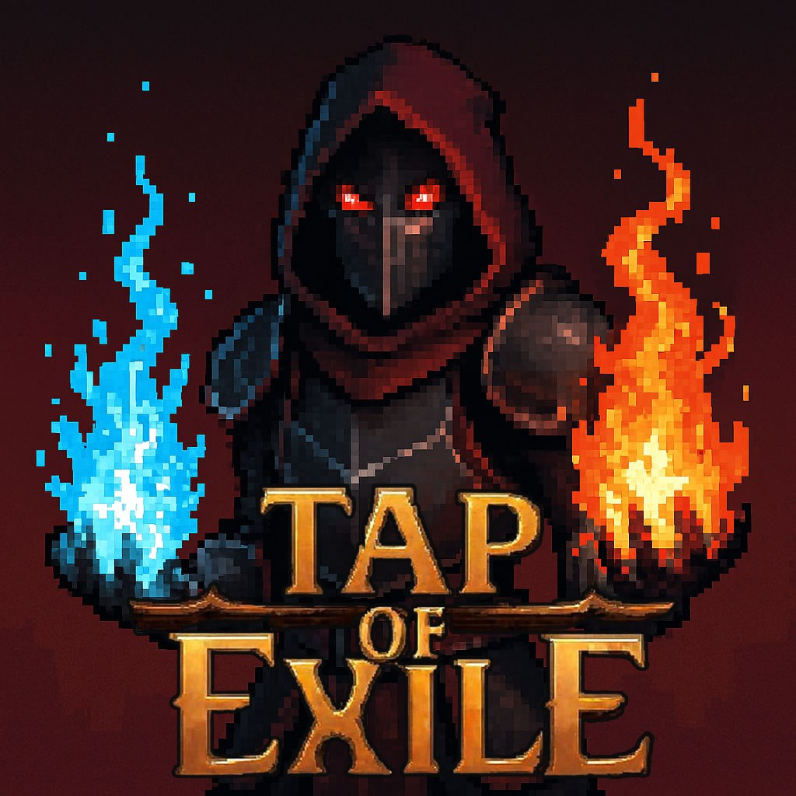
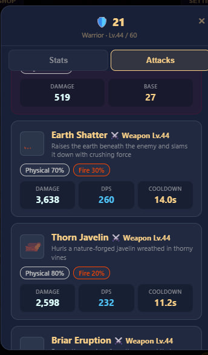
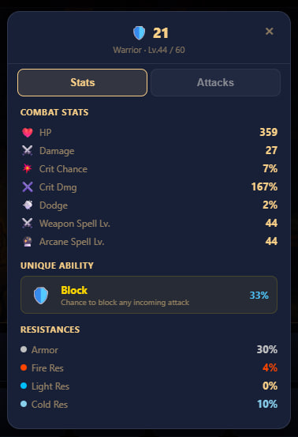
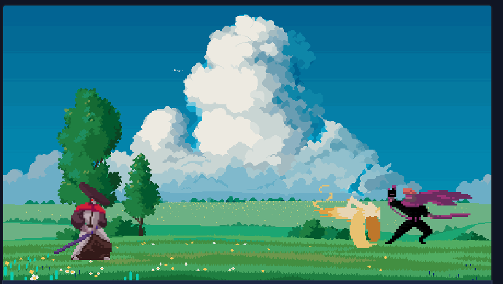
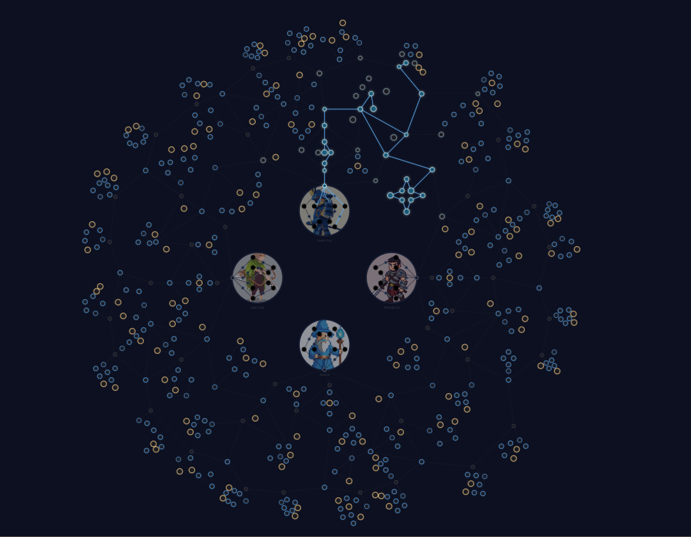
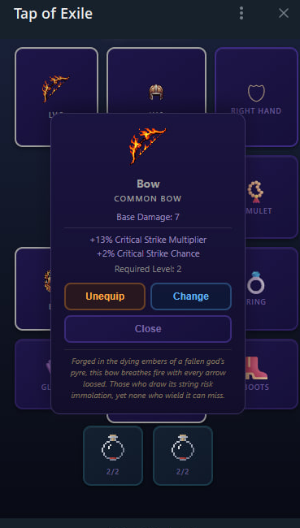

<p align="center">
  
</p>

<h1 align="center">Tap of Exile</h1>

<p align="center">
  <b>A Path of Exile-inspired action RPG built as a Telegram Mini App</b>
</p>

<p align="center">
  <a href="https://t.me/Tap_Of_Exile_Bot">Play Now</a> &bull;
  <a href="#wiki">Wiki</a> &bull;
  <a href="#gameplay">Gameplay</a> &bull;
  <a href="#tech-stack">Tech Stack</a>
</p>

---

## About

**Tap of Exile** is a mobile-first action RPG that runs entirely inside Telegram. Inspired by *Path of Exile* and *Dead Cells*, the game features real-time tap combat, a deep passive skill tree, 4 character classes, a 5-act story campaign, endgame map system, equipment, leagues, and leaderboards — all wrapped in a dark-fantasy pixel-art aesthetic.

Every fight is **server-authoritative**: your taps send commands over WebSocket, and the server calculates all damage, drops, and XP. No client-side cheating possible.

---

## Gameplay

### Choose Your Class

Pick from **4 unique classes**, each with their own growth curve, elemental affinities, and special mechanic:

| Class | Role | Special |
|-------|------|---------|
| **Samurai** | Crit DPS | Lethal Precision — boosted critical damage multiplier |
| **Warrior** | Tank | Block — 20% base block chance, scales with level |
| **Mage** | Burst Caster | Spell Amplify — 8% chance to deal 2.5x damage |
| **Archer** | Sustained DPS | Double Shot — 12% chance to fire a second projectile |

Each character has detailed **combat stats**, **resistances**, **unique abilities**, and a set of **active attack skills** with elemental damage types:

<p align="center">
  
  &nbsp;&nbsp;
  
</p>

### Real-Time Tap Combat

Battle monsters in real-time by tapping the screen. Each tap deals damage based on your character stats, equipment, and skill tree bonuses. Monsters fight back every second — dodge, block, or outlast them.

- **5 elemental damage types**: Physical, Fire, Lightning, Cold, and Pure
- **Critical hits** with configurable chance and multiplier
- **Dodge and Block** mechanics to mitigate incoming damage
- **Active skills** like Fireball and Sword Throw with cooldowns
- **Monster rarities**: Common, Rare, Epic, and Boss — each with scaling HP, damage, and resistances

<p align="center">
  
</p>

### 5-Act Story Campaign

Journey through **50 locations** across 5 themed acts:

| Act | Theme | Levels |
|-----|-------|--------|
| 1 | Castle | 1–10 |
| 2 | Meadow | 11–20 |
| 3 | Fields | 21–30 |
| 4 | Snow Mountain | 31–40 |
| 5 | The Depths | 41–50 |

Each act has 10 locations with branching paths, unique monsters, and increasing difficulty. Complete the campaign to unlock the endgame.

<!-- Screenshot: Map/location select -->
<!--  -->

### Endgame Maps

After beating all 5 acts, unlock the **Map Device** — an infinite endgame scaling system:

- **10 map tiers** with exponential difficulty (up to 25x HP at Tier 10)
- **Map keys** drop from completed maps, letting you push deeper
- **Boss maps** with 8 unique bosses across 3 difficulty levels (Standard / Empowered / Mythic)
- **Loot drops** exclusive to endgame: potions, map keys, boss keys, equipment

<!-- Screenshot: Map device / endgame -->
<!--  -->

### Passive Skill Tree (Asterism)

A massive **~256-node passive skill tree** in a circular constellation layout inspired by PoE 2:

- **Minor nodes**: Small stat bonuses (+3–10%)
- **Notable nodes**: Multi-stat boosts (+10–35%)
- **Keystone nodes**: Powerful effects with trade-offs (+50–100%)
- **Class-specific skills**: 16 unique nodes per class
- Points earned per level — plan your build or respec anytime

<p align="center">
  
</p>

### Equipment & Potions

Gear up with weapons, armor, and accessories across **9 equipment slots**:

- Helmets, Body Armor, Gloves, Boots, Belts
- One-hand & Two-hand Weapons
- Rings, Amulets

**Potions** come in 6 flask types with 4 quality tiers — use them in combat to heal and survive tough encounters.

<p align="center">
  
</p>

### Leagues & Leaderboards

- **Standard League**: Permanent — your progress is forever
- **Monthly Leagues**: Fresh-start competitive seasons with unique challenges
- **Dojo**: Training dummy arena with global damage leaderboards
- **XP Rankings**: Compete for the highest level across leagues

When a monthly league ends, your characters and gold migrate to Standard automatically.

<!-- Screenshot: Leaderboard -->
<!--  -->

### Daily Bonus

First **3 kills per day** grant **3x XP** — log in daily to maximize your leveling speed. Resets at UTC 00:00.

---

## Wiki

The project includes a full-featured **community wiki** — a standalone React web app with bilingual support (English / Ukrainian).

### Wiki Features

| Section | Description |
|---------|-------------|
| **Characters** | All 4 classes with interactive level slider (1–60) showing stat progression |
| **Enemies** | 8 monster types with elemental resistances and rarity breakdowns |
| **Equipment** | Full catalog of weapons, armor, accessories, and 6 potion flask types |
| **Asterism** | Interactive skill tree explorer — browse all 256+ passive nodes |
| **Damage** | Elemental damage mechanics, resistances, crit system explained |
| **Plot** | All 5 acts with locations, monster types, and act modifiers |
| **Maps** | Endgame tier system, boss encounters, drop tables, boss key mechanics |

### Interactive Tools

- **Skill Tree Builder** — plan and share builds with an interactive canvas tool
- **Battle Mockup** — animated combat preview with sprite rendering
- **Champions Leaderboard** — live rankings pulling from the game database
- **Trade Market** — browse player-to-player listings for potions, keys, and gear

### Languages

The wiki supports full localization in:
- English (EN)
- Ukrainian (UA)

<!-- Screenshot: Wiki home page -->
<!--  -->

---

## Tech Stack

```
TapOfExile/
├── bot/        Telegram Mini App client (Vite + TypeScript + Canvas)
├── server/     NestJS backend (PostgreSQL + Redis + WebSocket)
├── shared/     Shared game data & balance constants
└── wiki/       React 19 wiki site (Vite + React Router + i18n)
```

| Layer | Technology |
|-------|-----------|
| **Frontend** | TypeScript, Vite 6, Canvas API, Socket.IO Client, Telegram WebApp SDK |
| **Backend** | NestJS 10, TypeORM, PostgreSQL, Redis (ioredis), Socket.IO, JWT + Passport |
| **Wiki** | React 19, React Router 7, i18next, Vite 6 |
| **Shared** | TypeScript — balance constants, skill tree, equipment defs, type interfaces |
| **Auth** | Telegram HMAC-SHA256 signature verification + JWT (access 1h / refresh 30d) |
| **Real-time** | WebSocket via Socket.IO (`/combat` namespace) — server-authoritative combat |
| **Anti-cheat** | 5-layer system: server-auth combat, rate limiting, dual-storage bans, signature verification, input validation |

### Architecture Highlights

- **Server-authoritative combat** — all damage, HP, XP, and loot calculated on backend. Client is display-only
- **WebSocket rate limiter** — 30 messages per 3-second window, instant 24h ban on violation
- **Dual-storage ban system** — Redis (fast path) + PostgreSQL (persistent fallback)
- **Monthly league migration** — automated CRON merges characters and gold to Standard league
- **Shared balance file** — single `balance.ts` with ~150 constants used by both client and server

---

## Getting Started

### Prerequisites

- Node.js 20+
- PostgreSQL 15+
- Redis 7+

### Installation

```bash
# Clone the repo
git clone https://github.com/your-org/TapOfExile.git
cd TapOfExile

# Install dependencies for all packages
cd bot && npm install && cd ..
cd server && npm install && cd ..
cd wiki && npm install && cd ..
```

### Environment Setup

Create `.env` files in `bot/` and `server/` directories. See `.env.example` for required variables.

### Running

```bash
# Start the backend
cd server && npm run start:dev

# Start the game client
cd bot && npm run dev

# Start the wiki
cd wiki && npm run dev
```

---

## Project Structure

```
TapOfExile/
│
├── bot/                        # Telegram Mini App (game client)
│   └── src/
│       ├── scenes/             # 15+ game screens (combat, hideout, map, skill tree...)
│       ├── ui/                 # Sprite rendering, animations, UI components
│       ├── game/               # State management, combat manager
│       ├── api.ts              # REST client with token auto-refresh
│       └── combat-socket.ts    # WebSocket singleton
│
├── server/                     # NestJS backend
│   └── src/
│       ├── auth/               # Telegram signature + JWT auth
│       ├── combat/             # WebSocket gateway, server combat loop
│       ├── league/             # League CRUD + monthly migration CRON
│       ├── loot/               # Drop logic, bag management
│       ├── skill-tree/         # Tree validation (BFS + budget)
│       ├── player/             # Player state, bans
│       └── shared/entities/    # TypeORM entities
│
├── shared/                     # Shared TypeScript code
│   ├── balance.ts              # Game balance constants (single source of truth)
│   ├── class-stats.ts          # 4 classes + growth formulas
│   ├── skill-tree.ts           # Tree builder + layout
│   ├── equipment-defs.ts       # Full equipment catalog
│   ├── types.ts                # Shared interfaces
│   └── design-tokens.css       # Design system CSS variables
│
├── wiki/                       # React wiki site
│   └── src/
│       ├── pages/              # 15 pages (characters, enemies, maps, skill tree...)
│       ├── components/         # SkillTreeRenderer, BattleMockup, Layout
│       └── i18n/               # EN + UA translations
│
├── docs/                       # Game design documents
└── README.md
```

---

## Adding Screenshots

To add gameplay screenshots to this README:

1. Create a `docs/screenshots/` directory
2. Take screenshots of key game screens (480px width recommended)
3. Uncomment the `` lines in this README

Recommended screenshots:
- `character-select.png` — Class selection screen
- `combat.png` — Battle scene with monster and UI
- `story-map.png` — Act/location selection
- `endgame.png` — Map device interface
- `skill-tree.png` — Asterism passive tree
- `equipment.png` — Inventory / equipment panel
- `leaderboard.png` — Dojo or XP rankings
- `wiki.png` — Wiki home page

---

<p align="center">
  <b>Built with TypeScript</b> &bull; Runs inside Telegram &bull; Server-authoritative &bull; No cheating
</p>

<p align="center">
  <a href="https://t.me/Tap_Of_Exile_Bot">Play Tap of Exile</a>
</p>
