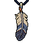
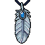
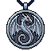
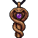
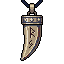
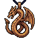
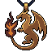
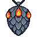
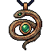

# Amulets - Item Catalog

> **Category:** Amulet  
> **Total items:** 100  
> **Classes:** Mage, Archer, Warrior, Samurai

| # | Preview | Item Name | Visual Description | Description | Classes |
|:-:|:-------:|:----------|:------------------|:------------|:--------|
| 1 |  | **Pyramid of the All-Seeing** | A triangular pendant featuring a divine eye symbol centered within concentric rings. Deep blue and teal coloring with golden accents forms the pyramid's frame, while a luminous eye glyph radiates from the center. Mystical energy crackles around the edges. | *An ancient talisman said to pierce the veil between worlds. Those who wear it claim to glimpse truths hidden from mortal sight-though whether this blessing or curse remains unclear.* | Samurai, Mage, Archer, Warrior |
| 2 |  | **Stormveil Sigil** | A circular gold-rimmed amulet featuring a stylized lightning bolt symbol in brilliant yellow against a deep indigo-blue enamel face. The bolt is angular and sharp, radiating outward. A small golden loop crowns the piece for suspension on a chain. | *A relic of forgotten tempests, this sigil crackles with residual electricity. Those who wear it claim to hear distant thunder in their veins, as if the sky itself watches their every move.* | Samurai, Mage, Archer, Warrior |
| 3 |  | **Deathshead Sigil** | A dark blue pendant featuring a stylized skull with hollow eye sockets and prominent teeth, suspended from a blackened chain. The skull gleams with an ethereal, otherworldly sheen against its deep indigo surface. | *An amulet forged from the essence of forgotten mortality. Those who wear it feel the weight of countless departed souls pressing against their chest, whispering secrets of the abyss.* | Samurai, Mage, Archer, Warrior |
| 4 |  | **Crimson Vigil Amulet** | A circular golden medallion suspended by a chain, featuring a radiant sunburst design with a deep crimson gemstone at its center. The gold is intricately etched with concentric patterns, and the ruby gleams with an otherworldly inner light. | *An artifact of forgotten faith, this amulet pulses with the accumulated will of those who wore it before you. The crimson stone whispers of watchfulness eternal-a sentinel's promise against the encroaching dark.* | Samurai, Mage, Archer, Warrior |
| 5 |  | **Crimson Covenant Heart** | A heart-shaped amulet with a deep crimson gemstone at its core, encased in ornate golden filigree. The pendant hangs from a delicate golden chain, radiating an unsettling warmth that pulses faintly like a living heartbeat. | *Once the beating heart of a forsaken saint, now bound in gold and sorrow. Those who wear it find their resolve hardened, but at the cost of feeling their humanity slowly crystallize into something colder, sharper, eternal.* | Samurai, Mage, Archer, Warrior |
| 6 |  | **Wornhide Phylactery** | A weathered leather amulet suspended by frayed cord, featuring a tarnished bronze clasp adorned with angular runes. The centerpiece displays a darkened gemstone set within concentric copper rings, accompanied by small bone charms and tattered fabric wrappings. | *An artifact of forgotten rites, this phylactery pulses with the residual essence of those who came before. To wear it is to invite their scrutiny-and their protection.* | Samurai, Mage, Archer, Warrior |
| 7 |  | **Rootbound Covenant** | A circular pendant featuring a stylized tree with spreading branches and roots in cream and gold tones, set against a dark background. The tree's limbs form a symmetrical pattern within an ornate round frame, suspended from a beaded chain. | *An ancient talisman grown from the heart of a petrified world-tree, its roots still reaching toward forgotten soil. Those who wear it find themselves tethered to forces older than kingdoms, blessed and cursed in equal measure.* | Samurai, Mage, Archer, Warrior |
| 8 |  | **Scarab of Eternal Vigil** | An ornate oval amulet featuring a turquoise scarab beetle as its centerpiece, mounted within an intricate bronze or brass frame. The scarab's wings are detailed and symmetrical, rendered in jewel-toned blues and greens with gold accents. The frame shows weathered metalwork with decorative elements. | *An ancient talisman carved from the carapace of a long-dead god-beetle. Those who wear it claim to hear whispers of forgotten tombs and feel the weight of centuries pressing against their very soul.* | Samurai, Mage, Archer, Warrior |
| 9 |  | **Bloodpact Sigil** | A circular wooden amulet suspended from a cord, featuring a crimson heart symbol enclosed within concentric rings. The wooden frame is dark and weathered, with the heart rendered in deep red, creating a striking contrast against the warm brown tones of aged timber. | *A pact sealed in blood and wood, this sigil thrums with the heartbeat of something long forgotten. Those who wear it feel the weight of ancient vows pressing against their chest-power granted, but at a cost yet unnamed.* | Samurai, Mage, Archer, Warrior |
| 10 |  | **Heartwing Pendant** | A heart-shaped amethyst gem suspended between ornate bronze wings. The gem glows with soft violet light, while the wings display intricate feather detailing in warm copper tones with darker accents. | *Once worn by a fallen angel bound to the material realm, this pendant pulses with an otherworldly warmth. Those who bear it whisper of wings brushing their shoulders in the dark, and a love as consuming as it is cursed.* | Samurai, Mage, Archer, Warrior |
| 11 |  | **Violet Seer's Pendant** | A circular bronze-rimmed amulet featuring a prominent violet eye at its center, surrounded by ornate gold detailing. The eye glows with an ethereal purple light, suspended within a dark socket. A braided cord connects to a decorative clasp above. | *An artifact of forgotten seers who gazed beyond the veil of mortality. Those who wear it claim to glimpse truths meant for the dead-a blessing as cursed as the knowledge it grants.* | Samurai, Mage, Archer, Warrior |
| 12 |  | **Crimson Runeheart** | A circular golden amulet pendant featuring a deep crimson gem at its center, surrounded by ornate concentric rings of burnished metal. Intricate runic engravings frame the glowing red stone, with a sturdy chain attachment at the top. | *An amulet pulsing with ancient bloodmagic, its crimson core whispers of oaths sworn in forgotten ages. Those who bear it feel the weight of every covenant ever sealed-a burden and a blessing alike.* | Samurai, Mage, Archer, Warrior |
| 13 |  | **Verdant Carapace Sigil** | A circular amulet featuring a stylized emerald-green beetle or scarab with intricate segmented plating. The insect is rendered in rich jade tones with darker striping, set against a subtle circular frame. Fine detailing suggests natural chitinous armor. | *An ancient talisman born from corrupted nature itself. Those who wear it feel the weight of the swarm-whispers of countless chittering voices echo at the edge of consciousness, granting resilience borrowed from the carapace of something far older than kingdoms.* | Samurai, Mage, Archer, Warrior |
| 14 |  | **Teardrop of the Abyss** | A teardrop-shaped amulet suspended from a delicate chain. Deep indigo stone with a luminous swirl of pale blue at its core, resembling a cosmic eye. Silver or platinum filigree frames the pendant, with ornate detailing at the top clasp. | *Once wept by a forgotten deity, this amulet channels the sorrow of the void itself. Those who wear it find their suffering transformed into otherworldly power, though at the cost of their peace.* | Samurai, Mage, Archer, Warrior |
| 15 |  | **Abyssal Anchor** | A dark teal-blue anchor pendant suspended from an ornate chain. The anchor features sharp, angular flukes and a weathered metal finish, evoking both maritime tragedy and eldritch depths. Silver accents trace its edges. | *An anchor that weighs upon the soul rather than ships. Those who wear it find themselves tethered to this realm, untethered from all else-a blessing for the cursed, a curse for the blessed.* | Samurai, Mage, Archer, Warrior |
| 16 |  | **Shadowpact Talisman** | A teardrop-shaped amulet of dark stone or obsidian, suspended by a thin chain. The surface bears deep purple and blue streaks resembling veins of corrupted essence. A small crystalline point dangles at its base, catching faint violet light. | *Once worn by those who bargained with forces beyond the veil. This talisman pulses with the weight of old oaths-a compact between the bearer and the hungry dark, sealed in stone and sorrow.* | Samurai, Mage, Archer, Warrior |
| 17 |  | **Serpent's Oath Amulet** | A jade-green serpent coils around itself forming a perfect circle, its scales carved with intricate detail. Two crimson jewels mark the serpent's eyes, glowing faintly against the dark background. Gold filigree traces along the creature's body. | *An ancient talisman born from pacts between serpent-kind and forgotten sorcerers. Those who wear it find their will strengthened, yet whispers suggest the serpent itself still hungers for dominion over its bearer's choices.* | Samurai, Mage, Archer, Warrior |
| 18 |  | **Owlwatcher's Vigil** | A bronze amulet featuring a stylized owl head with large, piercing amber eyes and intricate feather detailing. The piece gleams with an antique patina, adorned with small jeweled accents at the crown. | *An ancient sentinel bound within bronze, its unblinking gaze pierces the veil between worlds. Those who wear it claim to glimpse shadows before they strike, though the owl's eternal scrutiny exacts a price upon the wearer's sanity.* | Samurai, Mage, Archer, Warrior |
| 19 |  | **Iris of the Void** | A circular bronze medallion suspended from a purple cord. At its center sits a luminous violet eye with a golden iris, ringed by intricate arcane symbols. The eye glows with an otherworldly radiance against the dark metal backing. | *An amulet said to have been torn from the visage of a forgotten god. Those who wear it claim the eye watches through the veil between worlds, granting sight beyond mortal ken-though the price of such vision weighs heavy upon the soul.* | Samurai, Mage, Archer, Warrior |
| 20 |  | **Gilded Redemption Cross** | A ornate golden cross amulet with intricate metalwork and radiant yellow-gold coloring. Features a central intersection point with decorative flourishes at each cardinal direction, suspended from an implied chain or cord. | *Once blessed by forgotten clergy, this cross now radiates an ambiguous power-whether salvation or damnation depends on the wielder's sins. Its warmth whispers promises of absolution to those cursed enough to seek it.* | Samurai, Mage, Archer, Warrior |
| 21 |  | **Duskwarden's Fang** | A dark blue amulet carved into a sharp, fang-like crescent. Silver chains wrap around its obsidian surface, with a small glowing amber rune etched at its center. The edges catch faint light, suggesting ancient craftsmanship. | *A talisman whispered to be carved from the fang of something long dead-something that should have stayed buried. Those who wear it feel the weight of a curse and the promise of survival in equal measure.* | Samurai, Mage, Archer, Warrior |
| 22 |  | **Hollowveil Talisman** | A slate-gray amulet carved from obsidian-like stone, suspended by a tattered cord. The pendant features a recessed circular void at its center, surrounded by geometric runes that seem to absorb light. Sharp, angular edges frame the hollow core, giving it an unsettling, hunger-like quality. | *An artifact of the Void Age, when the first rifts tore through the veil between worlds. Those who wear it report dreams of weightless falling and whispers in forgotten tongues-whether blessing or curse remains unclear.* | Samurai, Mage, Archer, Warrior |
| 23 |  | **Astral Warden's Sigil** | A circular midnight-blue amulet pendant suspended by an ornate silver chain. The face features a glowing celestial eye symbol with concentric rings, surrounded by arcane runes in silver. Small crystalline points jut from the edges, catching pale starlight. | *An ancient talisman of the forgotten starkeepers, its gaze pierces through the veil between worlds. Those who wear it claim to hear whispers of a cosmic sentinel watching over their every step.* | Samurai, Mage, Archer, Warrior |
| 24 |  | **Verdant Star Talisman** | A five-pointed star amulet with a rich emerald gem at its center, suspended from a copper chain. The star's bronze frame features intricate Celtic-knot engravings, with darker patina accents suggesting ancient craftsmanship. | *Forged in ages past, this star pulses with a verdant light-said to guide those who carry it through the deepest shadows. Some whisper it was torn from the brow of a forgotten forest deity, and still hungers for the life-force of the unworthy.* | Samurai, Mage, Archer, Warrior |
| 25 |  | **Feathered Veil Amulet** | An ornate pendant featuring a delicate feather enclosed within a teardrop-shaped crystalline shell. The feather displays soft blue and white hues, suspended in what appears to be luminous ice or ethereal glass. Fine metallic filigree frames the edges, with a dark cord attachment. | *A relic of forgotten skies, this amulet whispers of souls caught between worlds. Those who wear it find their resolve crystallized, as if touched by the breath of ancient winds.* | Samurai, Mage, Archer, Warrior |
| 26 |  | **Soulwing Locket** | A crimson heart pendant adorned with golden angelic wings on either side, suspended from an ornate chain. The heart glows with a soft inner light, rendered in warm reds and golds against the darker background. | *Once worn by a fallen saint, this locket thrums with the essence of a redeemed soul. Its wings whisper promises of salvation even as its crimson core pulses with the weight of damnation.* | Samurai, Mage, Archer, Warrior |
| 27 |  | **Crimson Oath Medallion** | A circular medallion featuring a stylized red geometric symbol at its center, surrounded by concentric rings of deep crimson and gold. The design suggests ancient ritual markings, suspended from a dark cord. The symbol glows faintly with an inner radiance. | *Forged in blood and sealed by forgotten vows, this medallion pulses with the weight of oaths sworn in darkness. Those who bear it feel the presence of something watching, judging, waiting to collect its due.* | Samurai, Mage, Archer, Warrior |
| 28 |  | **Solaris Oath Amulet** | A radiant circular amulet featuring a golden sun motif with sharp rays extending outward. Central black orb surrounded by concentric rings of warm amber and gold. Ornate spikes frame the perimeter, creating a celestial, otherworldly appearance. | *An ancient talisman forged in forgotten celestial fires. Its radiant core pulses with the last breath of a dying star, granting its wearer glimpses of fate written in eternal flame.* | Samurai, Mage, Archer, Warrior |
| 29 |  | **Bloodwood Effigy** | A wooden carved mask amulet with deep mahogany-brown tones and intricate tribal markings. The face features prominent angular cheekbones, a stern expression, and ornate carved details. A leather cord runs through the top for wearing. The craftsmanship shows age and spiritual significance. | *An ancient totem carved from the heartwood of a cursed grove. Those who wear it feel the watchful presence of forgotten spirits, granting protection at the cost of unsettling visions.* | Samurai, Mage, Archer, Warrior |
| 30 |  | **Radiant Aegis Pendant** | A shield-shaped amulet with a deep indigo background, featuring a luminous cross symbol in silver-white. Gold trim frames the edges, with a chain attachment at the apex. The shield design suggests divine protection against dark forces. | *A relic blessed by forgotten saints, its cross burns with cold light against the encroaching shadow. Those who wear it feel the weight of divine judgment pressing against their souls-protection and burden intertwined.* | Samurai, Mage, Archer, Warrior |
| 31 |  | **Carved Maw of Thaal** | A wooden amulet carved into a fierce tribal mask with pronounced cheekbones and bared teeth. Rich brown wood grain dominates, accented by gold metalwork around the edges and a dangling cord. Eyes are hollow voids suggesting ancient power. | *An idol wrought from petrified wood of forgotten lands. Those who wear it claim to hear whispers of primal hunger echoing from the void behind its eyes-whether blessing or curse remains unclear.* | Samurai, Mage, Archer, Warrior |
| 32 |  | **Crimson Seal Amulet** | A circular golden amulet with a prominent crimson gem or seal at its center, surrounded by ornate metalwork. The design features radiating geometric patterns in warm gold tones with deep red accents, suggesting ancient craftsmanship and occult significance. | *An artifact bearing the mark of forgotten rituals, its crimson core pulses with the echo of sacrifices long past. Those who wear it find themselves caught between worlds, neither fully living nor entirely consumed.* | Samurai, Mage, Archer, Warrior |
| 33 |  | **Serpent's Covenant** | An ornate amulet featuring a coiled serpent in deep indigo and silver, with wings unfurled symmetrically. The creature's body forms an intricate knot around a central gemstone that glows with arcane energy. Gold filigree traces ancient runes along the pendant's edges. | *A pact sealed in scales and starlight. Those who bear this token gain audience with forces that dwell between worlds, though the price of such communion is paid in whispers only the wearer can hear.* | Samurai, Mage, Archer, Warrior |
| 34 |  | **Bonelord's Vigil** | A bleached skull pendant with hollow eye sockets and prominent teeth, suspended from a dark cord or chain. Gold or bronze accents frame the jaw and crown. Intricate bone-carved details suggest ancient craftsmanship. | *A talisman carved from the skull of a forgotten tyrant, it whispers promises of dominion to those who wear it. Those who listen too long find their will subsumed beneath its eternal hunger.* | Samurai, Mage, Archer, Warrior |
| 35 |  | **Verdant Scarab Amulet** | A teardrop-shaped pendant featuring an ornate golden scarab beetle with emerald-green wings. The insect's carapace gleams with intricate filigree detailing, suspended from a weathered bronze chain adorned with small jade accents. | *An ancient talisman infused with the essence of forgotten groves. Those who wear it feel the weight of ages pressing against their chest, as if the earth itself watches their every step.* | Samurai, Mage, Archer, Warrior |
| 36 |  | **Voidborn Serpent's Covenant** | A ornate pendant featuring a coiled serpent wrapped around a glowing emerald gem. The snake's scales are rendered in dark bronze, its eyes gleam with an otherworldly green light. Intricate brass filigree frames the stone, with small thorns protruding from the serpent's body. | *A pact sealed in ancient venom and forgotten oath. Those who wear this amulet feel the serpent's whisper coiling through their thoughts-a price for power, paid in small increments with each passing day.* | Samurai, Mage, Archer, Warrior |
| 37 |  | **Ironbound Warden's Seal** | A sturdy bronze amulet featuring a central rectangular plaque with intricate geometric patterns. Thick metal bands frame the face, with ornamental rivets at corners. Warm bronze-gold coloring with darker metal accents suggests ancient craftsmanship and worn patina. | *Forged in an age when boundaries between realms still held firm, this seal channels the resolute will of forgotten sentinels. To wear it is to stand against the encroaching dark-a promise sealed in metal and sorrow.* | Samurai, Mage, Archer, Warrior |
| 38 |  | **Sovereign's Blight** | A skull amulet adorned with a golden crown, rendered in pixel art. The skull features hollow eye sockets with an eerie glow, complemented by ornate gold detailing and a royal crest. Dark shadows accentuate the bone structure against the golden embellishments. | *Once worn by a tyrant whose reign brought only suffering to the lands. The amulet whispers of forgotten ambitions and the hollow victory of dominion purchased in blood.* | Samurai, Mage, Archer, Warrior |
| 39 |  | **Bloodwing Sigil** | A dark bronze amulet depicting a skeletal winged creature with spread wings. The centerpiece features a crimson gemstone or glass inlay. Gold accents outline the wings. Hangs from a simple cord. Weathered, ancient appearance with baroque detailing. | *Once worn by a fell sorcerer whose pact with shadow granted him dominion over carrion birds. The amulet hungers still, whispering promises of power to those desperate enough to heed its call.* | Samurai, Mage, Archer, Warrior |
| 40 |  | **Bloodhound's Talisman** | A bronze amulet carved in the shape of a snarling beast's head, worn smooth by time. Deep crimson gemstones form the eyes, glowing faintly against oxidized metal. Chain appears forged from dark iron. | *An ancient charm worn by hunters who stalked prey through cursed lands. Those who bear it claim the beast's hunger flows through their veins, sharpening instinct but darkening the soul.* | Samurai, Mage, Archer, Warrior |
| 41 |  | **Sable Serpent's Oath** | A circular pendant featuring an intricate silver serpent coiled around a deep indigo stone. The serpent's scales are finely etched, with two glowing amber eyes. A small chain loop sits atop the ornate frame. | *An ancient talisman whispered to contain the binding oath of a primordial serpent. Those who wear it feel the weight of forgotten promises-and the crushing price of breaking them.* | Samurai, Mage, Archer, Warrior |
| 42 |  | **Sapphire Wardstone** | A golden circular amulet with ornate filigree borders, centered by a brilliant blue sapphire that glows with ethereal light. The gem is set within concentric rings of aged brass, with subtle arcane runes etched along the frame's perimeter. | *An ancient talisman that pulses with the last breath of a fallen guardian. Those who wear it carry the weight of forgotten oaths-and the protection of those who came before.* | Samurai, Mage, Archer, Warrior |
| 43 |  | **Crossveil Aegis** | A shield-shaped amulet pendant featuring a deep blue background with a glowing golden cross at its center. Silver filigree borders frame the design, with small crystalline accents at each corner catching ethereal light. | *A holy ward forged in the depths where light and shadow converge. Those who wear it claim to hear whispers of protection in their darkest hours-whether salvation or damnation remains unclear.* | Samurai, Mage, Archer, Warrior |
| 44 |  | **Verdant Sorrow Pendant** | A teardrop-shaped amulet of deep jade green with an intricate black vein pattern running through its center, resembling a stylized leaf or heartwood cross-section. Suspended from a dark cord with a small metallic cap at the top. | *Once clutched by a druid consumed by the blight, this pendant weeps with ancient sorrow. The life force bound within offers protection, though at the cost of a lingering connection to something long dead.* | Samurai, Mage, Archer, Warrior |
| 45 |  | **Wolfpact Sigil** | A deep indigo amulet pendant shaped like a stylized paw print, centered with a luminous azure gemstone. Silver metallic accents frame the edges, creating a mystical, beast-marked talisman with an otherworldly glow. | *Forged in the blood of ancient apex predators, this sigil thrums with primal hunger. To wear it is to invite the gaze of something that hungers in the dark.* | Samurai, Mage, Archer, Warrior |
| 46 |  | **Slate of the Abyss** | A weathered stone amulet in shades of slate gray and deep blue, carved with intricate runic patterns that seem to shift in shadow. The surface is cracked like aged stone, with darker striations running through it. A heavy iron chain suspends it, its worn metal suggesting ancient origin. | *An artifact born from depths where light fears to tread. Those who wear it feel the weight of the void pressing gently against their soul, granting resilience against the horrors that dwell beyond the veil.* | Samurai, Mage, Archer, Warrior |
| 47 |  | **Wingward Sigil** | An ornate amulet featuring a stylized angel wing rendered in silver and pale blue tones. The wing curves elegantly around a central bronze medallion, with feather details etched throughout. A warm amber glow emanates from the center. | *Once worn by a celestial herald before the heavens fell silent. Its blessing grants passage through the veil between worlds, though some say it whispers of salvation that never comes.* | Samurai, Mage, Archer, Warrior |
| 48 |  | **Bloodbound Keystone** | An ornate brass key suspended from a tarnished chain, its bow decorated with a crimson gemstone. The shaft tapers to a gothic silhouette, with intricate grooves catching dim light. A small skull emblem adorns the pommel. | *A key to doors that should remain sealed. Those who carry it report whispers of locked chambers within their own souls, slowly turning.* | Samurai, Mage, Archer, Warrior |
| 49 |  | **Crimson Tether Amulet** | A ornate pendant suspended by braided cord, featuring a deep crimson gem housed in an ornamental golden cage. Three smaller rubies orbit the central stone, connected by delicate metalwork. The amulet glows with a faint blood-red luminescence. | *An artifact said to bind the wearer's essence to shadowed pacts. Those who wear it claim to hear whispers of forgotten oaths, though whether salvation or damnation follows remains unclear.* | Samurai, Mage, Archer, Warrior |
| 50 |  | **Dreadwing Talisman** | A circular bronze amulet dominated by a stylized winged stag or elk head in relief, rendered in deep copper tones. The creature's antlers curve upward dramatically, framing two glowing amber orbs at its center. Ornate metalwork radiates from the symbol in concentric rings, giving it an ancient, ceremonial weight. | *An artifact bearing the image of a beast long hunted into legend. Those who wear it feel the weight of cursed prey upon their shoulders, granting strange communion with the hunted and the hunter alike.* | Samurai, Mage, Archer, Warrior |
| 51 |  | **Bloodveil Sigil** | A symmetrical amulet featuring a deep crimson gemstone set within an ornate silver frame. Two wing-like protrusions extend from the sides, rendered in dark metal. A small teardrop shape hangs below the main stone, suggesting an ancient talisman of forbidden power. | *An amulet that pulses with the echoes of a thousand sacrifices. Those who wear it feel the weight of spilled blood coursing through their veins, granting them strength at a price their soul understands all too well.* | Samurai, Mage, Archer, Warrior |
| 52 |  | **Fang of the Abyss** | A curved ivory tusk pendant suspended by a tarnished bronze chain. The fang gleams with an otherworldly pale sheen, its surface etched with archaic runes that seem to writhe in peripheral vision. Dark veins of obsidian run through the bone. | *Once torn from a primordial beast that dwelt in the sunless deep, this fang thrums with an hunger older than memory. Those who wear it find their will hardened against the encroaching dark-though at a cost whispered only in nightmares.* | Samurai, Mage, Archer, Warrior |
| 53 |  | **Starfall Sigil** | An eight-pointed star amulet with a radiant blue gemstone at its center. Crystalline points extend outward with sharp, geometric precision. The core glows with ethereal azure light, surrounded by darker indigo rays that suggest cosmic energy trapped within polished stone. | *A fragment of fallen starlight, bound in stone by forces older than kingdoms. Those who wear it feel the weight of distant constellations pressing against their soul, whispering truths the waking mind cannot comprehend.* | Samurai, Mage, Archer, Warrior |
| 54 |  | **Azurite Watcher's Talisman** | A deep blue crystalline amulet suspended from a dark cord. The stone features intricate geometric patterns etched into its surface, with a glowing inner core that pulses faintly. Small silver accents frame the pendant, giving it an arcane, otherworldly appearance. | *An ancient sentinel's charm, forged when the barriers between realms grew thin. Those who wear it claim to hear whispers from forgotten watchers, though whether they offer guidance or warning remains eternally unclear.* | Samurai, Mage, Archer, Warrior |
| 55 |  | **Chalice of Remnant Echoes** | A golden goblet suspended by an ornate chain, its bowl radiating warm amber light. Intricate runic symbols circle the rim, with a dark jewel set into the base. The artifact bears the weight of ancient craftsmanship. | *Once a vessel for forgotten rituals, this chalice whispers of those long devoured by time. To wear it is to carry the burden of countless voices, demanding acknowledgment in the spaces between heartbeats.* | Samurai, Mage, Archer, Warrior |
| 56 |  | **Sovereign's Blight Crown** | A golden amulet pendant featuring an ornate crown with sharp, angular points. The crown sits atop a circular medallion with rich amber and deep burgundy tones. Intricate detailing adorns the base, suggesting ancient craftsmanship and dark majesty. | *Once worn by a tyrant whose reign brought only suffering. The crown whispers promises of dominion, though those who wear it find themselves slowly consumed by the weight of what they command.* | Samurai, Mage, Archer, Warrior |
| 57 |  | **Owlseer's Vigil** | A circular bronze amulet featuring an ornate owl's head with prominent amber eyes. Intricate feather detailing frames the face, with a dark patina suggesting ancient craftsmanship. A golden chain suspends the talisman. | *An ancient talisman said to grant the wearer sight beyond the veil. Those who wear it claim to glimpse the invisible threads binding fate-though some say the owl watches even when their eyes are closed.* | Samurai, Mage, Archer, Warrior |
| 58 |  | **Serpent's Coil Amulet** | A bronze-cast amulet featuring an interlocked serpent design, its scales detailed in warm copper tones. The snake coils around itself in an endless loop, with an amber or golden gemstone nestled at its core, radiating faintly from within the metalwork. | *An ancient talisman born from forgotten rituals, where two serpents eternally consume one another. Those who wear it find themselves caught between worlds-neither fully alive nor truly dead, bound by the cycle of rebirth and ruin.* | Samurai, Mage, Archer, Warrior |
| 59 |  | **Latticebound Talisman** | A circular bronze amulet suspended on a dark cord. The face features an intricate geometric lattice pattern in relief, creating a hypnotic grid of interlocking shapes. The worn patina suggests ancient craftsmanship. | *An artifact woven from the geometry of forgotten realms. Those who wear it report visions of infinite corridors and the creeping sense that they are being observed through countless invisible angles.* | Samurai, Mage, Archer, Warrior |
| 60 |  | **Sorrow's Aegis Pendant** | A shield-shaped amulet rendered in deep indigo and silver pixel art. The face displays an intricate geometric pattern with a dark gemstone at its center, surrounded by ornate borders. Fine chains anchor it to a dark cord. | *An amulet forged in an age of sorrow, its surface eternally weeps a faint, ethereal mist. Those who wear it find themselves cloaked in the weight of forgotten griefs-a burden transformed into unyielding protection.* | Samurai, Mage, Archer, Warrior |
| 61 |  | **Embercrest Amulet** | A circular golden amulet suspended by an ornate chain, featuring a burning orange gemstone at its center. Intricate flame-like engravings radiate outward across the polished metal surface, with deep amber and crimson hues blending into the stone. | *A relic kindled in the forge of forgotten gods, its amber heart pulses with an inner fire that refuses to be extinguished. Those who wear it inherit a fragment of the inferno that once consumed empires.* | Samurai, Mage, Archer, Warrior |
| 62 |  | **Bloodpact Talisman** | A worn bronze circular amulet suspended by a frayed crimson cord. The face depicts an intricate occult sigil in dark copper with concentric rings and angular runes. Small bone fragments dangle from the lower edge, casting faint shadows. | *Forged in a pact between flesh and shadow, this talisman hungers for the bearer's vitality. Those who wear it whisper of voices echoing from the bronze-ancient demands that grow louder with each passing night.* | Samurai, Mage, Archer, Warrior |
| 63 |  | **Veilbound Talisman** | A triangular amulet suspended by ornate chains, featuring a central golden compass or eye symbol encased in deep blue enamel. Silver filigree patterns frame the edges, with mystical runes etched along the border. The piece emanates an otherworldly glow. | *An artifact born from the fractured veil between worlds. Those who wear it feel the weight of forgotten oaths pressing against their soul, granting passage through barriers both seen and unseen.* | Samurai, Mage, Archer, Warrior |
| 64 |  | **Crimson Heartstone** | A teardrop-shaped amulet with a deep crimson gemstone at its core, surrounded by an ornate silver or steel frame. The stone glows faintly with an inner light. Intricate patterns radiate from the center, suggesting ancient craftsmanship. Suspended from a dark chain. | *An amulet said to contain the final heartbeat of a fallen god. Those who wear it feel the weight of mortality acutely, as if borrowed time pulses beneath their skin.* | Samurai, Mage, Archer, Warrior |
| 65 |  | **Veilbound Keystone** | A dark iron key suspended from an ornate chain, its shaft etched with arcane runes that glow faintly. The bow features a intricate skull motif wreathed in shadow, rendered in shades of charcoal and silver with hints of eerie blue luminescence. | *An ancient key that unlocks not doors, but the chains binding one's darker nature. Those who wear it find the veil between worlds grows thin, granting passage to forbidden knowledge-at a price only the desperate dare pay.* | Samurai, Mage, Archer, Warrior |
| 66 |  | **Solheart Amulet** | A radiant golden amulet featuring a blazing sun motif at its center. Sharp, flame-like rays extend outward in a symmetrical pattern, rendered in warm ochre and amber hues. The ornate design suggests both divine radiance and smoldering intensity against a darker background. | *Once worn by a forgotten sun-cult priestess, this amulet still radiates with the fever of her final ritual. Those who bear it feel the weight of ancient light pressing against their chest-a warmth that comforts and consumes in equal measure.* | Samurai, Mage, Archer, Warrior |
| 67 |  | **Nightwheel Sigil** | A circular amulet pendant featuring a deep indigo disc with concentric rings. At its center sits a glowing amber orb surrounded by intricate celestial markings. A silver chain supports the piece, with the outer edge rimmed in dark metal filigree. | *An ancient talisman forged when stars still remembered their purpose. Its light offers solace to those who walk between worlds, though some whisper it draws closer that which dwells in darkness.* | Samurai, Mage, Archer, Warrior |
| 68 |  | **Raven's Covenant** | A circular amulet featuring a stylized raven with spread wings in dark blue and gold. The bird is centered within a ring of arcane symbols, with ornate metalwork forming a protective halo around the emblem. | *An ancient talisman bearing the mark of the carrion-caller. Those who wear it claim to hear whispers from the void between worlds-a blessing or curse, depending on one's resolve.* | Samurai, Mage, Archer, Warrior |
| 69 |  | **Skullthorn Pendant** | A bone-white skull amulet with curved horns or thorns protruding from its crown, suspended on a tattered cord. The skull features hollow eye sockets and intricate carved details, with a sickly golden or amber glow emanating from within. | *An ancient totem of the forgotten dead, this pendant whispers with the voices of those who fell to dark magic. To wear it is to invite their restless hunger into your soul.* | Samurai, Mage, Archer, Warrior |
| 70 |  | **Verdant Teardrop Amulet** | A teardrop-shaped pendant with an ornate golden frame featuring intricate scrollwork. A deep emerald stone gleams at its center, surrounded by delicate filigree detailing. The frame appears weathered yet precious, suggesting ancient craftsmanship. | *An heirloom of forgotten nobility, this amulet pulses with the lingering vitality of a civilization long turned to dust. Those who wear it find themselves caught between life and decay-blessed and cursed in equal measure.* | Samurai, Mage, Archer, Warrior |
| 71 |  | **Emberscourge Talisman** | A circular amulet dominated by swirling amber and crimson flames contained within a dark ornate frame. The center glows with molten orange light, depicting an intricate fiery vortex pattern. Golden accents frame the edges, with a thick chain attachment at the top. | *Forged in the dying breath of a fallen pyre lord, this talisman channels the rage of immolation itself. Those who wear it carry the burden of endless hunger-power granted, but never satisfied.* | Samurai, Mage, Archer, Warrior |
| 72 |  | **Nightbound Talisman** | A dark, ornate amulet featuring a central obsidian stone surrounded by tarnished silver filigree. Two curved horns or crescents flank the stone, with intricate chains draping downward. The piece emanates an eerie violet aura at its edges. | *Forged in shadow and bound to forgotten oaths, this talisman whispers promises of power to those desperate enough to listen. Its weight upon the chest is less burden than anchor-holding the wearer between worlds.* | Samurai, Mage, Archer, Warrior |
| 73 |  | **Solstice's Burning Eye** | A radiant circular amulet featuring a golden-yellow sun symbol at its center, surrounded by sharp, angular rays in warm orange and yellow tones. The design is symmetrical and ornate, with pointed protrusions radiating outward, suggesting both divine light and ancient power. | *An artifact from an age when the sun itself was a weapon. Those who wear it claim to feel the weight of an eternal flame pressing against their chest, warming the blood and scorching away doubt-or perhaps consuming the wearer from within.* | Samurai, Mage, Archer, Warrior |
| 74 |  | **Crimson Warden's Seal** | An ornate oval amulet pendant featuring deep crimson and rose tones with intricate gold filigree borders. The center displays a stylized symbol or crest rendered in rich burgundy hues, suspended from a delicate chain. The gem-like surface suggests ancient craftsmanship. | *A relic born from forgotten pacts, its crimson depths whisper of oaths sworn in blood. Those who wear it feel the weight of watchers long since turned to dust, their vigilance etched into every fiber of their being.* | Samurai, Mage, Archer, Warrior |
| 75 |  | **Raven's Hollow Talisman** | A bone-white pendant carved into a stylized bird skull, suspended from a dark cord. The skull features hollow eye sockets and a sharp, elongated beak. The aged ivory material contrasts with the deep black of the attached chain or sinew. | *Once worn by a carrion prophet who read omens in the flight of crows. Now it whispers of death approaching-whether yours or your enemy's remains unclear.* | Samurai, Mage, Archer, Warrior |
| 76 |  | **Ember Sentinel's Heart** | A golden amulet featuring a blazing crimson gemstone at its center, surrounded by ornate metallic wings spread in a protective embrace. Warm amber light radiates from within, with intricate filigree detailing the frame. | *Once worn by a guardian consumed by sacred flame, this amulet still pulses with the warmth of a dying star. Those who bear it feel watched over-or hunted-by something ancient and wrathful.* | Samurai, Mage, Archer, Warrior |
| 77 |  | **Emberfang Talisman** | A warm golden amulet carved into the shape of a snarling beast's head, wreathed in amber and crimson flames. Sharp teeth glint from the maw, while embers seem to dance perpetually around the pendant's edges. | *A relic forged in the molten depths of a forgotten age. Those who wear it feel the primal fury of ancient beasts coursing through their veins, granting solace only to the strong-willed.* | Samurai, Mage, Archer, Warrior |
| 78 |  | **Tortoiseshell Aegis** | A weathered amulet featuring a cracked tortoise shell in rich brown and amber tones, suspended from a copper chain. The shell's surface is intricately etched with faint runes and segmented plates, radiating an ancient, protective presence. | *Worn by those who have outlasted empires, this shell-bound charm whispers of patience and endurance through countless ages. Its cracks run deeper than mere time-they are scars of trials survived.* | Samurai, Mage, Archer, Warrior |
| 79 |  | **Godstone Ankh** | A bronze-gold cross amulet with a looped top forming an ankh symbol. Rich amber and copper tones with ornate carved details. A glowing central stone sits at the intersection, suggesting ancient divine craftsmanship. | *An artifact from civilizations long consumed by shadow. The ankh thrums with forgotten prayers, granting its bearer glimpses of what lies beyond the veil-though some say the price of such knowledge is paid in sanity.* | Samurai, Mage, Archer, Warrior |
| 80 |  | **Carrionfeeder's Grasp** | A bronze-brown amulet depicting a skeletal hand clutching inward, suspended from a dark cord. The hand's fingers curl protectively around a faintly glowing core. Weathered bone-like texture with copper accents. | *An amulet seized from a forgotten necropolis, its grasp still warm with the hunger of the dead. Those who wear it feel the weight of countless hands pulling them toward oblivion.* | Samurai, Mage, Archer, Warrior |
| 81 |  | **Azurite Watcher's Seal** | A circular amulet pendant featuring a bright blue crystalline center with intricate geometric patterns radiating outward. A golden or silver metal rim frames the azure stone, with a thin chain attachment at the top. The cross-like symbol in the center glows with arcane energy. | *Once worn by those who gazed into the abyss itself, this seal remembers every curse it has witnessed. Its blue light offers no comfort-only clarity of purpose.* | Samurai, Mage, Archer, Warrior |
| 82 |  | **Serpent's Ouroboros** | A deep indigo amulet shaped as a coiled dragon or serpent consuming its own tail, rendered in dark blue with intricate scale details. The circular form creates an unbroken loop, with the creature's eye glowing faintly at the top. Fine line work suggests ancient craftsmanship. | *An ancient talisman depicting the eternal cycle of death and rebirth. Those who wear it claim to glimpse the threads of fate, though the visions often come at a terrible price.* | Samurai, Mage, Archer, Warrior |
| 83 |  | **Deepward Anchor** | A weathered naval anchor rendered in deep blue and silver tones. The anchor features intricate rope detailing wrapped around its shaft, with a darker navy gradient suggesting age and submersion. Small ornamental knots adorn the crossbar, and the piece has a worn, oceanic patina. | *Forged in abyssal depths and lost to drowned cities, this anchor tethers the wearer to forces beyond mortal comprehension. Those who bear it find themselves unmoved by the currents of fate-but at a cost measured in forgotten memories.* | Samurai, Mage, Archer, Warrior |
| 84 |  | **Arachnid's Malice** | A dark brown amulet shaped like a coiled spider, rendered in rich auburn and shadowy tones. Eight segmented legs curl inward, framing a glossy obsidian core at its center. Fine silk-like threads web between the limbs, glinting with an unnatural sheen. | *Woven from the remains of an ancient arachnid that stalked the deepest caverns. Those who wear it feel the phantom crawl of countless legs upon their skin, granting insight into the spaces between shadows.* | Samurai, Mage, Archer, Warrior |
| 85 |  | **Luneblight Charm** | A crescent moon pendant suspended from a thin silver chain. The moon is rendered in pale blue-white with a dark star nestled in its curve. Intricate engravings circle the edges, and the piece emanates a faint spectral glow against the black background. | *Forged under a cursed eclipse, this charm whispers the secrets of the void to those who wear it. The star within the crescent hungers-each blessing it grants demands a subtle toll.* | Samurai, Mage, Archer, Warrior |
| 86 |  | **Veilwarden Amulet** | A dark purple and silver amulet featuring an intricate geometric crest at its center. The pendant displays an ornate symbol with crystalline facets that catch light, surrounded by delicate chains and arcane runes etched into its surface. | *An artifact whispered to grant passage between worlds. Those who wear it claim to hear echoes of forgotten oaths, as if the amulet itself remembers what mortals have chosen to forget.* | Samurai, Mage, Archer, Warrior |
| 87 |  | **Storm Serpent's Covenant** | A bronze circular amulet suspended from an aged cord, featuring an emerald-green gemstone at its center encircled by an intricate coiled serpent design. The serpent's scales are detailed in copper patina, with crimson accents adorning its mouth. Ornate bronze filigree borders the perimeter. | *An ancient talisman that whispers of pacts made in shadow and blood. Those who wear it find themselves bound to forces older than kingdoms, trading safety for the weight of forgotten oaths.* | Samurai, Mage, Archer, Warrior |
| 88 |  | **Duskwarden's Tear** | A delicate teardrop-shaped amulet suspended from a tarnished silver chain. Deep indigo stone with swirling grey veins, catching light with an ethereal glow. Crowned with aged metal filigree depicting a weeping eye motif. | *Once shed by a sentinel long forgotten, this amulet pulses with the sorrow of infinite vigil. Those who wear it glimpse the veil between worlds, though the weight of such sight comes at a terrible price.* | Samurai, Mage, Archer, Warrior |
| 89 |  | **Raven's Hollow Eye** | A teardrop-shaped amulet of tarnished bronze suspended from a delicate chain. The pendant features a prominent circular aperture at its center, resembling an unblinking eye, with intricate feather-like engravings radiating outward. Dark patina covers the surface, suggesting great age. | *Once worn by a murder of corvids that heralded the old wars, this talisman whispers secrets only the dead remember. Those who bear it find themselves watched by unseen wings.* | Samurai, Mage, Archer, Warrior |
| 90 |  | **Verdant Eye Talisman** | Circular bronze amulet with an ornate outer ring featuring carved geometric patterns. A luminous emerald gem dominates the center, surrounded by concentric bronze bands and decorative rivets. Warm gold accents frame the stone. | *An ancient talisman whose emerald core pulses with verdant essence, said to grant clarity to those who gaze into its depths. The bronze has grown warm to the touch, as if animated by something far older than metal.* | Samurai, Mage, Archer, Warrior |
| 91 |  | **Tidecaller's Sigil** | A circular amulet pendant featuring a swirling blue-white wave motif against a deep ocean-blue background. The design resembles a whirlpool or spiral, with intricate silver-white accents forming concentric circles. A dark blue cord or chain suspends the polished disc. | *An ancient talisman that hums with the whispers of drowned civilizations. Those who wear it claim to hear the calling of depths long forgotten, their fate inextricably bound to currents beyond mortal comprehension.* | Samurai, Mage, Archer, Warrior |
| 92 |  | **Crescent Veilmark** | A circular amulet pendant featuring a deep purple crescent moon symbol centered on a dark blue-black disc. Silver or metallic trim frames the edges, with a thick chain attachment at the top. The crescent glows faintly with arcane energy. | *A talisman forged in the eclipse hour, when moonlight devours the sun. Those who wear it walk between worlds, neither fully present nor entirely absent-a blessing to some, a curse to others.* | Samurai, Mage, Archer, Warrior |
| 93 |  | **Abyssal Sigil** | A deep indigo amulet set within an ornate silver frame, featuring a central crystalline gemstone that glows with ethereal blue light. The frame is decorated with angular geometric patterns and small obsidian accents, suspended from a dark cord. | *An artifact whispered to have been forged in the depths where light fears to tread. Those who bear it feel the weight of forgotten knowledge pressing against their mind, granting glimpses of truths best left unseen.* | Samurai, Mage, Archer, Warrior |
| 94 |  | **Obsidian Wardmoth Amulet** | A midnight-blue amulet featuring a stylized moth or beetle with spread wings, rendered in gold filigree against deep obsidian. Golden accents frame the creature's thorax and antennae. Suspended by a delicate gold chain with small ornamental beads. | *An ancient talisman that whispers of forgotten vigils. Those who wear it feel the watchful presence of something old and patient, as if a thousand eyes peer through the veil between worlds.* | Samurai, Mage, Archer, Warrior |
| 95 |  | **Demonfire Crest** | A circular amulet featuring a bold red and gold cross design centered on a burning orange disc. Demonic horns curve outward from the top, framing a small golden sigil. The edges are rimmed with dark bronze, giving an ancient, weathered appearance. | *A relic consecrated in profane flame, its cross twisted by centuries of unholy devotion. Those who wear it feel the weight of a thousand damned prayers, granting dominion over suffering at the cost of one's own peace.* | Samurai, Mage, Archer, Warrior |
| 96 |  | **Abyssal Tide Pendant** | A circular teal amulet suspended from a dark chain. The pendant features concentric wave patterns in varying shades of turquoise and cyan, resembling deep ocean waters. A subtle luminescent glow emanates from its center, with darker teal borders framing the design. | *Once worn by a drowned oracle who glimpsed the world's ending in the depths below. Those who bear it find their perception twisted-visions blur between present and abyss, granting strange foresight at the cost of creeping dread.* | Samurai, Mage, Archer, Warrior |
| 97 |  | **Leonine Voidheart** | A teardrop-shaped amulet pendant crafted from burnished bronze and deep indigo stone. Features an intricate lion's head motif with fierce, angular features. Golden filigree adorns the crown, while the deep blue gem at its center gleams with an otherworldly luminescence, suggesting trapped starlight or corrupted essence. | *Once worn by a pride of extinct beast-lords, this amulet pulses with the hunger of the void. Those who claim its power find themselves tethered to something ancient and ravenous, yet undeniably strong.* | Samurai, Mage, Archer, Warrior |
| 98 |  | **Goldwarden's Eye** | A circular golden amulet pendant featuring a blue-iris central gemstone surrounded by ornate bronze metalwork. The design shows intricate concentric patterns with a warm amber glow, suspended from a sturdy chain attachment point. | *An ancient talisman that once guarded the tombs of forgotten kings. Its sapphire core pulses with a light that sees beyond the veil of mortality, granting its wearer clarity in shadow and purpose in chaos.* | Samurai, Mage, Archer, Warrior |
| 99 |  | **Chalice of Cinders** | A golden goblet suspended from an ornate chain, featuring a deep burgundy gem at its crown. The cup glows with smoldering amber light, wisps of ash perpetually rising from within. Intricate runes line the rim in tarnished silver. | *An ancient vessel that once held the ashes of a fallen god. Those who wear it find their vitality stoked by unseen flames, though the cost of such power forever marks the soul.* | Samurai, Mage, Archer, Warrior |
| 100 |  | **Pawbound Talisman** | A circular bronze amulet suspended on a dark cord, featuring an embossed paw print in warm ochre-gold at its center. The surrounding metal shows weathered patina and ornate detailing, with hints of amber or rust-colored accents creating an aged, ritualistic appearance. | *An artifact bearing the mark of something both feral and divine. Those who wear it report whispers of primal instinct coursing through their veins-whether blessing or curse remains unclear.* | Samurai, Mage, Archer, Warrior |
