# Amulets II — Item Catalog

> **Category:** Amulet  
> **Total items:** 100  
> **Classes:** Mage, Archer, Warrior, Samurai

| # | Preview | Item Name | Visual Description | Description | Classes |
|:-:|:-------:|:----------|:------------------|:------------|:--------|
| 1 | 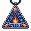 | **Azurite Watcher's Seal** | A triangular amulet pendant featuring a deep blue gemstone at its center, surrounded by golden geometric patterns. The stone glows with an ethereal light, framed by ornate metalwork with sharp, angular edges. | *An ancient talisman said to contain the watchful gaze of forgotten sentinels. Those who bear it claim to feel an unseen presence guiding their steps through darkness.* | Samurai, Mage, Archer, Warrior |
| 2 |  | **Vulpine Warding Sigil** | A triangular amulet featuring a stylized fox head in burnt orange and cream tones. The fox's pointed ears frame sharp, intelligent eyes rendered in deep amber. Gold filigree accents trace the edges, with a faint crimson undertone suggesting ancient craftsmanship. | *Once worn by a cunning hedge-witch who bartered her soul to a clever spirit. The fox remembers everything—your triumphs, your failures, your secrets. Wearing it grants clarity at the cost of never forgetting what you'd rather lose.* | Samurai, Mage, Archer, Warrior |
| 3 |  | **Amethyst Tear of Sorrows** | A teardrop-shaped amulet of deep purple amethyst, suspended by a delicate silver chain. The stone glows faintly with an inner violet light, and wisps of dark energy swirl within its faceted surface. | *Once wept by a forgotten sorcerer consumed by despair, this crystallized tear holds the weight of infinite suffering. Those who wear it find their sorrow becomes strength, though the price is steep—whispers of the dead echo in their dreams.* | Samurai, Mage, Archer, Warrior |
| 4 |  | **Ember Wyrdstone Amulet** | An oval-shaped amulet with a warm amber-brown exterior and a glowing golden-orange spiral or flame motif at its center. The ornate oval frame has a deep red-brown patina, suggesting aged metal or stone. A worn cord or chain attachment hangs from the top. | *Once worn by a pyromancer consumed by their own inferno, this amulet still pulses with the fading heat of immolation. Those who bear it feel the whisper of ancient flames—a power that demands respect, or ruin.* | Samurai, Mage, Archer, Warrior |
| 5 |  | **Crossward Aegis** | A shield-shaped amulet pendant with a prominent blue cross at its center, surrounded by ornate silver metalwork. The cross glows with arcane light against a dark purple-blue background. Silver chains frame the edges with pointed embellishments. | *An ancient ward forged when faith and steel still held dominion. Those who bear it find their convictions hardened against the creeping dark, though some say it whispers of crusades long forgotten.* | Samurai, Mage, Archer, Warrior |
| 6 |  | **Feline Seer's Charm** | A small circular amulet featuring a stylized cat's face with sharp amber eyes and pointed ears. Warm orange and brown tones dominate, with black accents defining the feline features. The piece appears crafted from polished stone or bone, emanating an almost hypnotic gaze. | *An artifact born from pacts between sorcerers and creatures of shadow. Those who wear it find their perception sharpened, as if seeing through the veil between worlds—though some claim the watching eyes never truly close.* | Samurai, Mage, Archer, Warrior |
| 7 | 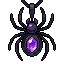 | **Arachnid's Vigil** | A dark amulet shaped like a stylized spider with a prominent amethyst gem embedded in its abdomen. The spider's body is rendered in deep blacks and purples, with delicate segmented legs extending outward. The central crystal glows with an ethereal violet luminescence. | *An amulet born from the void between worlds, where eight-legged sentinels guard the threshold of fate. Those who wear it find themselves watched—whether by protector or predator remains a secret the darkness keeps.* | Samurai, Mage, Archer, Warrior |
| 8 |  | **Sovereign of the Hollow Crown** | A golden crown amulet with ornate peaks and a deep crimson base. The sprite features a regal yellow-gold coloring with dark burgundy undertones, suggesting ancient royalty tainted by shadow. Small gemstones glint at the crown's tips. | *Once worn by a king whose ambition consumed kingdoms. Now it whispers promises of dominion to those foolish enough to bear its weight—each wearing it draws them deeper into the abyss of their own hunger.* | Samurai, Mage, Archer, Warrior |
| 9 |  | **Deathshead Sigil** | A circular gold medallion suspended from a chain, featuring a prominent skull motif at its center. The skull is rendered in white and black against the golden backdrop, surrounded by ornate circular patterns and symbols suggesting ancient craftsmanship. | *A talisman bearing the gaze of mortality itself. Those who wear it find their resolve hardened, though some whisper the skull watches even in darkness.* | Samurai, Mage, Archer, Warrior |
| 10 |  | **Hollow Meridian Amulet** | A circular brass-rimmed amulet with concentric rings of muted gold and bronze. The center features three horizontal bands in darker tones, creating a target-like design. Suspended from a simple dark cord or chain attachment point at the top. | *An ancient charm bearing the seal of forgotten celestial alignments. Those who wear it report visions of empty thrones and the soft whisper of something vast breathing in the dark.* | Samurai, Mage, Archer, Warrior |
| 11 | 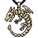 | **Serpent's Covenant** | An ornate amulet featuring a coiled serpent eating its own tail, rendered in weathered bronze and dark patina. The snake's scales catch glints of light, while its single ruby eye glows ominously from the center. Fine chains drape downward from the loop. | *An ancient talisman bearing the mark of eternal cycles and forbidden knowledge. Those who wear it find themselves caught between rebirth and damnation, forever bound to the serpent's hunger.* | Samurai, Mage, Archer, Warrior |
| 12 | 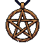 | **Pentagram of the Void** | A bronze-framed pentagram amulet suspended from a chain. The five-pointed star is intricately detailed with dark metalwork, its center glowing with an ethereal amber warmth against shadowed edges. Worn patina suggests ancient origins. | *An artifact forged in forgotten rituals, this pentagram channels the balance between worlds. Those who wear it feel the presence of forces beyond mortal comprehension, granting both protection and peril.* | Samurai, Mage, Archer, Warrior |
| 13 |  | **Ashenbark Talisman** | A rounded bronze medallion suspended by a dark cord. The face depicts an intricate tree or staff symbol in relief, with burnt orange patina covering aged metal. Simple, weathered, and deliberately archaic. | *An artifact of forgotten rituals, this talisman pulses with the essence of ancient groves long consumed by ash. Those who wear it feel the weight of centuries pressing against their soul, granting clarity in the face of oblivion.* | Samurai, Mage, Archer, Warrior |
| 14 |  | **Bloodveil Crest** | A shield-shaped amulet with a crimson center featuring a golden crowned figure or sigil. Ornate golden filigree borders frame the design. Deep burgundy and gold coloring dominates, with intricate medieval heraldic styling suggesting ancient nobility or dark lineage. | *An heirloom of the damned, bearing the weight of a cursed bloodline. Those who wear it feel the phantom presence of countless fallen ancestors, their whispers offering strength born of suffering and sacrifice.* | Samurai, Mage, Archer, Warrior |
| 15 | 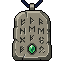 | **Verdant Spiritward** | A rectangular amulet pendant with weathered bronze framing. The center features a stylized green plant or vine motif against a pale cream background, suggesting nature's resilience. Small ornamental details frame the botanical symbol, with a braided cord attachment at the top. | *Once worn by druids who walked between the living world and the verdant abyss. Its lingering essence whispers of growth amid decay, offering sanctuary to those who carry its weight.* | Samurai, Mage, Archer, Warrior |
| 16 |  | **Ursine Vigil Amulet** | A circular bronze amulet pendant featuring a stylized bear's head in warm brown tones. The bear has prominent pointed ears, dark eyes, and an imposing expression. Ornate metal filigree frames the creature, with a metallic loop attachment at the top for wearing. | *Once worn by a forgotten guardian of the ancient forests, this amulet pulses with the primal strength of the great beasts. Those who bear it claim to feel the weight of watchful eyes upon them—whether protection or curse remains unclear.* | Samurai, Mage, Archer, Warrior |
| 17 |  | **Verdant Warden's Seal** | A circular amulet featuring an ornate golden frame encasing a deep emerald-green stone or crystal. The center displays an intricate tortoise or shield motif in darker green, surrounded by decorative golden filigree. The piece has a weathered, ancient quality with a warm bronze patina. | *An artifact of forgotten verdancy, this seal pulses with the slow, patient wisdom of ages long buried. Those who wear it find their resilience deepened, as if roots had grown through their very being.* | Samurai, Mage, Archer, Warrior |
| 18 |  | **Deathwatch Sigil** | A dark shield-shaped amulet featuring a golden skull emblem centered on a deep purple background. Ornate gold filigree borders frame the design, with small decorative elements at cardinal points. The skull's eye sockets glow faintly with an eerie luminescence. | *An ancient talisman that bears witness to countless deaths. Those who wear it claim to feel the presence of fallen souls, their whispers granting protection born from the knowledge of mortality itself.* | Samurai, Mage, Archer, Warrior |
| 19 |  | **Skulltide Pendant** | A circular amulet featuring a golden skull wreathed in blue mystical flames, suspended from a dark chain. The skull's eye sockets glow with ethereal blue light. Ornate detailing frames the skull against a deep blue background with star-like accents. | *Forged from the remains of a sorcerer who challenged death itself, this pendant hums with the whispers of the damned. Those who wear it walk between worlds, neither fully living nor wholly lost to the void.* | Samurai, Mage, Archer, Warrior |
| 20 |  | **Lyre of Forgotten Souls** | A golden harp-shaped amulet with warm bronze and copper tones. Delicate strings are intricately carved, with ornamental swirls adorning the frame. Small glowing runes shimmer along its edges, suggesting ancient magic woven into the craftsmanship. | *Once strummed by a bard who bargained with entities beyond the veil, this lyre resonates with the echoes of lost lives. Those who wear it claim to hear whispers of the departed, granting fleeting glimpses of truths meant to stay buried.* | Samurai, Mage, Archer, Warrior |
| 21 |  | **Serpent's Azure Coil** | A coiled serpent amulet in shades of blue and teal, rendered in pixel art with intricate scale details. The dragon-like creature wraps around itself, with a glowing cyan jewel at its center. Gold accents frame the pendant. | *An ancient talisman said to contain the essence of a celestial wyrm. Those who wear it find their will hardened against the corrupting whispers that lurk in shadow.* | Samurai, Mage, Archer, Warrior |
| 22 |  | **Ravencrest Talisman** | A dark bronze amulet suspended from a frayed cloth cord, featuring an obsidian raven's head with amber eyes. The pendant is adorned with tarnished silver filigree and dangles with small bone charms that catch the light. | *Once worn by a murder of witches who bargained with forces beyond the veil. Its whispered song draws the gaze of carrion and shadow alike, promising those who hear it a glimpse of the inevitable end.* | Samurai, Mage, Archer, Warrior |
| 23 |  | **Stag's Malice Talisman** | A carved wooden amulet depicting an antlered stag's head in dark brown, rendered with intricate detail. The face features haunting eye sockets and sharp, branching antlers that extend upward. The wood appears aged and weathered, with subtle grain patterns visible across the surface. | *An effigy wrought from the heartwood of a cursed forest, its antlers still seem to pulse with the dying breath of the beast from which it was carved. Those who wear it find themselves watched by unseen eyes.* | Samurai, Mage, Archer, Warrior |
| 24 |  | **Bloodpact Amulet** | A weathered bronze amulet featuring a central crimson gemstone surrounded by intricate runic engravings. Tarnished silver filigree traces ancient symbols across its surface, with dark staining suggesting age and ritualistic use. | *Forged in an age of forgotten pacts, this amulet pulses with the binding power of blood oaths. Those who wear it find themselves bound to forces beyond mortal comprehension, their very essence marked by the covenant.* | Samurai, Mage, Archer, Warrior |
| 25 | 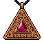 | **Crimson Covenant Amulet** | A triangular pendant with deep crimson and gold geometric patterns. Central ruby gem surrounded by ornate metalwork and ancient runes. Suspended from a dark chain with intricate knotwork details. | *Forged in an age when blood and oath were one, this amulet pulses with the rage of a thousand broken promises. Those who wear it feel the weight of ancient vengeance coursing through their veins.* | Samurai, Mage, Archer, Warrior |
| 26 |  | **Owlwarden's Gaze** | A golden amulet featuring a stylized owl face with piercing amber eyes and intricate feather details. The owl's head is adorned with a pointed crown-like crest, surrounded by ornate golden scrollwork and small jeweled accents in deep red and blue tones. | *An artifact of old night-watchers who guarded forgotten sanctums. Its unblinking gaze pierces through deception and shadow, granting those who wear it clarity in darkness and dominion over hidden truths.* | Samurai, Mage, Archer, Warrior |
| 27 |  | **Skull of Echoing Dread** | A dark skull amulet pendant with hollow eye sockets glowing an eerie crimson red. The bone is blackened and weathered, suspended from a tattered chain. Wisps of shadow curl around its jaw. | *An amulet carved from the skull of something that should not be named. Those who wear it hear whispers from the spaces between worlds—knowledge bought at a terrible cost.* | Samurai, Mage, Archer, Warrior |
| 28 |  | **Voidstar Pendant** | A circular amulet suspended from a golden chain, featuring a deep purple gemstone at its center. A luminous arcane symbol glows within the stone, radiating violet light. The pendant's outer ring is ornate gold filigree, with subtle cosmic patterns etched along its border. | *An artifact forged in the embrace of the void itself. Those who wear it feel the weight of forgotten stars pressing against their soul, granting passage between realms both seen and unseen.* | Samurai, Mage, Archer, Warrior |
| 29 |  | **Bloodpact Talisman** | A crimson-gemmed amulet suspended from a braided cord, featuring an ornate golden frame with dark enamel inlays. The central stone pulses with an inner amber glow, surrounded by ritualistic symbols etched into the metal backing. | *Forged in the throes of an ancient covenant, this talisman binds the wearer to forces older than kingdoms. Those who wear it find their will strengthened, though whispers suggest a price paid in shadows.* | Samurai, Mage, Archer, Warrior |
| 30 |  | **Vigilant Oculus Charm** | A ornate circular amulet featuring a prominent golden eye at its center, surrounded by layered petals or geometric patterns in warm bronze and gold tones. The eye glows with an ethereal blue iris, anchored by an ornamental loop for suspension. | *An ancient talisman said to grant sight beyond the veil. Those who wear it claim to perceive threats before they manifest, though some whisper the eye never truly closes—watching even in sleep.* | Samurai, Mage, Archer, Warrior |
| 31 |  | **Spiralvoid Pendant** | A teardrop-shaped amulet of deep indigo stone, swirling with ethereal violet energy that seems to rotate within the gem. Silver filigree wraps the edges, and a thin chain of dark metal suspends it. | *An amulet that drinks in the light around it, leaving only shadow and whispered doubt. Those who wear it find their senses drawn inward, toward truths better left forgotten.* | Samurai, Mage, Archer, Warrior |
| 32 |  | **Cardiophage Amulet** | A dark, anatomical heart rendered in deep crimson and obsidian black, suspended within an ornate silver cage. Veins of blood-red energy pulse across its surface. The pendant hangs from a blackened chain, with intricate gothic filigree adorning the frame. | *A relic forged from the heart of a fell beast, still beating with unnatural vitality. Those who wear it feel their own pulse quicken—whether from power or curse, none can say.* | Samurai, Mage, Archer, Warrior |
| 33 |  | **Sapphire Vigil Amulet** | A circular golden medallion suspended from a chain, featuring a prominent sapphire gemstone at its center. The stone glows with an ethereal blue light. Ornate gold filigree frames the gem in a protective circular pattern, with intricate detailing around the edges. | *An artifact of ancient ward-craft, its sapphire eye watches over those who bear it. Legend claims it belonged to a sentinel who refused death, binding their vigilance into crystal form.* | Samurai, Mage, Archer, Warrior |
| 34 | 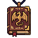 | **Gilded Sepulcher Amulet** | A ornate square pendant in aged bronze and gold, suspended by a worn chain. The face depicts a robed figure or saint in relief, surrounded by decorative scrollwork and darker patina. Simple, weathered, and ceremonial. | *An relic of forgotten devotion, its wearer becomes heir to the blessings—and curses—of those who wore it before. The gold tarnishes with each soul it witnesses.* | Samurai, Mage, Archer, Warrior |
| 35 |  | **Chronoveil Compass** | An octagonal silver amulet pendant featuring a dark compass rose with eight pointed directions. The center displays a pale blue circular gem or crystal surrounded by intricate geometric runic patterns. Fine chains and metallic details frame the emblem against a dark background. | *An ancient artifact said to pierce the veil between moments. Those who wear it walk slightly outside time's current, their fate obscured even to forces that divine destiny.* | Samurai, Mage, Archer, Warrior |
| 36 |  | **Crimson Heartstone** | A heart-shaped amulet suspended from a golden chain. Deep crimson gemstone with intricate gold filigree forming a protective seal, radiating warm amber light from its faceted center. | *Once torn from a god's dying form, this pendant pulses with the last echoes of divine vitality. To wear it is to invite both salvation and the wrath of those who hunted its bearer.* | Samurai, Mage, Archer, Warrior |
| 37 | 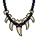 | **Fangward Talisman** | A dark amulet featuring sharp, downward-pointing spikes arranged in a circular pattern around a central dark stone. The spikes appear bone-like or metallic, rendered in grayscale against a shadowy background. Intricate details suggest ancient craftsmanship. | *Forged in ages past by those who walked between worlds, this talisman hungers for the lifeblood of those who dare approach its wearer. Each spike drinks deeply from the veil between life and death.* | Samurai, Mage, Archer, Warrior |
| 38 |  | **Veilbound Sigil** | A dark circular amulet with an obsidian-black background. Intricate violet and indigo runes form a geometric star pattern around a central crystalline core. Silver arcane symbols radiate outward, set against the shadowed face of the pendant. | *An amulet forged in the spaces between worlds, its sigils whisper secrets that mortal minds were never meant to comprehend. Those who wear it find themselves caught between the veil of reality and something far more ancient.* | Samurai, Mage, Archer, Warrior |
| 39 |  | **Goldvein Crucifix** | A golden cross amulet with ornate detailing, suspended from a beaded chain. The cross features intricate filigree work and glowing amber gemstones at each cardinal point, radiating warmth against its polished metallic surface. | *An artifact of forgotten devotion, its golden frame thrums with the accumulated prayers of the fallen. Those who wear it feel the weight of sanctity—a shield against the encroaching darkness, or perhaps a beacon drawing it ever closer.* | Samurai, Mage, Archer, Warrior |
| 40 |  | **Bloodbound Reliquary** | A ornate rectangular amulet with deep crimson and gold tones. The pendant features an intricate embossed design with baroque detailing, suspended from a delicate chain. The face bears a weathered crest or sigil, suggesting ancient craftsmanship and ritualistic significance. | *An artifact bound to the covenant of blood itself. Those who wear it feel the weight of a thousand forgotten oaths, their vitality intertwined with forces best left undisturbed.* | Samurai, Mage, Archer, Warrior |
| 41 |  | **Chronoveil Sigil** | A circular amulet featuring a golden gear-like outer rim adorned with purple gemstones at cardinal points. The center displays a deep blue clockwork mechanism with radiating spokes, set against an ornate violet background with intricate arcane runes. | *An artifact that whispers of ages past and futures yet unwritten. Those who wear it feel time's weight upon their shoulders, granting glimpses of what was and what might yet be—at a terrible cost.* | Samurai, Mage, Archer, Warrior |
| 42 |  | **Voidspiral Pendant** | A circular amulet with a deep purple and indigo spiral pattern emanating from its center. Gold filigree frames the edges, while the swirling design suggests an endless cosmic vortex. The pendant hangs from a ornate gold chain. | *An ancient talisman that draws power from the spaces between worlds. Those who wear it feel the weight of forgotten dimensions pressing against their mind, whispering secrets that should remain buried.* | Samurai, Mage, Archer, Warrior |
| 43 |  | **Bloodroot Pendant** | An ornate amulet featuring a deep amber-brown crystalline core, suspended within an intricate golden frame adorned with twisted thorny protrusions. The pendant glows with a warm, sanguine luminescence, suggesting ancient alchemical craftsmanship. | *Once worn by a forgotten covenant of blood-witches, this pendant thrums with vitality torn from the earth itself. Those who bear it walk a cursed path between life and ruin.* | Samurai, Mage, Archer, Warrior |
| 44 |  | **Dragonblood Sigil** | A crimson amulet featuring a coiled dragon in deep burgundy and gold tones. The dragon's scales form an intricate knot pattern around a central gemstone that glows faintly. Ornate golden filigree frames the pendant, with small wing-like protrusions extending from the sides. | *Forged in an age when dragons still walked the earth, this sigil pulses with the ancient vitality of draconic blood. Those who bear it claim to feel the beast's defiant heartbeat, a constant reminder that even gods can fall.* | Samurai, Mage, Archer, Warrior |
| 45 |  | **Goldseeker's Seal** | A circular golden amulet pendant featuring a central amber gemstone surrounded by concentric rings of burnished gold. Ornate filigree detailing frames the stone, with a sturdy chain attachment at the apex. The warm amber glow suggests captured light or inner radiance. | *An heirloom of merchants long turned to dust, this amulet thrums with accumulated greed and forgotten bargains. Those who wear it find fortune's gaze lingering a moment longer—though at what cost remains unclear.* | Samurai, Mage, Archer, Warrior |
| 46 |  | **Lion's Vigil Amulet** | A circular medallion pendant featuring a pixel-art lion's head in warm bronze and gold tones. The lion's mane is rendered in detailed amber shades with darker brown outlines, conveying fierce nobility. Suspended by a simple cord attachment at the top. | *An ancient talisman bearing the countenance of a beast long extinct. Those who wear it feel the weight of ancient courage pressing against their chest, as if the lion's eternal vigilance shields them from the creeping dark.* | Samurai, Mage, Archer, Warrior |
| 47 |  | **Storm Serpent's Covenant** | A bronze amulet depicting an ouroboros—a serpent consuming its own tail—suspended from a twisted cord. The snake's scales are meticulously detailed, with amber highlights catching the light. Small occult symbols ring the pendant's edge. | *An ancient talisman binding the wearer to cycles beyond mortal comprehension. Those who wear it find themselves caught between endings and beginnings, forever sealed to the serpent's eternal hunger.* | Samurai, Mage, Archer, Warrior |
| 48 |  | **Verdant Oath Amulet** | A circular pendant suspended from a dark chain, featuring a luminous green crystal or gemstone at its center. The frame appears ornate with subtle metalwork, surrounded by an inner ring of darker tones creating depth and shadow around the glowing core. | *An artifact steeped in forgotten pacts, its emerald heart pulses with the lingering will of those who swore eternal bonds. To wear it is to inherit their unfulfilled oaths—a burden that strengthens the bearer, though at a cost only time reveals.* | Samurai, Mage, Archer, Warrior |
| 49 |  | **Verdant Scarab Sigil** | A circular amulet pendant featuring a stylized emerald beetle at its center, set against a deep purple circular backing. The scarab glows with an otherworldly green luminescence, surrounded by ornate metallic detailing and dark mystical patterns. | *An ancient talisman bearing the visage of a forgotten god's messenger. Those who wear it feel the weight of the earth itself, as if nature's oldest secrets whisper through their very bones.* | Samurai, Mage, Archer, Warrior |
| 50 |  | **Wingfall Charm** | A golden winged amulet suspended from a delicate chain. The pendant features intricate feather detailing in warm gold tones, with outstretched wings forming a protective embrace around a small crystalline center. Ornate filigree work adorns the edges. | *Once worn by a fallen seraph, this charm still remembers the weight of celestial flight. Those who bear it find themselves touched by grace—though whether blessing or curse remains uncertain.* | Samurai, Mage, Archer, Warrior |
| 51 |  | **Bloodwing Talisman** | A dark crimson amulet featuring a pair of symmetrical bat wings unfurled around a central black core. Gold accents frame the wings' edges, with deep burgundy coloring suggesting dried blood or ancient dye. Sharp, angular wing points extend outward. | *Once worn by a fell creature of the night, this talisman thrums with an unsettling vitality. Those who bear it find themselves caught between the mortal world and something far darker, drawing power from shadows most dare not acknowledge.* | Samurai, Mage, Archer, Warrior |
| 52 |  | **Veilmouth Talisman** | A circular brass amulet featuring a grotesque open mouth with sharp teeth forming the outer ring. A single glowing green eye sits at the center, surrounded by intricate occult symbols. Dark patina covers the metal surface with hints of emerald luminescence. | *An ancient charm that whispers secrets from beyond the veil. Those who wear it claim to hear voices in the darkness—whether blessing or curse, none can say.* | Samurai, Mage, Archer, Warrior |
| 53 |  | **Flameheart Talisman** | A ornate amulet featuring a stylized deer or stag head rendered in warm amber and gold tones. Intricate antlers frame a central glowing core of deep crimson and orange, suggesting inner fire. The piece radiates warmth with flickering flame-like patterns throughout. | *An ancient charm born from the heart of a celestial beast. Those who wear it feel the primal warmth of creation itself coursing through their veins, though at the cost of an insatiable hunger that can never be sated.* | Samurai, Mage, Archer, Warrior |
| 54 | 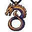 | **Ember Serpent's Covenant** | A bronze amulet depicting an ouroboros—a serpent coiled around itself forming a perfect circle. The serpent's scales are intricately detailed with warm gold inlays. Its single eye glows faintly amber, and crimson runes spiral along the inner rim. | *An ancient talisman forged in an age when serpents were gods. It whispers promises of renewal through ruin, binding the wearer to cycles both terrible and eternal.* | Samurai, Mage, Archer, Warrior |
| 55 |  | **Pentagram Warden's Seal** | A circular bronze amulet suspended by a braided cord, featuring a prominent five-pointed star in emerald green at its center, surrounded by concentric rings of intricate geometric patterns in copper and gold leaf detailing. | *An arcane talisman of forgotten origin, its pentagram pulses with eldritch energy that shields the wearer from unseen forces. Those who wear it walk between worlds, neither fully of flesh nor spirit.* | Samurai, Mage, Archer, Warrior |
| 56 |  | **Stag's Vigil** | An ornate amulet featuring a noble stag's head in silver-blue tones, crowned with antlers that form a protective arch. The stag's eyes glow with an ethereal sapphire light. Intricate knotwork frames the pendant, suggesting ancient forest magic and watchful guardianship. | *Once worn by a woodland sentinel who chose vigilance over slumber. The stag remembers what mortals forget—that some hunts never end, and some watchers never rest.* | Samurai, Mage, Archer, Warrior |
| 57 |  | **Withered Heartwood Charm** | A gnarled, twisted amulet carved from blackened wood with skeletal branch-like protrusions. Crimson veins pulse faintly across its surface, and a small hollow cavity at its center glows with dying ember-light. | *Once a sacred talisman of the forest's eldest guardians, now corrupted by centuries of entombed malice. Those who wear it feel the ancient wood's hunger—a whisper of things that should have stayed buried.* | Samurai, Mage, Archer, Warrior |
| 58 |  | **Cursed Deathshead Sigil** | A dark indigo amulet pendant featuring a stylized skull with glowing cyan eye sockets. Intricately carved bone or obsidian material with sharp angular features, suspended from a thin chain. The skull's hollow gaze radiates an otherworldly luminescence. | *An amulet carved from the skull of an ancient warlock, its ethereal eyes still burning with the hunger of the damned. Those who wear it feel the weight of countless souls pressing against their mortality.* | Samurai, Mage, Archer, Warrior |
| 59 |  | **Verdant Threnody** | A hanging amulet featuring a polished emerald teardrop suspended beneath an ornate golden crescent. Delicate vines wrap the chain; a small red jewel accent glints at the crown. The gem radiates subtle green luminescence against dark leather backing. | *Once worn by a druid who sang the world into ruin. The amulet hums with an ancient, mournful resonance—a requiem for all that was lost to ambition and thorns.* | Samurai, Mage, Archer, Warrior |
| 60 |  | **Heartwood Sigil** | A circular bronze amulet suspended from a tarnished chain. The pendant features a stylized heart symbol carved into dark wood at its center, surrounded by concentric bronze rings. Warm amber light emanates from within the wooden core. | *An ancient talisman said to beat with the pulse of forgotten kingdoms. Those who wear it feel the weight of every life it has witnessed—a burden, and a strength.* | Samurai, Mage, Archer, Warrior |
| 61 |  | **Twilight Mooncrest Amulet** | A golden circular amulet with ornate borders, featuring a prominent amethyst gemstone at its center that glows with deep purple radiance. The gem appears to shift between light and dark hues, suspended within an intricate golden setting adorned with decorative details. | *An artifact born from the marriage of celestial magic and forgotten craft. Its amethyst core pulses with the whispers of the void, granting the wearer glimpses beyond the mortal veil—a blessing or curse, depending on one's resolve.* | Samurai, Mage, Archer, Warrior |
| 62 |  | **Veilheart Amulet** | A teardrop-shaped amulet with deep teal and emerald gemstone center, surrounded by ornate bronze metalwork. Golden accents frame the stone, with delicate filigree patterns suggesting arcane symbols. A dark purple cord suspends it. | *Once worn by a forgotten seer, this amulet pulses with the faint warmth of a heart no longer beating. Those who bear it find their will strengthened against the encroaching darkness, though whispers suggest a price yet unpaid.* | Samurai, Mage, Archer, Warrior |
| 63 |  | **Crimson Vigil Amulet** | A circular pendant suspended from a chain, featuring a deep crimson center with ornate gold filigree borders. A central symbol resembles a watchful eye or seal, rendered in darker red tones. The piece has a weathered, ancient appearance with intricate circular patterns radiating outward. | *An artifact of forgotten guardians, this amulet pulses with the echoes of those who bore witness to calamity. To wear it is to invite their eternal scrutiny—whether blessing or curse remains unclear.* | Samurai, Mage, Archer, Warrior |
| 64 |  | **Bloodpact Crest** | A ornate wooden amulet with crimson and gold accents, featuring a central cross-like symbol with intricate carved details and a jeweled centerpiece that gleams against aged leather cord. | *An ancient talisman bound by forgotten oaths and the blood of those who came before. Those who wear it feel the weight of ancestral power, as if countless souls whisper guidance through the veil between worlds.* | Samurai, Mage, Archer, Warrior |
| 65 | 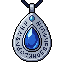 | **Sapphire Teardrop** | A teardrop-shaped amulet pendant featuring a deep blue sapphire stone set within an ornate silver or platinum frame. The gem glows faintly with an ethereal azure light. Delicate metalwork and decorative flourishes surround the stone, suspended from a thin chain. | *Once wept by a forgotten god, this crystalline tear hardens sorrow into power. Those who wear it find their deepest grief becomes an unbreakable resolve.* | Samurai, Mage, Archer, Warrior |
| 66 |  | **Toadkin's Corrupted Eye** | A tarnished bronze amulet featuring a grotesque toad's head with bulging eyes and warty texture. The central gem glows an sickly amber-green, surrounded by ornate metalwork with fungal-like protrusions. A frayed cord secures the talisman. | *Once a noble charm, this amulet now pulses with primordial corruption. Those who wear it feel the weight of ancient amphibian hunger gnawing at the edges of their sanity, granting resilience born from something wholly unnatural.* | Samurai, Mage, Archer, Warrior |
| 67 |  | **Forsaken Arachnid's Vigil** | A dark amulet featuring a detailed black spider with eight articulated legs, rendered in obsidian tones. The spider's body gleams with an ethereal purple aura, suspended within a subtle crystalline or web-like frame. Fine linework creates an intricate, almost living appearance. | *An amulet woven from the remnants of an ancient arachnid guardian. Those who wear it claim to sense the skittering of unseen threads—a watchful presence that stirs between worlds, neither wholly here nor there.* | Samurai, Mage, Archer, Warrior |
| 68 |  | **Verdant Covenant Stone** | A ornate square amulet with interlocking geometric patterns in black and dark green. Central emerald-green gem surrounded by thorned ivy motifs. Silver filigree borders frame the design with sharp, angular details. | *An ancient charm wrought from the bones of forgotten pacts. Its verdant heart pulses with the whispered oaths of those who sought power through sacrifice, binding the wearer to forces neither fully mortal nor divine.* | Samurai, Mage, Archer, Warrior |
| 69 |  | **Deathveil Ossuary** | A verdant-green rectangular amulet pendant with ornate bronze or gold framing. At its center, a pale skull symbol rendered in bone-white sits within a darker green gemstone or enameled face. Intricate decorative borders frame the skull motif. | *An ancient talisman that whispers of tombs long forgotten. Those who wear it feel the veil between life and death grow thin, granting glimpses of mortality's truth—and power drawn from its acceptance.* | Samurai, Mage, Archer, Warrior |
| 70 |  | **Sovereign's Dirge** | A ornate golden crown amulet pendant with a deep purple gemstone at its center. The crown features intricate metalwork with sharp, angular points. A delicate chain suspends the piece, rendered in muted grays and blacks against the dark background. | *Once worn by a monarch whose reign ended in shadow and ruin. Those who bear this amulet feel the weight of forgotten thrones pressing upon their soul—power and despair intertwined.* | Samurai, Mage, Archer, Warrior |
| 71 |  | **Goldenthrone Sigil** | A golden cross-shaped amulet with a prominent circular centerpiece. The cross features ornate arms with subtle detailing, while the central medallion displays warm amber and gold tones. Four smaller cross points extend outward, creating a symmetrical, regal silhouette against a dark background. | *Once worn by a forgotten deity, this sigil thrums with an ancient power that transcends mortal comprehension. Those who bear it feel the weight of divine judgment—protection granted only to the worthy.* | Samurai, Mage, Archer, Warrior |
| 72 |  | **Veilguard Sigil** | An ornate amulet featuring a central shield crest in deep blue and silver, adorned with symmetrical wing motifs and intricate geometric patterns. The pendant hangs from a reinforced chain, with small crystalline accents catching ethereal light. | *A ward against the creeping dark, though whether it protects the wearer or merely postpones the inevitable remains unclear. Those who bear it report whispers at the edge of consciousness—guidance, or temptation?* | Samurai, Mage, Archer, Warrior |
| 73 | 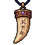 | **Fang of the Pale Hunt** | A carved ivory or bone fang pendant, cream-colored with warm tan undertones, suspended from a leather cord. The fang tapers to a sharp point and features subtle carved grooves along its length, suggesting age and ritual significance. | *Once worn by those who stalked prey in moonlit wastelands, this fang thrums with the hunger of forgotten predators. Those who bear it find themselves marked by something ancient—watched, perhaps, or blessed.* | Samurai, Mage, Archer, Warrior |
| 74 |  | **Crimson Cross Amulet** | A ornate cross pendant featuring deep crimson gemstones at cardinal points, surrounded by intricate blue metalwork. Golden accents frame the center ruby, with symmetrical cross-bar design emanating arcane power. | *An unholy relic that thrums with the prayers of the forgotten dead. Those who wear it find their resolve hardened, yet their soul forever marked by its hunger.* | Samurai, Mage, Archer, Warrior |
| 75 |  | **Crimson Warden's Cross** | A ornate cross amulet with a dark metallic frame and four cardinal points. Central red gemstone glows faintly, surrounded by intricate geometric patterns. Weathered bronze or iron construction with symbolic engravings along each arm. | *An ancient talisman forged in times of divine strife, its crimson heart pulses with the last breath of a forgotten sentinel. Those who bear it find themselves watched—whether blessed or cursed remains unclear.* | Samurai, Mage, Archer, Warrior |
| 76 |  | **Heartwood Vigil** | A heart-shaped amulet carved from dark wood with ornate copper filigree. Two symmetrical wing-like extensions frame the sides, with intricate patterns resembling feathers or leaves. Warm amber light glows softly from within the carved center. | *Once worn by a guardian whose love transcended death itself. The amulet still pulses with protective warmth, though whether it shields the wearer or hungers for their devotion remains unclear.* | Samurai, Mage, Archer, Warrior |
| 77 |  | **Obsidian Pact Amulet** | A dark diamond-shaped amulet with a black obsidian core, surrounded by jagged crystalline edges in deep purple and midnight blue. Silver or platinum filigree traces angular patterns across its surface, with a small glowing orb suspended at its center. | *Forged in the depths where light fears to tread, this amulet pulses with the hunger of forgotten oaths. Those who wear it find their bonds with shadow deepened, yet pay a price in their very essence.* | Samurai, Mage, Archer, Warrior |
| 78 |  | **Emeraldvenom Talisman** | A ornate spider-shaped amulet crafted from dark metal, featuring a prominent emerald green stone set within its abdomen. The eight legs spread outward symmetrically, with intricate detailing suggesting ancient craftsmanship. The gem glows with an eerie, venomous luminescence. | *Woven from the carapace of a long-dead spider-thing, this talisman pulses with ancient venom. Those who wear it feel the creeping touch of poison in their veins—a gift and a curse in equal measure.* | Samurai, Mage, Archer, Warrior |
| 79 |  | **Gilded Heartwing Amulet** | A golden heart-shaped pendant suspended between two ornate feathered wings. The heart gleams with warm amber light, while the wings are rendered in burnished bronze with delicate feather details. A subtle halo surrounds the entire piece. | *An artifact of forgotten divinity, said to have been torn from the breast of a celestial guardian. Those who wear it claim to hear the faint echo of wingbeats in moments of mortal peril—whether salvation or condemnation remains unclear.* | Samurai, Mage, Archer, Warrior |
| 80 |  | **Chalice of Ascension** | A golden goblet with ornate wings extending from its sides, rendered in warm amber and bronze tones. The cup glows with an ethereal light, topped with a radiant jewel at its center. Intricate details line the rim. | *A relic of forgotten divinity, this chalice once graced the altars of fallen kingdoms. Those who bear its weight find themselves caught between salvation and damnation, as if drinking from eternity itself.* | Samurai, Mage, Archer, Warrior |
| 81 |  | **Ironwood Sentinel** | A carved wooden amulet in warm brown tones, featuring an angular face with deep-set eyes and geometric patterns. Gold or bronze metalwork frames the edges, with intricate tribal motifs etched across the surface. The expression is stern and protective. | *An ancient ward carved from the heartwood of trees that witnessed the fall of kingdoms. Those who wear it claim to feel the weight of forgotten guardians watching through the veil between worlds.* | Samurai, Mage, Archer, Warrior |
| 82 |  | **Cursed Bloodpact Amulet** | A teardrop-shaped pendant of deep crimson crystal suspended by ornate copper wire. The stone pulses with an inner vermillion glow, surrounded by delicate filigree knotwork. Small thorns or barbs protrude from the metal setting. | *Forged in blood and shadow, this amulet binds its wearer to an ancient covenant. Those who bear it find their vitality intertwined with forces beyond mortal comprehension—a blessing and curse in equal measure.* | Samurai, Mage, Archer, Warrior |
| 83 | 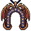 | **Forsaken Bloodwing Talisman** | A symmetrical horseshoe-shaped amulet with rich burgundy and copper tones. Twin ornate wings spread outward from a central circular emblem, detailed with intricate scrollwork. The metalwork appears ancient and ornamental, with a dark patina suggesting old blood or tarnish. | *Once worn by those who danced between life and death, this amulet pulses with the echoes of forgotten battles. Its wings remember the flight of carrion birds over countless fields.* | Samurai, Mage, Archer, Warrior |
| 84 | 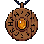 | **Sundered Chronometer** | A circular bronze amulet pendant featuring an ornate clock face with golden numeral markers. The center displays a glowing amber or golden core, surrounded by intricate mechanical rings and celestial motifs. Weathered patina covers the surface, suggesting ancient craftsmanship. | *An artifact of forgotten ages, this amulet pulses with the weight of moments unmade. Those who wear it feel time's currents bend subtly around them, as if the world moves through their shadow rather than the reverse.* | Samurai, Mage, Archer, Warrior |
| 85 |  | **Wolfpack Sigil** | A hexagonal amulet featuring a stylized wolf's head with piercing blue eyes and sharp geometric features. Deep indigo and silver coloring with intricate angular patterns suggesting fur and primal power. | *An amulet carved from starborn metal, bearing the mark of the hunt. Those who wear it are said to move with the cunning and ferocity of the wolf pack—predatory, relentless, never alone.* | Samurai, Mage, Archer, Warrior |
| 86 |  | **Carapace of the Void** | A deep indigo chitinous amulet resembling an armored beetle or scarab, its shell polished to a lustrous sheen. Twin crimson gem-like markings glow faintly at its center, arranged like watchful eyes. Gold filigree traces arcane symbols across its segmented surface. | *An artifact born from the exoskeletons of creatures that dwelt in the spaces between worlds. Those who wear it report whispers in the darkness—whether warnings or temptations, none can say for certain.* | Samurai, Mage, Archer, Warrior |
| 87 |  | **Tentacle Sigil** | An ornate amulet featuring a bronze or copper-toned octopus or tentacled creature as its centerpiece. The creature's limbs curl and intertwine around a dark core. Hanging from a sturdy chain, the artifact gleams with an otherworldly patina. | *Born from depths where light fears to tread, this sigil pulses with the hunger of forgotten things. Those who wear it feel the watchful presence of ancient tentacles coiling through their very soul.* | Samurai, Mage, Archer, Warrior |
| 88 |  | **Nightveil Amulet** | A circular pendant suspended by a dark chain, featuring a deep purple background with glowing green arcane runes or symbols arranged in a mystical pattern. The center contains a darker circle, possibly representing a void or eye, with subtle ethereal light emanating from within. | *An artifact forged in the depths of forgotten crypts, its runes whisper secrets that corrode the mind. Those who wear it find themselves walking the threshold between worlds, neither fully present nor entirely absent.* | Samurai, Mage, Archer, Warrior |
| 89 |  | **Sunscourge Medallion** | A circular golden amulet with a radiant sun face at its center, rendered in warm yellows and golds. Ornate rays extend outward, forming a perfect circle. The pendant hangs from a thin chain and features intricate detailing around the solar visage. | *Once worn by those who sought to pierce the veil between worlds, this medallion now radiates a corrupted light—beautiful and terrible. Those who bear it feel the weight of forgotten suns pressing against their very soul.* | Samurai, Mage, Archer, Warrior |
| 90 | 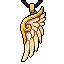 | **Bonelocket of Echoes** | A skeletal hand clutches a glowing orb suspended by golden chains. The hand is pale ivory bone, fingers curled protectively around a luminescent sphere emanating soft amber light. Fine metalwork adorns the wrist, with intricate engravings visible on aged parchment wrapping. | *Once worn by a forgotten seer, this amulet whispers secrets of the dead. Those who hold it feel the weight of countless souls pressing against their consciousness, granting glimpses of fates already written.* | Samurai, Mage, Archer, Warrior |
| 91 |  | **Nightveil Talisman** | A dark, jagged amulet carved from obsidian or blackened stone, shaped like a malevolent crown or thorned crest. Deep purple and black hues dominate, with veins of sickly violet running through its surface. Sharp, angular protrusions jut outward, giving it a dangerous, predatory appearance. | *An artifact forged in shadow and despair, this talisman whispers promises of power to those desperate enough to heed its call. Those who wear it find themselves walking the line between worlds, cloaked in an aura of pure dread.* | Samurai, Mage, Archer, Warrior |
| 92 |  | **Duskwarden's Sigil** | A dark, ornate amulet featuring a stylized wolf or beast head rendered in black and deep blue pixels. Sharp angular features with glowing blue eyes and intricate crown-like protrusions frame the grimacing visage. Metallic sheen suggests ancient forged material. | *An artifact bearing the weight of forgotten oaths, its gaze pierces through the veil between worlds. Those who wear it hear whispers of beasts long entombed, their hunger echoing in the amulet's cold embrace.* | Samurai, Mage, Archer, Warrior |
| 93 |  | **Crimson Voidheart** | A dark crimson amulet featuring a glowing ruby center set within concentric rings of aged bronze. Golden ornamental details frame a central emblem resembling an eye or portal, radiating an ominous reddish glow against the burgundy background. | *An ancient talisman that pulses with the trapped essence of something long forgotten. Those who wear it feel the weight of a thousand screams echoing from within, promising power at a terrible cost.* | Samurai, Mage, Archer, Warrior |
| 94 |  | **Sunburst Pact** | A circular bronze amulet featuring a radiant golden sun disk at its center, surrounded by concentric rings of burnt orange and deep crimson. Ornate geometric patterns frame the luminous core, with a sturdy chain attachment at the top. | *An ancient talisman that pulses with forgotten celestial power. Those who wear it feel the weight of a covenant made between worlds—protection earned through sacrifice, not granted by grace.* | Samurai, Mage, Archer, Warrior |
| 95 |  | **Goldenfeather Vigil** | A golden owl-faced amulet with spread wings, rendered in warm yellows and golds. Intricate feather detailing frames the solemn expression. Red gemstones accent the eyes and wing tips, creating an impression of watchful intensity. | *An ancient sentinel carved by forgotten hands, this amulet's unblinking gaze pierces through deception and shadow alike. Those who wear it claim the owl's eternal vigilance becomes their own—a burden of awareness that never rests.* | Samurai, Mage, Archer, Warrior |
| 96 |  | **Dragonfly's Requiem** | A delicate amulet featuring an iridescent dragonfly with blue and copper wings suspended in an ornate golden frame. The insect's segmented body gleams with an ethereal amber glow, while fine filigree wraps around the pendant's edges. | *Once a creature of the Luminous Marshes, this dragonfly was trapped in amber during an age of forgotten sorcery. It whispers of boundless skies and carries the weight of a thousand fleeting moments.* | Samurai, Mage, Archer, Warrior |
| 97 |  | **Violet Vigil Amulet** | A circular bronze pendant featuring a striking violet eye symbol at its center, surrounded by concentric rings. The iris glows with an ethereal purple hue, while deep blue undertones frame the pupil. Gold filigree adorns the outer edge, suspended from a dark chain. | *An artifact that watches where mortals cannot see. Those who wear it claim to glimpse shadows moving between moments, though the cost of such sight often proves steeper than the wearer imagines.* | Samurai, Mage, Archer, Warrior |
| 98 |  | **Thornveil Pendant** | A dark teal amulet carved from shadowed stone, suspended by a thin obsidian chain. Sharp, crystalline thorns jut outward from its crescent-shaped face, glinting with an eerie jade luminescence. A single vertical slit marks its center like a watchful eye. | *Forged in the depths where light dare not tread, this pendant drinks in the essence of those who wear it—a parasite adorned as protection. Its thorns weep a venom older than memory.* | Samurai, Mage, Archer, Warrior |
| 99 |  | **Crusader's Aegis Pendant** | A shield-shaped amulet with a golden-bronze frame adorned with a prominent cross motif. The background is a warm tan parchment color, creating depth. The cross is rendered in deep crimson with ornate detailing at its center, suggesting divine protection or holy purpose. | *Once worn by knights who fell in forgotten crusades, this pendant thrums with the weight of shattered faith. Those who bear it find themselves shielded by the conviction of the dead—whether blessing or curse remains unclear.* | Samurai, Mage, Archer, Warrior |
| 100 |  | **Solstice Star Pendant** | A radiant eight-pointed star amulet with golden-yellow coloring and intricate geometric patterns. The central core glows warmly, surrounded by angular rays that extend outward in a symmetrical design. The piece appears to be crafted from polished metal or enchanted crystal. | *An ancient talisman said to channel the dying light of forgotten suns. Those who wear it find themselves touched by celestial force, though at a price—each blessing draws them closer to the cold abyss from which all stars eventually fall.* | Samurai, Mage, Archer, Warrior |
