# Belts - Item Catalog

> **Category:** Belt  
> **Total items:** 100  
> **Classes:** Warrior, Samurai, Archer

| # | Preview | Item Name | Visual Description | Description | Classes |
|:-:|:-------:|:----------|:------------------|:------------|:--------|
| 1 | 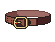 | **Crimson Girdle of Dominion** | A sturdy leather belt with deep burgundy-red tones, reinforced with dark metal buckles and studs. The centerpiece features an ornate rectangular bronze clasp with intricate detailing. Worn leather straps hang from the sides, suggesting age and countless battles. | *Forged in an era when blood-oaths bound warriors to their destiny, this girdle steadies the resolve of those who wear it. Each stain upon its leather tells of oaths kept and enemies fallen.* | Samurai, Warrior, Archer |
| 2 |  | **Cinderbound Girdle** | A dark leather belt adorned with ornate brass buckles and embossed crimson patterns. Gold filigree traces along the edges, with blackened steel studs forming a chain-like motif. Holly or ivy-like foliage details frame the central ornament in rich emerald and gold tones. | *Forged in the embers of a fallen lord's pyre, this girdle binds both flesh and fate. Those who wear it claim to feel the weight of old blood coursing through sinew, granting discipline to warrior and hunter alike.* | Warrior, Samurai, Archer |
| 3 |  | **Forsaken Cinderbound Girdle** | A dark leather belt with ornate brass buckle and rivets. The leather appears scorched and weathered, with faint ash-gray embroidery along the edges. Metal plates reinforce the sides, suggesting both nobility and battle-hardening. | *Forged in the embers of a forgotten war, this girdle binds not just flesh but the very resolve of those who wear it. Warriors claim it whispers of victories past, steadying the hand in moments of doubt.* | Warrior, Samurai, Archer |
| 4 |  | **Goldleaf Cinch** | A ornate belt of rich brown leather adorned with a prominent golden buckle featuring intricate leaf-like metalwork. The buckle displays symmetrical filigree patterns in bronze and gold tones, with a central embossed crest. The leather appears weathered yet regal. | *Worn by those who walk between worlds-a belt that grounds the wearer in ancient power. Its golden clasp whispers of forgotten kingdoms and the strength required to command them.* | Warrior, Samurai, Archer |
| 5 | 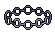 | **Shattered Cinderbound Girdle** | A wide ornate belt with a dark metal buckle adorned with circular studs and geometric patterns. The band appears crafted from dark leather or cloth with metallic reinforcement, featuring symmetrical decorative elements and a prominent central clasp. | *Forged in ash and bound with the resolve of fallen champions, this girdle anchors both body and spirit. Those who wear it find their center unmoved, whether facing steel or sorcery.* | Warrior, Samurai, Archer |
| 6 |  | **Abyssal Cinture** | A dark leather belt adorned with obsidian buckles and tarnished silver studs arranged in a spiral pattern. The material appears worn yet deliberately maintained, with deep indigo stitching that catches faint light. Small chains dangle from the sides. | *Forged in forgotten depths, this belt drinks in the light of those who wear it. The chains whisper of restraint broken and oaths shattered in shadow.* | Warrior, Samurai, Archer |
| 7 | 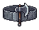 | **Ironpact Cinch** | A heavy leather belt reinforced with dark iron buckles and rivets. Worn charcoal-gray leather with weathered bronze fittings. A large central clasp features intricate geometric patterns reminiscent of ancient runes. | *Forged in an age when steel and flesh were one, this belt binds more than cloth-it anchors the wearer to earth and iron, granting steadfast resolve against the encroaching dark.* | Samurai, Archer, Warrior |
| 8 |  | **Bloodwraith Girdle** | A dark leather belt adorned with ornate bronze buckles and crimson fabric trim. Intricate symbols are embossed along the length, with what appears to be dried blood stains weathering the aged leather. Metal studs and decorative crimson accents frame the central buckle. | *Forged in sacrifice and bound with the essence of those who fell in forgotten wars, this girdle pulses with a faint crimson aura. Those who wear it find their resolve hardened, though whispers suggest it hungers for more.* | Warrior, Samurai, Archer |
| 9 |  | **Voidstitched Girdle** | A wide belt of deep purple fabric adorned with jagged, crystalline protrusions that seem to absorb light. The studs form an angular, almost spiky pattern across the dark weave, with hints of indigo and midnight blue throughout. | *Forged from the sinews of forgotten realms, this girdle whispers of abyssal pacts and the weight of shadows. Those who wear it find their resolve hardened, though at the cost of echoes only they can hear.* | Warrior, Samurai, Archer |
| 10 |  | **Bloodbound Cinch** | A dark leather belt with ornate bronze buckle and metal studs arranged in a ritualistic pattern. Deep crimson fabric runs along the edges, contrasting against weathered brown leather. Intricate etched designs suggest ancient bindings or seals. | *Forged in ritual and bound with the will of fallen champions, this belt channels vitality through its wearer. Those who don it report an unnatural pull-as if the belt itself demands tribute in blood and perseverance.* | Samurai, Warrior, Archer |
| 11 | 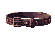 | **Forsaken Bloodbound Cinch** | A dark leather belt with deep crimson accents and ornate metal buckle. Riveted burgundy cord weaves through aged bronze fittings. The buckle bears a faint symbol of binding runes, worn smooth by centuries of use. | *A belt forged in ritual and sealed with sacrifice. Those who wear it claim they feel the weight of oaths-both their own and those of the fallen who came before.* | Samurai, Warrior, Archer |
| 12 |  | **Wraithbound Girdle** | A dark leather belt with black metal buckle and rivets. Features shadowy purple accents along the edges and a central ornate clasp with what appears to be a spectral or void-like symbol. Worn, aged appearance suggesting ancient craftsmanship. | *Forged in an age when the veil between worlds grew thin, this girdle binds its wearer to the lingering echoes of the fallen. Those who wear it feel the weight of countless souls pressing at the edges of their consciousness.* | Warrior, Samurai, Archer |
| 13 |  | **Embercinder Girdle** | A dark leather belt adorned with bronze-gold ornamental plates arranged in a symmetrical pattern. The centerpiece features a stylized flame motif in warm orange and amber tones, with sharp angular edges suggesting both fire and ash. The buckle glows faintly against the deep charcoal leather. | *Forged in the dying embers of a pyre-temple, this girdle binds the wearer's resolve as tightly as it binds their waist. Those who don it feel the phantom warmth of fallen warriors coursing through their core.* | Samurai, Archer, Warrior |
| 14 |  | **Blackthorn Cinch** | A dark leather belt with a prominent ornate buckle featuring thorned metalwork. The buckle displays a symmetrical pattern of sharp spikes radiating outward in bronze or dark gold against jet-black leather straps reinforced with rivets. | *A belt forged in darker times, its thorned buckle whispers of protection through pain. Those who wear it find their resolve hardened, though at a cost only the wearer comprehends.* | Warrior, Samurai, Archer |
| 15 |  | **Cordwainer's Cinch** | A dark brown leather belt with ornate bronze buckle and circular medallions. Features interwoven copper wire details and aged patina throughout. Metal studs arranged in ritualistic patterns frame the central clasp. | *Forged in the kilns of fallen craftsmen, this belt has cinched the waists of warriors who knew no mercy. Its bronze face remembers every scar it has witnessed.* | Warrior, Samurai, Archer |
| 16 |  | **Verdant Girdle of Thorns** | A wide leather belt with ornate bronze buckle and fittings. The belt features a rich green fabric or dyed leather with dark thorny vine motifs woven or embossed across its surface. Bronze accents and a prominent central clasp suggest both martial durability and arcane craftsmanship. | *Woven from the hides of forgotten forests, this girdle pulses with thorned vitality. Those who wear it claim the vines whisper warnings of unseen threats, though few live long enough to confirm it.* | Warrior, Samurai, Archer |
| 17 |  | **Shadowbound Girdle** | A dark leather belt with blackened metal buckle and ornate clasps. Features intricate silver threading along the edges and shadowy engravings depicting twisted vines or arcane symbols. The leather appears aged and worn, with subtle purple undertones suggesting magical infusion. | *Forged in the depths where light fears to tread, this girdle binds more than flesh-it anchors the wearer's very essence against the encroaching void. Those who wear it speak of whispers at the edge of consciousness.* | Samurai, Archer, Warrior |
| 18 |  | **Boneweave Girdle** | A dark leather belt adorned with intricate bronze or gold filigree patterns and bone-colored studs arranged in circular motifs. The centerpiece features ornate metalwork with a rich brown and gold color scheme, suggesting ancient craftsmanship and occult significance. | *Forged in an age when mortality held dominion over flesh, this girdle binds more than flesh-it tethers the wearer to the boundary between life and ruin. Those who wear it feel the weight of countless oaths sworn in darkness.* | Samurai, Warrior, Archer |
| 19 |  | **Voidbound Girdle** | A dark leather belt adorned with obsidian-black buckle and silver metal studs. The band features intricate stitching with deep indigo accents, creating an ornate yet martial appearance. Worn silver rings hang loosely from the sides. | *Forged in the depths where light fears to tread, this girdle binds more than flesh-it seals the wearer's connection to the void itself. Those who wear it walk between worlds, neither fully present nor wholly absent.* | Warrior, Samurai, Archer |
| 20 |  | **Voidborn Cinderbound Girdle** | A weathered leather belt with ornate bronze buckle and dark metal studs arranged in a circular pattern. The leather appears scorched and worn, with ashen gray undertones. Decorative chains drape from the sides, and the buckle bears carved symbols suggesting flame or ruin. | *Forged in the ashes of a fallen empire, this belt binds more than flesh-it anchors the bearer to purpose. Those who wear it swear they feel the warmth of dying fires, a constant reminder that all glory turns to cinder.* | Samurai, Warrior, Archer |
| 21 |  | **Shattered Cinderbound Girdle** | A sturdy leather belt woven with dark brown cordage and reinforced metal studs. The surface is scorched and weathered, with hints of ash-grey discoloration suggesting exposure to intense heat or flame. Metal buckle shows intricate knotwork patterns. | *Forged in the embers of a forgotten pyre, this belt remembers the screams of those who wore it before. It binds the waist as it binds the wearer to their darkest purpose.* | Warrior, Samurai, Archer |
| 22 |  | **Scourgebound Girdle** | A weathered leather belt with worn bronze buckle and metal studs. Rich brown leather shows age and battle scars, accented by dark tarnished metal fittings and a prominent central clasp bearing an occult symbol. | *Forged in an age of conquest, this belt has cinched the waists of countless warriors who answered darker calls. The metal groans with each step, as if still bound to the wills of its fallen masters.* | Warrior, Samurai, Archer |
| 23 |  | **Nightbound Girdle** | A dark leather belt with ornate black metal buckle and rivets. Intricate silver threading traces arcane symbols along the edges. The buckle features a crescent moon motif with shadowy indigo accents. | *Forged in the twilight hours by those who walk between worlds, this girdle steadies the resolve of warriors who dance with death. Its dark blessing whispers of endurance through endless night.* | Warrior, Samurai, Archer |
| 24 |  | **Hollow Cinderbound Girdle** | A dark leather belt adorned with ornate bronze buckle and metal studs. The centerpiece features a glowing amber gemstone set in an ornamental clasp, with intricate crimson stitching along the edges and blackened metal fittings. | *Forged in the ash-choked forges of a fallen empire, this girdle binds more than flesh-it anchors the wearer to the smoldering resolve of those who defied the void. The ember at its heart pulses with the last breath of a dying world.* | Samurai, Warrior, Archer |
| 25 | 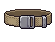 | **Ancient Shadowbound Girdle** | A worn leather belt with bronze buckle and metal studs arranged in a crescent pattern. Dark brown and weathered, with rust-stained metalwork suggesting age and countless battles. Frayed edges hint at arcane reinforcement. | *Forged in the shadow of forgotten wars, this girdle whispers of oaths made in blood and promises kept through suffering. Those who wear it feel the weight of ancients pressing upon their resolve.* | Warrior, Samurai, Archer |
| 26 |  | **Crimson Tyrant's Girdle** | A wide leather belt with ornate brass buckle featuring a crowned skull motif. Rich burgundy leather with gold threading along edges. Central brass plate displays intricate metalwork of thorns wrapping around a stylized crown. Small crimson gemstones set into the brass accents. | *Once worn by a warlord whose cruelty echoed through ages. The belt hungers for dominion, whispering promises of power to those who dare cinch its cursed leather.* | Warrior, Samurai |
| 27 |  | **Void-Stitched Cinch** | A dark leather belt with intricate blackened buckle adorned with mystical sigils. Silver-threaded embroidery traces eldritch patterns along its length, with deep indigo accents suggesting otherworldly craftsmanship. | *Forged in shadow and bound with threads drawn from the abyss itself, this belt whispers of forgotten pacts. Those who wear it feel the weight of another realm pressing against their mortality.* | Samurai, Archer, Warrior |
| 28 |  | **Voidborn Cinderbound Girdle** | A weathered leather belt with ornate bronze buckle and accompanying pouches. Dark brown leather shows ash-grey striping and burnt edges. Metal fittings bear intricate relief patterns depicting coiled serpents or thorns wrapping around the clasp. | *Forged in the cooling embers of a fallen forge, this belt drinks in the heat of battle and channels it through its wearer's core. Those who don it feel the phantom warmth of ancestral warfare coursing through their loins.* | Samurai, Warrior, Archer |
| 29 |  | **Embercord Girdle** | A wide leather belt adorned with ornate golden buckles and crimson gemstone studs arranged in a geometric pattern. The leather is dark burgundy with decorative stitching, and metal bands wrap around the circumference with intricate engravings reminiscent of ancient runes. | *Forged in the dying embers of a fallen dynasty, this girdle binds not just flesh but the very essence of resolve. Those who wear it claim the weight of destiny settles upon their shoulders-a burden most cannot bear.* | Samurai, Warrior, Archer |
| 30 |  | **Verdant Warden's Girdle** | A worn leather belt with bronze buckle and verdant green patina. Adorned with small brass studs forming a circular sigil pattern. Faded golden embroidery traces the edges, suggesting ancient craftsmanship. The leather shows deep creases from weathered use. | *Once worn by those who guarded the threshold between worlds. Its emerald tarnish whispers of forgotten oaths and the weight of burdens long carried.* | Warrior, Samurai, Archer |
| 31 | 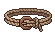 | **Storm Wraithbound Girdle** | A worn leather belt with dark brown and bronze tones, featuring ornate buckle work with shadowy metallic plates. Intricate cord weaving runs along the edges, with faint runic symbols etched into the worn leather. A tarnished bronze clasp dominates the center. | *Forged in an age when warriors bound their fates to shadow itself, this girdle grants those who wear it resilience against the creeping dark. Some say the leather still whispers with the voices of those it once protected.* | Warrior, Samurai, Archer |
| 32 |  | **Hollow Cinderbound Girdle** | A worn leather belt with brass buckle and ornate bronze plate. Rich brown leather accented with copper studs and ash-grey fabric trim. The central plate bears an embossed symbol of interlocking flames. | *Forged in the dying embers of a fallen citadel, this girdle remembers the warmth of wars long past. Those who wear it feel the faint heat of cinders against their skin, a whispered promise of resilience.* | Samurai, Archer, Warrior |
| 33 |  | **Ancient Voidbound Girdle** | A dark leather belt with ornate bronze buckle and metal studs. The center features an obsidian-black gemstone set in a tarnished bronze plate. Weathered brown straps with blackened metal accents suggest ancient craftsmanship and prolonged use in shadow. | *Forged in the depths where light fears to tread, this girdle binds both flesh and shadow to its wearer. Those who don it report whispers from the void itself, as if something ancient watches through the darkened stone.* | Samurai, Warrior, Archer |
| 34 |  | **Cinderbrand Girdle** | A wide leather belt with ornate bronze buckle and clasps. Deep brown leather is scorched and weathered, with intricate burnt orange stitching forming geometric patterns. Metal studs and small chains hang from the sides, catching dim light with a warm, ashen gleam. | *Forged in the dying embers of a forgotten war, this belt carries the weight of countless battles. Those who wear it feel the lingering warmth of ancient flames, grounding them against despair.* | Warrior, Samurai, Archer |
| 35 |  | **Cinderclasp Girdle** | A wide leather belt with ornate bronze buckle and metal studs. Rich brown leather darkened by soot, with copper rivets forming intricate patterns. Metal plates along the edges show signs of heat damage and ancient flame scarring. | *Forged in the dying embers of a tyrant's throne, this belt channels the wearer's inner furnace into devastating strikes. Those who don it claim they can feel heat pooling at their core, waiting to be unleashed.* | Warrior, Samurai, Archer |
| 36 |  | **Deathbound Girdle** | A dark leather belt adorned with metallic studs and an ornate buckle. The centerpiece features a weathered silver clasp depicting intertwined skulls. The band appears reinforced with iron rivets and faded crimson accents. | *Forged in an age of endless warfare, this girdle binds more than flesh-it tethers the wearer to their own mortality. Those who wear it speak of whispers at the edge of consciousness, as if the belt itself remembers every life it has claimed.* | Warrior, Samurai, Archer |
| 37 |  | **Bloodvow Girdle** | A sturdy leather belt with ornate bronze buckle and riveted metal plates. Deep crimson fabric with dark metallic accents forms the main band. Intricate geometric patterns edge the sides, suggesting ancient craftsmanship and ritualistic purpose. | *Forged in the blood-soaked halls of forgotten kings, this girdle binds more than flesh-it anchors one's resolve to the path of carnage. Those who wear it find their wounds closing as quickly as they open new ones.* | Samurai, Warrior, Archer |
| 38 |  | **Voidweft Girdle** | A dark ornamental belt featuring intricate purple and black woven patterns with an elegant buckle centerpiece. The fabric shimmers with an otherworldly sheen, adorned with small crystalline protrusions that catch a violet glow against the shadowy weave. | *Woven from threads pulled from the spaces between worlds, this girdle binds more than flesh-it anchors the wearer's resolve against the encroaching dark. Those who wear it claim to feel the weight of something ancient watching from just beyond sight.* | Samurai, Archer, Warrior |
| 39 |  | **Thornwraith Girdle** | A dark leather belt adorned with emerald-green thorned vines that coil around its circumference. Weathered bronze buckle clasp shaped like a gnarled knot. Brass studs run along the edges, tarnished with age. | *Woven from the roots of a long-dead forest, this girdle constricts with the hunger of the thorns that bind it. Those who wear it claim the vines whisper secrets of verdant ruin.* | Warrior, Samurai, Archer |
| 40 |  | **Bloodbraid Cinch** | A worn leather belt with ornate bronze buckle and dark crimson braiding. Tattered cloth strips dangle from the sides, adorned with small brass rings and what appear to be dried bone talismans. The leather is creased and stained from long use. | *Worn by those who have tasted battle and lived to bind their wounds. The braided crimson holds the warmth of spilled blood-whether in victory or desperate survival, none can say.* | Warrior, Samurai, Archer |
| 41 | 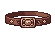 | **Ancient Bloodwraith Girdle** | A worn leather belt with deep crimson binding and ornate bronze buckle. Dark burgundy stains streak the supple hide, accented by small bone totems and tarnished metal studs arranged in a ritualistic pattern along its length. | *Steeped in the vitality of countless fallen, this belt whispers promises of endurance to those bloodied enough to wear it. The stains upon its surface are neither rust nor rust alone.* | Warrior, Samurai, Archer |
| 42 | 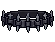 | **Riftbound Girdle** | A heavy leather belt with dark iron buckles and ornate clasps. The band is reinforced with black steel rivets and features an intricate woven pattern of deep purple and charcoal threads. Worn metal studs line the edges, suggesting countless battles endured. | *Forged in the abyss where shadow meets steel, this belt binds the wearer's resolve as tightly as it cinches their waist. Those who wear it claim to feel the weight of another world pressing against their spine.* | Warrior, Samurai, Archer |
| 43 |  | **Forsaken Embercord Girdle** | A dark leather belt adorned with crimson and gold threading. Ornate metallic buckle features a stylized flame motif at its center, with intricate patterns running along the studded edges. The worn leather suggests ancient craftsmanship. | *Forged in the dying embers of a forgotten war, this girdle binds more than flesh-it anchors the wearer's resolve against the encroaching dark. Those who wear it claim to feel warmth even in the coldest tombs.* | Warrior, Samurai, Archer |
| 44 |  | **Voidpact Cincture** | A deep indigo belt with ornate silver buckle featuring an intricate star pattern. The fabric appears woven from twilight-colored threads with subtle purple iridescence. Dark gemstones are set along the edges, catching light with an eerie glow. | *Forged in shadow by those who bargained with forces beyond the veil. This belt amplifies one's connection to the abyss, marking its wearer as a servant of forgotten pacts.* | Warrior, Samurai, Archer |
| 45 |  | **Shattered Shadowbound Girdle** | A dark leather belt adorned with blackened metal studs and ornamental buckle. The centerpiece features a crescent moon emblem in tarnished silver, flanked by smaller circular rivets. Deep purple undertones shimmer across the aged leather surface. | *Worn by those who walk between worlds, this girdle whispers of pacts made in moonless nights. It cinches more than fabric-it binds the wearer's resolve against the encroaching dark.* | Samurai, Archer, Warrior |
| 46 |  | **Ember Cinderbound Girdle** | A sturdy leather belt with bronze or copper buckle and ornamental clasps. The leather appears weathered and scorched, with dark brown and russet tones. Metal studs or rivets line the edges, and intricate etched patterns suggest ancient craftsmanship. | *Forged in the embers of a forgotten war, this belt has absorbed the ashes of countless fallen. Those who wear it feel the weight of eternity settling upon their shoulders, granting resilience against the inevitable.* | Warrior, Samurai, Archer |
| 47 |  | **Shadowpact Cincture** | A dark leather belt with ornate black metal buckle and rivets. Features intricate bone-white thread embroidery along edges in angular, ritualistic patterns. Silver studs form a chain-like motif across the front. | *Forged in pacts older than kingdoms, this belt binds its wearer to shadow itself-granting steadiness in the darkest trials, though some say it whispers demands of those who dare wear it.* | Samurai, Archer, Warrior |
| 48 |  | **Hollow Cinderbound Girdle** | A dark leather belt adorned with ornate bronze buckle and metal studs. The buckle features glowing orange-amber inlays arranged in a circular pattern, suggesting smoldering embers. Weathered straps hang at the sides with darker leather trim. | *Forged in the heart of a dying volcano, this girdle channels the restless heat of ancient flames. Those who wear it feel the warmth of ash and ember, as if kindling a long-dormant fire within their very bones.* | Samurai, Warrior, Archer |
| 49 | 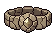 | **Ironpact Girdle** | A wide leather belt with ornate bronze buckle and metal rivets. Dark burgundy leather adorned with interlocking iron bands and aged bronze plates. Tarnished metalwork suggests ancient craftsmanship and countless battles endured. | *Forged in an age of blood and iron, this girdle binds more than flesh-it chains the wearer's resolve to their purpose. Those who wear it claim they can feel the weight of fallen warriors pressing against their core, steadying their strike.* | Warrior, Samurai, Archer |
| 50 |  | **Bloodthorn Cincture** | A dark leather belt adorned with crimson thorns and blackened metal studs arranged in an ornate pattern. The buckle features a central blood-red gemstone surrounded by intricate metalwork, with thorny protrusions extending outward. | *Forged in the depths where thorn and blood intertwine, this cincture drinks in the vitality of those who wear it. Those bound by its thorns find their resolve hardened, though at a price written in shadow.* | Warrior, Samurai, Archer |
| 51 |  | **Cordage of the Void** | A dark leather belt adorned with intricate crimson embroidery and ornate metal buckle. The buckle features a central circular obsidian gem surrounded by jagged silver filigree. The leather appears worn and stained with ancient patterns. | *Once worn by those who walked between worlds, this belt carries the weight of forgotten oaths. Its clasp hungers for the strength of those who dare bind their fate to darkness.* | Warrior, Samurai, Archer |
| 52 |  | **Ironbound Wayfarer's Girdle** | A sturdy leather belt reinforced with dark iron plates and bronze buckles. Intricate knotwork runs along the edges, with tarnished silver rivets securing the segments. A large central clasp bears faded runic markings. | *Forged in an age when wanderers still walked between worlds, this girdle has anchored countless warriors through bloodshed and shadow. Its worn leather speaks of long roads and battles survived.* | Warrior, Samurai, Archer |
| 53 |  | **Crimson Tyrant's Cinch** | A dark leather belt with ornate crimson and gold buckle featuring an angular, menacing emblem. The leather is worn and weathered with dark stitching, adorned with small metallic studs and a prominent central plate of deep burgundy stone or crystal. | *Forged in the wake of ancient conquest, this belt has cinched the waists of warlords long forgotten. Its buckle drinks in blood and never thirsts again.* | Warrior, Samurai, Archer |
| 54 |  | **Tarnished Corslet Girdle** | A weathered leather belt with ornate turquoise-green metal buckle and studs. The buckle features an intricate geometric pattern with a central gemstone or crystal element. Dark leather straps with worn edges suggest age and countless battles. | *Forged in an age when empires crumbled to dust, this girdle binds the waist of those who have stared into the abyss and refused to blink. The cursed metal whispers of fallen kingdoms with every movement.* | Warrior, Samurai, Archer |
| 55 |  | **Storm Cinderbound Girdle** | A leather belt adorned with bronze ornamental plates and dark crimson inlays. Gold filigree traces the edges of each plate, forming intricate patterns. A prominent central buckle features an embossed symbol resembling flames or ash, weathered by time. | *Forged in the embers of a fallen dynasty, this girdle binds not just flesh but the very essence of discipline. Those who wear it claim the ash never truly leaves their skin.* | Warrior, Samurai, Archer |
| 56 |  | **Voidwarden's Cinch** | A dark leather belt with ornate gold buckle clasp shaped like an arcane symbol. Deep indigo fabric with silver threading along edges. Metal studs arranged in ritual patterns. A small dangling charm resembling a crystalline shard. | *A belt once worn by keepers of the void between worlds. Its weight is both burden and blessing-those who bind themselves to it find their resolve hardened against the encroaching dark.* | Samurai, Archer, Warrior |
| 57 | 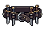 | **Carrionwraith Girdle** | A tattered belt of blackened leather adorned with corroded iron buckles and dangling bone talismans. Wisps of dark energy coil around its frayed edges, and the buckle bears a faded sigil of decay. | *Once worn by those who commune with death itself, this girdle pulses with necrotic hunger. The longer it adorns your waist, the more the line between living and fallen begins to blur.* | Warrior, Samurai, Archer |
| 58 |  | **Cindercord Girdle** | A sturdy leather belt with ornate bronze buckle and clasps. Dark brown straps adorned with smoldering red and gold thread patterns. Metal studs line the edges, and wisps of ember-like detailing suggest lingering heat. | *Forged in the embers of a fallen dynasty, this belt binds more than flesh-it anchors the wearer's resolve against the encroaching dark. Those who wear it speak of warmth that never fades, and strength that answers when all else fails.* | Warrior, Samurai, Archer |
| 59 |  | **Forsaken Cinderbound Girdle** | A thick leather belt adorned with dark bronze buckles and studs. The leather is scorched and weathered, with burnt orange undertones visible along the worn edges. Metal fixtures show signs of ash residue and oxidation. | *Forged in the embers of a fallen stronghold, this girdle binds the wearer's resolve as tightly as it cinches their waist. Those who wear it carry the weight of ancient fires-and the strength to bear it.* | Warrior, Samurai, Archer |
| 60 |  | **Voidbinder's Girdle** | A dark purple and blue belt with ornate silver buckle and metallic accents. Features intricate geometric patterns and shadowy wisps woven into the fabric. The buckle bears a crescent moon symbol surrounded by arcane runes. | *Forged in the spaces between worlds, this girdle binds the wearer's essence tightly, anchoring them against the pull of the abyss. Those who wear it speak of whispered voices at the edge of perception.* | Samurai, Archer, Warrior |
| 61 |  | **Shattered Wraithbound Girdle** | A dark leather belt with ornate buckle featuring intricate silver filigree and shadowy geometric patterns. The leather appears aged and worn, adorned with small dark gemstones along the edges and a central ornamental clasp with an obsidian centerpiece. | *Forged in an age of forgotten wars, this girdle binds more than flesh-it anchors the wearer's essence against the creeping void. Those who don it speak of phantom whispers guiding their strikes.* | Warrior, Samurai, Archer |
| 62 |  | **Ember Embercinder Girdle** | A ornate belt with a large central buckle featuring glowing red and gold accents. The buckle displays an intricate sunburst or flame motif with darker metallic bands extending outward. Warm amber highlights against deep crimson leather or cloth base. | *Forged in the heart of a dying star, this girdle radiates an ancient heat that hardens the flesh and sharpens the warrior's focus. Those who wear it claim to feel the heartbeat of something long extinct, driving them toward inevitable ruin.* | Samurai, Warrior, Archer |
| 63 |  | **Cinderfang Girdle** | A sturdy leather belt with ornate bronze buckle featuring a snarling beast motif. Rich cognac-brown leather accented with amber-toned metal studs and dark iron reinforcements along the edges. Small crimson stitching details trace the perimeter. | *Forged in the ember-pits of fallen kingdoms, this girdle carries the restless hunger of beasts long extinct. Those who wear it claim to hear distant snarling in the depths of battle.* | Warrior, Samurai, Archer |
| 64 |  | **Dreadwhisper Girdle** | A dark leather belt adorned with ornate black metal plates and crimson gemstone accents. The centerpiece features a winged emblem with intricate detailing, flanked by decorative studs. Rich burgundy and shadowy tones dominate the design. | *Forged in shadow and bound with whispered oaths, this girdle grants its wearer an aura of dread. Those who wear it find their strength deepened, as if drawing power from the spaces between breaths.* | Warrior, Samurai, Archer |
| 65 |  | **Ancient Cinderbound Girdle** | A dark leather belt with ornate crimson buckle and metallic accents. Features intricate embroidered patterns in deep red and black, with small gemstone inlays catching the light. Heavy brass studs and reinforced stitching suggest durability and arcane craftsmanship. | *Once worn by a warlord consumed by ambition, this girdle radiates residual heat from conflicts long forgotten. It binds the wearer's resolve as tightly as the leather cinches the waist, granting steadiness in the face of oblivion.* | Samurai, Warrior, Archer |
| 66 |  | **Cursed Bloodbound Cinch** | A dark leather belt with ornate crimson buckle and brass fittings. Worn cordage wraps the edges, and a singular obsidian sigil hangs from the center loop. The leather shows deep weathering and faint arcane runes. | *Forged in ritual and sealed with sacrifice, this belt binds the wearer's resolve as surely as iron chains. Those who wear it claim to feel the weight of ancient oaths pressing against their flesh.* | Warrior, Samurai, Archer |
| 67 |  | **Forsaken Cinderbound Girdle** | A ornate belt with a distinctive golden-bronze buckle at center, flanked by symmetrical wing or crest motifs. The band appears woven or tooled leather in deep amber and charcoal tones, with intricate embossed patterns along its length suggesting ancient craftsmanship. | *Forged in the dying embers of a fallen empire, this girdle binds more than flesh-it anchors the wearer's resolve against the encroaching dark. Those who wear it carry the weight of ash and forgotten glory.* | Warrior, Samurai, Archer |
| 68 |  | **Voidborn Cinderbound Girdle** | A sturdy leather belt with dark iron buckle and chain links. The surface bears charred, ash-grey leather with faint crimson striations, suggesting fire damage or ancient flame exposure. Metal studs and ornamental rings hang loosely from the sides. | *Forged in the dying embers of a fallen stronghold, this belt binds more than flesh-it tethers the wearer to the scorched oaths of those who perished in ash. Those who wear it feel the weight of cinder and flame.* | Warrior, Samurai, Archer |
| 69 |  | **Ironpact Waistguard** | A ornate dark metal belt with riveted plating across the front. Features a prominent central buckle with geometric engravings and what appears to be inlaid silver or moonstone accents. The sides taper with segmented armor plates, rendered in charcoal gray with metallic highlights suggesting aged steel. | *Forged in an age when oaths were sealed in blood and iron. This belt has cinched the waists of those who stood unbroken against the encroaching dark, its weight a constant reminder of debts unpaid and vengeance deferred.* | Warrior, Samurai, Archer |
| 70 |  | **Crimson Warden's Girdle** | A wide leather belt with ornate golden buckle and crimson gemstone center. Dark burgundy leather adorned with intricate gold filigree patterns and small rubies along the edges. Heavy, ceremonial construction with reinforced stitching. | *Worn by those who stood against the endless night. The blood-red stone pulses with an ancient oath-protection for those strong enough to bear its weight.* | Warrior, Samurai, Archer |
| 71 |  | **Storm Cinderbound Girdle** | A wide leather belt with dark brown and charred red tones, adorned with tarnished metal buckles and rivets. Ash-gray fabric trim runs along the edges, with faint ember-like patterns etched into the worn leather surface. | *Once clasped around the waist of a pyre-keeper long forgotten. The belt remembers the heat of funeral flames and carries that ancient warmth still-a whispered promise of both protection and inevitable ash.* | Warrior, Samurai, Archer |
| 72 |  | **Hollow Ironpact Girdle** | A sturdy leather belt with ornate metal buckle and studs. Bronze-gold metalwork adorns the dark leather strap. Three prominent circular medallions with geometric patterns are evenly spaced across the front. The buckle features an intricate embossed design suggesting ancient craftsmanship. | *Forged in an age when oaths were written in steel and blood. Those who wear this girdle find their resolve hardened, their frame steadied against the encroaching darkness.* | Warrior, Samurai, Archer |
| 73 |  | **Ancient Cinderbound Girdle** | A worn leather belt with ornate bronze buckle and dark metallic studs. Charred fabric edges suggest flame exposure. Intricate carved patterns depicting coiled serpents or thorns run along the leather band. | *Forged in the embers of a fallen sanctuary, this girdle pulses with residual heat-a burden for those who dare carry such cursed strength. Warriors who don it feel the weight of ash settling in their bones.* | Warrior, Samurai, Archer |
| 74 |  | **Bloodbound Girdle** | A dark leather belt adorned with ornate crimson and gold metalwork. Twin circular buckles with intricate gemstone inlays dominate the center, connected by chains of blackened steel. The leather shows signs of ritual scarring. | *Forged in ceremonies older than empires, this girdle binds the wearer's life force to their steel. Those who wear it claim they can feel their pulse syncing with the rhythm of battle itself.* | Warrior, Samurai, Archer |
| 75 | 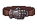 | **Forsaken Cinderbound Girdle** | A dark leather belt adorned with burnished bronze buckle and metal studs. The worn leather is scorched at the edges with faint ash-grey markings. Ornamental clasps feature a symmetrical geometric pattern suggesting ancient craftsmanship. | *Forged in the embers of a forgotten war, this girdle binds more than flesh-it chains the wearer's resolve to their darkest purpose. Those who wear it speak of whispered strength in their lowest moments.* | Warrior, Samurai, Archer |
| 76 |  | **Voidborn Cinderbound Girdle** | A deep crimson leather belt adorned with ornate golden buckle and clasps. Twin golden wings spread across the centerpiece, wrought in relief. Studded with ember-red gemstones that catch light like smoldering coals. Rich burgundy fabric trim along edges. | *Forged in the dying light of an ancient pyre, this girdle binds the wearer to embers long since cooled. Those who wear it inherit the resolve of warriors consumed by their own conviction.* | Warrior, Samurai, Archer |
| 77 |  | **Shattered Cinderbound Girdle** | A thick leather belt with ornate golden buckle and flame-like orange gemstones embedded along its width. Dark burgundy leather strap with intricate crimson patterns. Metal studs and rivets accent the edges, giving it a battle-worn yet regal appearance. | *Forged in the embers of a fallen empire, this belt channels the rage of dormant infernos. Those who wear it feel the pulse of ancient flame-a reminder that even ash remembers the fire that consumed it.* | Warrior, Samurai, Archer |
| 78 |  | **Voidwraith Cincture** | A dark leather belt adorned with tattered purple and black cloth strips. Ornate silver buckle featuring an intricate void-pattern sigil at center. Studded metal accents run along edges, with wisping ethereal details suggesting otherworldly corruption. | *Forged in the embrace of a dying star, this belt drinks in the light around it. Those who wear it feel the weight of another realm pressing against their mortality.* | Warrior, Samurai, Archer |
| 79 | 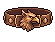 | **Storm Cinderbound Girdle** | A weathered leather belt with ornate bronze buckle and metal studs. Rich burnt-orange and deep brown tones dominate, with copper accents forming intricate patterns. Worn fabric suggests age and countless battles. | *Forged in the ashes of a fallen empire, this girdle has bound the waists of countless warriors. Its copper seams whisper of strength enduring through ruin and renewal.* | Warrior, Samurai, Archer |
| 80 |  | **Shadowpact Girdle** | A dark leather belt with obsidian buckle and silver reinforced rivets. Black fabric wraps around the center with intricate crimson stitching forming arcane symbols. Metal side plates feature etched patterns suggesting both martial and mystical design. | *Forged in shadow and sealed with blood oaths, this girdle binds the wearer to forces beyond mortal ken. Those who wear it find their resolve hardened, yet whispers of the abyss follow their every step.* | Warrior, Samurai, Archer |
| 81 |  | **Abyssal Cinch** | A dark leather belt adorned with obsidian studs and crimson thread detailing. The buckle features a tarnished silver sigil depicting a crescent moon over churning depths. Worn and weathered, with traces of dried blood along the edges. | *Forged in the grip of shadow itself, this belt binds more than flesh-it anchors the wearer to the void between worlds. Those who wear it walk a thinner line between hunger and restraint.* | Samurai, Warrior, Archer |
| 82 | 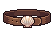 | **Bloodweave Girdle** | A dark brown leather belt with ornate crimson stitching forming intricate patterns. Features brass or bronze buckle hardware and studded accents along its length, with worn edges suggesting age and countless battles. | *Woven from hides of forgotten beasts and bound with thread steeped in old blood, this girdle steadies the warrior's resolve. Those who wear it claim to feel the weight of fallen champions lending strength to their strikes.* | Warrior, Samurai, Archer |
| 83 |  | **Carrionscale Cinch** | A weathered belt of dark leather adorned with overlapping scales in sickly greens and browns. Tarnished metal buckle shaped like a grasping claw. Frayed edges suggest age and countless battles endured. | *Once worn by a plague knight whose name has been forgotten by time. The scales whisper of decay and resilience-a grim reminder that only the corrupted truly survive.* | Warrior, Samurai, Archer |
| 84 |  | **Bloodwarden's Cincture** | A dark leather belt with ornate gold and crimson buckle, adorned with small bone toggles and tarnished brass studs. The leather appears aged and battle-worn, with intricate embroidered patterns in deep red thread running along its length. | *A sash worn by those who stood sentinel over forgotten tombs. Its buckle drinks deep of spilled blood, growing heavier with each soul claimed in service to the old pacts.* | Warrior, Samurai, Archer |
| 85 |  | **Shattered Cinderbound Girdle** | A dark brown leather belt with ornate brass buckle and studs. Features intricate embroidered patterns in copper and gold thread along its length, with a prominent central emblem depicting flames or mythical imagery. Well-worn yet ceremonial in appearance. | *Forged in the embers of a fallen empire, this girdle binds not just flesh but the fraying threads of one's resolve. Those who wear it carry the weight of ash-laden legacies.* | Warrior, Samurai, Archer |
| 86 |  | **Nightbound Cinch** | A dark purple leather belt with ornate black metal buckle and studs. Features intricate bat-wing motifs embossed along the band. Silver threading traces arcane runes across the surface, glowing faintly with eldritch energy. | *Forged in shadow and sealed with pacts older than kingdoms, this belt binds more than flesh-it anchors the wearer to the spaces between light and dark. Those who wear it claim to feel watched by unseen wings.* | Warrior, Samurai, Archer |
| 87 |  | **Storm Abyssal Cinch** | A ornate belt featuring intricate blue and silver metalwork with symmetrical wing-like ornaments extending from the central buckle. The design is elaborate and symmetrical, rendered in shades of cyan, silver, and deep indigo against a darker background. | *Forged in the depths where light dissolves into shadow, this cinch binds not merely flesh but the very essence of resolve. Those who wear it find their conviction unshakeable, though at the cost of growing hollow within.* | Warrior, Samurai, Archer |
| 88 |  | **Cindergilt Waistband** | A dark leather belt adorned with ornate metal plates in burnt gold and charred bronze. The buckle features an intricate embossed pattern of intertwining thorns and embers. Worn fabric edges suggest ancient craftsmanship, with traces of ash clinging to the aged leather. | *Forged in the dying embers of a fallen kingdom, this belt binds more than flesh-it anchors the wearer to a darker purpose. Those who don it find their resolve hardened, as if the very ashes of the past bolster their will.* | Samurai, Archer, Warrior |
| 89 |  | **Deathgrip Cinch** | A dark leather belt with heavy iron buckle and studs. The leather is weathered black with deep crimson accents along the edges. Metal reinforcements run the length, etched with faint runes. The buckle features a grimacing skull motif with shadowed eye sockets. | *Forged in the depths where iron drinks blood, this belt binds more than flesh-it anchors the wearer to their darkest purpose. Those who wear it feel an iron grip upon their mortality itself.* | Warrior, Samurai, Archer |
| 90 |  | **Voidbinder's Cinch** | A dark leather belt adorned with an ornate emerald-green buckle featuring intricate rune-work. The center gemstone glows with an eerie verdant light, surrounded by blackened metal filigree and worn leather studded with corroded brass. | *Forged in the depths of a forgotten keep, this belt binds the wearer to the void itself-granting steadiness in the darkest hours. Those who wear it report an uncanny connection to forces beyond mortal comprehension.* | Samurai, Warrior, Archer |
| 91 |  | **Bloodwrath Girdle** | A wide leather belt with ornate crimson metal plates arranged in overlapping segments. Dark burgundy stitching runs along the edges, with blackened steel buckle adorned by a central blood-red gemstone. Worn brass accents peek through weathered leather. | *Forged in the depths of forgotten wars, this girdle pulses with the wrath of fallen warriors. Those who bind themselves with its power feel their resolve harden into something darker, more primal.* | Warrior, Samurai, Archer |
| 92 |  | **Shadowbind Cincture** | A dark leather belt adorned with blackened steel buckles and arcane silver runes along its length. The centerpiece features an obsidian sigil wrapped in tarnished chains, with deep crimson accents woven throughout the weathered material. | *Forged in shadow and bound by forgotten pacts, this belt tightens around the waist like a serpent's embrace. Those who wear it find their resolve hardened, though whispers suggest the price of such strength is paid in echoes of their own mortality.* | Warrior, Samurai, Archer |
| 93 |  | **Nightscourge Cinch** | A dark leather belt adorned with obsidian buckle and silver studs. Intricate blue and purple ethereal patterns ripple across the surface, suggesting corrupted magic woven into aged hide. | *Forged in the depths where light fears to tread, this belt binds more than flesh-it anchors the wielder to shadows themselves. Those who wear it speak of whispers in the darkness, and a hunger that never quite sleeps.* | Warrior, Samurai, Archer |
| 94 |  | **Ember Cinderbound Girdle** | A dark leather belt with blackened metal buckle and reinforced plating. Charred fabric edges suggest exposure to intense heat, with faint ember-like gold threading woven through worn leather. | *Forged in the embers of a fallen pyre-temple, this girdle binds more than cloth-it anchors the wearer to their darkest resolve. Those who wear it report the phantom warmth of ancestral fires.* | Warrior, Samurai, Archer |
| 95 |  | **Storm Cinderbound Girdle** | A sturdy leather belt with ornate bronze buckle and clasps. Rich brown leather is reinforced with dark metal bands and small iron studs arranged in a deliberate pattern. The buckle features an embossed symbol suggesting flame or ash. | *Forged in the furnace-heart of a fallen empire, this girdle was worn by those who walked through fire and emerged unbroken. Its leather remembers the heat of ages past.* | Warrior, Samurai, Archer |
| 96 |  | **Verdant Cinch of Thorns** | A dark green leather belt adorned with thorny vine motifs and bronze buckle accents. The surface features embossed thorns and naturalistic patterns, suggesting both growth and menace. Oxidized metal studs line the edges. | *Once worn by a nature-cursed warlord, this belt weaves thorns into its very fabric-a living reminder that dominion over wilderness demands submission to its primal hunger. Those who bind themselves to it find their resolve hardened, yet never truly free of nature's grasp.* | Samurai, Warrior, Archer |
| 97 | 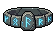 | **Ancient Wraithbound Girdle** | A dark leather belt adorned with tarnished silver buckles and ornate metal plates. The centerpiece features an intricate geometric pattern in iron and bronze, with shadowy indigo undertones woven through the aged leather bands. | *Forged in an age when iron still remembered the voices of the dead, this girdle tightens around the waist like a spectral hand. Those who wear it claim to hear whispers of fallen warriors at dusk.* | Warrior, Samurai, Archer |
| 98 | 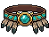 | **Cursed Shadowbound Girdle** | A dark leather belt adorned with ornate teal and gold metalwork. Features prominent turquoise gemstone inlays arranged in a symmetrical pattern, with dark metal studs and intricate decorative plates suggesting ancient craftsmanship and arcane significance. | *Forged in shadow-touched leather and bound with gems that drink in the light, this girdle whispers of wars forgotten and blood spilled upon cursed ground. Those who wear it feel the weight of countless fallen warriors pressing against their resolve.* | Warrior, Samurai, Archer |
| 99 | 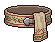 | **Forsaken Bloodwraith Girdle** | A worn leather belt with tarnished bronze buckle and rivets. Deep crimson staining runs along the edges, with blackened iron studs arranged in a ritualistic pattern. Frayed cloth strips hang from the sides, singed at the ends. | *Forged in the final moments of a blood-mage's downfall, this belt drinks deep from those who wear it. The stains never fade, nor does the whispered hunger that accompanies each labored breath.* | Warrior, Samurai, Archer |
| 100 |  | **Verdant Siege Girdle** | A sturdy leather belt with ornate golden buckle and emerald-green gemstone centerpiece. Bronze studs line the edges, with intricate vine-like engravings across the dark leather surface. A tarnished silver chain dangles from one side. | *Worn by those who stand against the encroaching dark, this belt channels the last vestiges of nature's defiance. Its emerald core pulses faintly-a heartbeat of the world yet unblemished by shadow.* | Warrior, Samurai, Archer |
