# Gloves — Item Catalog

> **Category:** Gloves  
> **Total items:** 100  
> **Classes:** Mage, Archer, Warrior, Samurai

| # | Preview | Item Name | Visual Description | Description | Classes |
|:-:|:-------:|:----------|:------------------|:------------|:--------|
| 1 | 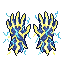 | **Frostbrand Gauntlets** | Ornate blue-and-white pixel gloves with crystalline formations across the knuckles and fingers. Frost-like jagged edges emanate from the wrists, suggesting frozen power. The fingers glow faintly with an icy luminescence. | *Forged in the depths of an eternal winter, these gloves channel the essence of primordial ice. Those who don them find their grip unyielding, their strikes imbued with the cold that consumes all warmth.* | Samurai, Mage, Archer, Warrior |
| 2 |  | **Nightfall Grips** | A pair of deep purple gloves with darker violet accents and mysterious arcane symbols embroidered along the knuckles. The fabric appears supple yet reinforced, with shadowy wisps curling around the wrists. | *Woven from the twilight between worlds, these gloves grant their wearer the grip of inevitability. Those who don them find their resolve hardened against the encroaching darkness.* | Samurai, Mage, Archer, Warrior |
| 3 |  | **Bloodhide Grips** | Worn leather gloves stained deep burgundy and brown, with reinforced palms and finger wrapping. Dark fabric shows age and heavy use, with mottled discoloration suggesting dried blood or ritual staining across the knuckles and wrists. | *Gloves worn by those who have spilled enough blood to mark their very skin. They grip tighter the more desperate the struggle, as if fed by violence itself.* | Samurai, Mage, Archer, Warrior |
| 4 |  | **Wraithbound Gauntlets** | Weathered leather gloves with reinforced knuckles, featuring tarnished metal plating across the knuckles and wrist. Intricate dark runes are etched into the palms, glowing faintly with an otherworldly violet hue. The material appears aged and worn, with hints of bone-white accents along the fingers. | *Cursed by those who wore them in life, these gauntlets bind the wielder's grip to something beyond the veil. Each strike carries the weight of restless souls, demanding blood as tribute for their borrowed strength.* | Samurai, Mage, Archer, Warrior |
| 5 |  | **Ashen Grips** | Worn leather gloves with dark grey-brown coloring and muted red accents. The knuckles are reinforced with what appears to be aged metal plating or hardened material. The texture suggests weathered craftsmanship with subtle metallic highlights along the wrists. | *Gloves worn by those who have walked through the ashes of fallen empires. Their grip has not failed a single wielder who understood the price of power.* | Samurai, Mage, Archer, Warrior |
| 6 |  | **Bonegrip Gauntlets** | Skeletal hand-shaped gloves rendered in pale ivory and dark brown tones. Finger bones articulate naturally with leather bindings between joints. Intricate bone-carved details trace across the knuckles, creating an unsettling anatomical precision. | *Hands that remember death itself. These gauntlets grant the wearer an unnatural grip—neither the trembling of the living nor the stillness of the dead, but something profane between.* | Samurai, Mage, Archer, Warrior |
| 7 | 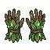 | **Thornveil Gauntlets** | Aged leather gloves with moss-green coloring and dark overgrowth. Gnarled vine-like patterns wrap around the fingers and wrists, with small thorny protrusions emerging from the knuckles. The material appears weathered and alive with creeping vegetation. | *Once worn by those who walked between worlds, these gloves whisper of forgotten oaths and thorns that never fade. To don them is to invite the wilds into your very grasp.* | Samurai, Mage, Archer, Warrior |
| 8 |  | **Bloodwoven Gauntlets** | Burgundy leather gloves with dark crimson accents and ornate stitching. The knuckles feature reinforced plating with a weathered bronze finish. Intricate vein-like patterns run across the palms, suggesting arcane or blood-infused craftsmanship. | *Woven from the hides of forgotten beasts and tempered in ritual blood, these gauntlets grant their wearer an unnatural grip on both flesh and fate. Those who wear them speak of whispers that fade only in combat.* | Samurai, Mage, Archer, Warrior |
| 9 |  | **Shadowthread Grips** | A pair of dark leather gloves with black fabric construction. The fingers are tapered and defined, with subtle gray or silver accents along the knuckles and wrist cuffs, suggesting reinforced stitching or arcane thread. | *Woven from the sinews of forgotten nights, these gloves grant their wearer command over shadow itself. Those who don them find their grip unnaturally steady—whether drawing steel, channeling ruin, or drawing a bowstring taut.* | Samurai, Mage, Archer, Warrior |
| 10 |  | **Verdantcreep Gauntlets** | A pair of moss-green fabric gloves with darker green accents along the knuckles and fingertips. The material appears organic and vine-like, with subtle textured patterns suggesting living growth. Small pale highlights suggest moisture or bioluminescent traces. | *Once worn by a druid consumed by the wilds, these gloves pulse with an ancient hunger. Those who don them feel the weight of untamed nature coursing through their veins—a blessing and a curse alike.* | Samurai, Mage, Archer, Warrior |
| 11 |  | **Veilweaver's Grasp** | Deep purple gloves with indigo accents and ethereal wisps. The fabric appears woven from shadow itself, with arcane symbols glowing faintly along the knuckles and palms. Delicate tendrils of dark energy swirl around the fingers. | *Crafted from the twilight between worlds, these gloves grant their wearer a whisper of the void's power. Those who don them feel the boundary between flesh and shadow grow perilously thin.* | Samurai, Mage, Archer, Warrior |
| 12 |  | **Ashen Condemner's Grips** | Weathered leather gloves with pale cream-colored palms and finger wrappings. Gold or brass metallic accents reinforce the knuckles and wrist cuffs. The surface shows deep cracks and aged discoloration, suggesting ancient craftsmanship and countless battles endured. | *Forged in an age of ash and ruin, these gloves remember the grip of those who defied the fall. Each crack in their leather is a scar from power too great to contain.* | Samurai, Mage, Archer, Warrior |
| 13 |  | **Shattered Ashen Grips** | Worn leather gloves with dark gray fabric and reinforced knuckles. Tattered edges and faded crimson stitching suggest countless battles. Ash-colored smudges and scorch marks cover the surface, with metallic rivets at the wrists. | *Gloves stained by the ashes of fallen foes and the smoke of ruined empires. They grant their wearer an iron resolve, as if the weight of countless conflicts has been absorbed into the leather itself.* | Samurai, Mage, Archer, Warrior |
| 14 | 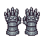 | **Ember Ashen Grips** | A pair of weathered leather gloves rendered in grayscale pixel art. The gauntlets feature reinforced knuckles with dark metallic plating, tattered edges around the wrists, and faint ethereal wisps emanating from the fingertips. | *Forged in the dying breath of a forgotten war, these gloves drink in the ambient despair of their wielder. Those who don them find their grip unyielding—whether clutching steel, staff, or bowstring.* | Samurai, Mage, Archer, Warrior |
| 15 |  | **Bloodleather Grips** | A pair of deep crimson leather gloves with darker burgundy accents. The knuckles feature reinforced padding with a weathered, aged texture. Bronze or copper-toned metal rivets and small ornamental plates adorn the wrists and finger joints, suggesting both protection and wear from countless battles. | *Stained by the hands of those who came before, these gloves whisper of blood spilled and oaths sworn. They grant sureness in grip, as if guided by the vengeance of the fallen.* | Samurai, Mage, Archer, Warrior |
| 16 |  | **Bloodhide Gauntlets** | Worn leather gloves with a deep crimson-brown hue, reinforced with darker tanned hide at the knuckles and palms. The material appears weathered and stained, with a textured, aged appearance suggesting countless battles endured. | *Forged from the hide of creatures long forgotten, these gauntlets drink deep of violence. Those who don them feel the weight of old sorrows pressing against their grip.* | Samurai, Mage, Archer, Warrior |
| 17 | 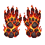 | **Emberflare Gauntlets** | A pair of crimson leather gloves with flame-like ridges running across the knuckles and wrists. The palms glow with an intense orange-red hue, suggesting smoldering heat. Sharp, jagged protrusions resembling fire crests rise from the back of each hand. | *Forged in the dying breath of a pyre-spirit, these gauntlets burn with an ancient hunger. To grasp them is to feel the world's heat bend to your will, whether you seek to strike, curse, or defend.* | Samurai, Mage, Archer, Warrior |
| 18 |  | **Bindleather Wraps** | Weathered tan leather gloves with dark brown bindings wrapped around the knuckles and wrists. Worn brass buckles secure the forearm straps. The palms show signs of heavy use with visible creases and faded staining. | *Once worn by a penitent order of wanderers, these wraps carry the weight of countless journeys through forgotten lands. They offer no mercy to the wearer, only resolve.* | Samurai, Mage, Archer, Warrior |
| 19 |  | **Crimson Thorngrips** | Leather gloves dyed deep crimson-red with dark burgundy accents. Thorned or spiked protrusions run along the knuckles and back of the hands. The material appears worn and reinforced, suggesting countless battles. Gold or bronze trim edges the wrists. | *Forged in blood and malice, these gloves whisper of violence with every grip. They have tasted the suffering of countless foes, and their thorns drink deeper with each strike.* | Samurai, Mage, Archer, Warrior |
| 20 |  | **Rotwood Gauntlets** | Weathered leather gloves with gnarled wood reinforcements along the knuckles and forearms. Moss-green coloring with darker brown decay patterns. Skeletal finger bones protrude from the knuckle plates, creating a menacing silhouette. | *Once worn by a druid who defied death itself, these gloves now channel the slow corruption of the forest floor. Each grasp brings the wielder closer to the ancient rot that binds all living things.* | Samurai, Mage, Archer, Warrior |
| 21 |  | **Shattered Veilweaver's Grasp** | Purple-hued fabric gloves with dark crimson accents and mystical embroidered patterns. The palms glow faintly with arcane symbols, suggesting enchantment. Reinforced knuckles show signs of ancient craftsmanship. | *Once worn by a sorceress who walked between worlds, these gloves pulse with residual magic. They grant their wearer a fraction of her unnatural dexterity, as if countless forgotten spells still linger in the weave.* | Samurai, Mage, Archer, Warrior |
| 22 |  | **Bloodrust Gauntlets** | Pair of weathered crimson and brown leather gloves with oxidized metal plating across knuckles and forearms. Dark rust stains streak the surface, suggesting ancient bloodshed. Metal rivets gleam dully against the worn leather. | *Forged in an age when violence held dominion, these gauntlets thirst for the spilling of blood. Each scar upon their surface whispers of battles long forgotten, yet their hunger remains undiminished.* | Samurai, Mage, Archer, Warrior |
| 23 |  | **Bloodleather Gauntlets** | A pair of weathered leather gloves stained deep crimson and rust-brown. The palms are reinforced with darkened hide, fingertips worn from countless grips. Subtle veining patterns run across the knuckles like dried blood. | *Once belonging to a warrior whose name was scrubbed from history, these gloves retain the warmth of violence. They whisper promises of unflinching grip, whether wielding steel or incantation.* | Samurai, Mage, Archer, Warrior |
| 24 |  | **Bloodveil Wraps** | Tattered cloth gloves in deep crimson and brown, reinforced at the knuckles and wrists with dark leather straps. The fabric appears aged and stained, with frayed edges suggesting countless battles. Faint ritualistic markings are visible along the cuffs. | *Woven from the cloaks of forgotten bloodmages, these wraps whisper of pacts made in shadow. Those who wear them find their grip unnaturally steady, as if unseen hands guide their actions.* | Samurai, Mage, Archer, Warrior |
| 25 |  | **Ancient Bonegrip Gauntlets** | Weathered leather gloves reinforced with bleached bone plating across the knuckles and forearms. Intricate crimson stitching traces skeletal patterns, with tarnished metal rivets securing the bone segments. The palms show deep wear marks suggesting countless battles. | *Forged from the remains of a forgotten tyrant, these gauntlets whisper promises of unyielding resolve. Those who don them feel the weight of countless fallen foes, their strength channeled through trembling fingers.* | Samurai, Mage, Archer, Warrior |
| 26 |  | **Bloodwraith Grips** | Weathered leather gloves with deep crimson staining across the palms and knuckles. Tattered cloth wrappings spiral around the wrists, and faint dark veins seem to pulse beneath the worn surface, suggesting corruption or dark enchantment. | *Once worn by those who thirsted for power beyond mortal limits, these gloves whisper promises of strength with every grasp. The blood that stains them has long since dried, yet somehow never truly fades.* | Samurai, Mage, Archer, Warrior |
| 27 |  | **Veilwraith Grips** | A pair of deep purple gloves with darker violet accents and ghostly blue shimmer. The fabric appears ethereal with wispy, smoke-like patterns trailing across the knuckles and wrists. Fine arcane runes glow faintly along the seams. | *Wrought from the essence of forgotten spirits, these gloves whisper promises of power to those desperate enough to listen. Each grasp draws strength from the void itself, though the cost remains unknown.* | Samurai, Mage, Archer, Warrior |
| 28 |  | **Duskmire Gauntlets** | Sturdy gray-blue leather gloves with reinforced knuckles and wrist guards. Dark metallic plating runs along the fingers and palm, with weathered straps securing the forearms. The material shows signs of wear and age. | *Forged in the marshes where light dies, these gauntlets grant their wearer the grip of one who has strangled shadows. Each clasp whispers of countless hands that came before.* | Samurai, Mage, Archer, Warrior |
| 29 |  | **Ashen Gauntlets of the Void** | A pair of sturdy armored gloves rendered in dark gray and black pixels. The gauntlets feature reinforced knuckles with metallic ridges, tattered cloth wrappings around the wrists, and an ethereal purple glow emanating from the palms, suggesting arcane or necrotic energy. | *Forged in the depths where shadow swallows light, these gauntlets grant their wearer command over the spaces between worlds. Those who don them find their grip unnaturally firm, as if guided by something unseen.* | Samurai, Mage, Archer, Warrior |
| 30 |  | **Ember Veilwraith Grips** | Deep purple gloves with darker shadowy wisps curling across the knuckles and fingers. The fabric appears ethereal and slightly translucent, with subtle black accents along the seams and palm. Wisps of shadow seem to drift from the fingertips. | *Woven from the twilight between worlds, these gloves grant their wearer a ghostly touch. Those who don them find their grip strengthened by forces that defy mortality itself.* | Samurai, Mage, Archer, Warrior |
| 31 |  | **Embercinder Grips** | Ornate gloves rendered in warm orange and deep red tones, with flame-like patterns climbing across the knuckles and wrists. The fingertips glow with molten intensity, suggesting smoldering heat. Gold trim frames the cuffs, and small embers appear to drift from the fabric. | *Once worn by a pyromancer consumed by their own inferno, these gloves still pulse with the dying warmth of a thousand burned offerings. Those who don them feel ancient flame stir within their bones.* | Samurai, Mage, Archer, Warrior |
| 32 |  | **Hollow Bloodhide Gauntlets** | Weathered leather gloves in deep crimson and rust tones, reinforced with dark metal plating across the knuckles and forearms. Worn edges suggest countless battles, with faint arcane runes etched into the palms. | *Stained by the blood of a thousand conflicts, these gauntlets remember every strike their wearer has delivered. Those who don them feel the weight of violence settle into their bones.* | Samurai, Mage, Archer, Warrior |
| 33 |  | **Ancient Bloodwraith Grips** | A pair of brown leather gloves with deep crimson accents and weathered texture. Dark staining marks the knuckles and palms, suggesting countless battles. Reinforced stitching and worn edges indicate age and heavy use. | *Forged in the grip of those who have tasted victory through bloodshed, these gloves carry the weight of countless fallen foes. They whisper of rage untempered and hands that refused to yield.* | Samurai, Mage, Archer, Warrior |
| 34 | 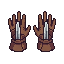 | **Bloodwraith Gauntlets** | Dark crimson leather gloves with burgundy undertones, reinforced with blackened metal plating across the knuckles and forearms. Intricate stitching patterns resemble veins, creating an unsettling organic appearance. Worn and weathered texture suggests countless battles. | *Forged from the hide of something long dead, these gauntlets pulse with a dull crimson light. Those who wear them feel the weight of spilled blood—not their own.* | Samurai, Mage, Archer, Warrior |
| 35 |  | **Ashen Frostgrips** | Weathered leather gauntlets with reinforced knuckles wrapped in tarnished silver bands. Gray-brown coloring suggests age and ash exposure. Intricate metalwork adorns the wrists with geometric patterns. Worn, practical construction despite ornamental details. | *Forged in the cold breath of forgotten peaks, these gauntlets grant steadiness in the darkest grip. Even as leather decays, the metal never loses its bite.* | Samurai, Mage, Archer, Warrior |
| 36 |  | **Voidborn Bloodhide Gauntlets** | Weathered leather gloves with deep brown and rust coloring, reinforced with darker leather straps across the knuckles and wrists. Textured surface suggests aged hide, with visible stitching and worn patches indicating long wear through battle. | *Once worn by those who walked the borderlands between life and death, these gauntlets have absorbed the essence of countless struggles. They whisper of old oaths and older blood.* | Samurai, Mage, Archer, Warrior |
| 37 |  | **Bloodpulse Wraps** | Crimson leather gloves with ornate embroidered patterns in deep purple and gold thread. Pulsing veins of darker red traverse the back of each hand, converging at ornate metal knuckle plates adorned with small circular emblems. | *Once worn by a cult devoted to the old blood rites, these gloves throb with a rhythm all their own. Those who don them feel the weight of forgotten oaths settling into their bones.* | Samurai, Mage, Archer, Warrior |
| 38 |  | **Azurite Grips of the Void** | A pair of fingerless gauntlets dominated by deep blue and purple hues with ornate metallic plating across the knuckles and forearms. Intricate glowing runes run along the wrists, and the fabric appears woven from a twilight-colored material with silvery threading. | *Forged in the cold depths where starlight dies, these grips channel the hunger of the void itself. Those who don them feel the weight of infinite darkness settle upon their hands.* | Samurai, Mage, Archer, Warrior |
| 39 | 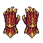 | **Bloodrite Gauntlets** | Crimson leather gloves with ornate embroidered patterns in dark red and gold threading. The knuckles feature reinforced metal plating with a ritualistic symbol etched across the backs. Frayed edges suggest age and repeated consecration. | *Stained by countless offerings, these gloves pulse with an ancient thirst. Those who don them feel the weight of every oath sworn in blood, every debt collected in darkness.* | Samurai, Mage, Archer, Warrior |
| 40 | 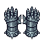 | **Shadowbound Gauntlets** | Dark gray leather gloves with black steel plating across knuckles and forearms. Intricate silver rune-work traces along the fingers. The palms are reinforced with darkened metal studs arranged in ritualistic patterns. | *Forged in the depths where light fears to tread, these gauntlets whisper promises of power to those desperate enough to listen. Some say the runes binding them still hunger for the touch of mortal flesh.* | Samurai, Mage, Archer, Warrior |
| 41 |  | **Ancient Nightfall Grips** | A pair of midnight-blue gauntlets with deep indigo accents and silver threading. The knuckles are reinforced with what appears to be hardened leather or scaled plating. Ethereal wisps or shadow-like patterns swirl across the surface, giving them an otherworldly, cursed appearance. | *Forged in the depths where starlight fears to reach, these grips whisper promises of strength to those cursed enough to don them. Many who have worn them speak of shadows that move of their own accord.* | Samurai, Mage, Archer, Warrior |
| 42 |  | **Bloodwarden Gauntlets** | Worn leather gloves with deep crimson staining and reinforced knuckles. Tattered fabric edges and faded gold embroidery suggest ancient craftsmanship. Dark iron rivets run along the fingers and palms, weathered by countless battles. | *Stained with the blood of forgotten wars, these gauntlets remember every grip they've strengthened. Those who don them feel the weight of old vengeance settling into their bones.* | Samurai, Mage, Archer, Warrior |
| 43 | 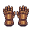 | **Forsaken Bloodhide Gauntlets** | Weathered leather gloves with deep crimson staining across the knuckles and palms. Reinforced with tarnished bronze plating on the backs of the hands. Dark veining patterns run through the leather like dried blood channels. | *Stained with the essence of countless conflicts, these gauntlets whisper of violence past. They grip with an unnatural hunger, as if eager to taste blood once more.* | Samurai, Mage, Archer, Warrior |
| 44 |  | **Ironbound Grips of Ruin** | Pair of heavy gauntlets with dark grey metal plating reinforced by black iron bands. Intricate crimson veins run across the knuckles like dried blood, with sharp ridged edges along the fingers. Tattered cloth wrappings peek from the wrists. | *Forged in the depths where flesh meets shadow, these gauntlets grant their bearer an iron will—and a grip that refuses to yield. Many have tried to pry them free from the hands of the fallen.* | Samurai, Mage, Archer, Warrior |
| 45 |  | **Shattered Bloodwraith Gauntlets** | A pair of weathered leather gloves with deep crimson staining across the knuckles and palms. Brown leather is reinforced with dark iron plating on the back of the hands. The fingers are wrapped tightly, with subtle crimson veining pattern woven into the material. | *Stained by countless conflicts, these gauntlets pulse with a malevolent warmth. They grant their wearer an unnatural grip on fate itself—or perhaps merely on the throats of their enemies.* | Samurai, Mage, Archer, Warrior |
| 46 |  | **Ember Bloodleather Grips** | Brown leather gloves with deep crimson staining across the knuckles and palms. Worn brass buckles fasten at the wrists, and the leather bears faded ritual markings etched along the forearms. The material appears aged and well-used. | *Hands stained by countless battles—or perhaps something far older. These grips whisper of oaths sworn in blood and pacts that demand a heavy price.* | Samurai, Mage, Archer, Warrior |
| 47 | 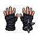 | **Bloodhusk Grips** | Worn leather gloves with dark burgundy staining across the palms and knuckles. Reinforced with blackened metal studs along the back of the hands. The fingers appear weathered and cracked, with a faint crimson sheen suggesting old bloodstains that never fully wash away. | *Gloves steeped in violence and suffering. Those who don these relics feel the weight of countless battles coursing through their fingertips, as if the hands themselves remember every blow struck in rage and desperation.* | Samurai, Mage, Archer, Warrior |
| 48 | 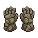 | **Ossein Wraiths' Grasp** | Tattered leather gloves stained deep brown and grey, with bone-white reinforced knuckles and skeletal finger wrappings. Wisps of spectral mist cling to the worn fabric, and dark runes are etched across the palms. | *Hands that once belonged to those who crossed the veil between worlds. Wearing them grants a chilling touch—whispers of the departed cling to your fingertips, granting clarity in darkness and surety in violence.* | Samurai, Mage, Archer, Warrior |
| 49 |  | **Wraithbound Grips** | A pair of grey cloth gloves with dark shadowy wisps emanating from the palms and fingers. The fabric appears worn and tattered at the edges, with subtle dark striations running across the surface suggesting an otherworldly material. | *Woven from the vestments of those who lingered too long between worlds, these gloves grant their wearer an unnatural familiarity with the veil. Each touch carries the whisper of oblivion.* | Samurai, Mage, Archer, Warrior |
| 50 |  | **Veilbound Grips** | A pair of sturdy cloth gloves in deep indigo and grey, adorned with intricate silver embroidery forming arcane patterns. The palms are reinforced with leather, and wisps of ethereal mist seem to cling to the fingertips. | *Woven by hands long turned to dust, these gloves channel the boundary between worlds. Each grasp pulls something from the void—power, or perhaps a price yet unnamed.* | Samurai, Mage, Archer, Warrior |
| 51 |  | **Forsaken Veilwraith Grips** | Tattered purple gloves with wispy, ethereal tendrils coiling around the fingers. Dark plum fabric fades to near-black at the wrists, adorned with ghostly wisps that seem to hover above the surface. Intricate shadowy patterns wrap around the knuckles. | *Woven from the twilight between worlds, these gloves grant those who wear them passage through shadows. The spectral wisps hunger for the warmth of living hands.* | Samurai, Mage, Archer, Warrior |
| 52 |  | **Voidborn Bloodhusk Grips** | A pair of worn leather gloves in deep burgundy and rust tones. The knuckles and palms are reinforced with darkened hide, marked by cracks that suggest age and countless battles. Faint crimson stains mar the surface, refusing to fade. | *Gloves steeped in the essence of fallen warriors. Those who don them claim to feel the strength of the slain coursing through their fingertips, though whether this is blessing or curse remains uncertain.* | Samurai, Mage, Archer, Warrior |
| 53 |  | **Ossein Grips** | Weathered leather gloves with prominent bone reinforcements across the knuckles and wrists. Tan-brown leather darkened by age, with pale cream-colored bone plates affixed at strategic impact points. Visible stitching and wear suggest countless battles. | *Forged from the bones of an ancient sentinel, these gloves channel suffering into strength. Each strike carries the weight of forgotten sorrows.* | Samurai, Mage, Archer, Warrior |
| 54 |  | **Ashen Knucklebound Wraps** | Weathered cloth gloves with gray-white coloration and dark binding. Reinforced knuckles show signs of ancient wear, with faint arcane markings etched along the wrists. Tattered edges suggest countless battles endured. | *Forged in the ash-fall of a forgotten ritual, these wraps remember the hands of those who walked between worlds. They whisper of strength borrowed from things best left unspoken.* | Samurai, Mage, Archer, Warrior |
| 55 |  | **Ironwood Grips** | Weathered leather gloves with reinforced brown palm sections and dark leather straps. Visible stitching and worn bronze buckles suggest age and hard use. The knuckles show reinforced padding with a subtle metallic sheen. | *Forged in the fires of forgotten wars, these gloves remember every blade they've turned aside. To wear them is to inherit the resolve of those who refused to yield.* | Samurai, Mage, Archer, Warrior |
| 56 |  | **Bloodsoaked Wraiths** | A pair of tattered leather gloves stained deep crimson, with frayed edges and darkened fingertips. Ghostly wisps of ethereal energy coil around the wrists, and faint bloodstains streak across the palms in ritualistic patterns. | *Once worn by those who trafficked in forbidden pacts, these gloves whisper with the anguish of broken oaths. To don them is to invite the weight of spilled souls upon your hands.* | Samurai, Mage, Archer, Warrior |
| 57 |  | **Bloodveil Grips** | Crimson leather gloves with dark burgundy accents and black reinforced knuckles. Tattered fabric wisps trail from the wrists, and arcane symbols glow faintly along the palms. | *Once worn by a pact-breaker, these gloves whisper of old debts unpaid. They channel malice through trembling fingers, binding the wielder between worlds.* | Samurai, Mage, Archer, Warrior |
| 58 |  | **Shadowbound Grips** | A pair of dark leather gloves with black fabric throughout. The gauntlets feature reinforced knuckles with subtle metallic plating. Wispy shadow tendrils appear to coil around the wrists and fingers, rendered in darker tones against the base leather. | *Forged in the grip of forgotten sorrows, these gloves drink in the ambient darkness and grant their wearer an unnatural steadiness. Those who don them report fingers that move with purpose beyond their own intention.* | Samurai, Mage, Archer, Warrior |
| 59 | 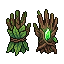 | **Wraithgrip Gauntlets** | Tattered green cloth gloves with skeletal bone reinforcements across the knuckles and fingers. Dark veins or corrupted tendrils spiral around the wrists. The fabric appears weathered and ethereal, with wisps of spectral energy emanating from the seams. | *Once worn by a forgotten sorcerer who bartered his flesh for power, these gloves hunger for the warmth of living hands. Those who don them feel the weight of countless grasps pulling from beyond the veil.* | Samurai, Mage, Archer, Warrior |
| 60 | 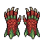 | **Bloodthorn Gauntlets** | Crimson leather gloves with jagged, thorn-like protrusions along the knuckles and forearms. Deep burgundy fabric beneath reinforced plating, traced with dark veining that resembles dried blood or corrupted roots. | *Forged in malice and soaked in the essence of thorns that drink deep. Those who don these gauntlets feel their grip strengthen with every drop of spilled blood.* | Samurai, Mage, Archer, Warrior |
| 61 |  | **Frostweaver's Grasp** | Pale blue ethereal gloves with intricate frost-crystalline patterns across the knuckles and palms. Wisps of spectral energy coil around the fingers like living ice. The fabric appears semi-translucent with an otherworldly luminescence. | *Woven from the frozen tears of forgotten winters, these gloves grant dominion over the spaces between warmth and cold. Those who don them feel the weight of eternal frost settling into their very bones.* | Samurai, Mage, Archer, Warrior |
| 62 |  | **Ember Bloodhide Grips** | Weathered leather gloves stained deep crimson, reinforced with darker brown hide panels across the knuckles and wrists. Visible stitching traces the palms, and a faint russet patina suggests age and countless battles endured. | *Worn by those who have grasped steel through endless carnage, these gloves carry the memory of blood spilled by their wielder. They offer no comfort—only an unflinching grip on destiny.* | Samurai, Mage, Archer, Warrior |
| 63 |  | **Storm Bloodhide Grips** | Weathered leather gloves in deep auburn and rust tones, reinforced with darker leather straps across the knuckles. The palms show a worn crimson stain pattern suggesting ancient bloodshed. Fingers curl slightly as if permanently gripping. | *Tanned from the hides of beasts long forgotten, these gloves whisper of violence executed with purpose. Those who wear them feel the echoes of countless battles thrumming beneath their skin.* | Samurai, Mage, Archer, Warrior |
| 64 |  | **Hollow Bloodleather Grips** | Crimson leather gloves with dark burgundy undertones and obsidian reinforcements at the knuckles. The palms show a textured, worn surface suggesting countless battles. Sharp black accents trace the fingers and wrist cuffs. | *Forged from the hide of creatures long forgotten, these grips whisper of violence yet to come. Each strike lands with the weight of ancient malice.* | Samurai, Mage, Archer, Warrior |
| 65 |  | **Ashen Covenant Wraps** | A pair of weathered cream-colored fabric gloves with deep brown accents at the wrists and fingers. The material appears aged and worn, with subtle texture suggesting linen or canvas. Small darker stains or marks streak across the palms. | *Woven from the burial shrouds of forgotten oath-keepers, these wraps carry the weight of a thousand broken promises. They grant their wearer steadiness, though at the cost of hearing whispers in the dark.* | Samurai, Mage, Archer, Warrior |
| 66 |  | **Bloodhound's Grasp** | Worn leather gloves with dark brown and crimson tones. Detailed stitching forms claw-like patterns across the knuckles. The palms show deep wear marks and faded bloodstains that seem permanently etched into the material. | *Gloves stained by the hunt of countless prey. Those who don them feel the phantom grip of something ancient stirring beneath their skin, whispering of violence yet to come.* | Samurai, Mage, Archer, Warrior |
| 67 |  | **Bone-Stitched Grips** | Weathered cloth gloves reinforced with pale bone plating across knuckles and fingers. Intricate dark thread binds the segments together in ritualistic patterns. Faded crimson stains mark the palms, suggesting long use in conflict. | *These cursed gauntlets were sewn from the hide of something that should have stayed buried. Each stitch whispers of violence yet to come, and those who wear them find their grip unnaturally steady—as if guided by hands long dead.* | Samurai, Mage, Archer, Warrior |
| 68 |  | **Voidborn Bloodhide Gauntlets** | Worn leather gloves with deep crimson staining across the knuckles and palms. Dark brown material shows aged creasing and reinforced stitching. Dried bloodstains create irregular patterns, suggesting countless violent encounters. Tattered edges frame the wrists. | *Gloves steeped in the ichor of fallen foes, their leather hardened by suffering and strife. Those who don them feel the weight of every drop spilled in their name.* | Samurai, Mage, Archer, Warrior |
| 69 |  | **Verdant Blight Wraps** | Tattered cloth gloves in sickly green and grey, with dark vein-like patterns spreading across the palms and fingers. The fabric appears partially corrupted or diseased, with wisps of spectral fog curling around the wrists. | *Gloves woven from the sinews of forgotten gardens. They whisper of blight and renewal—a dark pact between the wearer and the creeping rot that consumes all things.* | Samurai, Mage, Archer, Warrior |
| 70 |  | **Amethyst Covenant Gloves** | A pair of deep purple gloves with ornate embroidered patterns. The fabric appears supple yet reinforced, with glowing violet runes traced along the knuckles and wrists. Gold filigree accents frame the cuffs, suggesting both arcane and martial craftsmanship. | *Woven from the sinews of forgotten pacts, these gloves pulse with an otherworldly violet luminescence. Those who don them report whispers of voices long silenced, as if the very fabric remembers the hands that shaped it.* | Samurai, Mage, Archer, Warrior |
| 71 |  | **Void-Touched Grips** | A pair of dark purple gloves with ethereal, wispy tendrils emanating from the palms. The fabric appears to shift between shadow and silk, with subtle arcane runes glowing faintly along the knuckles and wrists. | *Forged in the embrace of the void itself, these gloves grant their wearer a connection to forces beyond mortal comprehension. Those who don them feel the weight of ancient power coursing through their fingertips.* | Samurai, Mage, Archer, Warrior |
| 72 |  | **Crimson Grasp Wraps** | Ornate cloth gloves rendered in deep crimson and burgundy tones with intricate embroidered patterns across the knuckles and wrist cuffs. Reinforced with dark metal plating at the joints, featuring small spikes and arcane symbols along the edges. | *Stained with the blood of countless fallen, these wraps bind the wielder's hands in grim purpose. Whether gripping sword, staff, or bowstring, they whisper promises of power at a terrible cost.* | Samurai, Mage, Archer, Warrior |
| 73 |  | **Ancient Bloodwraith Grips** | Weathered dark brown leather gloves with deep crimson staining across the knuckles and palms. The material appears worn and aged, with visible stitching and reinforced finger joints. A faint burgundy discoloration suggests ancient bloodstains that refuse to wash away. | *Gloves steeped in violence and sorrow, their crimson patina a testament to countless fallen. Those who don them feel the weight of every blow they've delivered, as if the blood of the past guides their hand toward inevitable ruin.* | Samurai, Mage, Archer, Warrior |
| 74 |  | **Cursed Bonegrip Gauntlets** | Skeletal leather gloves with ivory-white finger bones protruding from dark maroon fabric. Intricate bone inlays trace arcane patterns across the knuckles. Tattered edges suggest age and countless battles. | *Crafted from the hands of forgotten warriors, these gauntlets channel the hunger of the restless dead. Each grip tightens with spectral resolve.* | Samurai, Mage, Archer, Warrior |
| 75 |  | **Charred Bone Grips** | A pair of weathered fingerless gloves crafted from blackened bone and tattered leather. Scorched markings spiral across the knuckles, with frayed fabric trailing from the wrists. Deep brown and ash-gray coloring dominates the design. | *Hands bound in the charred remnants of those who sought power beyond their reach. Each grip tightens with the weight of forgotten ambitions.* | Samurai, Mage, Archer, Warrior |
| 76 |  | **Shadowveil Grips** | Dark burgundy leather gloves with deep crimson undertones and blackened fingertips. The material appears aged and worn, with subtle texture suggesting reinforced stitching along the knuckles and wrist cuffs. A faint violet aura seems to emanate from the fabric. | *Gloves steeped in shadow magic, their leather supple from countless dark rituals. Those who don them feel the weight of forgotten vows pressing against their skin, whispering secrets best left unspoken.* | Samurai, Mage, Archer, Warrior |
| 77 | 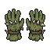 | **Thornweave Gauntlets** | Weathered leather gloves reinforced with gnarled vine-like patterns in moss green and sickly yellow. Thorned tendrils coil around the knuckles and wrists, with patches of darker decay spreading across the palms. The material appears organic and writhing. | *Woven from the corrupted growth of a forgotten garden, these gauntlets whisper with the hunger of things that should not grow. Each grasp draws strength from the shadow between life and decay.* | Samurai, Mage, Archer, Warrior |
| 78 |  | **Ember Ashen Grips** | Worn leather gloves with gray-brown coloring and visible stitching. The palms show darker weathering and reinforced padding. Frayed edges suggest age and heavy use, with muted bronze or copper accents at the wrists. | *Gloves weathered by countless conflicts, their ash-gray leather worn smooth by blood and battle. Those who don them feel the phantom grip of fallen warriors guiding their hands.* | Samurai, Mage, Archer, Warrior |
| 79 |  | **Shadowpact Grips** | Dark burgundy leather gloves with blackened steel knuckle plates and intricate crimson stitching. The palms bear worn silver runes that seem to shimmer faintly. Fingers are reinforced with dark metal bands. | *Forged in an age when blood oaths bound warrior and shadow alike, these grips remember every contract sealed in darkness. To wear them is to accept the weight of promises made in the void.* | Samurai, Mage, Archer, Warrior |
| 80 |  | **Bloodweave Grips** | Worn leather gloves stained deep crimson, reinforced with darkened metal plates across the knuckles and wrist cuffs. Intricate thread patterns run through the palms in a ritualistic weave, suggesting ancient craftsmanship. | *Gloves woven from the hides of forgotten beasts, their crimson dye drawn from blood older than memory. Those who don them feel the weight of countless battles seeping into their very grip.* | Samurai, Mage, Archer, Warrior |
| 81 |  | **Frostblight Wraiths** | A pair of ethereal blue gloves with wispy, spectral fingers. Glacial ice crystals form jagged patterns across the palms and knuckles, while pale wisps of frozen mist coil around the wrists like living chains. | *Gauntlets woven from the essence of blighted winters, they whisper with the screams of those frozen in eternal torment. To wear them is to invite the cold into your very soul.* | Samurai, Mage, Archer, Warrior |
| 82 |  | **Bloodweaver's Grasp** | Weathered leather gloves with deep burgundy staining across the palms and fingers. Intricate dark red embroidery traces worn patterns along the knuckles and wrists, suggesting arcane symbols or ancient script. The material appears supple yet reinforced, with hints of copper or bronze threading. | *Gloves steeped in the essence of those who wielded forbidden pacts. They whisper of blood spilled in ritual and war alike, granting their wearer an unsettling connection between thought and action.* | Samurai, Mage, Archer, Warrior |
| 83 |  | **Forsaken Bloodhide Grips** | A pair of dark crimson leather gloves with aged, worn texture. The palms display intricate black sigils and veins that pulse faintly. Reinforced knuckles show burnt bronze plating with claw-like protrusions. The cuffs are tattered, revealing dark cloth beneath. | *Forged from the hide of something that should have stayed dead, these gloves whisper promises of strength to those desperate enough to listen. Each grip tightens the line between wielder and oblivion.* | Samurai, Mage, Archer, Warrior |
| 84 |  | **Withered Thorngrips** | A pair of aged leather gloves with gnarled, thorn-like protrusions covering the knuckles and fingers. The material appears weathered and moss-stained, with deep green and brown hues. Skeletal vines wrap around the wrists, suggesting both decay and arcane corruption. | *Gloves woven from the hide of something long dead, their thorns drinking deep from the life force of those who dare grip them. Each strike carries the weight of a thousand withered gardens.* | Samurai, Mage, Archer, Warrior |
| 85 |  | **Dreadbound Gauntlets** | Aged leather gloves reinforced with tarnished metal plates across knuckles and forearms. Wrapped in frayed cloth bindings stained dark crimson. Metal studs trace the palm edges. Weathered, battle-worn appearance with visible cracks in the leather. | *Bound in the blood of fallen champions, these gauntlets grant their wearer an iron grip—whether wielding blade, spell, or bow. The leather remembers every kill.* | Samurai, Mage, Archer, Warrior |
| 86 |  | **Scorched Covenant Gauntlets** | Weathered leather gloves with ornate bronze plating across the knuckles and forearms. Golden embroidery traces arcane symbols along the cuffs. The palms show deep burn marks and singed edges, suggesting exposure to profane fire. | *Hands that have pledged themselves to darker purposes bear the marks of their oath. These gauntlets remember every flame they've endured, and grant their wearer a fraction of that hardened resolve.* | Samurai, Mage, Archer, Warrior |
| 87 |  | **Storm Bloodhide Grips** | Weathered brown leather gloves with deep crimson staining across the knuckles and palms. Reinforced stitching runs along the fingers, and dark bronze rivets accent the wrist cuffs. The leather appears aged and well-worn, suggesting countless conflicts. | *Gloves stained by the blood of countless foes, their leather has grown supple and responsive to violence. Those who wear them feel the phantom grip of ancient warriors guiding their hands toward ruin.* | Samurai, Mage, Archer, Warrior |
| 88 | 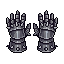 | **Scourgebound Gauntlets** | Dark leather gloves reinforced with blackened metal plating across knuckles and forearms. Tattered cloth wraps around the wrists, stained deep crimson. Jagged spikes protrude from the knuckle guards, and faint violet runes glow along the metal edges. | *Forged in the ash of a fallen curse-bearer, these gauntlets drink deep of suffering. Those who don them find their grip strengthened by the anguish woven into every stitch.* | Samurai, Mage, Archer, Warrior |
| 89 |  | **Bonewraith Gauntlets** | Cream-colored fingerless gloves with exposed knuckles and wrist guards. Decorated with dark accents and shadowy patterns reminiscent of spectral wisps. The material appears aged parchment-like with mysterious runes etched across the backs. | *Wrought from the ethereal remains of a forgotten sentinel, these gloves whisper with the voices of the departed. They grant their wearer communion with forces that hunger beyond the veil.* | Samurai, Mage, Archer, Warrior |
| 90 |  | **Bloodweave Gauntlets** | Dark crimson leather gloves with black reinforced plating on the knuckles and forearms. Intricate veins of deep burgundy thread run across the palms in an arcane pattern. The fingertips are edged with tarnished silver trim, showing signs of ancient wear. | *Woven from the hides of forgotten beasts, these gloves pulse with a faint crimson energy. Those who don them feel the weight of countless battles seeping into their very bones.* | Samurai, Mage, Archer, Warrior |
| 91 | 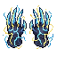 | **Stormwrath Grips** | Gauntlets crackling with ethereal blue lightning, featuring sharp angular designs and jagged edges. Dark leather base reinforced with metallic plating, bolts of electric energy spiraling around the knuckles and forearms. | *Forged in the heart of a shattered tempest, these grips channel the fury of a thousand storms. Those who don them feel the weight of unleashed power coursing through their veins, eager for violent purpose.* | Samurai, Mage, Archer, Warrior |
| 92 |  | **Voidborn Bloodhide Gauntlets** | Weathered leather gloves in deep crimson and brown, reinforced with dark metal plating across the knuckles and forearms. Worn texture suggests countless battles, with deep creases and faded bloodstains woven into the material. | *Forged from the hide of creatures long forgotten, these gauntlets remember every blow they've struck. Those who don them feel the weight of violent purpose settle into their grip.* | Samurai, Mage, Archer, Warrior |
| 93 |  | **Bloodveil Gauntlets** | A pair of sturdy gloves with deep crimson leather and dark metal reinforcement. The knuckles feature ornate plating with subtle geometric patterns, while the wrists are bound with aged cloth wrapping. Small bronze studs line the edges. | *Forged in the shadow of forgotten wars, these gauntlets drink in the vitality of those who wear them. Each grip tightens the wearer's connection to the blood that flows beneath their skin.* | Samurai, Mage, Archer, Warrior |
| 94 |  | **Ember Bloodhide Grips** | Weathered leather gauntlets in deep burgundy and brown tones, reinforced with darker leather straps across the knuckles and wrists. The surface shows intricate stitch patterns and worn creases suggesting age and heavy use. | *Hands stained by countless battles, these grips whisper of violence past. They grip tighter the more blood they taste.* | Samurai, Mage, Archer, Warrior |
| 95 | 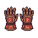 | **Storm Bloodrite Gauntlets** | Crimson leather gloves with dark red cloth wrappings around the forearms. Aged brass knuckles with intricate carved patterns overlay the knuckles. Deep burgundy staining marks the palms, suggesting ritual use or ancient violence. | *Stained by countless rites and battles long forgotten, these gauntlets throb with a hunger that passes into the wielder's very bones. Those who don them report a warmth in their grip—whether blessing or curse, none can say.* | Samurai, Mage, Archer, Warrior |
| 96 |  | **Hollow Crimson Thorngrips** | A pair of heavy leather gloves with deep burgundy coloring and prominent thorned metal plating across the knuckles and fingers. Dark spikes protrude from the wrist cuffs, and the palm areas show reinforced crimson fabric with worn silver trim. | *Forged in the blood of fallen thorns, these grips promise to pierce flesh as easily as they grip steel. Those who wear them feel the ancient hunger of thorns yearning to taste their enemies.* | Samurai, Mage, Archer, Warrior |
| 97 |  | **Ancient Bloodhide Gauntlets** | A pair of deep crimson leather gloves with darker brown accents at the wrists and knuckles. The material appears aged and weathered, with visible stitching and reinforced palms. Subtle bronze or copper buckles secure the cuffs. | *Crafted from the hide of creatures long forgotten, these gauntlets pulse with an ancient hunger. They grant their wearer an unnatural grip on fate itself—whether to wield blade, staff, or bow with unyielding purpose.* | Samurai, Mage, Archer, Warrior |
| 98 |  | **Wraithbone Gauntlets** | Cream-colored cloth gloves with skeletal bone structure overlaid across the knuckles and fingers. Dark shadowy wisps emanate from the seams, creating an ethereal, ghostly aura around the hands. | *Crafted from the sinew of forgotten spirits, these gauntlets grant their wearer an unnatural grip on mortality itself. Those who don them report hearing whispers of the dead coursing through their veins.* | Samurai, Mage, Archer, Warrior |
| 99 |  | **Ashen Fist Wraps** | Weathered cloth gloves with dark grey-brown fabric, reinforced knuckles marked by soot stains and burn marks. Metal studs line the knuckles in a ritualistic pattern, with tattered edges suggesting age and countless battles. | *Forged in the embers of a fallen monastery, these wraps have absorbed the prayers of warriors long turned to dust. Each strike carries the weight of their final defiance.* | Samurai, Mage, Archer, Warrior |
| 100 |  | **Pestilent Grasp Gloves** | Tattered cloth gloves with sickly teal and deep purple coloration. Wisps of green miasma swirl around the fingers, with thorny protrusions sprouting from the knuckles. The fabric appears rotted and diseased, with darker stains throughout. | *Once worn by a plague-touched prophet, these gloves still reek of contagion. Each touch leaves corruption in its wake—a blessing for those already damned, a curse for the pure of spirit.* | Samurai, Mage, Archer, Warrior |
