# Helmets - Item Catalog

> **Category:** Helmet  
> **Total items:** 100  
> **Classes:** Mage, Archer, Warrior, Samurai

| # | Preview | Item Name | Visual Description | Description | Classes |
|:-:|:-------:|:----------|:------------------|:------------|:--------|
| 1 | 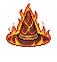 | **Embercrown of the Pyre** | A ornate helmet wreathed in dancing flames of orange and deep red. The crown features sharp, flame-like protrusions rising from the rim, with a warm golden core beneath flickering embers. Crafted to resemble molten metal frozen mid-burn. | *Forged in the heart of a dying star, this crown whispers of ash and ruin to those who dare wear it. The wearer's thoughts grow as volatile as the flames that crown their brow.* | Samurai, Mage, Archer, Warrior |
| 2 |  | **Grimwood Coronet** | A ornate bronze helmet with a distinctive pointed crest. Features deep crimson accents and weathered copper plating. The face guard displays intricate angular patterns with a haunting, mask-like appearance. Dark patina suggests ancient forging. | *Once worn by a forgotten warlord whose name the earth itself refused to remember. Those who don it feel the weight of countless vanquished foes pressing upon their brow.* | Samurai, Mage, Archer, Warrior |
| 3 | 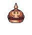 | **Embercrown of the Fallen** | A burnished bronze helmet with a distinctive rounded dome crowned by a small flame-like ornament. Warm amber and copper tones dominate the piece, with decorative ridges suggesting layered metalwork. The interior glows faintly with an otherworldly ember-red luminescence. | *Forged in the dying embers of a forgotten kingdom, this crown-helm whispers of rulers consumed by their own ambitions. Those who wear it inherit both their dominion and their curse.* | Samurai, Mage, Archer, Warrior |
| 4 |  | **Thornscale Helm** | A wickedly spiked helmet forged from burnished bronze and dark iron. Sharp, barbed protrusions crown the surface in a jagged pattern, reminiscent of thorns or scales. The color palette shifts between warm copper tones and deep shadowy browns, with intricate detailing suggesting an otherworldly craftsmanship. | *Forged in the dying embers of a cursed forge, this helm drinks in the light around it. Those who don it find their resolve hardened-and their mercy withered.* | Samurai, Mage, Archer, Warrior |
| 5 |  | **Crimson Coronet of Thorns** | A ornate helmet with a deep burgundy base adorned with golden accents and protruding thorned spikes. Four curved horn-like protrusions rise from the crown, each tipped with jeweled red stones that gleam menacingly. The face features symmetrical gold filigree patterns suggesting an ancient, regal design. | *Born from the blood of tyrants and forged in forgotten temples, this crown whispers of dominion over lesser mortals. Those who wear it feel the thorns drinking deeply from their ambition, rewarding the worthy with unyielding resolve.* | Samurai, Mage, Archer, Warrior |
| 6 |  | **Witchpyre Helm** | A conical witch hat rendered in warm browns and tans with a darker band at its base. A small golden ornament adorns the peak. The fabric appears tattered at the edges with subtle shadowing suggesting depth and age. | *Once worn by a sorceress who bartered her sight for dominion over flame. Those who don this helm report whispers in the dark-whether blessing or curse remains unclear.* | Samurai, Mage, Archer, Warrior |
| 7 |  | **Moss-Worn Helm of Thorns** | A verdant helmet encrusted with creeping moss and gnarled thorns, featuring a rounded crown with organic protrusions. Moss-green patina dominates its surface, with dark brown woody growths intertwining across the surface. Small crimson accents peek through the overgrowth. | *Once worn by a forest sentinel lost to time, this helm has become one with the wilds themselves. It whispers of ancient vigils and slow decay, offering protection to those who walk between the living world and ruin.* | Samurai, Mage, Archer, Warrior |
| 8 |  | **Hollow Embercrown of the Fallen** | A ornate helmet with a prominent central crest, rendered in warm bronze and copper tones with darker shadow accents. The design features angular, commanding ridges and a stylized face plate with glowing amber eyes. Gold trim frames the structure with intricate geometric patterns. | *Forged in the pyres of a sunken dynasty, this crown drinks the essence of those who wear it. The eyes of the fallen still burn within-a warning to enemies and a burden to the wearer.* | Samurai, Mage, Archer, Warrior |
| 9 |  | **Grimspire Crown** | A jagged, obsidian-dark helmet with sharp, upward-pointing spikes arranged in a menacing crown formation. Deep crimson veins run through the black material, glowing faintly. The face guard features angular cheekbones and a stern, almost skull-like appearance with hollow eye sockets. | *Forged in the depths where ambition curdles into hunger, this crown whispers promises of dominion to those mad enough to wear it. The weight upon your brow is less steel than sorrow.* | Samurai, Mage, Archer, Warrior |
| 10 |  | **Embercrest Helm** | A pointed witch-hat style helmet with a dark navy base. The crown features bright orange and yellow flame motifs that flicker upward, suggesting living fire. A thin gold band encircles the base, with small ornamental details glinting along the brim. | *Forged in the dying embers of a sorcerer's pyre, this helm whispers warnings of approaching malice. Those who wear it find their mind sharpened by the lingering curse of its creation.* | Samurai, Mage, Archer, Warrior |
| 11 |  | **Voidwraith Helm** | A sleek, angular helmet rendered in icy blue and cyan tones. Its design features a sharp, pointed crest with ethereal wisps trailing from the crown. The faceplate glows with arcane energy, bordered by geometric patterns suggesting both technological and mystical origins. | *Forged in the depths where reality thins, this helm whispers of forgotten voids. Those who don it find their thoughts scattered like starlight, clarity purchased at the cost of sanity's fraying edges.* | Samurai, Mage, Archer, Warrior |
| 12 | 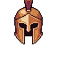 | **Grimscale Helm** | A bronze-gold helmet with a distinctive T-shaped visor and prominent nose guard. Deep crimson-red plating adorns the crown and cheeks, creating an intimidating visage. Ornamental ridges and metallic detailing suggest both ceremonial significance and brutal functionality. | *Forged in an age when tyrants ruled through fear, this helm drinks in the blood-light of dying suns. Those who don it claim to hear whispers of conquered kingdoms echoing within its hollow depths.* | Samurai, Mage, Archer, Warrior |
| 13 |  | **Grimscale Coronet** | A rounded helmet with a warm bronze-orange hue, featuring a distinctive ridged crown and dark crimson face guard. Two amber-toned protrusions flank the sides, suggesting scales or horns. The design is compact and imposing, with a weathered metallic sheen. | *Forged in the embers of a fallen empire, this helm drinks in the fear of those who gaze upon it. Its scales remember the wars of ages past, and wearing it grants you their bitter wisdom.* | Samurai, Mage, Archer, Warrior |
| 14 |  | **Thornwood Crown** | A ornate helmet crafted from deep crimson and forest green materials, adorned with thorny, leaf-like protrusions that crown the top. Golden accents frame the design, creating an appearance both regal and menacing, suggesting thorny natural growth fused with metalwork. | *Forged in the blood-soaked glades where nature devours all kingdoms, this crown whispers of ancient pacts between man and the thorn. Those who don it find their mind entangled with primal hunger.* | Samurai, Mage, Archer, Warrior |
| 15 |  | **Storm Thornwood Crown** | An ornate helmet crafted from gnarled, dark wood with twisted branches forming a jagged crown. Moss and fungi cling to its surface, glowing faintly with bioluminescent spores. Gold-threaded vines wrap around the framework, and a single amber gemstone sits at the center. | *Born from the heart of an ancient forest consumed by shadow, this crown whispers of primordial rot and rebirth. Those who wear it feel the forest's hunger coiling through their thoughts, promising power at the cost of their humanity.* | Samurai, Mage, Archer, Warrior |
| 16 |  | **Emberhusk Coronet** | A copper-bronze helmet with a rounded crown adorned with ornate metalwork. The face features a distinctive reddish-brown patina with decorative ridges. Small curved horns or protrusions flank the sides, and the overall design suggests ancient craftsmanship with a weathered, burnished finish. | *Forged in the dying embers of a forgotten civilization, this helm whispers of kingdoms long consumed by ash. Those who wear it bear the weight of ages upon their brow, their vision clouded by visions of cinders and ruin.* | Samurai, Mage, Archer, Warrior |
| 17 | 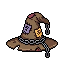 | **Grimfeather Helm** | A dark leather helmet adorned with tattered black feathers and bronze metalwork. The crown features an angular, corvid-like silhouette with hollow eye sockets that glow faintly amber. Weathered straps and occult sigils mark the sides. | *Once worn by a raven-god's chosen, this helm whispers prophecies of death to those who dare listen. Its feathers drink the shadows around you, rendering despair as armor.* | Samurai, Mage, Archer, Warrior |
| 18 | 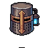 | **Grimbound Casque** | A sturdy bronze helmet with dark leather straps and copper accents. The front plate features an austere, angular design with shadowed eye recesses. A single blue gemstone or crystal is set into the crown, glowing faintly against the weathered metal. | *Forged in an age when steel remembered suffering, this helm grants those who wear it a measure of the resolve that bound the old kingdoms together. The blue eye watches still, even in darkness.* | Samurai, Mage, Archer, Warrior |
| 19 | 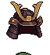 | **Hollowveil Helm** | A dark bronze helmet with swept-back horns and an ornate winged crest. The faceplate features a prominent nose guard and cheek plates with intricate ridged patterns. Deep shadows pool beneath the eyeholes, suggesting an ancient, weathered metalwork. | *Forged in an age of forgotten wars, this helm drinks in light as readily as it sheds blows. Those who wear it claim to hear whispers from the void beneath.* | Samurai, Mage, Archer, Warrior |
| 20 | 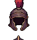 | **Crimson Marrow Helm** | A deep burgundy helmet with a prominent central crest, featuring ornate metalwork and a polished spherical crown. Dark crimson plating with shadowed recesses creates an imposing silhouette. The design suggests both nobility and occult purpose. | *A relic of forgotten nobility, this helm pulses with the faint warmth of pooled blood. Those who don it claim to hear whispers of the countless souls crushed beneath its weight.* | Samurai, Mage, Archer, Warrior |
| 21 |  | **Emberveil Circlet** | A ornate helmet with a dark metallic base adorned with glowing orange-gold accents. Features a prominent crest or plume extending upward, with swirling flame-like motifs. The design suggests ancient craftsmanship with mystical energy coursing through its grooves. | *Forged in the dying embers of a forgotten civilization, this helm whispers of power long sealed away. Those who don it feel the weight of centuries pressing against their mind, and glimpse fleeting visions of ash and ruin.* | Samurai, Mage, Archer, Warrior |
| 22 |  | **Grimscout's Helm** | A rounded bronze helmet with a distinctive wide brim and reinforced crown. Warm copper tones with darker patina streaks suggest ancient craftsmanship. A subtle crest detail runs along the dome, with small rivets visible throughout the weathered surface. | *Forged in an age when scouts ventured into lightless places, this helm's design speaks of practicality and dread. Those who wear it find their senses sharpened, though some report hearing whispers from the dark they've already traversed.* | Samurai, Mage, Archer, Warrior |
| 23 | 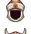 | **Grimveil Helm** | A bronze or copper-toned helmet with a distinctive open-faced design. Features a prominent nose guard and cheek protections, with a dark shadowed interior suggesting depth. The metallic surface shows warm earthy tones with possible verdigris patina, giving it an aged, weathered appearance. | *Forged in an age when shadows held dominion, this helm was worn by those who stared into the abyss without flinching. Its hollow depths seem to swallow light itself, offering protection to those willing to embrace the dark.* | Samurai, Mage, Archer, Warrior |
| 24 |  | **Hollow Embercrown of the Fallen** | A rounded helmet with a deep burgundy-brown patina, adorned with a prominent golden crest or ornament at its apex. The metalwork shows aged copper tones with dark crimson accents. A single pale circular motif or eye-like symbol marks the center front, suggesting ancient craftsmanship or arcane inscriptions. | *Once worn by a tyrant whose empire turned to ash. This helm whispers of dominion lost and power eternally smoldering-those who don it inherit both its protection and the weight of forgotten sins.* | Samurai, Mage, Archer, Warrior |
| 25 |  | **Emberveil Crown** | A golden helmet with an ornate crest featuring warm amber and orange hues. The crown displays intricate metalwork with flame-like patterns etched across its surface. A glowing ember-orange gem sits centered on the forehead piece, casting flickering light. | *Forged in the depths of a dying star, this crown whispers of forgotten empires consumed by their own ambition. Those who wear it feel the weight of ancient fire burning just beneath their skin.* | Samurai, Mage, Archer, Warrior |
| 26 |  | **Crown of the Hollowed** | An ornate blue-gemmed crown with pointed spires and a dark jeweled center piece. The crown features symmetrical crystalline protrusions that glow faintly, set upon a rich indigo base with intricate metalwork details. | *A relic of forgotten nobility, this crown whispers of a throne consumed by shadow. Those who wear it carry the weight of a kingdom that never was-and perhaps, never should have been.* | Samurai, Mage, Archer, Warrior |
| 27 |  | **Crimson Lotus Crown** | A ornate pink helmet with a flower-like crown design. The central bloom features sharp, petal-like protrusions in magenta and rose tones. A dark obsidian jewel sits at its heart, contrasting the vibrant coloring. | *A crown bloomed from the blood of ancient sorcerers, its petals unfold to reveal dominion over both flesh and shadow. Those who wear it feel the whispers of a thousand witches coiled within their mind.* | Samurai, Mage, Archer, Warrior |
| 28 |  | **Voidborn Grimscale Helm** | A dark reddish-brown helmet with a distinctive angular crest resembling scaled armor. Features sharp, geometric protrusions along the crown and sides, with a narrow eye slit revealing an eerie glow beneath. The surface appears weathered and etched with ancient runes. | *Forged in ages past by those who walked between shadow and flame, this helm whispers of forgotten wars. Those who don it find their senses sharpened, yet their humanity grows distant with each wearing.* | Samurai, Mage, Archer, Warrior |
| 29 |  | **Shadowpeak Helm** | A dark helmet with a pointed, mountain-like crown. Deep emerald and black coloring with a shadowy aura. Features a narrow eye slit and ornate detailing suggesting an ancient, otherworldly design. | *Forged in the depths where light fears to tread, this helm grants the wearer a fragment of the abyss's own concealment. Those who don it find shadows clinging to them like old companions.* | Samurai, Mage, Archer, Warrior |
| 30 | 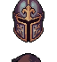 | **Ember Grimscale Coronet** | A dark iron helmet with ornate gold filigree forming a cross pattern on the crown. Deep burgundy gemstones are embedded at cardinal points. The metal has a scaled, textured finish with shadowy undertones, suggesting ancient craftsmanship. | *Forged in an age when gods still walked among mortals, this helm channels the will of those who refuse to break. Each wearer claims to hear whispers from the gems-whether blessing or curse remains unclear.* | Samurai, Mage, Archer, Warrior |
| 31 | 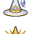 | **Solstice Crown** | A golden-yellow pointed helmet with a wide brim, featuring a prominent central crest. The crown displays celestial motifs with radiating lines suggesting divine light or solar imagery. The warm metallic tone contrasts with darker shadowing, giving it an otherworldly, regal appearance. | *Forged in an age when the sun still held dominion over shadow, this crown whispers of forgotten epochs and kingdoms turned to dust. Those who wear it carry the burden of radiance-a beacon to both salvation and ruin.* | Samurai, Mage, Archer, Warrior |
| 32 |  | **Embercrown Helm** | A rounded bronze helmet with a distinctive orange-gold gradient that deepens toward the base. Features symmetrical ridged patterns resembling heat waves or flame motifs. A narrow horizontal visor opening and subtle metallic sheen suggest ancient craftsmanship. | *Forged in the dying light of a fallen empire, this helm radiates an inexplicable warmth. Those who wear it claim to hear whispers of ash and ancient glory burning just beyond perception.* | Samurai, Mage, Archer, Warrior |
| 33 | 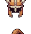 | **Ancient Grimscale Helm** | A bronze-toned helmet with a distinctive ridged crest and angular cheek guards. The design features sharp, overlapping scales or plating that give it an insectoid appearance. Dark weathered patina covers the surface, with hints of corrosion suggesting ancient origins. | *Forged in an age of forgotten wars, this helm was worn by those who descended into depths best left undisturbed. Its scales whisper of things that should remain buried.* | Samurai, Mage, Archer, Warrior |
| 34 |  | **Crimson Witch's Helm** | A pointed red witch's hat with a wide brim, featuring a dark green band around its base. The cone tapers upward with subtle texture details, rendered in dark red and burgundy tones against a plain background. | *A relic of those who consorted with forces beyond the veil. The crimson cloth drinks in sorrow, whispering old hexes to those bold-or foolish-enough to wear it.* | Samurai, Mage, Archer, Warrior |
| 35 |  | **Forsaken Emberveil Crown** | A regal helmet with a distinctive golden crown atop a dark purple base. The crown features sharp, flame-like points in warm gold tones. Purple fabric or material drapes from the sides, creating an imposing silhouette against the dark background. | *Once worn by a tyrant whose ambitions burned brighter than his wisdom. The crown whispers of forgotten power, each spike a monument to pride turned to ash.* | Samurai, Mage, Archer, Warrior |
| 36 |  | **Grimscale Crown** | A dark, imposing helmet with burgundy and black coloring. Features a prominent crest with sharp, downward-pointing spikes arranged in a menacing pattern. The face guard displays intricate detailing with shadowy undertones, suggesting scale-like textures across its surface. | *A helm worn by those who gazed too long into the abyss. Its spikes drink deep the blood of the fallen, whispering secrets only the damned can hear.* | Samurai, Mage, Archer, Warrior |
| 37 |  | **Nightshade Witch's Helm** | A pointed purple witch hat with a wide brim, rendered in pixel art. Features a distinctive tall conical crown in deep violet with darker purple shading. A small white triangular symbol or buckle adorns the front band. The brim casts a subtle shadow beneath. | *Woven from the midnight petals of flowers that bloom only in cursed soil, this hat whispers secrets of the abyss to those who dare wear it. Even the wisest minds find their thoughts clouded by its ancient, hungry presence.* | Samurai, Mage, Archer, Warrior |
| 38 | 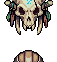 | **Crimson Thrall Helm** | A horned helmet with a deep burgundy and gold color scheme. Features two prominent curved horns sweeping upward, ornate gold filigree along the edges, and a dark metallic face guard with an unsettling expression. The crown section gleams with blood-red gemstones. | *Once worn by a tyrant whose ambitions consumed kingdoms. The helm whispers promises of dominion to those mad enough to listen, its crimson sheen never dulling-as if perpetually slick with the blood of the ambitious.* | Samurai, Mage, Archer, Warrior |
| 39 |  | **Shadowmere Helm** | A curved, obsidian-black helmet with a distinctive purple-tinted crown piece. The design features a sleek, rounded top with subtle metallic sheen and a narrow eye slit. The lower portions show deep indigo and violet hues, suggesting enchanted material or corrosion from dark magic. | *Forged in the depths where light fears to tread, this helm whispers of forgotten kingdoms and those who gazed too long into the abyss. To wear it is to invite the shadow's counsel.* | Samurai, Mage, Archer, Warrior |
| 40 |  | **Hollow Grimscale Coronet** | A dark burgundy-maroon helmet with a distinctive crown-like silhouette. Features two sharp, angular spikes or horns extending upward from the sides. The coloring suggests aged leather or corrupted metal with deep wine-colored tones throughout. | *A relic of forgotten nobility, steeped in the blood of ancient kings. Those who don this cursed crown find clarity in darkness, though whispers suggest it exacts a price paid in shadow.* | Samurai, Mage, Archer, Warrior |
| 41 | 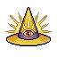 | **Emberveil Helm** | A golden helmet with a distinctive pointed crest and ornate ridged design. The crown features warm amber and bronze tones with intricate detailing. A dark visor or face guard spans the lower portion, creating an imposing, regal silhouette against the shadowed background. | *Forged in the dying embers of a forgotten dynasty, this helm channels the last warmth of a world growing cold. Those who wear it claim to hear whispers of ancient kings demanding tribute from the living.* | Samurai, Mage, Archer, Warrior |
| 42 |  | **Cursed Grimscale Crown** | A ornate helmet with a distinctive two-tiered design featuring burnt orange and deep crimson plating. The crown portion displays symmetrical ridge patterns resembling scales or feathers, with a central crest. Gold or bronze trim accents the upper segments. | *Once worn by a tyrant whose reign ended in ash and ruin. The scales remember every blow it turned aside, and those who don it inherit both its protection and the weight of its cursed legacy.* | Samurai, Mage, Archer, Warrior |
| 43 | 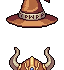 | **Embercrest Sombrero** | A wide-brimmed felt hat in burnt orange and deep brown, adorned with a curved feather plume. The crown features layered circular patterns suggesting scales or layered armor. A decorative curved mustache motif in gold embellishes the band. | *Once worn by a mercenary lord whose name has been swallowed by ash and time. The hat's strange geometry whispers of lands beyond the veil, where pride and ruin walk hand in hand.* | Samurai, Mage, Archer, Warrior |
| 44 |  | **Toadkin Bulwark** | A squat, rounded helmet with warty, fungal protrusions covering its surface. Rendered in murky greens and browns with a sickly yellow underbelly, resembling a swollen toad's head. Small horn-like growths jut from the crown. | *A helm born from the corpses of forgotten swamp things, its chitinous shell whispers of primordial decay. Those who wear it find their flesh toughened against the world's cruelty, though at the cost of their reflection.* | Samurai, Mage, Archer, Warrior |
| 45 |  | **Amethyst Witch's Crown** | A pointed purple witch hat with a wide brim, featuring a deep violet color with darker purple striping. The crown has a distinctive tall, conical peak and appears to be made of felt or cloth material with subtle magical undertones suggested by its rich hue. | *Once worn by a sorceress who bargained with things best left unnamed, this crown still hums with her lingering malice. Those who don it feel the weight of her unfulfilled pacts pressing against their mind.* | Samurai, Mage, Archer, Warrior |
| 46 |  | **Amethyst Wrath Helm** | A ornate helmet dominated by deep purple and violet hues, featuring a prominent gemstone or crystal crest at its center. The design shows symmetrical angular plating with darker shadowing, suggesting layered metalwork beneath the luminous purple exterior. | *Forged in the depths where amethyst veins run through blackened stone, this helm pulses with the fury of a thousand restless spirits. Those who wear it are said to hear whispers of the damned echoing through their thoughts.* | Samurai, Mage, Archer, Warrior |
| 47 | 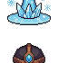 | **Storm Emberveil Helm** | A dark helmet with a prominent crest featuring symmetrical flame-like protrusions in deep crimson and gold. The face guard shows intricate geometric patterns suggesting molten metal. Wisps of ethereal light emanate from within, creating an ominous, otherworldly glow. | *Forged in the dying embers of a fallen god's pyre, this helm whispers secrets of immolation to those brave or foolish enough to don it. The wearer's vision burns with ancient rage.* | Samurai, Mage, Archer, Warrior |
| 48 |  | **Hollow Grimscale Helm** | A robust helmet with a distinctive blue-tinted metallic finish and dark accents. Features layered plating with a central crest, flanked by curved side guards. The design suggests scale-like segments arranged in overlapping rows, with a darker underbelly visible beneath. | *Forged from the hide of a creature long forgotten, this helm whispers of depths where light fears to tread. Those who wear it find their vision sharpened, though they often speak of seeing things that should remain unseen.* | Samurai, Mage, Archer, Warrior |
| 49 |  | **Ancient Grimscale Helm** | A dark, segmented helmet with overlapping scaled plating in deep indigo and charcoal. The crown features jagged ridges resembling a predator's spine. Metallic accents catch light along the cheekguards, with a subtle crimson undertone suggesting age or cursed patina. | *Forged in the depths where light fears to tread, this helm drinks in sorrow and exhales dread. Those who don it feel the weight of countless battles pressing against their skull.* | Samurai, Mage, Archer, Warrior |
| 50 | 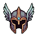 | **Cursed Grimscale Coronet** | A dark burgundy and bronze helmet with sharp, scaled ridges running along the crown. The face plate features angular cheekbones and a menacing expression, with deep crimson accents highlighting the eye sockets and jaw line. Intricate metalwork suggests ancient craftsmanship. | *Forged in an age of forgotten wars, this helm whispers of battles lost to time. Those who wear it claim to hear the screams of its previous masters echoing faintly in the darkness.* | Samurai, Mage, Archer, Warrior |
| 51 |  | **Veilbound Crown** | A dark blue helmet with a prominent crest featuring two curved horns or spikes. The design combines metallic plating with cloth or fabric wrapping. The color scheme is deep indigo with gold or bronze accents, giving it an otherworldly, mystical appearance. | *Forged in the depths where mortals fear to tread, this crown whispers of realms beyond sight. Those who don it feel the weight of forgotten oaths pressing against their mind.* | Samurai, Mage, Archer, Warrior |
| 52 | 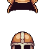 | **Voidborn Grimscale Coronet** | A distinctive helmet with a dual-peaked crown design in copper-bronze tones. The face features an ornate mask with symmetrical curved patterns and sharp, scale-like protrusions. Rich earth-brown coloring with metallic accents suggest ancient craftsmanship and weathered nobility. | *Once worn by a warlord whose name has been swallowed by ash and time. Those who don this helm claim to hear whispers of forgotten battles echoing within its hollow depths.* | Samurai, Mage, Archer, Warrior |
| 53 | 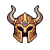 | **Shattered Grimscale Helm** | A layered helmet with dark metallic plating arranged in overlapping scale patterns. The color palette features deep bronze and charcoal tones with hints of crimson accents. A prominent crest or ridge runs along the crown, and the overall silhouette suggests both ornate craftsmanship and weathered age. | *Forged in the depths where ancient scales still gleam, this helm whispers of wars long forgotten. Those who don it feel the weight of countless fallen warriors settling upon their shoulders.* | Samurai, Mage, Archer, Warrior |
| 54 |  | **Crimson Apex Helm** | A pointed helmet with a sharp, triangular silhouette rendered in deep crimson and black. The design features a narrow, angular profile with stark geometric patterns and a small ornamental crest at its peak, suggesting ancient authority and malevolent purpose. | *A crown worn by those who have gazed too long into the abyss. Its crimson hue is said to shift with the wearer's darkest thoughts, a beacon for things that hunt in shadow.* | Samurai, Mage, Archer, Warrior |
| 55 |  | **Duskwarden's Cowl** | A pointed, tall helmet rendered in deep purple and indigo pixels. The crown features angular, jagged edges suggesting thorns or arcane spikes. A thin silver or white trim runs along the brim. The overall silhouette is mystical and foreboding, with a vaguely triangular pointed peak. | *A helm worn by sentries of forgotten twilight, its strange geometry whispers of wards long broken. Those who don it feel the weight of an ancient vigil, as if countless unseen eyes now peer through their own.* | Samurai, Mage, Archer, Warrior |
| 56 |  | **Nightshade Circlet** | A deep purple helmet with a wide-brimmed design, featuring a dark green mushroom or toadstool sprouting from its crown. The cap has an organic, otherworldly appearance with subtle ridges and a pale underside visible beneath the brim. | *Wrought from the chitin of creatures dwelling in lightless depths, this helm whispers of toxins and forgotten magics. Those who don it feel the weight of the abyss settle upon their shoulders.* | Samurai, Mage, Archer, Warrior |
| 57 |  | **Ancient Grimscale Helm** | A dark bronze helmet with angular, predatory lines suggesting scaled plating. Deep burgundy accents stripe the crown. The face guard features a menacing expression with sharp, protruding cheekbones. Ornate detailing adorns the upper ridge, giving it an aged, battle-worn appearance. | *Once worn by a warlord consumed by shadow, this helm whispers of countless fallen beneath its gaze. Those who don it feel the weight of ancient malice pressing against their thoughts.* | Samurai, Mage, Archer, Warrior |
| 58 |  | **Grimspike Crown** | A dark teal helmet with jagged, menacing spikes protruding from its crown. The metallic surface features sharp angular ridges and pointed protrusions in alternating shades of blue and black, creating an intimidating silhouette. Two prominent spikes flank the sides. | *Once worn by a tyrant whose name has been consumed by shadow, this spiked crown whispers of dominion over all who gaze upon it. Those who don it find their will hardened, though whether by blessing or curse remains unclear.* | Samurai, Mage, Archer, Warrior |
| 59 |  | **Forsaken Grimscale Helm** | A imposing helmet with a silvery-grey metallic finish and dark shadowing. Features angular, segmented plating with a distinctive ridge running down the center. The design suggests scaled or overlapping armor plates, giving it a reptilian quality. Weathered and battle-worn with a stoic, formidable appearance. | *Forged in the depths where forgotten kings ruled over stone and shadow, this helm whispers of countless battles and the weight of dominion. Those who wear it feel the gaze of something ancient watching through the visor's darkness.* | Samurai, Mage, Archer, Warrior |
| 60 | 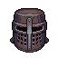 | **Voidborn Grimscale Helm** | A dark metallic helmet with an angular, menacing design. Deep purple and black tones dominate the piece, with sharp ridges forming a crown-like structure. The faceplate features intricate scale-like patterns arranged in horizontal bands, giving an otherworldly, reptilian appearance. | *Forged in the depths where light fears to tread, this helm whispers of ancient covenants and forgotten wars. Those who don it find their resolve hardened, though some say they hear the scales shifting in the darkness.* | Samurai, Mage, Archer, Warrior |
| 61 | 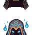 | **Shattered Emberveil Helm** | A dark, ornate helmet with a distinctive blue-glowing visor and intricate metalwork. The crown features sharp, angular ridges in deep crimson and obsidian tones. Mystical blue light emanates from within, casting an ethereal glow across the curved surfaces. | *Forged in the depths where embers dance with shadow, this helm grants the wearer clarity in darkness-though some say it reveals truths meant to stay hidden. Those who don it report visions of flame and ancient sorrows.* | Samurai, Mage, Archer, Warrior |
| 62 | 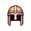 | **Emberveil Coif** | A rounded helmet with warm bronze and rust-red coloring. Features horizontal segmented plating with darker striped bands, resembling layered metal. A small ornamental crest or ridge runs down the center, with subtle gold-toned trim accents. | *Forged in dying embers, this helm whispers of ancient forges and fallen kingdoms. Those who wear it find their vision sharpened by ash and flame, though the metal never cools.* | Samurai, Mage, Archer, Warrior |
| 63 | 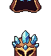 | **Storm Emberveil Helm** | A ornate helmet featuring a deep indigo-blue base with glowing amber accents. Gold trim frames the eye-holes and crown ridge. An ethereal teal aura surrounds the upper section, suggesting otherworldly enchantment. The design merges martial craftsmanship with arcane resonance. | *Forged in the heart of a dying star and quenched in shadow, this helm grants its wearer sight beyond mortal ken. Those who don it find their perception fractured between worlds-a blessing and a curse in equal measure.* | Samurai, Mage, Archer, Warrior |
| 64 | 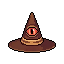 | **Emberveil Coronet** | A pointed, ornate helmet with deep crimson and gold striping. The crown features angular ridges and arcane symbols etched across the surface. A mystical blue-purple aura emanates from within, visible through narrow eye slits. The metal appears both ancient and otherworldly. | *Forged in the dying embers of a sorcerer's tower, this crown whispers secrets of forgotten magic to those bold enough to wear it. Those who don it report visions of their own unmaking.* | Samurai, Mage, Archer, Warrior |
| 65 |  | **Ancient Emberveil Circlet** | A ornate golden helmet with a prominent central crest, featuring warm amber and bronze tones. The design includes decorative ridges and a jeweled centerpiece that glows with inner fire. The base shows intricate metalwork with dark shadowing. | *Once worn by a pyromancer whose ambitions outpaced mortality itself. The circlet still radiates with the dying embers of forbidden knowledge, granting its wearer fragments of sight beyond the veil.* | Samurai, Mage, Archer, Warrior |
| 66 |  | **Crimson Thane Helm** | A deep burgundy helmet with ornate gold trim and a distinctive central crest. The rounded crown features intricate metalwork with what appears to be a noble insignia or emblem. Gold accents frame the sides, suggesting regal craftsmanship and aristocratic origins. | *Once worn by a forgotten lord whose name was swallowed by shadow and time. Those who don this helm inherit not honor, but the weight of a cursed legacy-power bought at the price of their former self.* | Samurai, Mage, Archer, Warrior |
| 67 | 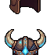 | **Tauric Dread Helm** | A horned helmet with curved bronze horns extending upward, featuring teal-blue plating across the crown and cheeks. Dark brown leather or metal base frames the face opening, with ornate detailing suggesting ancient craftsmanship. | *Once worn by forgotten lords who commanded the respect of beasts and men alike. The horns whisper of power corrupted, a warning to those who dare claim dominion over what should remain wild.* | Samurai, Mage, Archer, Warrior |
| 68 |  | **Voidborn Grimscale Coronet** | A dark teal and bronze helmet with a prominent central crest. The face features angular, scale-like plating arranged in overlapping rows, giving an aquatic yet menacing appearance. Golden trim adorns the edges, with a distinctive pointed apex rising from the crown. | *Forged in the depths where forgotten gods once slumbered, this crown of scales whispers secrets of drowned empires. Those who wear it find their resolve hardened, though at the cost of dreams filled with abyssal silence.* | Samurai, Mage, Archer, Warrior |
| 69 | 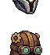 | **Grimvault Helm** | A bronze-gold helmet with an ornate crest, featuring teal and emerald jeweled inlays across the crown. The face plate displays intricate patterns with dark metalwork, accented by glowing green gemstones at the temples. Rich patina and ancient craftsmanship evident throughout. | *Forged in an age when gods still walked the earth, this helm channels the weight of forgotten kingdoms. Those who wear it claim to hear whispers from beyond the veil-whether blessing or curse, none can say.* | Samurai, Mage, Archer, Warrior |
| 70 | 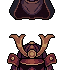 | **Crimson Ossuary Crown** | A ornate helmet with a deep burgundy and black color scheme. Features curved, horn-like protrusions extending upward, adorned with bone-white accents and intricate detailing. The face plate displays a menacing visage with angular contours and a prominent central crest. | *Wrought from the crowns of forgotten tyrants, this helmet drinks in the blood of its wielder's foes. Those who don it find their will sharpened, yet hear whispers of the countless dead imprisoned within its cursed metal.* | Samurai, Mage, Archer, Warrior |
| 71 |  | **Crimson Thorn Crown** | A jagged, ornate helmet with deep crimson plating and dark burgundy accents. Sharp, thorn-like protrusions jut from the crown and sides. The faceplate features an intimidating angular design with a slight metallic sheen, suggesting both ancient craftsmanship and malevolent intent. | *A crown wrought from the blood of forgotten wars. Those who don it feel the weight of countless fallen upon their brow, granting them the resilience of the damned.* | Samurai, Mage, Archer, Warrior |
| 72 | 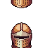 | **Emberveil Casque** | A rounded helmet with a warm copper-bronze finish, featuring ornate vertical ridges along the crown. Two small circular emblems glow faintly amber on the front plate. The lower face guard shows intricate geometric patterns in darker metal, with a subtle sheen suggesting ancient craftsmanship. | *Forged in the dying embers of a fallen empire, this helm pulses with residual heat from its creation. Those who wear it claim to hear whispers of the smiths who shaped it, their final breaths sealed within the metal.* | Samurai, Mage, Archer, Warrior |
| 73 |  | **Grimscale Cowl** | A bone-white helmet with a prominent skull face, featuring dark eye sockets and a pronounced jawline. The crown rises to a peaked point with segmented ridges. Weathered tan and grey tones dominate, suggesting ancient bone or weathered metal with skeletal motifs. | *Those who don this helm hear whispers of the forgotten dead. It grants clarity in darkness, but at the cost of remembering faces you've already laid to rest.* | Samurai, Mage, Archer, Warrior |
| 74 |  | **Cursed Emberveil Circlet** | A pointed, conical helmet rendered in deep purple with golden accents. Features a flame-like crest at its apex and ornate decorative bands around the base. The design suggests arcane origins with its mystical purple hue and elegant proportions. | *Forged in the dying embers of a forgotten sanctum, this circlet whispers of power long sealed away. Those who don it feel the weight of ancient magic pressing against their mind, neither blessing nor curse-merely inevitable.* | Samurai, Mage, Archer, Warrior |
| 75 | 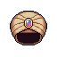 | **Forsaken Emberveil Helm** | A curved, angular helmet crafted from dark iron with prominent ridges. Deep crimson and burgundy gradients suggest heat-scorched metal. The design features a sharp, downward-pointed visor and decorative side flanges that taper to cruel points, evoking both samurai and demonic aesthetics. | *Forged in the dying embers of a conquered empire, this helm whispers of subjugation and ash. Those who wear it find their will sharpened, though at the cost of an ever-present hunger.* | Samurai, Mage, Archer, Warrior |
| 76 |  | **Voidborn Grimscale Helm** | A weathered brown leather helmet adorned with dark scaled plating across the crown and sides. A prominent crest or ridge runs down the center, with what appears to be tarnished bronze or iron reinforcements. The face guard features a subtle menacing expression, crafted from aged materials. | *Once worn by those who descended into lightless depths, this helm carries the weight of forgotten sorrows. The scales whisper of things better left unseen.* | Samurai, Mage, Archer, Warrior |
| 77 |  | **Emberveil Horns** | A stylized helmet featuring two prominent curved horns in burnt orange and gold, with intricate blue and teal geometric patterns across the face plate. The design suggests demonic influence with sharp angular details and ornamental ridge work. | *A relic of forgotten conquest, this horned crown channels the rage of ancient beasts. Those who wear it find their will hardened against the darkness-or corrupted by it.* | Samurai, Mage, Archer, Warrior |
| 78 | 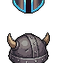 | **Grimhorn Helm** | A sturdy iron helmet with two prominent curved horns extending upward. Dark gray-blue metal plating with angular, menacing design. The face guard features a stern expression with defined cheekbones. Gold or brass accents visible along the rim and horn bases. | *Forged in the depths of a fallen empire, this helm channels the wrath of beasts long extinct. Those who wear it find their resolve hardened, though some whisper of the horns' hunger for battle.* | Samurai, Mage, Archer, Warrior |
| 79 |  | **Storm Embercrest Helm** | A faceted helmet with a prominent central crest of sharp, angular spikes in deep crimson and gold. The base features a dark metallic sheen with ornate geometric patterns. A mystical blue-green gem glows at its core, casting an eerie light across the jagged crown. | *Forged in the depths of a fallen empire, this helm channels the rage of forgotten gods. Those who don it feel the weight of countless wars pressing against their mind-power and madness separated only by will.* | Samurai, Mage, Archer, Warrior |
| 80 |  | **Hollow Emberveil Casque** | A dark iron helmet with a distinctive burnt-orange and crimson gradient finish. The design features a rounded crown with curved side plates and a prominent central ridge. Glowing amber accents line the visor and temples, suggesting contained embers within the metal itself. | *Forged in the volcanic depths of a dying realm, this helm radiates residual heat from an age of cinders. Those who wear it carry the weight of smoldering wrath-a constant reminder that some fires never truly extinguish.* | Samurai, Mage, Archer, Warrior |
| 81 | 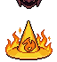 | **Ancient Embercrown of the Fallen** | A golden-orange helmet with flame-like ridges radiating upward from the crown. The metal glows with an intense amber hue, as if perpetually burning from within. Sharp, jagged peaks frame the top, resembling roaring fire frozen in metal. | *Forged in the heart of a dying star, this helm whispers of kingdoms consumed by their own ambition. To wear it is to court the flame that devours all.* | Samurai, Mage, Archer, Warrior |
| 82 | 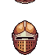 | **Grimveil Casque** | A sturdy rounded helmet with a warm copper-bronze finish. The front features a distinctive cross or plus-shaped motif in darker metal, suggesting protective runes or a sealed visor. The dome shape tapers slightly toward the crown, with subtle ridges for reinforcement. | *Forged in an age of forgotten wars, this helm bears the mark of a protective sigil said to ward against hexes and despair. Those who don it feel the weight of ancient vigilance settle upon their shoulders.* | Samurai, Mage, Archer, Warrior |
| 83 |  | **Forsaken Embercrown of the Fallen** | A ornate golden helmet with a prominent crest featuring crimson and orange gemstones arranged in a flame-like pattern. The crown rises to a sharp peak adorned with glowing red jewels, while the base features intricate metalwork with darker accents suggesting age and battle wear. | *Once worn by a tyrant whose ambitions burned brighter than the sun itself. Now its cursed radiance whispers of empires turned to ash, promising power to those bold-or foolish-enough to claim it.* | Samurai, Mage, Archer, Warrior |
| 84 |  | **Voidborn Grimscale Helm** | A bronze-toned helmet with an ornate crest featuring layered, scale-like plating. Dark amber and bronze coloring creates a weathered, ancient appearance. The design suggests both protection and primal power, with a sturdy construction befitting seasoned warriors. | *Forged in ages past by craftsmen whose names have turned to dust, this helm bears the weight of countless battles. Those who don it feel the gaze of something old watching from within its depths.* | Samurai, Mage, Archer, Warrior |
| 85 |  | **Shattered Grimscale Cowl** | A rounded helmet with a deep burgundy and obsidian color scheme. The surface appears textured like scales or chitin, with a smooth crown that tapers slightly. Dark crimson accents highlight the edges, suggesting an organic, almost insectoid design. | *A helm born from the carapace of something ancient and terrible. Those who don it whisper of visions glimpsed in the dark-fragments of a world that was, before the light failed.* | Samurai, Mage, Archer, Warrior |
| 86 |  | **Grimveil Sorcerer's Cap** | A tall, pointed wizard's hat rendered in dark gray and charcoal tones. The brim curves slightly downward with a subtle ridge. A faint silver or metallic band wraps around the crown. The fabric appears woven and slightly tattered at the edges, suggesting age and arcane use. | *Once worn by a hedge sorcerer who bartered their sanity for forbidden knowledge. The hat whispers with voices that may or may not be your own.* | Samurai, Mage, Archer, Warrior |
| 87 |  | **Bonelace Helm** | A skeletal helmet with a golden/brass reinforced frame. The skull features intricate bone-white coloring with dark eye sockets and nasal cavity. Ornate metallic bands wrap around the cranium, suggesting both protection and ancient craftsmanship. Subtle glowing details hint at otherworldly properties. | *Once worn by a lich-lord whose name has been swallowed by time, this helm whispers fragments of forgotten incantations to those brave-or cursed-enough to don it. The bones remember what flesh cannot.* | Samurai, Mage, Archer, Warrior |
| 88 | 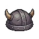 | **Hollow Grimscale Cowl** | A conical helmet rendered in dark gray stone or iron with a textured, scale-like surface. The pointed crown tapers sharply upward, while the lower sections feature overlapping geometric patterns suggesting layered armor plating. Small angular protrusions dot the surface, creating an intimidating, almost reptilian appearance. | *Forged in the depths where stone meets shadow, this helm drinks in the light of the world. Those who wear it find their thoughts grow distant, as if something older stirs behind their eyes.* | Samurai, Mage, Archer, Warrior |
| 89 |  | **Grimhorn Visage** | A dark bronze helmet featuring two prominent curved horns sweeping upward. The face plate is angular and menacing with a narrow eye slit. Intricate metalwork adorns the cheeks, suggesting ancient craftsmanship. The overall silhouette is imposing and demonic. | *Forged in an age when gods walked among mortals, this helm channels the primal fury of forgotten beasts. Those who wear it find their resolve hardened, yet whisper of voices that are not their own.* | Samurai, Mage, Archer, Warrior |
| 90 |  | **Duskwarden's Helm** | A dark metallic helmet with a deep indigo and purple color scheme. Features prominent angular ridges and a sleek, downward-swept visor. Two small pointed protrusions flank the crown, suggesting both menace and nobility. The surface has a polished, almost opalescent sheen. | *Forged in the twilight forges of a forgotten age, this helm drinks in the darkness around it. Those who don it feel the weight of ancient watchfulness settle upon their shoulders, as if the helm itself remembers guarding something far greater than mortal concerns.* | Samurai, Mage, Archer, Warrior |
| 91 |  | **Forsaken Emberveil Helm** | A rounded copper-bronze helmet with warm orange-gold tones. Features a central vertical ridge and symmetrical side panels. The metal shows a weathered, burnished finish with deep ochre accents suggesting age and elemental exposure. | *Forged in the dying embers of a forgotten age, this helm pulses with residual heat-a whisper of the infernos from which it was born. Those who don it feel watched by ancient eyes, as if the metal itself remembers the flames that shaped it.* | Samurai, Mage, Archer, Warrior |
| 92 | 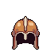 | **Voidborn Emberveil Helm** | A rounded bronze helmet with a distinctive burnt-orange gradient. The crown features angular ridges and ornamental plating. A dark central visor dominates the face, with subtle gold trim along the edges and temples. | *Forged in the furnaces of a fallen empire, this helm still radiates the heat of its creation. Those who don it feel the weight of ancient conquest settling upon their shoulders.* | Samurai, Mage, Archer, Warrior |
| 93 |  | **Grimveil Coronet** | A rounded helmet with a deep burgundy-brown metal construction. Features ornate golden trim along the edges and a central vertical ridge. The face plate has a distinctive brown leather or fabric covering with two small circular eye openings, giving it an austere, mask-like appearance. | *Once worn by a despot whose name has been erased from history, this helm emanates an aura of forgotten power. Those who don it find their resolve hardened, though whispers of its previous master's cruelty echo faintly in the darkness.* | Samurai, Mage, Archer, Warrior |
| 94 |  | **Crimson Throne Helm** | A ornate burgundy and gold helmet with a distinctive crown-like crest. Rich crimson fabric drapes from the sides, adorned with golden embellishments and dark gemstones. The crown features sharp, angular peaks suggesting ancient royalty or dark majesty. | *Once worn by a tyrant whose reign drowned kingdoms in blood. The helmet whispers of dominion and refuses to be forgotten, its crimson depths promising power to those mad enough to claim it.* | Samurai, Mage, Archer, Warrior |
| 95 |  | **Bullhorn Visage** | A robust horned helmet with curved, imposing bronze horns sweeping upward. The face guard features warm copper and deep brown tones with a weathered patina. Intricate detailing adorns the crown, suggesting ancient craftsmanship and ritualistic significance. | *Once worn by forgotten chieftains who communed with spirits of earth and storm. Those who don this helm find their will hardened, though whispers suggest the horns remember their old masters.* | Samurai, Mage, Archer, Warrior |
| 96 |  | **Starweaver's Cowl** | A deep indigo conical hat adorned with celestial embroidery. Silver star patterns cascade across the fabric, with a prominent crescent moon symbol at its peak. The base is trimmed in pale blue thread, creating an ethereal, enchanted appearance. | *Woven from the dreams of fallen astrologers, this hat whispers forgotten constellations to those who dare listen. Stars do not guide the lost-they consume them.* | Samurai, Mage, Archer, Warrior |
| 97 |  | **Ancient Grimscale Helm** | A formidable helmet with a dark metallic finish, featuring intricate geometric patterns and riveted plating. The crown displays prominent ridges and an ornate crest with glowing amber accents. Angular side plates flare outward, adorned with symbolic markings suggesting ancient craftsmanship. | *Forged in the depths of a forgotten age, this helm bears the weight of countless battles. Its amber-lit visage watches eternally, a sentinel against the encroaching dark.* | Samurai, Mage, Archer, Warrior |
| 98 | 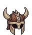 | **Horned Tyrant's Crown** | A bronze-brown helmet adorned with two large curved horns sweeping upward. The face guard features angular, aggressive lines with a dark interior shadow. Ornate metal plating covers the sides, with a weathered patina suggesting ancient craftsmanship and countless battles. | *Forged in an age of forgotten kingdoms, this crown was worn by warlords who commanded through fear and dominion. Those who don it feel the weight of tyranny settling upon their shoulders-a burden only the strongest can bear.* | Samurai, Mage, Archer, Warrior |
| 99 |  | **Hollowveil Skull Helm** | A dark purple and black helmet shaped like a stylized skull with prominent eye sockets and a defined jawline. The surface features shadowy gradients and a ghostly purple glow emanating from within, giving it an ethereal, haunted appearance. | *Once worn by a forgotten tyrant whose name was erased from history itself. Those who don this helm feel the weight of countless souls pressing against their consciousness, neither alive nor truly dead.* | Samurai, Mage, Archer, Warrior |
| 100 | 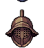 | **Ironbound Grimhelm** | A heavy, angular helmet forged from dark iron bands bound in a cross-hatched lattice pattern. Bronze or brass accents frame the visor opening. The crown features a prominent central ridge, with intricate geometric engravings catching dim light across its surface. | *Wrought in an age of endless warfare, this helm has weathered countless blows. Those who don it claim to hear whispers of fallen soldiers echoing within its iron confines.* | Samurai, Mage, Archer, Warrior |
