# Mantles — Item Catalog

> **Category:** Mantle  
> **Total items:** 100  
> **Classes:** Mage, Archer

| # | Preview | Item Name | Visual Description | Description | Classes |
|:-:|:-------:|:----------|:------------------|:------------|:--------|
| 1 |  | **Veilstorm Mantle** | A deep indigo hooded cloak with swirling ethereal patterns. The fabric appears to shimmer with arcane energy, displaying cascading star-like sparkles across its surface. Sharp angular edges frame the hood, suggesting otherworldly craftsmanship. | *Woven from the threads of a shattered sky, this mantle whispers of forgotten incantations with every step. Those who don it feel the weight of distant storms settle upon their shoulders—a burden and a blessing alike.* | Mage, Archer |
| 2 | 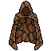 | **Shadowweave Mantle** | A tattered cloak of deep brown and black woven fabric, adorned with intricate embroidered patterns along the edges. The garment appears aged and weathered, with hints of gold threading throughout. The hood is prominent and slightly ragged, suggesting ancient craftsmanship. | *Woven from the hides of creatures that dwell in lightless places, this mantle whispers of forgotten rites and forbidden knowledge. Those who don it find themselves cloaked not merely in shadow, but in the very absence of certainty.* | Mage, Archer |
| 3 | 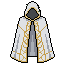 | **Veilweaver's Shroud** | A flowing mantle of muted grey and cream fabric with an asymmetrical cut. The garment drapes elegantly from broad shoulders, featuring subtle vertical striping and a layered hemline. A dark triangular clasp or fastening adorns the neckline, giving it an arcane appearance. | *Woven from the twilight between worlds, this mantle grants its bearer the ability to slip between sight and shadow. Those who don it find their presence becomes as insubstantial as morning mist—favored by those who deal in secrets and sorcery.* | Mage, Archer |
| 4 | 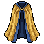 | **Duskwarden's Mantle** | A flowing shoulder cape with deep navy blue fabric and golden trim along the edges. The garment features vertical gold striping down the center and layered construction that creates depth. Rich, luxurious material with elegant draping suggests arcane significance. | *Woven from the twilight hours themselves, this mantle once draped the shoulders of those who stood vigil between worlds. Those who wear it find the veil between magic and mortality growing perilously thin.* | Mage, Archer |
| 5 | 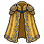 | **Goldweave Shroud** | A flowing mantle of deep amber and gold fabric with ornate golden trim along the edges. The garment features intricate woven patterns resembling arcane symbols, with vertical gold striping down the front. The shoulders are broad and draped, suggesting both nobility and mystical authority. | *Woven from threads spun in forgotten sanctums, this mantle hums with latent power. Those who don it find their connection to the weave strengthened, though at the cost of drawing the gaze of things best left unseen.* | Mage, Archer |
| 6 | 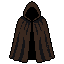 | **Shadowveil Mantle** | A flowing dark cloak rendered in deep charcoal and midnight black, with a high collar and billowing hem. The fabric appears heavy and draped, with subtle purple undertones suggesting arcane influence. Fine details suggest woven texture throughout. | *Woven from the twilight between worlds, this mantle drinks in light and exhales dread. Those who don it find themselves walking the knife's edge between visibility and shadow.* | Mage, Archer |
| 7 | 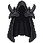 | **Veilshroud Mantle** | A billowing black cloak with jagged, wing-like shoulders that curve upward menacingly. The fabric appears woven from shadow itself, with tattered edges and an ethereal quality. Two pointed protrusions frame the wearer like dark plumage, suggesting otherworldly malevolence. | *Woven from the despair of forgotten realms, this mantle wraps the wearer in absolute darkness. Those who don it find themselves caught between worlds—neither fully present nor entirely absent.* | Mage, Archer |
| 8 | 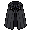 | **Shroud of the Void** | A flowing, tattered mantle of deep charcoal black with wispy, ethereal edges that fade into shadow. Draped asymmetrically, it features subtle dark purple undertones and appears woven from spectral fabric. Small, indistinct rune-like patterns shimmer faintly along the hem. | *A mantle spun from the darkness between worlds, its fabric whispers of forgotten incantations and lost rituals. Those who don it find themselves half-present, cloaked in the weight of ancient power.* | Mage, Archer |
| 9 | 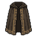 | **Ancient Shadowveil Mantle** | A tattered, floor-length cloak in deep charcoal and bronze. The fabric drapes asymmetrically with ragged edges, suggesting age and wear. Gold threading traces arcane symbols down the front panels. The collar stands high and rigid, embroidered with intricate dark patterns. | *Woven from the twilight between worlds, this mantle grants its wearer passage through shadows as easily as breath. Those who don it find themselves half-forgotten, perceived only in peripheral vision.* | Mage, Archer |
| 10 | 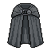 | **Shadowpall Mantle** | A flowing dark gray cloak with deep charcoal tones and subtle black striations throughout. The fabric appears heavy and layered, with a high collar and draped shoulders that suggest protective enchantment. The weave shows a faint metallic sheen at the edges. | *Woven from the twilight between worlds, this mantle drinks in light and whispers secrets to those who dare wear it. The shadows it casts linger longer than they should.* | Mage, Archer |
| 11 |  | **Frostweave Mantle** | A flowing blue-grey cloak with crystalline frost patterns. Ethereal wisps emanate from its edges, suggesting an aura of cold magic. The garment features layered fabric with icy geometric embroidery, giving it an otherworldly, shimmering appearance. | *Woven from threads that taste the void between stars, this mantle whispers of winters that swallowed kingdoms. Those who don it trade warmth for power—a pact written in crystalline frost.* | Mage, Archer |
| 12 |  | **Thornwood Shroud** | A moss-draped mantle of deep forest green and muted brown, adorned with gnarled wooden thorns and trailing vines. The fabric appears weathered and organic, with subtle golden thread embroidery woven throughout the shoulders and hem. | *Woven from the cursed vines of the Thornwood, this mantle whispers secrets of ancient forests to those who dare wear it. Those who don it feel the weight of centuries settle upon their shoulders, granting clarity at the cost of an unshakeable dread.* | Mage, Archer |
| 13 | 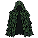 | **Shattered Shadowveil Mantle** | A tattered cloak of deep forest green and black, woven from what appears to be spectral threads. Wisps of ethereal fog coil around its hem, and the fabric seems to absorb light rather than reflect it. The shoulders are reinforced with dark, gnarled material resembling petrified wood or bone. | *Woven from the lingering essence of those lost between worlds, this mantle grants its wearer the gift of obscurity. Even the most vigilant eye struggles to track one cloaked in such profound shadow.* | Mage, Archer |
| 14 | 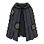 | **Ember Shadowpall Mantle** | A tattered dark cloak with a high collar, rendered in deep charcoal and black pixels. Frayed edges and wisps of fabric suggest ethereal decay. A subtle purple undertone glimmers at the hem, hinting at arcane corruption or otherworldly origin. | *Woven from the twilight between worlds, this mantle drinks in light and whispers forgotten incantations to those who wear it. Those shrouded in its folds walk as phantoms—seen yet unseen.* | Mage, Archer |
| 15 | 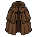 | **Storm Shadowveil Mantle** | A tattered cloak of deep brown and charcoal fabric, draped asymmetrically with ragged edges. Layered panels suggest age and wear, with darker cloth underneath peeking through tears. The silhouette is angular and ominous, reminiscent of folded wings or a predator's shadow. | *Woven from the hides of creatures that dwelt in sunless places, this mantle drinks in light and casts those who wear it in perpetual twilight. Some say it remembers the darkness it came from.* | Mage, Archer |
| 16 | 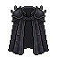 | **Hollow Shadowveil Mantle** | A tattered dark cloak with jagged, irregular hemline suggesting battle-worn fabric. Deep black coloring with hints of charcoal gray creates a silhouette that seems to absorb light. Frayed edges and asymmetrical draping give an otherworldly, spectral quality. | *Woven from the twilight between worlds, this mantle clings to its bearer like a living shadow. Those who don it find their presence grows thin, as if reality itself begins to forget them.* | Mage, Archer |
| 17 | 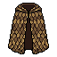 | **Thornweave Mantle** | A heavy cloak woven from deep brown and gold-threaded fabric, adorned with an intricate diamond lattice pattern. The garment features a distinctive angular silhouette with layered, asymmetrical panels that suggest arcane reinforcement or natural thorned growth. | *Woven from the hides of creatures long forgotten, this mantle whispers of secrets best left undisturbed. Those who don it find themselves cloaked not merely in fabric, but in the very essence of the wild places between worlds.* | Mage, Archer |
| 18 | 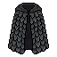 | **Cursed Shadowweave Mantle** | A flowing, dark cloak woven from midnight fabric with intricate quilted diamond patterns throughout. The material appears heavy yet ethereal, with subtle black-on-black detailing that catches light like raven feathers. The silhouette is voluminous and drapes downward, suggesting arcane weight. | *Worn by those who walk between worlds, this mantle drinks in the ambient light around its bearer. Whispers of forgotten incantations linger in its folds—a comfort to some, a curse to others.* | Mage, Archer |
| 19 | 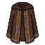 | **Forsaken Shadowweave Mantle** | A long, flowing cloak in deep brown and dark charcoal tones with vertical striping throughout. The fabric appears heavy and textured, gathered at the shoulders with a high collar. Subtle darker panels create an elegant silhouette, suggesting arcane craftsmanship and practical concealment. | *Woven from threads spun in moonless nights, this mantle drinks in light and whispers. Those who don it find themselves lingering at the edges of perception—neither truly hidden nor wholly seen.* | Mage, Archer |
| 20 | 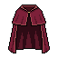 | **Crimson Veilcloak** | A flowing mantle rendered in deep maroon and burgundy hues with a rich, velvety texture. The fabric drapes heavily from broad shoulders, featuring subtle vertical ribbing and a high collar. Dark crimson undertones create depth, suggesting an ancient, blood-soaked material. | *Woven from the vestments of forgotten sorcerers, this mantle whispers of rituals long profaned. Those who don it find themselves cloaked not merely in fabric, but in the lingering dread of ages past.* | Mage, Archer |
| 21 | 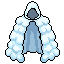 | **Shattered Frostweave Mantle** | A flowing cloak rendered in pale blue and white, adorned with crystalline frost patterns along the edges. The garment drapes elegantly from shoulder clasps, with wispy, ethereal details suggesting frozen mist. Dark shadowing creates depth, implying heavy, magical fabric. | *Woven from the breath of winter itself, this mantle grants its wearer the cold comfort of solitude. Those who don it find themselves drifting between worlds, shielded by ancient magic that remembers when frost was sacred.* | Mage, Archer |
| 22 | 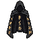 | **Ember Shadowveil Mantle** | A tattered black cloak with deep purple undertones, featuring a high collar that frames the shoulders. The fabric appears weathered and ancient, with subtle ethereal wisps or arcane symbols woven throughout. The garment drapes heavily, suggesting weight and dark enchantment. | *Woven from the shrouds of forgotten tombs, this mantle whispers secrets to those who dare wear it. Those cloaked in its folds find themselves caught between worlds—neither fully present nor entirely absent.* | Mage, Archer |
| 23 | 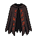 | **Ravenwing Mantle** | A tattered dark cloak with deep crimson accents bleeding through charred black fabric. Jagged, feather-like tears along the hem suggest wings mid-unfurl. Worn leather bindings reinforce the shoulders, and faint ember-orange patterns shimmer across the surface. | *Woven from the shadow of a dying star and stitched with sinew of forgotten things. Those who don this mantle walk between worlds, cloaked in an ancient hunger that feeds on fear itself.* | Mage, Archer |
| 24 | 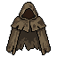 | **Shroudweaver's Mantle** | A tattered cloak of deep charcoal and forest green, adorned with weathered leather straps and bronze buckles. Torn edges fray into wispy shadows, while intricate embroidered patterns of thorns and arcane runes spiral across the shoulders. The fabric appears to shimmer faintly with otherworldly essence. | *Woven from the cloaks of forgotten hedge witches, this mantle carries the weight of spells cast in desperation. Those who don it find themselves cloaked not merely in fabric, but in the veil between worlds—where arrows fly truer and magic flows darker.* | Mage, Archer |
| 25 |  | **Goldenweave Shroud** | A flowing mantle of rich golden-yellow fabric with deep pleated folds. The garment features a high collar and drapes elegantly down the shoulders. Intricate golden embroidery or thread-work adorns the upper sections, suggesting arcane runes or celestial patterns woven throughout the heavy material. | *Woven from the silk of forgotten luminaries, this shroud whispers of forbidden knowledge with each step. Those who don it find their frailty masked by an aura of otherworldly grace—though some say the mantle remembers its previous bearers, their fates sewn into every thread.* | Mage, Archer |
| 26 | 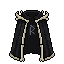 | **Cursed Shadowpall Mantle** | A tattered black cloak with jagged, asymmetrical edges that suggest decay or deliberate shredding. The fabric appears heavy and worn, with darker charcoal accents along the collar and shoulders. A high, pointed shoulder design gives it an imposing silhouette against the void-dark backdrop. | *Once draped upon a practitioner of forbidden arts, this mantle drinks in light itself. Those who wear it find the veil between worlds grown thin—a blessing and a curse in equal measure.* | Mage, Archer |
| 27 | 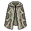 | **Forsaken Shadowweave Mantle** | A tattered cloak of deep emerald and charcoal with intricate woven patterns. The garment features layered fabric with darker undertones, worn edges, and subtle golden threading along the collar and hem, suggesting ancient craftsmanship. | *Woven from the threads of forgotten rituals, this mantle absorbs the very light around its wearer. Those who don it find themselves caught between worlds—neither fully seen nor entirely hidden.* | Mage, Archer |
| 28 | 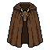 | **Voidborn Thornweave Mantle** | A flowing brown cloak with intricate woven patterns resembling thorns or brambles. The fabric appears aged and weathered, with darker striping throughout. The shoulders are broad and layered, suggesting protective enchantments woven into the material itself. | *Woven from the cursed fibers of the Thornwood, this mantle grants refuge to those who walk between worlds. Its thorny embrace whispers warnings of approaching danger, yet demands a price in suffering.* | Mage, Archer |
| 29 | 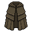 | **Shattered Shadowweave Mantle** | A dark, layered cloak with muted olive and charcoal tones. Heavy fabric drapes asymmetrically with visible stitching and worn edges. A prominent clasp or brooch secures the shoulders, with subtle texture suggesting age-worn wool or cursed cloth. | *Woven from the twilight between worlds, this mantle drinks in light and whispers secrets to those who wear it. Its previous owners left no trace of themselves behind—only shadows.* | Mage, Archer |
| 30 | 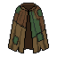 | **Shadowpine Drape** | A tattered mantle of deep forest green with dark brown accents. The fabric appears weathered and moss-covered, draped asymmetrically with frayed edges. Subtle patterns suggest ancient embroidery now faded by time, with a hint of skeletal imagery woven throughout. | *Woven from the boughs of trees that grew where sunlight feared to tread, this mantle whispers secrets of the deep forest. Those who don it find themselves embraced by shadow itself, as if the very darkness bends to their will.* | Mage, Archer |
| 31 |  | **Veilstitched Mantle** | A flowing purple cloak with intricate arcane embroidery along the edges. Dark indigo fabric is adorned with glowing violet patterns and symbols, suggesting woven magic. The garment features a high collar and billowing sleeves with mystical accents. | *Woven from the twilight between worlds, this mantle whispers forgotten incantations to those who wear it. Its threads hum with dormant power, a shield against both blade and curse.* | Mage, Archer |
| 32 | 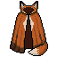 | **Embercinder Mantle** | A flowing shoulder mantle in burnt orange and deep brown, with asymmetrical draping. Features charred fabric edges and ember-like orange accents along the collar and hem, suggesting fire-touched material with a mysterious, aged quality. | *Woven from the cinders of a pyre long extinguished, this mantle whispers of sorcery and sacrifice. Those who don it feel the weight of forgotten rituals upon their shoulders.* | Mage, Archer |
| 33 | 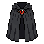 | **Veilweaver's Mantle** | A flowing black cloak with deep crimson inner lining, adorned with a prominent embroidered symbol on the chest. The fabric appears aged and ethereal, with subtle dark purple accents along the edges. A high collar frames the shoulders, giving an imposing silhouette. | *Woven from the twilight between worlds, this mantle once cloaked those who dared commune with forces beyond mortal ken. It whispers of forgotten pacts and the price of forbidden knowledge.* | Mage, Archer |
| 34 | 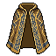 | **Goldweave Mantle** | A flowing cloak woven from rich golden-brown fabric with ornate embroidered patterns. The garment features layered draping with darker bronze accents along the edges and shoulders, suggesting aged silk or enchanted textile with intricate geometric designs. | *Woven in forgotten times by those who sought to pierce the veil between worlds, this mantle carries the weight of countless rituals. Its golden threads hum with latent power, a refuge for those who command magic or channel fate through distant arrows.* | Mage, Archer |
| 35 | 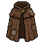 | **Forsaken Thornweave Mantle** | A tattered cloak of deep brown and rust-colored fabric, layered with aged leather panels. Intricate dark patterns resembling thorns or twisted vines cover the surface. The collar appears reinforced, with a mottled, weathered texture suggesting long exposure to shadow and decay. | *Woven from the hides of forgotten beasts and thread spun in lightless places, this mantle clings to its wearer like a living thing. Those who don it report whispers at the edge of hearing—warnings, perhaps, or threats yet to materialize.* | Mage, Archer |
| 36 | 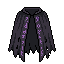 | **Veilwraith Mantle** | A tattered dark cloak with wispy, ethereal edges that seem to fade into shadow. The fabric appears black and deep purple with a weathered, aged texture. Torn edges hang irregularly, creating a ragged silhouette. The mantle has an unsettling, spectral quality. | *Woven from the essence of forgotten spirits, this mantle clings to its wearer like a second shadow. Those who don it find themselves caught between worlds—neither fully seen nor entirely hidden.* | Mage, Archer |
| 37 | 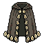 | **Shattered Shadowveil Mantle** | A tattered cloak of deep charcoal fabric adorned with metallic buckles and ornamental clasps down the front. Intricate embroidered patterns trace the edges in silver thread. The shoulders are slightly raised and structured, creating a dramatic silhouette with asymmetrical draping. | *Woven from the twilight between worlds, this mantle drinks in light and whispers secrets to those who wear it. Those touched by its embrace find the veil between sight and shadow growing perilously thin.* | Mage, Archer |
| 38 | 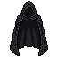 | **Ember Shadowweave Mantle** | A billowing black cloak with tattered edges, crafted from dark woven fabric. The mantle features an asymmetrical silhouette with deep shadows pooling in its folds. Wisps of darkness seem to cling to its surface, and the garment appears to absorb light rather than reflect it. | *Woven from the twilight between worlds, this mantle grants its wearer the gift of obscurity. Those who don it learn that true power often hides in plain sight, cloaked in shadow and silence.* | Mage, Archer |
| 39 | 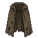 | **Storm Shadowweave Mantle** | A tattered cloak of deep charcoal fabric with jagged, asymmetrical edges. The material appears worn and frayed, adorned with darker patches suggesting age or ritual scarring. A high collar frames the shoulders, while wisps of ethereal wisps seem to cling to its surface. | *Woven from the threads of forgotten nightmares, this mantle clings to its bearer like a living shadow. Those who don it find themselves half-present in the world, caught between flesh and void.* | Mage, Archer |
| 40 | 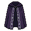 | **Hollow Veilweaver's Shroud** | A flowing dark purple mantle with deep indigo accents, featuring an asymmetrical drape. The fabric appears ethereal with subtle arcane patterns woven throughout. A high collar frames the shoulders, and wispy shadow-like tendrils seem to drift from the edges. | *Woven from the twilight between worlds, this mantle grants those versed in the arcane arts an unsettling grace. Whispers suggest it once belonged to a sorcerer who walked between dimensions, leaving only silence in their wake.* | Mage, Archer |
| 41 |  | **Veilwarden's Shroud** | A sweeping midnight-blue mantle with intricate silver arcane sigils woven throughout. The fabric appears to shift between deep indigo and black, with ethereal wisps trailing from the shoulders. Tattered edges suggest age and otherworldly origin. | *Once draped upon the shoulders of a forgotten sentinel who guarded the veil between worlds. Those who don this mantle feel the weight of old magics pressing against their skin, whispering secrets best left unremembered.* | Mage, Archer |
| 42 | 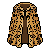 | **Emberfell Mantle** | A tattered cloak woven from deep amber and burnt orange fabric with intricate gold embroidered patterns. The garment features layered, asymmetrical panels with frayed edges and darker charred sections suggesting exposure to intense heat. Gold threading traces arcane symbols across the shoulders. | *Once draped across the shoulders of a pyromancer consumed by their own craft, this mantle still radiates the faint warmth of forbidden flames. Those who wear it claim to hear whispers of spellcraft long extinguished, and smell ash from worlds long turned to cinder.* | Mage, Archer |
| 43 | 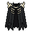 | **Forsaken Veilweaver's Shroud** | A tattered black mantle with ragged, asymmetrical edges that fade into wisps. Adorned with dark purple accents and faint ethereal patterns woven throughout the fabric, suggesting arcane origins. | *Worn by those who walk between worlds, this mantle drinks in shadow itself. Some say its threads are spun from the twilight between life and death.* | Mage, Archer |
| 44 | 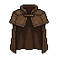 | **Voidborn Shadowweave Mantle** | A tattered brown cloth mantle with deep burgundy undertones, featuring worn leather trim and frayed edges. Dark fabric drapes asymmetrically across the shoulders, suggesting age and mystic purpose. Faint stitching patterns hint at arcane symbols woven throughout the material. | *Woven from the cloaks of forgotten sorcerers, this mantle hungers for the ambient mana that clings to those who bend reality. Those who don it find themselves caught between worlds—neither fully present nor entirely absent.* | Mage, Archer |
| 45 | 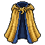 | **Emberveil Mantle** | A flowing shoulder cloak in deep navy blue with golden-yellow trim and ornamental clasps. The garment features layered fabric with a slightly scorched appearance and warm amber undertones along the edges, suggesting exposure to arcane fire or stellar energies. | *Woven from threads spun by those who commune with dying stars, this mantle grants its wearer a veil between worlds. Those who don it find themselves caught between flame and shadow, blessed and cursed in equal measure.* | Mage, Archer |
| 46 | 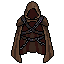 | **Shadowweft Mantle** | A tattered dark cloak with deep brown and black tones, adorned with intricate embroidered patterns along the edges. The fabric appears weathered and ancient, with subtle crimson accents woven throughout. A high collar frames the shoulders, suggesting both elegance and occult purpose. | *Woven from the threads of forgotten rituals, this mantle whispers of those who walked between worlds. To don it is to accept the weight of secrets that consume the living.* | Mage, Archer |
| 47 | 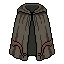 | **Storm Shadowveil Mantle** | A tattered cloak of deep charcoal fabric with weathered edges and faint ash-gray patterns. The collar appears reinforced with darker material, suggesting protective layering. The texture shows age and wear, with subtle striations suggesting woven cloth or hide. | *Woven from the remains of forgotten sanctuaries, this mantle drinks in the light around it. Those who wear it find themselves treading the threshold between worlds—neither fully seen nor entirely hidden.* | Mage, Archer |
| 48 | 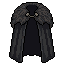 | **Hollow Shadowweave Mantle** | A tattered dark cloak with deep charcoal fabric and frayed edges. The shoulders feature layered, wing-like extensions in black and grey tones. Subtle purple undertones suggest arcane influence, with asymmetrical draping suggesting movement or otherworldly origin. | *Woven from the shrouds of forgotten spirits, this mantle drinks in light and exhales dread. Those who don it become indistinct—present, yet unseen by eyes that would harm them.* | Mage, Archer |
| 49 | 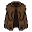 | **Ancient Shadowweave Mantle** | A tattered cloak of deep brown and charcoal fabric, layered with worn leather panels. Rough fur trims the shoulders and collar. The weave shows intricate seams and weathered folds, suggesting age and arcane craftsmanship. Dark, muted tones dominate throughout. | *Woven from the hides of forgotten beasts and thread spun in moonless nights, this mantle grants passage between shadows. Those who wear it learn that concealment is not merely absence, but a presence all its own.* | Mage, Archer |
| 50 | 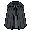 | **Cursed Shadowveil Mantle** | A flowing, dark charcoal cloak with tattered edges and a high collar. The fabric appears worn and ethereal, with subtle wispy patterns suggesting arcane energy. A deep black coloration dominates, with hints of purple-grey undertones along the seams. | *Woven from the forgotten shrouds of those who dabbled in forbidden arts, this mantle whispers secrets to those bold enough to don it. The shadows themselves seem to cling to its wearer, rendering them less a target and more a passing thought.* | Mage, Archer |
| 51 | 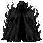 | **Forsaken Veilwraith Mantle** | A flowing black cloak with jagged, wispy edges that seem to billow and dissipate into shadow. The fabric appears tattered yet ethereal, with darker striations suggesting depth and movement. Hints of deep purple shimmer faintly within the folds. | *Woven from the whispers of forgotten spirits, this mantle grants those who wear it passage between the veil of worlds. The shadows themselves seem to bend around the wearer, as if reality itself wishes them unseen.* | Mage, Archer |
| 52 | 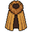 | **Ashenheart Mantle** | A flowing, knee-length cloak in burnt orange and deep gold tones. The fabric appears weathered with darker charcoal accents along the edges and shoulders. A prominent vertical stripe of darker material runs down the center, suggesting ceremonial robes of an ancient order. | *Once draped upon the shoulders of those who communed with dying stars. This mantle whispers of ash and forgotten rituals, its warmth born not of comfort but of powers best left undisturbed.* | Mage, Archer |
| 53 | 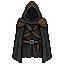 | **Shattered Veilwraith Mantle** | A tattered black cloak with ethereal wisps trailing from its edges. The fabric appears woven from shadow itself, with subtle purple undertones and darker patterns suggesting arcane runes. The hood is deep and obscuring, framing an aura of otherworldly darkness. | *Woven from the vestments of forgotten sorcerers, this mantle drinks in the light around it. Those who don it feel the veil between worlds grow thin, as if reality itself bends to their will.* | Mage, Archer |
| 54 | 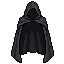 | **Ember Shadowveil Mantle** | A tattered black cloak with deep indigo undertones, featuring a high collar and flowing fabric that drapes asymmetrically. The garment appears weathered and worn, with subtle dark wisps or smoke-like patterns woven throughout its surface, suggesting an aura of shadow magic. | *Woven from the veils between worlds, this mantle drinks in light itself. Those who wear it find themselves caught between existence and void, blessed and cursed in equal measure.* | Mage, Archer |
| 55 | 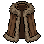 | **Storm Thornweave Mantle** | A heavy shoulder cloak of deep brown wool lined with darker fur trim. Intricate thorned vine embroidery spirals across the shoulders in muted gold. The fabric appears aged and weathered, with subtle texture suggesting protective enchantment woven throughout. | *Woven from the hides of forgotten beasts and stitched with thorns that draw sustenance from shadow, this mantle grants its bearer the resilience to weather both curse and steel. Those who don it find themselves standing amid ruin, still standing.* | Mage, Archer |
| 56 | 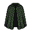 | **Thornveil Mantle** | A flowing, dark green cloak with a dense, thorny texture throughout. The fabric appears weathered and organic, with jagged protrusions resembling twisted vines or briars. Darker shadowing at the edges creates depth, suggesting the mantle drapes heavily from the shoulders. | *Woven from the cursed growth of an ancient thorned forest, this mantle whispers with the anguish of those who fell among its barbs. To wear it is to invite both sanctuary and suffering.* | Mage, Archer |
| 57 |  | **Ancient Shadowweave Mantle** | A tattered cloak of deep forest green and charcoal, adorned with intricate embroidered patterns along the edges. The fabric appears weathered and aged, with hints of darker threads woven throughout, suggesting ancient craftsmanship. A subtle shimmer of dark energy clings to its frayed hem. | *Woven from the silken threads of forgotten groves, this mantle drinks in the surrounding shadows. Those who don it find themselves caught between worlds—neither fully seen nor entirely hidden.* | Mage, Archer |
| 58 |  | **Cursed Shadowveil Mantle** | A tattered black cloak with billowing fabric, featuring deep charcoal tones and wisps of dark energy. The shoulders are broad and imposing, adorned with darker fabric that cascades downward. Subtle crimson accents trace the edges, suggesting ancient runes or dried blood. | *Woven from the darkness between worlds, this mantle drinks in light and grants those who wear it passage through shadows. Many who don it return changed—if they return at all.* | Mage, Archer |
| 59 |  | **Forsaken Shadowweave Mantle** | A tattered black cloak with ragged edges and an asymmetrical silhouette. The fabric appears worn and ethereal, with darker shadows pooling at its hem. A deep hood obscures the wearer's features, suggesting an aura of mystery and dread. | *Woven from the twilight between worlds, this mantle drinks in the light around it. Those who wear it learn to move unseen, though some say it whispers secrets best left forgotten.* | Mage, Archer |
| 60 |  | **Carmesine Shroud** | A flowing mantle of deep burgundy fabric with ornate golden embroidery along the edges. The garment features layered cloth with a rich, wine-dark hue, accented by golden trim and clasps at the shoulders. Dark red and gold create an elegant, aristocratic silhouette. | *Woven from the silks of forgotten dynasties, this crimson mantle drinks in the ambient magic of the world. Those who don it find their spellcraft enriched, as if the garment itself remembers incantations spoken centuries past.* | Mage, Archer |
| 61 |  | **Embercrimson Mantle** | A flowing shoulder cloak with sharp, angular cuts. Deep crimson fabric transitions to flickering orange and golden hues at the edges, resembling smoldering embers. Ornate golden clasps secure the front, with intricate flame-like patterns woven throughout the textile. | *Once worn by a pyre-keeper of forgotten rites, this mantle still smolders with the dying breath of a thousand sacrificial flames. Those who don it inherit both its warmth and its curse.* | Mage, Archer |
| 62 |  | **Ember Ravenwing Mantle** | A dark, feathered cloak with intricate wing-like patterns woven throughout. The silhouette features sharp, geometric chevron designs in black and deep grey, resembling folded raven wings. Tattered edges suggest age and otherworldly origin. | *Woven from the pinions of corvids that haunted the Blighted Moors, this mantle whispers secrets to those who dare wear it. Each feather holds the memory of a thousand deaths.* | Mage, Archer |
| 63 |  | **Voidweaver's Mantle** | A flowing dark cloak with deep navy and gold embroidery. Gold trim edges the shoulders and hem. Ornate golden clasps fasten at the chest. The fabric appears heavy and arcane, with subtle ethereal patterns woven throughout. | *A garment woven from the spaces between stars, bearing the sigil of those who bend reality to their will. Those who don it feel the weight of forgotten magics settling upon their shoulders.* | Mage, Archer |
| 64 |  | **Starfall Mantle** | A flowing dark blue cloak with silver celestial embroidery. Gold-trimmed edges frame the shoulders, with arcane symbols woven throughout. The fabric appears to shimmer with an ethereal glow, suggesting magical properties. | *Woven from the midnight sky itself, this mantle whispers of forgotten constellations. Those who don it find themselves touched by the cold grace of the void—protection bought at the price of one's warmth.* | Mage, Archer |
| 65 |  | **Saffronveil Mantle** | A flowing golden-yellow cloak with deep amber accents along the hemmed edges. The fabric drapes elegantly from broad shoulders with subtle layering and dimensional folds. Rich ochre tones dominate, suggesting aged silk or enchanted cloth with a luminous quality. | *Woven from the last light of dying suns, this mantle whispers secrets to those patient enough to listen. Those who don it find themselves draped in an aura of ancient power—though some say the garment demands a price for such knowledge.* | Mage, Archer |
| 66 |  | **Crimson Thornmantle** | A flowing mantle of deep burgundy fabric with ornate dark patterns woven throughout. Layered folds drape elegantly from shoulders, featuring tattered edges and subtle crimson threading. The garment has an aged, weathered quality with hints of embroidered thorns along the collar. | *Woven from the silks of fallen kingdoms, this mantle whispers of ancient pacts and sorcerous bloodlines. Those who don it find themselves cloaked not just in shadow, but in the very essence of forgotten power.* | Mage, Archer |
| 67 |  | **Forsaken Shadowpall Mantle** | A tattered dark cloak with a high collar, woven from midnight-black fabric. The edges fade into wisping shadows with hints of deep purple. Ornate clasps hold the garment at the shoulders, and the overall silhouette suggests an aura of absorbed darkness. | *A mantle worn by those who walk between worlds, its fabric drinks in light rather than reflects it. Whispers claim it was stitched from the last breath of a starless night.* | Mage, Archer |
| 68 |  | **Voidborn Shadowweave Mantle** | A tattered cloak of deep brown and charcoal fabric, layered with ragged edges and worn seams. The shoulders are broad and heavy, adorned with darker striping that creates a sense of depth and shadow. The material appears aged and weathered, with hints of darker dye pooling at the folds. | *Woven from the cloaks of forgotten sorcerers, this mantle drinks in light itself. Those who wear it walk between worlds, their silhouette blurring at the edges of perception.* | Mage, Archer |
| 69 |  | **Shroud of the Withered Oath** | A tattered mantle of dark brown fabric with deep vertical pleats and folds. The garment appears aged and weathered, with a muted earthy tone suggesting old leather or decaying cloth. Heavy, draped construction with a voluminous silhouette. | *A mantle woven from the cloaks of forgotten penitents, its folds heavy with regret and ancient sorcery. Those who don it feel the weight of broken promises pressing upon their shoulders, yet gain clarity in the void.* | Mage, Archer |
| 70 |  | **Ember Shadowveil Mantle** | A tattered black cloak with ragged, pointed edges resembling crow feathers or thorns. The fabric appears worn and ethereal, with darker shadowy wisps trailing from the hem. Ornate central clasp suggests arcane origins. | *Woven from the plumage of carrion birds that feed on cursed battlefields, this mantle whispers of forgotten pacts. Those who wear it walk between shadow and sight, marked by the very darkness they command.* | Mage, Archer |
| 71 |  | **Frostweaver's Mantle** | A flowing blue mantle with intricate crystalline patterns across its surface. The fabric appears to shimmer with an icy sheen, adorned with frost-like motifs and sharp geometric designs. Silver trim edges the garment, and the shoulders feature subtle icy protrusions suggesting arcane power. | *Woven from the dreams of winter itself, this mantle channels the primal cold of forgotten realms. Those who don its embrace find clarity in the void, though frostbite creeps ever closer to the soul.* | Mage, Archer |
| 72 |  | **Hollow Embercrimson Mantle** | A flowing cloak with deep crimson fabric lined in burnt orange trim. The shoulders feature ornate golden buckles, and the hem is trimmed with smoldering amber thread. The garment drapes asymmetrically with layered panels suggesting movement and arcane power. | *Woven from the cloaks of fallen sorcerers, this mantle smolders with residual malice. Those who don it inherit both its warmth and the burden of its previous masters' transgressions.* | Mage, Archer |
| 73 |  | **Ravenwing Shroud** | A tattered dark mantle with jagged, asymmetrical edges resembling crow feathers. Deep indigo-black fabric with subtle silvery threads woven throughout, creating a shimmering, ethereal quality. The collar appears reinforced with darker material. | *Woven from the midnight plumage of carrion birds, this mantle whispers forgotten incantations with every movement. Those who don it find themselves cloaked not merely in shadow, but in the very absence of light itself.* | Mage, Archer |
| 74 |  | **Cursed Shadowweave Mantle** | A flowing, asymmetrical cloak in deep chocolate brown with darker vertical panels and layered fabric. The mantle features a high collar and appears to be crafted from heavy, textured material with subtle folds suggesting movement and mystical weight. | *Woven from the threads of forgotten shadows, this mantle clings to its wearer like a living thing. Those who don it find their presence diminished, as if the world itself conspires to overlook them.* | Mage, Archer |
| 75 |  | **Ashwood Shroud** | A heavy woolen mantle in deep brown with dark gray tones, featuring a high collar and draped sleeves. The fabric appears weathered and worn, with subtle charred edges along the hem suggesting exposure to arcane flames or ritual fire. | *Woven from the fibers of trees that once stood in cursed groves, this mantle carries the weight of forgotten incantations. Those who don it find themselves wrapped in the embrace of shadow itself, a barrier between flesh and the hungry void.* | Mage, Archer |
| 76 |  | **Voidborn Shadowweave Mantle** | A dark brown woolen mantle with deep burgundy lining, draped asymmetrically across the shoulders. The fabric appears weathered and tattered at the edges, with subtle darker striations suggesting age. Heavy cloth construction with visible seams. | *Woven from the shrouds of forgotten tombs, this mantle drinks in the light around it. Those who don it find themselves drifting between shadow and substance, neither fully present nor entirely absent.* | Mage, Archer |
| 77 |  | **Shattered Shadowweave Mantle** | A tattered cloak of deep brown and charcoal hues, woven with subtle dark threads. Heavy fabric drapes asymmetrically with frayed edges and worn seams. The garment suggests age and arcane use, with folds suggesting movement and mystery. | *Spun from the veils between worlds, this mantle drinks in light itself. Those who wear it fade like smoke—neither fully present nor entirely absent.* | Mage, Archer |
| 78 |  | **Shadowpall Vestment** | A tattered, floor-length mantle in deep brown and black tones. Heavy fabric drapes asymmetrically with ragged edges and torn sections. Dark vertical striping runs throughout, creating an aged, weathered appearance. The collar appears high and stiffened. | *Woven from the shrouds of forgotten tombs, this mantle drinks in light and whispers secrets to those who dare wear it. The shadows it casts seem to linger longer than they should.* | Mage, Archer |
| 79 |  | **Storm Shadowveil Mantle** | A dark, flowing cloak rendered in deep charcoal black with subtle fabric texture. The garment drapes asymmetrically with layered panels suggesting movement. Fine tattered edges hint at ancient wear. Shadowy wisps or ethereal tendrils seem to coil around the hem. | *Woven from the twilight between worlds, this mantle drinks in light and whispers secrets to those who dare wear it. Few return unchanged from garments so willingly steeped in the void.* | Mage, Archer |
| 80 |  | **Hollow Shadowveil Mantle** | A flowing black cloak with a high collar and draped shoulders. The fabric appears tattered at the edges with subtle dark purple undertones. A small clasp or brooch fastens at the neckline, barely visible against the deep shadow of the garment. | *Woven from the remnants of forgotten nightmares, this mantle clings to its wearer like a living thing—granting reprieve from prying eyes and the weight of cursed magic alike.* | Mage, Archer |
| 81 |  | **Ancient Veilstorm Mantle** | A flowing blue hooded cloak with sharp, angular silhouette. Deep indigo fabric drapes asymmetrically with jagged edges resembling lightning or crystalline shards. Metallic azure accents frame the shoulders and hem, creating an otherworldly, ethereal appearance. | *Woven from the tempestuous fabrics of forgotten storms, this mantle whispers secrets of the aether to those who dare wear it. Those cloaked in its depths become translucent as mist, though their power burns ever brighter.* | Mage, Archer |
| 82 |  | **Cursed Emberfell Mantle** | A flowing cloak of deep amber and burnt orange fabric, resembling flickering flames frozen in cloth. The garment features jagged, irregular edges that suggest charred material, with darker brown undertones creating depth and the illusion of smoldering heat. | *Once draped across the shoulders of a pyromancer consumed by their own inferno, this mantle still radiates the dying warmth of catastrophic magic. Those who wear it hear the faint crackle of eternal flames.* | Mage, Archer |
| 83 |  | **Forsaken Thornweave Mantle** | A flowing cloak with deep brown and tan coloring, featuring intricate woven patterns along the shoulders and upper back. The fabric appears layered and textured, with darker shadowing suggesting aged leather reinforcements. Subtle thorn-like protrusions accent the neckline and edges. | *Woven from the hides of creatures long forgotten, this mantle whispers of thorns and shadow. Those who wear it find themselves cloaked not merely in fabric, but in the very essence of woodland hunger.* | Mage, Archer |
| 84 |  | **Stormweft Mantle** | A flowing cloak with deep navy-blue fabric and golden-yellow trim along the edges and shoulders. The garment features a high collar and drapes dramatically down the back, with metallic gold accents at the clasp point. The weave appears storm-touched, with subtle texture suggesting woven lightning. | *Woven from the fur of creatures that dance between worlds, this mantle crackles with latent arcana. Those who don it feel the weight of storms gathering at their fingertips, as if the very air bends to their will.* | Mage, Archer |
| 85 |  | **Shattered Thornwood Shroud** | A flowing emerald-green mantle with darker verdant patterns woven throughout. The garment features leaf-like motifs and vine embroidery along its edges, with a natural, organic texture suggesting ancient forest materials. The hood is deep and shadowed. | *Woven from the sinew of forgotten groves, this mantle whispers secrets of the deepwood to those who dare wear it. Those shrouded in its embrace find themselves half-hidden between worlds, neither fully seen nor completely lost.* | Mage, Archer |
| 86 |  | **Ember Shadowpall Mantle** | A dark, tattered cloak draped from shoulder to lower back. Deep burgundy and black fabric with frayed edges. The garment appears weathered and worn, with an almost liquid quality to its drape, suggesting enchanted material. | *Woven from the dusk itself, this mantle clings to its wearer like a living shadow. Those who don it find their presence muted, as if the world's eye slides past them into darkness.* | Mage, Archer |
| 87 |  | **Storm Shadowpall Vestment** | A floor-length mantle of deep brown cloth with subtle dark striations. Heavy woolen fabric drapes asymmetrically, secured with a clasp at the shoulder. The hem falls in tattered, frayed layers suggesting age and wear. Darker brown accents line the interior. | *Woven from the cloaks of forgotten sorcerers, this mantle drinks in light itself. Those who don it find their presence dimmed—a whisper in the darkness rather than a figure in the light.* | Mage, Archer |
| 88 |  | **Hollow Ravenwing Mantle** | A tattered cloak of deep charcoal and sage green, adorned with asymmetrical feather-like fringe hanging from the shoulders. The fabric appears weathered and ceremonial, with subtle striped patterns suggesting ancient embroidery or natural wear. | *Once draped upon the shoulders of those who walked between worlds, this mantle carries the weight of forgotten rituals. The feathers whisper of flight and shadow, granting their wearer passage through the veil.* | Mage, Archer |
| 89 |  | **Ancient Veilwraith Mantle** | A flowing dark navy cloak with deep indigo undertones, featuring a high collar and layered fabric that suggests movement. The garment appears to shimmer subtly with an otherworldly sheen, lined with darker shadows that seem to pool at its edges. | *Woven from the twilight between worlds, this mantle grants those who wear it a fleeting glimpse of the veil. Whispers cling to its fabric like morning frost, and those touched by its shadow learn to move unseen.* | Mage, Archer |
| 90 |  | **Cursed Shadowveil Mantle** | A tattered black cloak with jagged, irregular edges that seem to dissolve into wisps. The fabric appears woven from darkness itself, with subtle deep purple undertones along the shoulders. Torn and weathered, suggesting countless battles or dark incantations. | *A garment born from the spaces between light and shadow, this mantle whispers of forgotten pacts and forbidden knowledge. Those who don it find themselves cloaked not merely in cloth, but in the very essence of concealment.* | Mage, Archer |
| 91 |  | **Azurite Veil Mantle** | A flowing, knee-length mantle in deep cerulean blue with lighter turquoise accents. The fabric drapes elegantly with sharp, angular folds suggesting ethereal movement. A subtle crystalline sheen runs through the weave, with darker blue trim along the shoulders and hem. | *Woven from threads spun in the depths of forgotten caverns, this mantle whispers of arcane secrets with every step. Those who don it find their connection to magic strengthened, though at the cost of a creeping cold that never quite fades.* | Mage, Archer |
| 92 |  | **Veilmantle of the Starless** | A flowing, hooded mantle rendered in pale blue and grey tones with a symmetrical, ethereal silhouette. The fabric drapes vertically from narrow shoulders, featuring a high collar and pointed hood. Two pale blue sections frame the center, suggesting mystical energy or frostbitten silk. | *Woven from the tears of forgotten mages who gazed too long into the abyss. Those who don this mantle find solace in shadow, though some say the cold never truly leaves their bones.* | Mage, Archer |
| 93 |  | **Shattered Shadowweave Mantle** | A heavy cloak of deep brown and black fabric with intricate embroidered patterns across the shoulders. The garment features layered, flowing cloth with golden or bronze accents along the collar and edges, suggesting arcane runes or protective wards woven into the material. | *Spun from threads pulled from the spaces between worlds, this mantle whispers secrets to those who wear it. The shadows cling to its wearer like old allies, obscuring their presence from prying eyes and hostile intent.* | Mage, Archer |
| 94 |  | **Ember Shadowveil Mantle** | A flowing dark navy cloak with a high collar, trimmed in gold filigree. The fabric appears heavy and ethereal, with subtle arcane symbols embroidered along the edges. A brooding atmosphere emanates from its deep indigo folds. | *Woven from the twilight between worlds, this mantle whispers of forgotten rites and occult knowledge. Those who don it find themselves walking the threshold between shadow and sight.* | Mage, Archer |
| 95 |  | **Storm Veilwraith Mantle** | A tattered black cloak with jagged, wispy edges that seem to dissolve into shadow. The fabric appears worn and ancient, with subtle ethereal wisps trailing from the shoulders and hem. Dark purple undertones shimmer faintly within the black weave. | *Woven from the remnants of spirits long forgotten, this mantle clings to its wearer like a living shadow. Those who don it find themselves caught between worlds—neither fully present nor entirely absent.* | Mage, Archer |
| 96 |  | **Hollow Ravenwing Shroud** | A tattered mantle of deep brown and charcoal fabric with ragged, feathered edges resembling crow wings. Dark material drapes asymmetrically with frayed details and a weathered, aged appearance suggesting ancient craftsmanship. | *Woven from the feathers of birds that nested in cursed tombs, this mantle whispers with the voices of those who wore it before. To don it is to accept the burden of shadows that cling closer than any living thing.* | Mage, Archer |
| 97 |  | **Ancient Shadowweave Mantle** | A tattered cloak of deep brown and charcoal fabric, draped asymmetrically with ragged edges. The material appears aged and weathered, with subtle darker striations suggesting arcane weaving. Layered panels fall unevenly, creating an ominous silhouette. | *Woven from the shrouds of forgotten tombs, this mantle drinks in light itself. Those who don it find themselves caught between the world of flesh and something far darker.* | Mage, Archer |
| 98 |  | **Duskweave Mantle** | A heavy, draped cloak in deep brown and bronze tones with layered fabric construction. Features asymmetrical draping with weathered leather accents and darker shadowing that suggests age and arcane use. The shoulders are reinforced with darker material, creating a distinctly silhouetted profile. | *Woven from threads steeped in twilight itself, this mantle carries the weight of forgotten rituals. Those who don it find their movements obscured by an ambient gloom—whether blessing or curse remains unclear.* | Mage, Archer |
| 99 |  | **Forsaken Crimson Veilcloak** | A flowing mantle of deep burgundy fabric with a subtle sheen, featuring a high collar and dramatic draped sides. The garment appears to be woven from silk or similar material, with a rich wine-red coloration that fades slightly toward the edges. | *Worn by those who walk between worlds, this cloak remembers the blood of ancient rites. Its crimson threads whisper of power exchanged for secrets best left forgotten.* | Mage, Archer |
| 100 |  | **Voidborn Shadowveil Mantle** | A tattered black cloak with jagged, irregular edges reminiscent of torn fabric or shadowy wisps. The garment features a high collar and appears to be woven from dark, heavy material with subtle texture variations suggesting wear and otherworldly craftsmanship. | *A cloak that drinks in light and exhales despair. Those who don it find themselves half-forgotten by the world, as if seen through smoke and shadow.* | Mage, Archer |
