# Pants - Item Catalog

> **Category:** Pants  
> **Total items:** 100  
> **Classes:** Mage, Archer, Warrior, Samurai

| # | Preview | Item Name | Visual Description | Description | Classes |
|:-:|:-------:|:----------|:------------------|:------------|:--------|
| 1 | 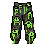 | **Shadowveil Greaves** | Tattered emerald-green cloth pants with darker verdant patterns and striped detailing. The fabric appears weathered and stained, with asymmetrical leg wraps and frayed edges suggesting age and wear. Intricate dark bands or binding wrap around the legs. | *Woven from the cursed silks of a forgotten plague, these greaves whisper of pestilence with every step. Those who don them find themselves cloaked in shadow, as if the very darkness hungers to conceal their movement.* | Samurai, Mage, Archer, Warrior |
| 2 | 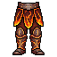 | **Cinderfall Greaves** | Sturdy leg armor crafted from scorched leather and rust-orange metal plates. Deep burgundy fabric underlays the plating, with ash-gray detailing along the seams. Tattered cloth dangles from the waist, singed and weathered. The color palette shifts from warm copper to charred umber. | *Forged in the aftermath of the Ashlands collapse, these greaves carry the scorching memory of cinder and flame. They grant those who wear them an unshakeable footing, as if the very earth recognizes their passage through ruin.* | Samurai, Mage, Archer, Warrior |
| 3 | 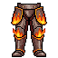 | **Cinderfall Legguards** | Heavy segmented pants with dark orange and black striped fabric, reinforced with bronze or copper plating at the thighs and knees. The material appears weathered and scorched, with ember-like orange tones dominating the lower legs and waistband. | *Forged in the dying light of a fallen civilization, these legguards bear the scorch marks of ancient conflagrations. They grant steadiness to those who walk through ruin.* | Samurai, Mage, Archer, Warrior |
| 4 |  | **Cinderfall Britches** | Loose-fitting pants with a warm amber and deep orange color palette, resembling smoldering embers and charred fabric. Features dark brown striping and mottled patterns suggesting ash and flame damage. The material appears weathered and slightly scorched, with irregular hemming at the ankles. | *Forged in the dying breath of a pyre-consumed citadel, these pants carry the warmth of a thousand burnt offerings. Those who wear them find themselves oddly resistant to flame, as if the very ash clings to their legs in eternal protection.* | Samurai, Mage, Archer, Warrior |
| 5 | 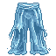 | **Azurite Wanderer's Chausses** | Loose-fitting pants dyed in deep indigo and pale blue hues with vertical striping. The fabric appears weathered and layered, featuring reinforced seams and a slightly frayed hem. Dark accents at the waistband and calves suggest practical, worn leather trim. | *Garments steeped in the essence of forgotten roads. Those who don these legs find their steps lighter, as if the very paths they walk remember where they've been.* | Samurai, Mage, Archer, Warrior |
| 6 |  | **Thornvine Greaves** | Dark green fabric pants with black thorny vine motifs sprawling across the legs. Barbed tendrils coil around the calves and thighs, with small sharp protrusions jutting outward. The material appears weathered and organic, as if woven from corrupted plant matter. | *Woven from the sinews of a blighted forest, these greaves offer both protection and the whispered promises of the dark earth. Those who wear them find themselves rooted to their convictions-unwavering, relentless, bound to a darker purpose.* | Samurai, Mage, Archer, Warrior |
| 7 |  | **Nightbloom Greaves** | Ornate leg armor in deep purple and black with luminescent violet accents. Features intricate vine-like engravings wrapping around armored segments. Gemstone clusters in rich amethyst tones protrude from the knee guards, emanating a soft ethereal glow against the darkened metal plating. | *Woven from shadow-touched leather and cursed metal, these greaves grant those who wear them passage through realms unseen. Each step echoes with the whispers of forgotten gardens, blooming only in the dark.* | Samurai, Mage, Archer, Warrior |
| 8 | 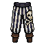 | **Shadowbind Legguards** | Dark striped pants with vertical black and grey bands. Tattered fabric hangs loosely at the thighs and calves, with ragged edges suggesting age or battle wear. Thick black straps cinch at the waist and ankles, contrasting against the lighter striped pattern. | *Woven from the grave-wrappings of forgotten tombs, these legguards bind shadow to flesh, granting the wearer passage through darkness unnoticed. Each step echoes with the whispers of those who wore them before.* | Samurai, Mage, Archer, Warrior |
| 9 | 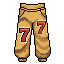 | **Goldenweave Chausses** | Tan and golden-brown leather pants with intricate woven patterns and striping throughout. Reinforced with darker leather panels at the thighs and calves. The fabric has a weathered, expedition-worn appearance with subtle golden thread embroidery creating geometric motifs. | *Garments woven from the hides of creatures long forgotten, their golden hue a testament to trials endured across cursed lands. Those who don these leggings find their footing steadied, as if guided by phantom hands through shadow and ruin.* | Samurai, Mage, Archer, Warrior |
| 10 | 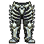 | **Ossein Legguards** | Segmented armor plating in bone-white and charcoal, adorned with intricate black filigree patterns and skeletal motifs. Ribbed construction suggests vertebrae; dark bands cinch at waist and thighs. Aged leather trim shows wear. | *Forged from the petrified remains of an ancient leviathan, these legguards whisper of depths long forgotten. Those who wear them feel the weight of abyssal pressure, a constant reminder that some hunts never truly end.* | Samurai, Mage, Archer, Warrior |
| 11 | 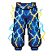 | **Abyssal Wrath Greaves** | Dark blue and black segmented leg armor with jagged, crystalline protrusions along the shins. Deep indigo fabric underlays peek between armored plates. Sharp geometric patterns suggest corrupted energy crackling across the surface. | *Forged in the depths where light fears to tread, these greaves pulse with the rage of a thousand sunken souls. To don them is to invite the abyss into your very stride.* | Samurai, Mage, Archer, Warrior |
| 12 | 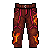 | **Crimson Blight Trousers** | Dark red fabric with black geometric patterns and mottled crimson stains resembling dried blood. The material appears weathered and worn, with tattered edges at the hem. Intricate dark embroidery traces along the seams in angular, ritualistic designs. | *Stained by the blood of countless battles, these cursed trousers whisper of violence long past. Those who don them feel the weight of spilled souls clinging to the fabric, granting resilience born from suffering.* | Samurai, Mage, Archer, Warrior |
| 13 | 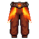 | **Embercinder Breeches** | Crimson and deep orange reinforced pants with black leather accents and gold-threaded seams. Flame-like patterns run down the legs, and scorched edges suggest exposure to intense heat. Heavy fabric with ornate buckles at the waist. | *Forged in the depths where magma flows like blood, these pants bear the scars of infernal crucibles. Those who wear them carry the warmth of dying embers-comfort to some, a warning to others.* | Samurai, Mage, Archer, Warrior |
| 14 | 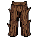 | **Scorched Thane's Cuisses** | Brown leather pants with dark reinforced plating at the thighs and knees. Worn brass buckles and straps run vertically down each leg. The material shows signs of fire damage with charred edges and a weathered, battle-scarred appearance throughout. | *Once worn by a fell knight whose hubris drew the wrath of ancient flames. These scorched greaves remember every battle, every scar, every step toward damnation.* | Samurai, Mage, Archer, Warrior |
| 15 |  | **Shattered Void Greaves** | Midnight-blue segmented leg armor with jagged, crystalline protrusions. The fabric shimmers with fractured purple-violet hues, resembling shattered glass frozen mid-shattering. Gold accents trace geometric patterns across the surface. | *Forged from the shattered remains of a void-walker's prison, these greaves grant the wearer an unsettling presence. Those who don them report whispers beneath the fabric, as though reality itself struggles against their form.* | Samurai, Mage, Archer, Warrior |
| 16 | 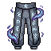 | **Shadowthorn Legguards** | Dark indigo fabric reinforced with jagged black plating along the thighs and shins. Tattered edges drape asymmetrically, adorned with small silver studs and weathered bone accents. The material appears worn from countless battles, with subtle violet undertones catching the light. | *Forged in the twilight depths where shadow takes form, these legguards have witnessed the fall of kingdoms. Those who wear them find themselves moving between worlds, neither fully present nor entirely absent.* | Samurai, Mage, Archer, Warrior |
| 17 |  | **Goldleaf Wayfarer's Breeches** | Golden-yellow fabric pants with darker ochre accents and layered construction. Features reinforced thigh panels and tapered legs with subtle bronze buckles at the sides. The weave appears weathered yet ornate, suggesting both durability and travels through forgotten lands. | *Woven from the scales of a long-dead wyvern that once roosted in sunken tombs, these breeches shimmer with an unnatural luster. They grant the wearer the uncanny swiftness of those who've outrun their own doom.* | Samurai, Mage, Archer, Warrior |
| 18 | 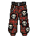 | **Cursed Cinderfall Greaves** | Dark red and black segmented leg armor with ornate gold threading and crimson fabric accents. Features intricate geometric patterns and smoldering ember-like details across the surface, suggesting ancient craftsmanship. | *Forged in the depths of a dying realm, these greaves bear the scars of battles long forgotten. They whisper of ash and ember with every step, granting passage through darkness itself.* | Samurai, Mage, Archer, Warrior |
| 19 |  | **Verdant Plague Greaves** | Segmented leg armor in sickly moss-green with darker emerald striping. Tattered cloth sections hang between armored plates. Intricate vine-like patterns weave across the surface, suggesting corrupted nature or disease. | *Woven from the hides of creatures that succumbed to the Blight, these greaves whisper of rot with each step. Those who wear them find their feet steady on cursed ground, though at a terrible price.* | Samurai, Mage, Archer, Warrior |
| 20 | 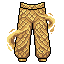 | **Goldleaf Striders** | Tattered golden-brown fabric pants with layered, feathered edges resembling autumn leaves. Deep ochre undertones and weathered patches suggest age and worn travel. Darker reinforced sections at the seams indicate practical craftsmanship. | *Woven from the hides of creatures long forgotten, these breeches shimmer with an eerie amber hue-as if perpetually catching firelight that no longer exists. Those who don them find their steps quickened, their movements guided by something older than memory.* | Samurai, Mage, Archer, Warrior |
| 21 | 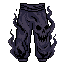 | **Shadowrend Greaves** | Dark indigo-black reinforced leg armor with jagged, tattered edges along the sides. Adorned with small silver buckles and trailing cloth strips that hang asymmetrically. The material appears weathered leather wrapped around layered plating, with a faint purple ethereal shimmer. | *Forged in the depths where light fears to tread, these greaves bear the scars of countless battles against forces best left unnamed. They whisper of speed and evasion, though at what cost, none dare ask.* | Samurai, Mage, Archer, Warrior |
| 22 | 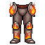 | **Cinderbrand Greaves** | Heavy segmented leg armor in burnt orange and deep brown leather, reinforced with blackened metal plates. Smoldering amber runes trace along the shins, with charred fabric wrappings between armor sections. | *Forged in the dying embers of a forgotten war, these greaves still radiate the heat of their creation. Those who wear them carry the weight of ash-laden battlefields beneath their feet.* | Samurai, Mage, Archer, Warrior |
| 23 | 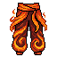 | **Infernal Cinderwraps** | Ornate crimson and amber leg armor with flame-like patterns. Segmented plates overlap vertically, resembling flickering fire. Gold accents trace the edges, with darker charred fabric visible between sections. | *Forged in the heart of a dying star, these wraps whisper of ancient immolations. Those who don them carry the warmth of empires turned to ash.* | Samurai, Mage, Archer, Warrior |
| 24 |  | **Pestilent Bog Chausses** | Tattered pants in sickly lime-green and moss tones, adorned with dark patches and trailing wisps of ethereal decay. Frayed edges suggest fabric barely held together by cursed magic, with muddy discoloration creeping up the legs. | *Woven from the corrupted fibers of a long-cursed wetland, these leggings reek of stagnant waters and forgotten tombs. Those who don them feel the swamp's ancient hunger seeping into their very steps.* | Samurai, Mage, Archer, Warrior |
| 25 | 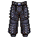 | **Shadowweave Legguards** | Dark charcoal pants with intricate black embroidered patterns across the thighs and calves. Multiple cargo pockets and reinforced seams suggest both mobility and durability. Deep purple accents line the edges, creating an impression of woven shadow. | *Woven from the twilight fabric of forgotten crypts, these legguards grant the wearer the grace of wandering spirits. Those who don them report feeling lighter, as though death itself has claimed only their footprints.* | Samurai, Mage, Archer, Warrior |
| 26 |  | **Abyssal Weavings** | Loose-fitting pants crafted from deep indigo fabric with intricate violet embroidery. The garment features cosmic patterns swirling across the legs, with darker shadows suggesting an otherworldly weave. Accented by mystical sigils running down the seams. | *Woven from the twilight between worlds, these pants seem to absorb light rather than reflect it. Those who wear them find their footsteps echoing through planes most mortals cannot perceive.* | Samurai, Mage, Archer, Warrior |
| 27 | 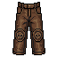 | **Scorched Marrow Chausses** | Tattered brown leather pants with charred edges and dark staining. Reinforced at the knees with iron rivets. Vertical striping and weathered fabric suggest both age and brutal wear. A faint ashen residue clings to the lower legs. | *Forged in the aftermath of a nameless conflagration, these legs have carried warriors through hellfire and shadow alike. The stains upon them tell of horrors best left unremembered.* | Samurai, Mage, Archer, Warrior |
| 28 |  | **Charred Marrow Greaves** | Tattered brown leather pants with dark, burnt-charred sections across the thighs and lower legs. Weathered buckles and straps run down the sides. The fabric shows signs of age and scorching, with frayed edges and a mottled, ash-like discoloration throughout. | *Forged in the ashes of a long-forgotten pyre, these greaves carry the weight of curses and flame. Those who don them feel the phantom heat of their creation, a constant reminder that some burdens can never truly be shed.* | Samurai, Mage, Archer, Warrior |
| 29 |  | **Stormweave Greaves** | Segmented leg armor in deep azure and white, featuring diagonal lightning bolt patterns. Reinforced knee guards with metallic trim, layered fabric panels suggesting storm clouds, and intricate blue-white geometric stitching throughout. | *Woven from the hide of creatures that dwell in perpetual tempests, these greaves crackle with residual electricity. Those who wear them move as if riding the edge of a breaking storm.* | Samurai, Mage, Archer, Warrior |
| 30 | 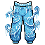 | **Azurite Wanderer's Legguards** | A pair of bright blue fabric pants with darker blue accents and reinforced knee sections. The material appears layered and quilted, featuring subtle geometric stitching patterns. White or silver trim runs along the seams and waistband, with what appears to be small decorative rivets or studs at the sides. | *Woven from the azure cloth of fallen wanderers, these legguards have absorbed countless miles of cursed roads. They offer no resistance to blade or spell, yet those who wear them find themselves perpetually unseen by the eyes that hunt.* | Samurai, Mage, Archer, Warrior |
| 31 | 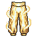 | **Goldleaf Greaves** | Knee-length pants crafted from supple leather in rich golden-tan hues. Reinforced with ornate brass plating along the sides and thighs. Detailed embroidered patterns suggest flowing leaves or script along the legs. The fabric appears weathered yet regal, with subtle metallic accents catching light. | *Woven from the hides of creatures long forgotten, these greaves shimmer with an otherworldly sheen. Those who wear them claim to feel the weight of ages lifting from their limbs, as if blessed by spectral guardians of a fallen realm.* | Samurai, Mage, Archer, Warrior |
| 32 | 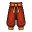 | **Emberfall Legguards** | Sturdy crimson and orange fabric pants with deep burgundy accents. The material appears scorched and weathered, with flame-like patterns woven throughout. Gold-bronze plating reinforces the upper thighs and sides, creating a battle-worn silhouette. | *Forged in the ash-choked depths where kingdoms burned, these leggings carry the scorch of ancient infernos. Those who don them walk through flame as though it were memory itself.* | Samurai, Mage, Archer, Warrior |
| 33 |  | **Stormweave Legguards** | Knee-length pants woven from deep blue fabric with intricate silver threading. Lightning-like patterns cascade down the legs, with white accents at the seams and reinforced edges. A darker blue forms the main body with lighter blue stripes creating a dynamic, flowing appearance. | *Forged in the heart of a shattered tempest, these legguards crackle with residual electricity. Those who wear them claim to feel the storm's pulse coursing through their very bones.* | Samurai, Mage, Archer, Warrior |
| 34 | 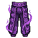 | **Violetblight Greaves** | Segmented leg armor in deep purple with darker violet accents. Features ornate buckles and straps with an otherworldly shimmer. The fabric sections between plates appear almost translucent, with an ethereal glow emanating from within. | *Forged in shadow and sorrow, these greaves whisper of curses woven into their very threads. Those who wear them move with an unnatural grace, as if the darkness itself guides their steps.* | Samurai, Mage, Archer, Warrior |
| 35 | 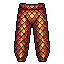 | **Crimson Weave Legguards** | Pixel-art pants featuring deep crimson and rust-red woven fabric with a diamond lattice pattern. Dark brown accents frame the waistband and leg cuffs. The weave creates a textured, armor-like appearance with subtle shading suggesting layered material. | *Woven from the cloaks of fallen templars, these legguards carry the weight of old blood and older oaths. Those who don them find their resolve hardened, though whispers suggest the fabric itself remembers its previous bearers.* | Samurai, Mage, Archer, Warrior |
| 36 | 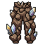 | **Blackforged Greaves of Mourning** | Heavy leg armor crafted from dark iron with intricate bronze accents and rivets. Features asymmetrical plating with layered segments, adorned with tattered cloth wrappings around the calves. The color scheme is predominantly charcoal black with oxidized copper trim. | *Forged in the depths of a cursed smithy, these greaves bear the weight of countless fallen warriors. They ground the wearer in grim resolve, though some say the metalwork whispers of those who never returned.* | Samurai, Mage, Archer, Warrior |
| 37 | 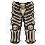 | **Bonelace Greaves** | Segmented leg armor in cream and dark brown tones, featuring intricate skeletal bone patterns woven throughout. Reinforced plates with ornamental rib-like detailing run vertically. Angular knee guards and wrapped shin sections suggest both mobility and durable craftsmanship. | *Forged from the bones of forgotten war-beasts and bound with sinew, these greaves whisper of battlefields long swallowed by ash. Those who wear them find their steps unnaturally steadied, as if guided by spectral hands.* | Samurai, Mage, Archer, Warrior |
| 38 | 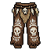 | **Shadowbound Greaves** | Dark brown leather pants with ornate brass buckles and rivets along the sides. Intricate gold embroidery traces geometric patterns down the legs. The fabric appears weathered and reinforced, with darker staining suggesting age and use in battle. | *Forged in the depths of forgotten vaults, these greaves carry the weight of countless fallen. They offer no comfort-only the promise that you will walk further into darkness than those who came before.* | Samurai, Mage, Archer, Warrior |
| 39 | 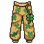 | **Blight-Warden Leggings** | Tattered yellow-ochre pants with dark green and brown patchy discoloration suggesting decay or alchemical corruption. Reinforced with dark bands at the waist and ankles. The fabric appears weathered and stained, with an almost diseased appearance throughout. | *Garments steeped in the miasma of forgotten plagues. Those who don these legs find their flesh oddly resistant to corruption-or perhaps merely already claimed by it.* | Samurai, Mage, Archer, Warrior |
| 40 | 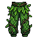 | **Thornveil Greaves** | Moss-covered leg armor with creeping vines and dark green foliage woven throughout. The fabric appears organic, almost living, with shadowy brown leather panels reinforcing the thighs and shins. Thorny protrusions jut from the sides. | *Grown rather than forged, these cursed leggings writhe with ancient forest hunger. Those who wear them feel the weight of the wild pressing against their flesh-a constant reminder that nature itself thirsts for their vitality.* | Samurai, Mage, Archer, Warrior |
| 41 |  | **Verdant Shroud Leggings** | Moss-covered leg armor with trailing vines and withered foliage. Deep forest green base with brown leather straps, overgrown with creeping vegetation. Tattered cloth edges suggest ancient abandonment. | *Once worn by a druid-knight consumed by the primordial forest, these leggings breathe with the slow rot of centuries. The vines that cling to them whisper of forgotten groves and the hunger of the earth.* | Samurai, Mage, Archer, Warrior |
| 42 | 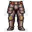 | **Bloodstained Leggings of the Fallen** | Tattered brown leather pants with deep crimson stains and dark patches. Reinforced at the knees and thighs with worn metal plating. Frayed edges and weathered texture suggest countless battles endured. | *Once worn by a warrior of renown, these leggings carry the weight of spilled blood and forgotten oaths. They offer no comfort, only the grim promise of survival.* | Samurai, Mage, Archer, Warrior |
| 43 | 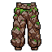 | **Bogrot Leathers** | Weathered brown and olive canvas pants with darker mottled patches suggesting age and decay. Heavy fabric shows signs of wear with frayed edges and discolored splotches. Reinforced seams and asymmetrical patterning give a battle-worn, asymmetrical appearance. | *Wrought from the hides of forgotten marshlands, these leathers reek of ancient earth and sacrifice. Those who don them find their movements steady, as if the bog itself guides each step.* | Samurai, Mage, Archer, Warrior |
| 44 | 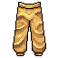 | **Goldweave Legguards** | Sturdy fabric pants in warm golden-tan hues with darker brown accents and intricate woven patterns. Features reinforced panels and layered construction suggesting durability and crafted quality. | *Woven from the fibers of fallen kingdoms, these legguards bear the weight of countless journeys through shadow and ash. They offer steady protection to those who refuse to falter.* | Samurai, Mage, Archer, Warrior |
| 45 | 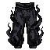 | **Shadowrift Breeches** | Dark charcoal pants with tattered edges and wispy black tendrils of ethereal fabric coiling around the legs. Reinforced with darker stitching and adorned with small void-like symbols that seem to absorb light. | *Woven from the remnants of a shadow realm, these breeches grant passage through darkness itself. Those who wear them leave barely a whisper in their wake.* | Samurai, Mage, Archer, Warrior |
| 46 | 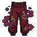 | **Bloodweavers Chausses** | Deep crimson and burgundy fabric legwear with ornate quilted panels. Dark purple embroidered patterns serpent across the thighs. Reinforced with black leather straps and metal rivets at the waist and knee joints. Tattered hemlines suggest age and countless battles. | *Woven from the sinews of forgotten empires, these cursed legwraps whisper of spilled blood with every step. Those who don them feel the weight of ancient violence settling into their bones.* | Samurai, Mage, Archer, Warrior |
| 47 | 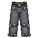 | **Gravescript Legguards** | Dark charcoal-gray reinforced pants with intricate runic patterns etched across the thighs and calves. Tattered edges and weathered leather suggest ancient battles. Metal rivets and buckles reinforce the waistband and sides, with a faint luminescent glow emanating from the carved runes. | *Forged in the ash-choked forges of a fallen kingdom, these legguards whisper forgotten incantations with each step. Those who wear them feel the weight of countless souls bound within their weave, granting steadiness in the darkest of trials.* | Samurai, Mage, Archer, Warrior |
| 48 | 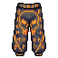 | **Embercinder Britches** | Burnt orange and deep brown tactical pants with scorched fabric panels. Reinforced thighs feature intricate dark stitching patterns. Ash-grey accent strips run along the sides with a distinctive ember-glow shimmer suggesting heat-treated leather. | *Forged in the kilns of fallen empires, these pants carry the scent of sulfur and ancient fire. Those who wear them claim to feel the warmth of a dying world beneath their skin.* | Samurai, Mage, Archer, Warrior |
| 49 | 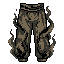 | **Shadowthorn Greaves** | Dark olive-green pants with prominent black thorn-like protrusions along the legs. Tattered lower edges and weathered leather segments. Intricate web-like patterns woven across the thighs in murky tones. | *Woven from the hides of creatures that dwelt in lightless depths, these greaves whisper of thorns and shadow. Those who wear them find their footsteps swallowed by darkness.* | Samurai, Mage, Archer, Warrior |
| 50 |  | **Abyssal Depths Leggings** | Deep blue pixel-art pants with intricate silver and white geometric patterns across the fabric. Features angular shoulders and reinforced segments with a crystalline sheen, suggesting an otherworldly, oceanic material. | *Woven from the depths where light fears to tread, these leggings grant the wearer an unshakeable connection to the void below. Those who don them find their movements unnaturally fluid, as if walking through water rather than air.* | Samurai, Mage, Archer, Warrior |
| 51 |  | **Amethyst Blight Leggings** | Ornate purple pants with deep violet hue and crystalline amethyst formations across the thighs and calves. Dark fabric interwoven with glowing arcane runes. Reinforced plating at the knees with jagged, gemstone-like protrusions. Ethereal wisps curl around the legs. | *Wrought from the corrupted essence of a shattered amethyst citadel, these leggings whisper with the voices of those who fell defending its halls. The wearer feels weight lift from their limbs, as if walking between worlds.* | Samurai, Mage, Archer, Warrior |
| 52 | 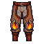 | **Embercinder Greaves** | Segmented leg armor in deep crimson and charred brown, accented with golden clasps and rivets. Ornate flame-like patterns ridge the thighs, fading to ash-grey at the shin guards. Singed leather wrappings coil around the ankles. | *Forged in the depths where embers never die, these greaves carry the warmth of a dying world. Those who wear them walk unflinching through inferno and ruin alike.* | Samurai, Mage, Archer, Warrior |
| 53 | 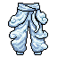 | **Frostweave Legguards** | Pale blue-grey cloth pants with quilted diamond patterns and reinforced knee sections. Frost-like crystalline protrusions emanate from the fabric, creating an ethereal, icy shimmer across the legs. The material appears both protective and spectral. | *Woven from the preserved sinews of winter itself, these legguards grant their wearer an unnatural chill that numbs both blade and bone. Those who don them report hearing whispers carried on winds that no longer blow.* | Samurai, Mage, Archer, Warrior |
| 54 | 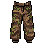 | **Scorched Marrow Legguards** | Brown and tan canvas pants with darker burnt sienna patches and weathered seams. Reinforced knees with visible stitching. Mottled, aged fabric suggesting exposure to ash and decay. Loose fit with practical pockets and frayed edges at the ankles. | *Once worn by those who walked through burning cities, these leggings carry the stench of old smoke and bitter loss. Each patch marks a journey through lands consumed by shadow.* | Samurai, Mage, Archer, Warrior |
| 55 | 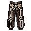 | **Shadowpact Cuisses** | Dark brown leather pants with black ornamental stitching and metallic buckles. Reinforced thigh plates feature bronze accents and intricate geometric patterns. The fabric shows wear and age, with subtle tears revealing darker underlayers beneath. | *Forged in the crypts of forgotten kingdoms, these legs have carried warriors through battlefields soaked in elder blood. The leather remembers every step toward oblivion.* | Samurai, Mage, Archer, Warrior |
| 56 |  | **Shadowpiercer Greaves** | Dark segmented leg armor with sharp, angular plating. Black metal with deep purple accents runs along the sides. Bone-white striping details the knee sections. The silhouette is lean and predatory, suggesting both mobility and lethal purpose. | *Forged in the lightless depths where shadow takes form, these greaves allow the wearer to move between worlds unseen. Each step echoes with the weight of forgotten murders.* | Samurai, Mage, Archer, Warrior |
| 57 | 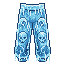 | **Ancient Frostweave Legguards** | Flowing pants in icy blue and white hues with intricate crystalline patterns. The fabric appears woven from ethereal frost-touched material, featuring jagged ice-like protrusions along the seams and a shimmering, translucent quality that suggests magical enchantment. | *Wrought from the very essence of eternal winter, these legguards whisper of forgotten glaciers and the cold that devours empires. To wear them is to carry the numbing weight of an ageless curse.* | Samurai, Mage, Archer, Warrior |
| 58 |  | **Verdantbloom Legguards** | Black armored pants with glowing green accents and organic vine-like patterns. Emerald runes spiral along the thighs, with bioluminescent moss growth at the joints. The fabric appears woven with corrupted nature, blending metal plating with living plant matter. | *Forged in the depths where light and rot intertwine, these legguards pulse with ancient verdancy. Those who don them feel the creeping weight of the earth itself, as if roots slowly bind their very stride.* | Samurai, Mage, Archer, Warrior |
| 59 | 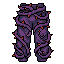 | **Veilweave Legguards** | Dark purple fabric pants with intricate black embroidered patterns throughout. The material appears luxurious yet worn, with wisps of ethereal energy seeming to coalesce around the legs. Shadowy tendrils cascade down from the waistband like smoke. | *Woven from the twilight between worlds, these legguards grant the wearer passage through veils unseen. Those who don them report feeling watched by something just beyond perception.* | Samurai, Mage, Archer, Warrior |
| 60 | 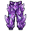 | **Voidborn Amethyst Blight Leggings** | Segmented leg armor in deep purple with crystalline amethyst growths protruding from the thighs and calves. Dark violet fabric underlayer with ornate obsidian buckles at the waist and knees. Sharp, jagged gemstone formations glint ominously across the surface. | *Forged from the corrupted essence of a shattered geode, these leggings whisper with the hunger of the void. Those who wear them find their steps quickened by malevolent energies, though the crystalline fragments slowly drain the wearer's vitality.* | Samurai, Mage, Archer, Warrior |
| 61 | 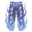 | **Abyssal Weave Chausses** | Indigo and violet pixel-art pants with ethereal blue gradient swirls and crystalline geometric patterns. The fabric appears otherworldly with shimmering vertical striations and arcane symbols woven throughout, suggesting enchanted material that shifts between deep purple and icy blue hues. | *Forged from the remnants of a shattered astral realm, these chausses whisper with forgotten incantations. Those who wear them find their steps lighter, their resolve hardened against the encroaching darkness.* | Samurai, Mage, Archer, Warrior |
| 62 | 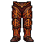 | **Emberscourge Legguards** | Segmented pants with deep crimson and burnt orange hues, adorned with ornate black metal plating along the thighs and shins. Intricate gold threading traces angular patterns across the fabric, with smoldering embers seeming to glow faintly within the weave. | *Forged in the dying breath of a fallen war-god, these legguards carry the weight of countless battles. The cloth still radiates a phantom heat, as if the wearer walks perpetually through ash and fire.* | Samurai, Mage, Archer, Warrior |
| 63 | 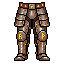 | **Scorched Marauder's Greaves** | Heavy leather and brass leg armor with a burnt sienna and charcoal color scheme. Reinforced with dark metal plating at the thighs and shins. Weathered fabric shows scorch marks and battle-worn creasing. Multiple buckles and straps run vertically down each leg. | *Forged in the aftermath of a cursed siege, these greaves bear the scorching touch of fell magic. Those who wear them carry the weight of a thousand marches through ashen wastelands.* | Samurai, Mage, Archer, Warrior |
| 64 | 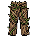 | **Deepwood Legguards** | Moss-covered leather pants with dark brown and olive tones. Reinforced with aged bronze buckles and weathered sinew bindings. Overgrown with creeping vines and fungal patterns across the thighs, suggesting long burial in corrupted forest soil. | *Garments claimed from a drowned grove where ancient things still root. The land itself has claimed them as its own, granting the wearer a strange kinship with the decay that dwells beneath.* | Samurai, Mage, Archer, Warrior |
| 65 | 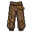 | **Deepwood Stalker's Leggings** | Dark brown and olive canvas pants with reinforced leather patches at the knees and thighs. Weathered fabric shows mottled earth tones with subtle embroidered patterns along the seams. Multiple pouches hang from the waist cord, suggesting a traveler's practicality. | *Garments worn by those who walk between shadow and stone. These leggings carry the weight of countless journeys through corrupted forests and forgotten places, their fabric infused with the resilience of those who survive where others perish.* | Samurai, Mage, Archer, Warrior |
| 66 | 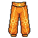 | **Emberscourge Leggings** | Golden-orange linen pants with darker burnt-orange accents along the seams and hem. The fabric shows a mottled, heat-worn texture suggesting exposure to intense flame. Reinforced knee patches and a sturdy waistband define the silhouette. | *Forged in the dying embers of a corrupted forge, these leggings bear the scars of infernal trials. Those who wear them find their resolve tempered, yet their mortality ever present.* | Samurai, Mage, Archer, Warrior |
| 67 |  | **Thornveil Legguards** | Tattered pants of deep forest green and black, woven with creeping thorned vines that curl organically down the legs. Patches of decaying moss cling to the fabric, with darker stains suggesting age or worse. The edges fray into whisper-thin strands. | *Forged from the cursed flora of the Rotwood, these leggings bind the wearer with thorns that itch and whisper ancient warnings. Those who wear them claim the plants themselves guide their steps-whether toward salvation or ruin remains unclear.* | Samurai, Mage, Archer, Warrior |
| 68 |  | **Verdantmire Greaves** | Moss-green fabric pants with darker forest-green accents and natural leaf-like patterns woven throughout. The material appears organic and slightly luminescent, with trailing vine motifs along the seams and a mottled, weathered appearance suggesting deep woodland origins. | *Woven from the cursed flora of ancient forests, these greaves pulse with an otherworldly vitality. Those who wear them find themselves bound to the deep places where sunlight fears to tread.* | Samurai, Mage, Archer, Warrior |
| 69 |  | **Tattered Veilweave Leggings** | Weathered denim pants with a pale blue-gray tone, featuring significant fraying and tattered edges at the hem. Dark vertical seams and patches suggest age and heavy wear. The fabric appears thin and ethereal, with an almost ghostlike quality to its coloration. | *Once worn by those who walked between worlds, these frayed leggings carry the weight of forgotten journeys. The veil between realms grows thin where they touch.* | Samurai, Mage, Archer, Warrior |
| 70 |  | **Thornweave Greaves** | Ornate leg armor with a dark olive-green base adorned with black thorny vines and golden accents. The design features a symmetrical pattern of interlocking spikes and organic curves, suggesting both natural growth and deliberate craftsmanship. Tattered cloth strips hang from the waist. | *Forged in shadow and wreathed in thorns that draw blood from those who dare approach their wearer. These greaves whisper of a pact made long ago-protection bought at the price of constant, gnawing pain.* | Samurai, Mage, Archer, Warrior |
| 71 |  | **Veilthread Legguards** | Dark purple fabric pants with intricate arcane embroidery. Silver rune-work traces the seams and cuffs. The material appears lightweight yet reinforced, with a subtle ethereal shimmer suggesting enchantment. | *Woven from cloth touched by the void itself, these legguards grant the wearer an otherworldly grace. Those who don them find their steps muted and their movements fluid, as if walking between worlds.* | Samurai, Mage, Archer, Warrior |
| 72 |  | **Cinderweave Tassets** | Layered armor skirt with deep crimson and burnt orange fabrics. Gold and brass buckles secure overlapping panels. Dark leather reinforcements at the sides. Tattered edges suggest battle wear and ember-like scorching along the hem. | *Forged in the kilns of a fallen empire, these tassets bear the scars of dragonfire and ash. They grant their wearer resilience against both steel and sorcery, though wearing them stirs whispers of the catastrophe that birthed them.* | Samurai, Mage, Archer, Warrior |
| 73 |  | **Voidweave Breeches** | Dark purple pants with intricate black embroidered patterns across the legs and thighs. The fabric appears layered and textured, with flowing edges and ethereal wisps extending from the seams, suggesting an otherworldly material that seems to shift between solid and shadow. | *Woven from the threads of forgotten voids, these breeches grant their wearer an uncanny grace in shadow and step. Those who don them report a creeping sensation, as though darkness itself clings to their legs.* | Samurai, Mage, Archer, Warrior |
| 74 |  | **Scorched Exile Greaves** | Dark brown leather pants reinforced with bronze plating along the thighs and shins. Charred fabric edges and faded burn marks suggest survival through hellfire. Tattered cloth strips hang from the waistband, adorned with small bronze studs. | *Worn by those cast out from kingdoms of ash. These greaves carry the weight of exile and the memory of flames that consumed all they once held dear.* | Samurai, Mage, Archer, Warrior |
| 75 |  | **Embercrimson Tassets** | Ornate leg armor with deep crimson and gold brocade patterns. Heavy layered fabric with metallic plating at the thighs, accented by burgundy silk ties and gold embroidered motifs suggesting ancient nobility or war regalia. | *These storied greaves have drunk deep of ancient battlefields, their crimson dye said to be born from elder blood. Those who don them feel the weight of countless warriors pressing forward, their wills demanding victory.* | Samurai, Mage, Archer, Warrior |
| 76 |  | **Nightveil Leggings** | Flowing purple pants with deep indigo gradients and ethereal wisps. The fabric appears to shimmer with arcane energy, featuring ornate silver embroidery along the seams. Dark cosmic patterns swirl across the legs like shadows given form. | *Woven from the twilight between worlds, these leggings grant passage through darkness itself. Those who wear them find the veil between realms grows thin, their steps muffled by forces beyond mortal comprehension.* | Samurai, Mage, Archer, Warrior |
| 77 |  | **Abyssal Weave Legguards** | Deep navy and midnight blue fabric with intricate glowing rune patterns. The weave displays subtle constellation motifs across the thighs and calves, with darker blue leather reinforcements at the seams. Small crystalline shards protrude irregularly along the edges, emanating faint ethereal light. | *Woven from the depths where starlight fears to tread, these legguards bear the weight of forgotten oaths. Those who wear them find their steps quickened by whispers of the void itself.* | Samurai, Mage, Archer, Warrior |
| 78 |  | **Ember Goldweave Legguards** | Sturdy canvas pants in earthy tan and golden-brown tones, reinforced with copper-colored threading and rivets. Features multiple cargo pockets, rolled cuffs, and worn patches suggesting long travel through harsh terrain. | *Woven from the hide of creatures long forgotten, these legguards have absorbed the essence of a hundred battlefields. They grant their wearer the resilience of the old world-unyielding, timeless, and marked by the scars of ages past.* | Samurai, Mage, Archer, Warrior |
| 79 |  | **Obsidian Legguards of Dusk** | Dark metallic leg armor with deep blue-black plating and intricate gold trim. Features segmented thigh and shin guards with ornate clasps. Deep indigo gradient fades to black at edges, suggesting aged steel forged in shadow. | *Wrought from ore pulled from depths where sunlight fears to tread, these legguards carry the weight of countless nights. They grant their wearer the sureness of one who walks between worlds.* | Samurai, Mage, Archer, Warrior |
| 80 |  | **Hollow Verdant Plague Greaves** | Segmented leg armor in sickly green with organic, fungal growths protruding from the surface. The plates appear corroded and wrapped in creeping moss or diseased flora, with darker green accents and an eerie luminescent sheen. | *Once worn by those who trespassed in forbidden groves, these greaves carry the lingering curse of nature's wrath. The wearer finds their steps quickened, yet haunted by whispers of decay.* | Samurai, Mage, Archer, Warrior |
| 81 |  | **Azurite Depths Greaves** | Thigh-high leg armor in deep cerulean blue with intricate crystalline patterns. Sharp angular plating overlaps down the shins, accented by lighter blue ethereal wisps that seem to flow across the surface. Reinforced with darker indigo bands at waist and ankles. | *Forged from ore pulled from abyssal trenches, these greaves whisper with the weight of drowned civilizations. Each step echoes with the memory of sunken kingdoms.* | Samurai, Mage, Archer, Warrior |
| 82 |  | **Emberfall Greaves** | Crimson and rust-brown leather pants reinforced with ornate metal plating at the thighs and shins. Intricate flame-like patterns are etched across the fabric, with golden rivets catching the light. The edges show weathered wear and ash-stained creases. | *Forged in the depths where fire consumes all, these greaves bear the scorch marks of forgotten battles. To wear them is to invite the heat of ruin into your very stride.* | Samurai, Mage, Archer, Warrior |
| 83 |  | **Motleyweave Leggings** | Vibrant patchwork pants crafted from tessellating fabric strips in jewel tones-emerald, sapphire, crimson, and gold. Irregular geometric patterns create a chaotic, almost hypnotic design. Reinforced stitching traces the seams with darker thread, suggesting both durability and arcane intent. | *Woven from the cloaks of a thousand wanderers, these impossible breeches shift in hue with each step. Those who wear them claim the colors whisper forgotten languages-whether blessing or curse remains unclear.* | Samurai, Mage, Archer, Warrior |
| 84 |  | **Voidborn Ossein Legguards** | Bone-white segmented pants with cream and tan striping. Features skeletal knee plating, tattered fabric edges, and weathered ivory bone reinforcements along the thighs. Adorned with small bone charms and aged leather straps. | *Forged from the remains of forgotten warriors, these legguards whisper of countless battles. They move with an unnatural heaviness, as if bound by the very curses that claimed their previous bearers.* | Samurai, Mage, Archer, Warrior |
| 85 |  | **Shattered Emberscourge Legguards** | Weathered leather pants with burnt orange and deep brown tones. Reinforced with dark metal plating at the thighs and knees. Intricate ash-colored embroidery traces the seams, suggesting flame patterns. Frayed edges and scorch marks across the fabric indicate exposure to intense heat. | *Forged in the depths of a long-extinguished forge, these legguards bear the scars of cataclysm. Those who don them feel the phantom warmth of ancient fires, as if walking through ash-choked wastelands long turned to dust.* | Samurai, Mage, Archer, Warrior |
| 86 |  | **Veilstitched Legguards** | Dark indigo and purple reinforced trousers with intricate stitched patterns and mystical sigils. Features layered fabric with metallic gray plating on thighs and reinforced knee sections. Ethereal blue glowing accents trace along seams and edges, suggesting arcane binding. | *Woven from cloth touched by shadow itself, these legguards hum with residual magic. Those who don them report phantom whispers at dusk, as if the garment remembers every battlefield it has crossed.* | Samurai, Mage, Archer, Warrior |
| 87 |  | **Rotscourge Legguards** | Weathered olive and brown camouflage patterned trousers with heavy fabric texture. Multiple cargo pockets and reinforced seams suggest durable field wear. Dark staining and worn edges imply prolonged exposure to harsh terrain and decay. | *Garments worn by those who wade through cursed lands. The fabric remembers every plague and ruin it has endured, granting its wearer an unnatural resilience to the corruption that festers in shadow.* | Samurai, Mage, Archer, Warrior |
| 88 |  | **Abyssal Weave Leggings** | Deep indigo pixel-art pants with intricate blue celestial patterns woven throughout. Features darker blue accents along the seams and thighs, with a mystical, almost oil-slick iridescence suggesting otherworldly fabric. Tapered cut with subtle armored plating at the knees. | *Woven from the depths where light fears to tread, these leggings grant the wearer an ethereal stride. The void whispers through their threads, marking the bearer as one who has glimpsed the spaces between worlds.* | Samurai, Mage, Archer, Warrior |
| 89 |  | **Veilbound Greaves** | Heavy segmented leg armor in deep olive and charcoal tones with weathered brass buckles. Layered overlapping plates form a scaled pattern down each leg, with dark weathering suggesting age and countless battles. Reinforced at the knees with ornate riveted panels. | *Forged in an age of shadow, these greaves anchor the wearer to realms between light and dark. Those who don them feel the weight of countless fallen warriors binding to their legs.* | Samurai, Mage, Archer, Warrior |
| 90 |  | **Frostbind Leggings** | Pale blue fabric pants with darker indigo accents and stitching. Features reinforced knee guards and calf wrappings in muted steel-grey. Frost-like crystalline patterns shimmer along the seams and hem. | *Woven from the hide of creatures that dwell in sunless depths, these leggings bear the eternal chill of their origin. The wearer treads between warmth and oblivion, their stride marked by whispers of frozen air.* | Samurai, Mage, Archer, Warrior |
| 91 |  | **Embercrimson Legguards** | Segmented cloth and leather pants in deep crimson and burnt orange hues. The fabric shows deliberate tearing and scorching patterns, with darker red striping along the sides. Reinforced with darker leather panels at the thighs and knees, suggesting fire-touched resilience. | *Forged in the ash of fallen empires, these legguards bear the scars of infernal trials. Those who wear them stride through shadow and flame alike, forever marked by the price of survival.* | Samurai, Mage, Archer, Warrior |
| 92 |  | **Voidborn Embercrimson Legguards** | Sturdy leg armor with deep burgundy and rust-orange hues, accented by darker brown leather straps and buckles. Ornate embroidered patterns run down the outer seams in metallic thread. The fabric appears weathered and battle-worn, with singed edges suggesting exposure to intense flame. | *Forged in the dying embers of a fallen war-mage's sanctum, these legguards bear the scorch marks of arcane fury. Those who wear them feel the phantom warmth of battles long past, granting resilience to both blade and sorcery alike.* | Samurai, Mage, Archer, Warrior |
| 93 |  | **Bleached Wanderer's Greaves** | Cream-colored linen pants with dark tan accents and stitching. Features reinforced thigh panels and wrapped lower leg sections in muted earth tones. Simple, practical design suggesting prolonged travel through desolate lands. | *Worn by those who traverse the ashen wastes. These greaves have absorbed the dust of countless fallen kingdoms, their pale fabric stained by the passage of ages and darker purposes.* | Samurai, Mage, Archer, Warrior |
| 94 |  | **Ember Frostweave Legguards** | Thigh-high pants rendered in cool blue and cyan tones with intricate crystalline patterns. The fabric appears to shimmer with ice-like textures and geometric frost formations. Reinforced knee plates and decorative trim suggest both mobility and ethereal protection. | *Woven from the sinews of winter itself, these legguards grant the wearer an unnatural chill that spreads with each stride. Those who don them speak of whispered voices echoing from the frozen depths below.* | Samurai, Mage, Archer, Warrior |
| 95 |  | **Duskweave Greaves** | Deep indigo leg armor with intricate silver threading and arcane runes. Features layered fabric panels with dark blue accents, ornate buckles at the sides, and a mysterious ethereal glow emanating from woven patterns. | *Forged in the twilight between worlds, these greaves bind the wearer to the liminal spaces where shadow and starlight converge. Those who don them find their steps guided by forces older than memory.* | Samurai, Mage, Archer, Warrior |
| 96 |  | **Tideweaver's Leggings** | Teal and turquoise pixel-art pants with flowing, wave-like patterns throughout. The fabric appears layered and billowing, with darker teal accents at the waist and ankles. Subtle aquamarine highlights suggest an ethereal, water-touched material with an almost iridescent quality. | *Woven from the sinews of drowned kingdoms, these leggings grant the wearer an otherworldly grace. The fabric flows like water itself, as if the wearer walks between tides rather than through solid ground.* | Samurai, Mage, Archer, Warrior |
| 97 |  | **Shadowweave Greaves** | Dark charcoal pants with intricate black woven patterns throughout. The fabric appears dense and layered, with subtle crimson accents along the seams. Sharp, angular designs suggest both arcane runes and tactical armor plating. | *Woven from the threads of fallen nights, these greaves grant passage through shadow itself. Those who wear them carry the weight of forgotten curses upon their legs.* | Samurai, Mage, Archer, Warrior |
| 98 |  | **Ravenwing Chausses** | Tan leather pants with large cream-colored owl or bird wing motifs on each thigh. Dark brown accents at waistband and cuffs. Weathered texture suggests aged craftwork with subtle feather detailing. | *Forged from the hide of creatures long forgotten, these legguards bear the faded sigil of an ancient order. To wear them is to invite the gaze of things that hunt in darkness.* | Samurai, Mage, Archer, Warrior |
| 99 |  | **Crimsonfang Greaves** | Deep burgundy leather pants with jagged crimson accents along the sides and legs. Dark red stitching traces angular patterns reminiscent of fang marks or claw slashes. The fabric appears worn yet resilient, with subtle metallic burgundy threading that catches light. | *Forged from the hide of creatures long forgotten, these greaves whisper of bloodshed and survival. Those who wear them find their steps quickened by an ancient hunger that dwells within the fabric itself.* | Samurai, Mage, Archer, Warrior |
| 100 |  | **Frostweave Leggings** | Ice-blue fabric pants with intricate silver threading and crystalline patterns. Frost accents shimmer along the seams and hem, with a pale cyan glow emanating from the material. The texture appears ethereal yet durable, suggesting magical reinforcement woven throughout. | *Garments spun from the frozen tears of forgotten winters. Those who wear them find their resolve hardened against both blade and despair, though some say the cold never truly leaves their bones.* | Samurai, Mage, Archer, Warrior |
