# Plates — Item Catalog

> **Category:** Chest Armor  
> **Total items:** 100  
> **Classes:** Warrior, Samurai

| # | Preview | Item Name | Visual Description | Description | Classes |
|:-:|:-------:|:----------|:------------------|:------------|:--------|
| 1 |  | **Bloodthorn Cuirass** | A dark crimson chest plate with jagged, thorn-like protrusions across the shoulders and torso. The armor features deep burgundy coloring with darker shadowy recesses, creating an organic, almost flesh-like texture. Spikes and barbed ridges give it an intimidating, predatory appearance. | *Forged from the carapace of a creature long forgotten, this armor thirsts for violence. Those who don it find themselves drawn deeper into the abyss, their resolve hardened but their humanity fading with each battle.* | Warrior, Samurai |
| 2 |  | **Voidthorn Cuirass** | A dark purple chest plate adorned with jagged, thorn-like protrusions spiraling across the torso. The armor gleams with an otherworldly, ethereal sheen, featuring intricate void-black metalwork with violet accents that seem to pulse with malevolent energy. | *Forged in the depths of the Shattered Abyss, this cursed plate drinks in shadow itself. Those who don its thorns find their pain becomes their greatest weapon—each wound inflicted returns tenfold to their foes.* | Warrior, Samurai |
| 3 | 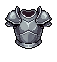 | **Ironpact Cuirass** | A dark steel chest plate with ornate shoulder pauldrons. Deep gray-black metallic finish with subtle crimson accents along the edges and central breastplate. Angular, imposing silhouette with layered plating and a distinctive embossed crest at the sternum. | *Forged in ancient bloodstone furnaces, this cuirass remembers the weight of kingdoms. Those who don it feel the resolve of fallen champions settling upon their shoulders—a burden both terrible and fortifying.* | Warrior, Samurai |
| 4 | 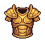 | **Goldplate Sentinel** | A ornate golden chest plate with red-orange accents and decorative quilting beneath. Features robust shoulder pauldrons and a reinforced center breastplate with angular geometric patterns. The craftsmanship suggests both elegance and formidable protection. | *Forged in the foundries of a forgotten empire, this gilded cuirass has weathered countless conflicts. Its radiant surface belies the countless souls it has shielded from oblivion.* | Warrior, Samurai |
| 5 | 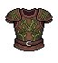 | **Rotwood Cuirass** | A moss-covered chest plate with decaying wood grain and verdant fungi growth. Deep browns and sickly greens dominate the surface, with organic tendrils creeping across rusted metal bands. The fabric underneath appears tattered and ancient. | *Cursed armor that feeds on flesh and time itself. Those who don this decay-ridden plate find their very vitality consumed by the hungry rot that dwells within its fibers.* | Warrior, Samurai |
| 6 | 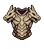 | **Goldenscale Cuirass** | A ornate chest plate featuring overlapping golden scales arranged in a protective pattern. The armor displays intricate detailing with warm bronze and gold tones, adorned with decorative clasps and embossed motifs suggesting both refinement and martial prowess. | *Forged in an age when gold could hold enchantments, this scaled cuirass whispers of forgotten dynasties. Those who wear it feel the weight of ancestral strength, though some say the metal grows cold when death draws near.* | Warrior, Samurai |
| 7 | 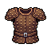 | **Bloodweave Cuirass** | A worn leather and cloth chest armor in deep burgundy and brown tones. Intricate crimson threading weaves across the fabric in ritualistic patterns. The material appears aged and stained, with reinforced stitching along the shoulders and torso. | *Stitched from the hides of forgotten battlefields, this cuirass thrums with the accumulated anguish of a thousand fallen warriors. Those who don it find their resolve hardened—at the cost of their humanity.* | Warrior, Samurai |
| 8 | 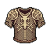 | **Thornscale Cuirass** | A brown leather chest piece reinforced with overlapping bronze-tinted scales arranged in a layered pattern. Gold-threaded embroidery forms arcane symbols across the shoulders and chest. The material appears weathered yet resilient, with a subtle metallic sheen. | *Forged in ages past when beast and blade were one, this armor remembers the scales of creatures long extinct. Those who don it find themselves marked by an ancient pact—protection born of predation.* | Warrior, Samurai |
| 9 | 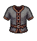 | **Bloodstitched Doublet** | A dark brown leather chest piece with crimson thread forming ritualistic patterns across the torso. Reinforced with dark metal studs and clasps, featuring a deep burgundy undershirt visible at the collar and sleeves. The stitching creates intricate geometric designs suggesting both craftsmanship and dark purpose. | *Woven with thread soaked in ancient blood, this garment whispers of pacts made in shadow. Those who wear it feel the weight of countless oaths—burdens that strengthen the flesh but gnaw at the spirit.* | Warrior, Samurai |
| 10 | 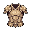 | **Bronzeplate of the Fallen** | A sturdy chest plate with warm bronze-brown tones and golden accents. Segmented plates overlap across the torso with visible stitching and rivets. The armor features a prominent central emblem and shows signs of age with weathered patina and subtle scratches throughout its surface. | *Forged in an age when empires crumbled to dust, this breastplate has weathered countless battles. Its bronze has darkened with time and blood, yet it remains an unbreakable testament to those who refused to fall.* | Warrior, Samurai |
| 11 |  | **Azurite Warden's Mantle** | A crystalline chest plate dominated by deep blue and cyan hues with jagged, ice-like protrusions. Geometric patterns form a protective crest across the torso, with sharp angular edges reminiscent of frozen shards or azure geodes. | *Forged from the heart of a sunken glacier, this armor pulses with an otherworldly cold. Those who don it feel the weight of ancient winters pressing upon their chest, granting resolve as unbreakable as permafrost.* | Warrior, Samurai |
| 12 |  | **Voidborn Thornscale Cuirass** | A dark teal and emerald chest plate adorned with organic, thorn-like protrusions forming a symmetrical pattern. The armor features a prominent central crest with layered, jagged details suggesting scales or thorns. Gold accents highlight the edges, creating an otherworldly, predatory appearance. | *Forged from the carapace of a long-dead leviathan, this cuirass hungers for the warmth of blood. Those who don it find their resolve sharpened, yet whisper that the thorns grow sharper with each soul it protects.* | Warrior, Samurai |
| 13 | 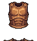 | **Bloodworn Cuirass** | A layered chest plate of deep rust and copper tones with vertical ribbing. Dark leather straps cross the torso. The armor bears weathered bronze plating with oxidized patina, suggesting age and countless battles. A subtle crimson undertone runs through the worn metal. | *Forged in an age when blood still stained the earth, this cuirass has absorbed the essence of a thousand fallen. Those who don it feel the weight of ancient vengeance coursing through their limbs.* | Warrior, Samurai |
| 14 | 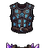 | **Voidforged Cuirass** | A dark, angular chest plate with deep purple and black coloring. Intricate void-like patterns swirl across the surface, accented by ethereal blue glowing runes. Sharp, jagged shoulder pauldrons extend upward with crystalline protrusions. The armor appears to absorb light rather than reflect it. | *Forged in the depths where reality fractures, this cuirass hungers for the clash of steel. Those who don its crushing weight find themselves touched by something ancient—a presence that whispers of power bought with forgotten souls.* | Warrior, Samurai |
| 15 | 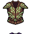 | **Thornweave Cuirass** | Heavy chest plate crafted from dark bronze with intricate gold filigree. Thorny vine motifs coil across the breastplate in relief. The shoulders feature layered scales in muted greens and blacks, suggesting corrupted nature woven into metal. Worn leather straps reinforce the sides. | *Forged in an age when the thorns grew wild and consumed the old kingdoms. Those who don this armor feel the vines' hunger course through their veins, granting resilience born of nature's cruelest thorns.* | Warrior, Samurai |
| 16 | 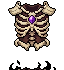 | **Crimson Thornplate** | A ornate chest plate rendered in deep crimson and black, featuring jagged thornlike protrusions across the shoulders and chest. Gold embroidered patterns frame the center, with intricate geometric designs suggesting Eastern armor craftsmanship. The surface gleams with an unsettling wet sheen. | *Forged in blood and malice, this cursed plate hungers for conflict. Those who don it feel the thorns' whispers—promises of victory at the cost of their humanity.* | Warrior, Samurai |
| 17 | 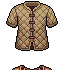 | **Thornweave Hauberk** | A quilted chest armor in earthy tan and brown tones, featuring an intricate woven pattern with dark thorny vine motifs running vertically. The fabric appears layered and reinforced, with a natural, aged appearance suggesting leather and treated cloth construction. | *Woven from the hides of creatures long forgotten, this hauberk remembers the thorns of a thousand battlefields. Those who don it inherit both its protection and the whispered curses of all it has sheltered.* | Warrior, Samurai |
| 18 | 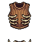 | **Cursed Bloodweave Cuirass** | A layered chest plate of deep crimson and burnt sienna with ornate gold embroidery forming intricate patterns across the torso. The armor features reinforced shoulder pauldrons and a central golden emblem. Rich fabric bindings peek between metallic segments. | *Woven from the hides of fallen champions and threaded with gold-infused sinew, this cuirass drinks the strength of those who wear it. The blood of conquest stains its every fiber—a second skin for those who refuse to yield.* | Warrior, Samurai |
| 19 | 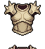 | **Thornhide Cuirass** | A weathered tan and brown chest plate with organic, vine-like protrusions across the torso. Crude leather strapping reinforces aged metal plating. Sharp, thorn-like growths protrude from shoulders and center, suggesting corrupted or naturalistic armor. | *Forged from the carapace of forgotten beasts and bound with thorned vines that writhe with corrupted life. Those who don this armor find themselves slowly overtaken by its hungry nature, each scar upon its surface feeding deeper into the wearer's soul.* | Warrior, Samurai |
| 20 | 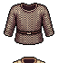 | **Ironbound Ashvest** | A sturdy chest armor crafted from dark brown leather reinforced with blackened iron plates. The garment features horizontal striping across the torso, with darker iron bands sewn into the fabric. A distinctive belt cinches the waist, and the overall silhouette is broad-shouldered and imposing. | *Forged in the kilns of a fallen kingdom, this armor has absorbed the ash of countless pyres. Those who wear it carry the weight of ancient sorrows, their movements marked by the grinding of iron against leather.* | Warrior, Samurai |
| 21 | 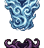 | **Azurite Tyrant's Carapace** | Heavy chest plate forged from deep blue-black metal with ornate cyan accents. Features a prominent crest of intertwined serpentine patterns across the shoulders and torso. Sharp, angular edges protrude from the sides, suggesting otherworldly craftsmanship. The center glows faintly with an eldritch blue luminescence. | *Forged in the depths where elder things still dream, this armor drinks the light from those who dare wear it. Each breath feels heavier, as if the carapace itself feeds upon the wearer's resolve.* | Warrior, Samurai |
| 22 | 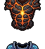 | **Embercrest Cuirass** | A dark segmented chest plate with prominent golden-orange flame motifs across the shoulders and torso. The armor features a rich crimson undershirt visible between obsidian-black plates. Intricate gold detailing frames the central chest area, creating an ornate, regal appearance despite its menacing coloration. | *Forged in the dying light of a fallen empire, this cuirass radiates an ancient heat that never fades. Those who wear it feel the weight of embers burning beneath their skin, a constant reminder of the fire that consumed its original bearer.* | Warrior, Samurai |
| 23 | 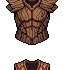 | **Ironbark Cuirass** | A sturdy chest plate with deep brown and bronze tones, resembling hardened wood grain interwoven with metallic plating. Layered segments overlap across the torso, adorned with darker straps and buckles. The armor has an organic, almost bark-like texture with pronounced ridges. | *Forged from wood that has witnessed a thousand winters and tempered in the blood of fallen titans. Those who don this armor find their resolve as immovable as ancient stone, yet their strikes carry the weight of the earth itself.* | Warrior, Samurai |
| 24 | 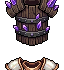 | **Shadowplate Corselet** | A dark purple and black chest armor with ornate plating. Features deep indigo cloth beneath reinforced shoulder pauldrons, accented with mystical violet trim. The breastplate bears intricate arcane patterns and appears crafted from shadowy, otherworldly material. | *Forged in the depths where light fears to tread, this armor drinks in the surrounding darkness to shield its bearer. Those who don it become one with the shadows, their presence a whisper rather than a cry.* | Warrior, Samurai |
| 25 | 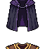 | **Nightpurple Cuirass** | A sleek chest plate rendered in deep purple and dark indigo tones, featuring a high-collared design with layered plating. Gold or bronze trim accents the shoulders and central seam, creating an elegant silhouette. The armor has a slightly curved, form-fitting construction suggesting both protection and mobility. | *Forged in shadow-touched steel and dyed with the essence of twilight, this cuirass grants its wearer an aura of dread nobility. Those who don it become instruments of inevitable fate, their movements as fluid and merciless as the encroaching dusk.* | Warrior, Samurai |
| 26 | 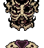 | **Umbral Carapace** | A dark, segmented chest plate with obsidian-black coloring and intricate bone-white accents forming ritualistic patterns. The armor features a prominent central crest with curved, organic angles suggesting both insect and demonic influences. Sharp ridges and jagged protrusions emerge from shoulders and sides. | *Forged from the carapace of creatures long forgotten, this armor drinks in shadow itself. Those who wear it carry the weight of abyssal depths—protection purchased at the cost of one's own light.* | Warrior, Samurai |
| 27 | 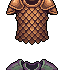 | **Weavemesh Brigandine** | A short-sleeved chest armor crafted from interlocking copper and brown fabric patterns. The weave creates a crosshatch motif across the torso, suggesting layered cloth reinforced with metal studs. Dark earth tones dominate, with subtle golden geometric patterns woven throughout the textile. | *Forged by the forgotten artificers of the Copper Wastes, this armor binds flesh to fate through threads older than memory. Those who don it find their movements unnaturally fluid, as if the garment itself guides their hand toward inevitability.* | Warrior, Samurai |
| 28 | 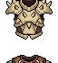 | **Bonelord's Cuirass** | A weathered chest plate of dull gold and bone-white metal with a prominent skeletal ribcage motif across the torso. Intricate dark tracery resembling veins or cursed runes winds through the armor. The shoulders feature sharp, angular spikes. Surface shows age and battle scars. | *Forged from the remains of an ancient tyrant, this armor thirsts for the clash of steel. Those who don it inherit not protection alone, but the hollow resolve of a warrior who refused to fall.* | Warrior, Samurai |
| 29 | 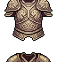 | **Thornplate Cuirass** | Bronze-toned chest armor with layered plate construction. Features prominent shoulder pauldrons with sharp, downward-pointing thorns. Dark metallic accents along the edges and center seam. Ornate buckles and straps reinforce the heavy construction. Worn, battle-scarred surface suggests ancient craftsmanship. | *Forged in an age of endless war, this armor drinks deep of its wearer's resolve. The thorns are said to channel the wrath of forgotten gods, turning every blow into an invitation for death.* | Warrior, Samurai |
| 30 | 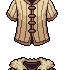 | **Bloodhewn Cuirass** | A tan and brown leather chest plate with dark crimson accents and ornate embroidered patterns. Features layered construction with reinforced shoulder pauldrons, gold trim detailing, and a central geometric motif suggesting ancient craftsmanship. | *Forged in the blood-soaked foundries of a forgotten age, this cuirass drinks deep from those who wear its burden. The leather remembers every wound it has turned aside.* | Warrior, Samurai |
| 31 |  | **Voidpact Cuirass** | Dark purple and black chest plate with an ornate central emblem. Features eldritch tentacle or void-like motifs wrapping across the torso. Sharp angular edges and metallic accents contrast with shadowy textile underlays. Emanates an unsettling, otherworldly presence. | *Forged in the depths where light fears to tread, this cuirass thirsts for the vitality of those who dare approach. Those who don it find themselves bound to something ancient and unknowable, their resolve hardened but their humanity forever diminished.* | Warrior, Samurai |
| 32 | 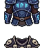 | **Duskplate Harness** | Heavy segmented chest armor in deep navy-blue and black with crimson accents. Features layered metal plates, ornate shoulder pauldrons with angular details, and a central emblem or crest. Metallic sheen with weathered, battle-worn patina throughout. | *Forged in the dying light of a conquered realm, this armor drinks in darkness itself. Those who wear it move as shadows between the world's dying breaths.* | Warrior, Samurai |
| 33 | 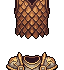 | **Ancient Bloodweave Cuirass** | A layered chest armor of deep burgundy and bronze leather, featuring intricate cross-hatched weaving patterns. Dark metallic plating reinforces the shoulders and center chest. Gold thread detailing forms symmetrical ornamental lines down the front, suggesting ancient craftsmanship. | *Forged from the hides of creatures long forgotten, this cuirass drinks in the crimson of fallen warriors. Those who don it find their resolve hardened, though whispers suggest it hungers for what it protects.* | Warrior, Samurai |
| 34 | 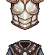 | **Bloodrite Cuirass** | A ornate chest plate with deep crimson and black coloring. Intricate geometric patterns and ritualistic symbols adorn the breastplate, with what appears to be dried blood or dark lacquer staining the metal. Sharp angular shoulders and a reinforced center suggest a warrior's fortification. | *Forged in the aftermath of a forgotten blood oath, this armor drinks deep from the wounds of those who wear it. The more it tastes of battle, the stronger the wearer's resolve becomes.* | Warrior, Samurai |
| 35 | 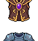 | **Crimson Harbinger Plate** | Ornate chest armor featuring deep crimson and gold embroidery. Central breastplate displays an intricate emblem of intertwined serpents or mystical runes. The shoulders are broad and reinforced with darker plating, accented by burgundy fabric trim and gold filigree detailing throughout. | *Forged in the blood-soaked forges of a fallen kingdom, this plate has absorbed the valor of a thousand warriors. Those who don it feel the weight of ancient vengeance coursing through their very bones.* | Samurai, Warrior |
| 36 | 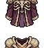 | **Bloodplate Haubergeon** | A layered chest plate in deep maroon and burgundy with ornate gold trim along the shoulders and center. Features a distinctive crimson cloth underlay visible at the neckline and waist. The armor has a militaristic, well-crafted appearance with segmented plating and elegant detailing. | *Forged in the killing fields of a forgotten war, this crimson-stained armor drinks deep of violence. Those who don it find themselves eager for battle, as if the plate itself demands blood to satisfy an ancient thirst.* | Warrior, Samurai |
| 37 | 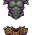 | **Shattered Thornplate Cuirass** | A dark metallic chest plate with a deep purple and bronze color scheme. Features jagged thorny protrusions across the shoulders and upper chest. The armor has an ornate, almost organic design with layered plating and shadowy accents suggesting corrupted craftsmanship. | *Forged in an age of shadow, this cuirass drinks the despair of those who dare approach. Each thorn thirsts for the blood of the unworthy.* | Warrior, Samurai |
| 38 | 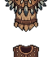 | **Thornscale Breastplate** | A layered chest armor of dark brown and bronze tones, featuring overlapping scale-like plates arranged in a protective pattern. Sharp thorny protrusions jut from the shoulders and torso, with intricate metalwork emphasizing a menacing, predatory silhouette. | *Forged from the chitin of creatures long forgotten, this armor drinks in the ambient dread of fallen battlefields. Those who don it find themselves shedding their humanity with each worn edge.* | Warrior, Samurai |
| 39 | 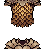 | **Burnished Dreadplate** | A brown leather chest armor with intricate golden buckles and ornate clasps. The garment features layered construction with darker leather accents along the shoulders and torso, reinforced with bronze rivets. Vertical striping and geometric patterns run across the front panel. | *Forged in the furnaces of a fallen kingdom, this armor has absorbed the weight of countless battles. Those who don it feel the gaze of ancient warriors upon their shoulders, their strength flowing through leather and steel.* | Warrior, Samurai |
| 40 | 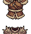 | **Hollow Bloodrite Cuirass** | A ornate chest plate of deep crimson and bronze, featuring intricate ritualistic patterns across the torso. The armor bears layered plating with a dark metallic sheen, accented by burgundy cloth trim at the shoulders and sides. Angular, aggressive design with a commanding presence. | *Forged in blood and shadow, this cuirass pulses with an ancient warrior's wrath. Those who don its weight feel the weight of countless fallen battles settle upon their shoulders, granting them neither mercy nor respite.* | Warrior, Samurai |
| 41 |  | **Ancient Embercrest Cuirass** | A ornate chest plate with deep blue and orange coloring. The armor features intricate gold detailing and crimson accents across the shoulders and center. Dark metallic plating with warm ember-like highlights gives it an imposing, battle-worn appearance. | *Forged in the dying embers of a cursed kiln, this breastplate bears the sigil of those who walk between worlds. Its warmth is said to be the last breath of a fallen god.* | Warrior, Samurai |
| 42 | 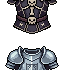 | **Ironpact Breastplate** | A sturdy chest armor with a dark steel construction featuring prominent horizontal plating across the torso. The piece displays a distinguished blue-grey metallic sheen with reinforced shoulder guards. Central chest emblem or clasp detail adds ornamental focus to the otherwise utilitarian design. | *Forged in the killing fields of forgotten wars, this breastplate bears the weight of countless fallen. Its steel remembers the blood of those who wore it before—a grim inheritance passed to warriors bold enough to claim it.* | Warrior, Samurai |
| 43 | 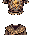 | **Bloodscale Breastplate** | A heavy chest armor with a deep crimson and bronze color scheme. Features overlapping scaled plating arranged in a distinctive pattern, with ornate golden trim along the shoulders and center. Dark metallic accents and subtle blood-red detailing give it an ancient, worn appearance. | *Forged in the depths of a long-forgotten war, this scaled cuirass has drunk deep of countless battles. The blood that once stained its surface has long since darkened into the very metal, granting its wearer an unshakeable resolve.* | Warrior, Samurai |
| 44 | 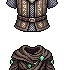 | **Voidborn Ironbark Cuirass** | A sturdy chest plate with dark brown and black tones, featuring a layered, bark-like texture across the torso. Bronze or copper plating reinforces the shoulders and center. The design suggests natural, organic armor interwoven with metal—rough, weathered, and imposing. | *Forged from the heartwood of ancient, corrupted trees and bound with fell iron, this cuirass bears the weight of forgotten forests. Those who wear it feel the slow, creeping strength of things that endure beyond mortal understanding.* | Warrior, Samurai |
| 45 | 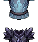 | **Veilbound Cuirass** | A layered chest plate in deep indigo and obsidian black, adorned with ethereal blue sigils that seem to shimmer with otherworldly light. The armor features a central void-like symbol and segmented pauldrons with wispy, spectral patterns across the shoulders. | *Forged in the depths where shadow consumes steel, this cuirass whispers of forgotten pacts and the thin veil between worlds. Those who don it feel the weight of countless unseen eyes upon their shoulders.* | Samurai, Warrior |
| 46 | 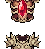 | **Crimson Throneguard** | A ornate chest plate dominated by deep crimson and gold tones. Features an intricate crown or thorned crest design across the upper chest, with symmetrical wing-like motifs spreading outward. Rich jeweled embellishments and baroque detailing suggest regal craftsmanship steeped in ancient power. | *Forged in an age when warlords commanded both steel and shadow, this armor drinks in the bloodlust of its wearer. Those who don it claim to feel the weight of a thousand crowned dead, their vengeance flowing through veins like molten gold.* | Warrior, Samurai |
| 47 | 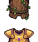 | **Bloodforged Harness** | Heavy chest plate with deep crimson and bronze hues. Ornate metalwork features vertical ridging and angular pauldrons. Central emblem displays a stylized crest or sigil. Dark leather accents reinforce the shoulders and sides, giving it a battle-worn yet regal appearance. | *Forged in the depths of a fell war, this harness hungers for the blood of those who dare oppose its wearer. Each scar upon its surface whispers of countless victories claimed by those strong enough to bear its weight.* | Warrior, Samurai |
| 48 | 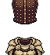 | **Hollow Bloodweave Cuirass** | A segmented chest plate of deep burgundy and black leather, reinforced with dark iron bands. Intricate crimson stitching traces geometric patterns across the torso, resembling arcane runes or dried blood stains. The armor shows layered construction with overlapping scales at the shoulders. | *Forged in shadow and stained by countless wars, this cuirass pulses with the echoes of fallen warriors. Those who don it find their resolve hardened, though whispers suggest the armor hungers for more.* | Warrior, Samurai |
| 49 | 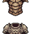 | **Ironbound Thoraxplate** | Heavy segmented chest armor in dark bronze and iron, featuring layered metal plates with prominent rivets and reinforced segments. Ornate brass detailing runs along the shoulders and central chest, with weathered patina suggesting ancient forging. | *Forged in the furnaces of a forgotten empire, this breastplate has absorbed the rage of countless warriors. Its dented surface bears testament to blows that would have shattered lesser armor.* | Warrior, Samurai |
| 50 | 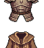 | **Cursed Thornplate Cuirass** | A segmented chest plate in muted browns and dark bronze, featuring overlapping armor plates with sharp, thorn-like protrusions along the shoulders and torso. Intricate metalwork with a weathered, battle-worn patina. | *Forged in an age when warriors bound their flesh to thorns and shadow. Each spike drinks deep of the blood it spills, hungering for the next conflict.* | Warrior, Samurai |
| 51 | 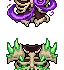 | **Thornveil Cuirass** | A dark purple and green chest armor piece with an ornate, thorny vine motif wrapping around the torso. The armor features sharp, spike-like protrusions along the shoulders and sides, rendered in deep emerald hues. Gold accents trace intricate patterns across the chest plate, giving it an otherworldly, corrupted botanical appearance. | *Woven from the husks of a forgotten garden, this armor hungers for the blood of those who dare face it. Each thorn remembers the taste of a thousand fallen.* | Warrior, Samurai |
| 52 | 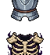 | **Bonelord's Carapace** | A skeletal chest plate of bleached bone and blackened steel. Ribcage-like segments form the breastplate, with ornate dark metal bands reinforcing the structure. Gold or brass detailing traces ancient runes across the surface. | *Forged from the remains of a forgotten colossus, this armor hungers for violence. Those who don it feel the weight of countless fallen enemies pressing against their chest.* | Warrior, Samurai |
| 53 | 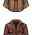 | **Shattered Thornplate Cuirass** | Segmented chest armor in deep burgundy and dark brown leather, reinforced with angular bronze plating. Jagged, thorn-like protrusions rise from shoulders and chest. Weathered surface shows dark stains and intricate metalwork across the torso. | *Forged in an age of endless wars, this cuirass drinks deep the blood of those foolish enough to strike. Each thorn is a promise—that no wound shall go unanswered.* | Warrior, Samurai |
| 54 | 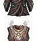 | **Ember Ironbound Thoraxplate** | A segmented chest armor with dark metallic plating arranged in overlapping horizontal bands. Features ornate gold trim along the shoulders and center, with a prominent decorative emblem at the sternum. Rich burgundy fabric underlayer visible between segments. | *Forged in the depths of forgotten foundries, this armor has drunk the blood of countless foes. Its weight is a constant reminder of the price paid by those who dare stand unbroken.* | Warrior, Samurai |
| 55 | 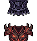 | **Bloodmoon Cuirass** | A dark crimson chest plate adorned with jagged, obsidian spikes along the shoulders and torso. The surface bears deep burgundy streaks reminiscent of dried blood, with an ornate central symbol resembling a crescent moon wreathed in shadow. | *Forged in the depths of a cursed night, this armor drinks in the essence of fallen foes. Those who don it find themselves consumed by an ancient hunger that echoes with each heartbeat.* | Warrior, Samurai |
| 56 | 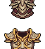 | **Thorncrest Cuirass** | A segmented chest plate of burnished bronze and dark iron, adorned with protruding thorn-like spikes across the shoulders and ribs. Intricate gold filigree traces ancient runes down the center. The metal bears weathered patina and deep gouges from countless battles. | *Forged in an age of forgotten wars, this cursed armor drinks deep of the violence surrounding it. Those who wear it find themselves invigorated by bloodshed, though whispers suggest the thorns hunger for more than just enemies.* | Warrior, Samurai |
| 57 |  | **Embercrest Harness** | Dark crimson chest armor with jagged, flame-like protrusions across the shoulders and torso. The metal bears a deep burgundy hue with blackened edges, adorned with sharp spikes and ornamental ridges suggesting smoldering embers frozen in steel. | *Forged in the dying breath of a fell beast, this harness drinks deep of the wearer's resolve. Those who don its spiked embrace find themselves hardened against both blade and despair.* | Warrior, Samurai |
| 58 |  | **Goldweave Cuirass** | A segmented chest plate in rich brown leather with ornate golden brocade patterns woven across the torso. Gold threading creates intricate geometric designs reminiscent of noble heraldry. The armor features layered construction with darker brown undertones, suggesting masterful craftsmanship and aged prestige. | *Forged in an age of fallen dynasties, this cuirass bears the weight of countless battles fought by warrior-kings. Its golden threads are said to shimmer with the last moments of glory, binding the wearer to an eternal struggle between honor and ruin.* | Warrior, Samurai |
| 59 |  | **Ironwood Warplate** | A sturdy chest armor crafted from dark bronze and reinforced wood panels. The breastplate features ornate angular patterns and weathered bronze rivets. Thick leather straps wrap around the torso, with muted gold-brown tones dominating the design. Notable dark wooden reinforcement plates run vertically down the center. | *Forged in ages past when the old kingdoms ruled, this armor has weathered countless campaigns. Its wood grain seems to whisper of ancient forests long since ash, while the bronze holds fast against the encroaching dark.* | Warrior, Samurai |
| 60 |  | **Voidborn Ironbound Thoraxplate** | A segmented chest armor with horizontal bronze and dark iron bands. Ornate shoulder pauldrons feature raised ridge patterns. The center displays vertical striping with a burnished copper sheen. Intricate metalwork suggests reinforced plating across the torso and upper arms. | *Forged in the foundries of a fallen empire, this armor has weathered countless battles. Its layered construction whispers of a warrior's unflinching resolve, each scar a testament to blows endured.* | Warrior, Samurai |
| 61 |  | **Emberclaw Cuirass** | A crimson and gold chest plate adorned with fierce beast imagery. Jagged orange flames curl across the metal surface, with ornate golden trim framing sharp, predatory claws. The design suggests a mythical creature's ferocity, crafted from dark iron and burnished gold. | *Forged in the magma veins of the Scorched Kingdoms, this armor drinks deep of violence and hunger. Those who wear it feel the weight of ancient predators stirring within their bones.* | Warrior, Samurai |
| 62 |  | **Sundered Breastplate** | A tan and brown leather chest armor with ornate golden buckles and straps. The breastplate features a prominent central emblem with geometric patterns. Worn bronze plating reinforces the shoulders and torso, showing signs of battle damage and age. | *Forged in an age when kings still commanded legions, this armor has weathered countless conflicts. Its golden accents have dulled to copper, yet they still whisper of past glories—and the blood spilled to earn them.* | Warrior, Samurai |
| 63 |  | **Blackthorn Cuirass** | A dark burgundy and black segmented chest plate with pronounced pauldrons. The armor features sharp, thorn-like protrusions along the shoulders and chest. Deep crimson accents outline each plate segment, giving an ornate, menacing appearance. | *Forged in blood-soaked flames, this cursed plate drinks deep of those who wear its thorns. Each scar upon its surface marks a warrior's final stand.* | Warrior, Samurai |
| 64 |  | **Bloodplate Carapace** | Heavy segmented chest armor in deep crimson and dark brown tones. Layered plates resemble insectoid chitin, with metallic bronze clasps at shoulders and center. Weathered leather straps bind the segments. A prominent circular emblem adorns the chest, suggesting ancient craftsmanship. | *Forged from the carapace of a long-dead terror, this armor drinks in the crimson of fallen foes. Those who don it inherit both its protection and its hunger.* | Warrior, Samurai |
| 65 |  | **Embercrest Breastplate** | A ornate chest armor with deep crimson and gold detailing. The center features a prominent golden emblem with radiating flame-like patterns. Dark red fabric or leather underlays metallic plating. Symmetrical design with intricate border work suggesting craftsmanship of ancient warriors. | *Forged in the heart of a dying star, this breastplate carries the weight of countless fallen warriors. Its golden crest pulses faintly, as if still smoldering with the rage of those who wore it before.* | Warrior, Samurai |
| 66 |  | **Bloodleather Harness** | A dark burgundy and black chest plate with ornate gold filigree patterns. The armor features layered leather panels with metallic studs and intricate crimson stitching forming ritualistic symbols across the torso. | *Crafted from hides steeped in ancient blood rituals, this harness pulses with a faint warmth. Those who don it feel the weight of countless fallen warriors pressing against their chest.* | Warrior, Samurai |
| 67 |  | **Goldbound Thoraxplate** | A layered chest armor featuring deep navy-blue plating with ornate golden trim and embroidered details. The design showcases symmetrical shoulder pauldrons with raised ridges, a central reinforced chest plate with intricate gold filigree patterns, and a structured silhouette suggesting both ceremonial prestige and battle-hardened durability. | *Forged in the kilns of a forgotten dynasty, this plate bears the weight of ancient oaths and the scars of countless wars. Its golden seams sing with protective enchantments, though some whisper they bind something far older within.* | Warrior, Samurai |
| 68 |  | **Voidborn Emberclaw Cuirass** | A dark brown leather chest armor with ornate bronze plating across the torso. Features two large, claw-like bronze pauldrons on the shoulders and intricate gold embroidered patterns. Central chest plate displays a menacing beast motif with amber-tinted metallic details. | *Forged in the ash-pits of forgotten wars, this armor drinks in the rage of its wearer. Those who don it speak of phantom claws whispering across their skin—a hunger that demands blood.* | Warrior, Samurai |
| 69 |  | **Shattered Embercrest Cuirass** | A segmented chest plate of burnished bronze and dark iron, layered with overlapping scales in warm amber and deep brown tones. Gold threading traces geometric patterns across the breastplate, with a distinctive emblem of interlocking flames at the center. | *Forged in the heart of a dying empire, this armor remembers the warmth of conquest and the chill of inevitable decline. Those who wear it carry the weight of faded glory.* | Warrior, Samurai |
| 70 |  | **Bloodbound Cuirass** | A ornate chest plate with deep crimson and gold accents. The armor features intricate embroidered patterns across the shoulders and chest, with layered fabric trim in burgundy. Two golden shoulder pauldrons flank the central breastplate, adorned with decorative studs and symbols. | *Forged in the crucible of ancient warfare, this cuirass drinks deep of its bearer's vitality, binding their essence to the armor itself. Those who don its embrace find their wounds closing, but at a terrible price—the line between steel and flesh grows perilously thin.* | Warrior, Samurai |
| 71 |  | **Storm Voidthorn Cuirass** | Dark purple chest plate with obsidian-black accents and jagged spikes protruding from shoulders and center. Ethereal violet wisps coil around the armor, suggesting otherworldly corruption. The breastplate features deep grooves and thorned ridges. | *Forged in the depths of a shattered realm, this cursed armor thrums with the anguish of the void itself. Those who don it feel the weight of endless suffering—and the cold strength that comes with embracing oblivion.* | Warrior, Samurai |
| 72 |  | **Embercrown Cuirass** | A ornate chest plate crafted from burnished copper and dark bronze. The breastplate features intricate crimson embroidery and gold filigree patterns forming a crown motif across the chest. Layered leather reinforcement visible at the shoulders with deep burgundy accents. | *Forged in the dying embers of an ancient kingdom, this armor bears the weight of fallen dynasties. Those who don it inherit both its protection and the bitter memory of those who wore it before.* | Warrior, Samurai |
| 73 |  | **Shadowplate Haubergeon** | A fitted chest plate rendered in dark steel with intricate geometric patterns across the shoulders and torso. The armor features a subtle gray-blue metallic sheen with darker recesses, appearing both ornate and functional. A structured silhouette suggests reinforced padding beneath. | *Forged in the depths where starlight fears to tread, this breastplate bears the cold weight of countless fallen foes. Its shadowed steel whispers of protection earned through blood and iron will.* | Warrior, Samurai |
| 74 |  | **Cursed Bloodweave Cuirass** | A dark crimson and burgundy chest plate with ornate embroidered patterns across the torso. Features deep maroon fabric accents and what appears to be reinforced plating at the shoulders and sides, with intricate stitching suggesting ancient craftsmanship. | *Woven from the sinews of forgotten conflicts, this cuirass pulses with a faint crimson glow. Those who don it feel the weight of countless battles settled into their very bones.* | Warrior, Samurai |
| 75 |  | **Forsaken Ironpact Breastplate** | A heavy bronze and dark iron chest plate with oxidized green patina. Reinforced with thick leather straps across the shoulders and torso. Features ornate brass studs arranged in ritualistic patterns, with a central emblem of interlocking circles suggesting ancient craftsmanship. | *Forged in an age when steel drank blood as readily as rain. This weathered armor bears the weight of countless battles, its surface a map of scars that whisper of fallen kingdoms and unbroken oaths.* | Warrior, Samurai |
| 76 |  | **Voidborn Emberclaw Cuirass** | A ornate chest plate with golden-brown metallic plating adorned with dark, claw-like protrusions across the shoulders and chest. The armor features layered segments with a rich burgundy underlay and intricate detailing suggesting both martial prowess and otherworldly craftsmanship. | *Forged in the embers of a fallen beast, this cuirass hungers for conflict. Those who don it feel the phantom claws of something ancient settling upon their shoulders, whispering promises of vengeance with every breath.* | Warrior, Samurai |
| 77 |  | **Goldweave Breastplate** | A ornate chest armor featuring intricate golden thread patterns woven across deep brown fabric. Gold embroidered motifs and metallic accents adorn the shoulders and torso, suggesting both martial discipline and ancient craftsmanship. The weave creates a rich, ceremonial appearance. | *Forged in an age when gold held dominion over fate itself, this breastplate channels the resilience of empires long forgotten. Those who don its weighted embrace inherit both protection and the burden of legacy.* | Warrior, Samurai |
| 78 |  | **Thornscale Harness** | A ornate chest plate of deep burgundy and gold with layered, overlapping scales resembling thorned petals. Gold filigree traces intricate patterns across the shoulders and sternum, with dark metallic spikes protruding from the upper chest and shoulders. | *Forged in an age when warriors bore the weight of thorns upon their hearts. Each scale drinks deep of spilled blood, hungering for the next clash of steel.* | Warrior, Samurai |
| 79 |  | **Goldvein Warplate** | A short-sleeved chest armor with rich golden embroidery across the shoulders and torso. Dark brown leather base with ornate gold threading forming intricate patterns. Reinforced plating at the chest with a distinctive golden sigil or emblem at center. Warm bronze and gold tones contrast against deep brown fabric. | *Forged in an age of forgotten dynasties, this plate drinks the essence of slain nobility. Those who wear it find themselves touched by the ambitions of the ancients—power flows through golden veins, but at a cost yet unknown.* | Warrior, Samurai |
| 80 |  | **Bloodplate Cuirass** | A dark brown leather chest piece reinforced with burgundy-tinted metal plating across the torso. Ornate copper or bronze shoulder pauldrons frame the upper chest. The leather shows deep reddish stains and weathered creasing, suggesting age and battle. | *Forged in an age of endless conquest, this cuirass remembers the blood of a thousand foes. The crimson stains upon its surface are said to deepen with each life it claims, granting its wearer unholy resilience.* | Warrior, Samurai |
| 81 |  | **Thornwood Pauldrons** | A layered chest armor crafted from dark bronze and weathered leather. Intricate thornvine patterns weave across the breastplate in burnished gold. Jagged pauldrons flare outward, adorned with bone-carved details and moss-covered edges suggesting ancient forest origins. | *Forged in shadow groves where thorns drink blood, this armor remembers the warriors who fell defending the old woods. Each scar upon its surface whispers of struggles against things that should have remained buried.* | Warrior, Samurai |
| 82 |  | **Cursed Bloodweave Cuirass** | A dark burgundy chest plate with intricate woven pattern overlays in black and crimson. The fabric-like texturing suggests enchanted cloth reinforced with dark metal plating. Gold trim accents the shoulders and center panel. | *Woven from the crimson threads of fallen warriors, this cursed armor drinks deep of spilled blood. Those who don it find their resolve hardened, yet whisper of voices screaming beneath the weave.* | Warrior, Samurai |
| 83 |  | **Emberscourge Cuirass** | A bronze-toned chest plate with deep crimson accents and ornate detailing. The armor features intricate gold embroidery across the shoulders and chest, with a rich burgundy fabric visible beneath the metal plating. Angular, aggressive design with flame-like motifs. | *Forged in the dying embers of a fallen dynasty, this cuirass drinks in the agony of its wearers and transforms it into unyielding resolve. Those who don its weight find themselves bound to something far older than glory.* | Samurai, Warrior |
| 84 |  | **Voidborn Goldenscale Cuirass** | A layered chest plate with overlapping golden scales arranged in neat rows across a deep navy tunic. Gold trim frames the shoulders and center seam. The scales catch light with a luminous sheen, creating an almost serpentine pattern. Small ornamental studs punctuate the design. | *Forged from the carapace of an ancient wyrm, this armor drinks in the darkness around it, its golden scales humming with the creature's fading heartbeat. Those who wear it find themselves neither wholly of flesh nor scale.* | Samurai, Warrior |
| 85 |  | **Marrowplate Hauberk** | A heavy chest armor crafted from bone-white plates layered over dark brown leather. Skeletal motifs run down the center, with ribcage-like segmentation. Tattered cloth fringe hangs from the shoulders and sides. The color palette is predominantly cream and shadow-brown. | *Forged from the ossified remains of something vast and forgotten, this armor drinks in sorrow and transforms it into resilience. Those who wear it find death itself becomes a reluctant ally.* | Warrior, Samurai |
| 86 |  | **Ember Bloodweave Cuirass** | A dark crimson and burgundy chest plate with intricate woven patterns across the torso. The armor features jagged, asymmetrical edges and darker striping that resembles dried blood or ancient ritual markings. Bronze or copper accents frame the shoulders and center seam. | *Woven from the sinews of forgotten wars, this armor remembers every drop of blood it has shed. Those who don it feel the weight of countless fallen, their strength coursing through fabric and steel alike.* | Warrior, Samurai |
| 87 |  | **Bloodweave Hauberk** | A dark crimson chest armor constructed from layered cloth and leather, featuring intricate woven patterns reminiscent of dried blood. Tattered edges and reinforced shoulders with bronze rivets suggest battle-worn construction. The fabric displays ornate embroidery in deep maroon tones across the torso. | *Woven from the sinews of forgotten wars, this armor drinks in the lifeblood of those who wear it. Each thread hums with the anguished echoes of the fallen, granting its bearer resilience born of sacrifice and malice.* | Warrior, Samurai |
| 88 |  | **Hollow Ironpact Cuirass** | A sturdy chest plate rendered in dark gray and black pixels with pronounced shoulder pauldrons. The center features interlocking metallic plates with a subtle vertical ridge down the sternum. Silver accents line the edges, suggesting reinforced seams and rivets throughout the armor's construction. | *Forged in the depths of a forgotten foundry, this cuirass bears the weight of countless battles. Its iron core hums with an ancient promise—protection bought with blood, paid in steel.* | Warrior, Samurai |
| 89 |  | **Thornbound Cuirass** | A dark brown leather chest plate adorned with sharp, angular bronze or copper plating. Intricate vine-like patterns with thorns weave across the torso. Reinforced shoulders feature metallic studs. The overall silhouette is broad and imposing, designed for heavy combat. | *Forged from the hide of something that should have remained buried, this armor drinks in the darkness around it. Those who wear it find themselves marked—not by enemies, but by something far older that remembers the blood spilled in its creation.* | Warrior, Samurai |
| 90 |  | **Thornwood Carapace** | A layered chest armor crafted from dark leather and bone plates. Features intricate brown and tan geometric patterns with sharp, angular quilting. Symmetrical shoulder reinforcements and a central chest plate adorned with thorny motifs suggest both natural and crafted origins. | *Armor born from the hides of creatures long forgotten, its thorned exterior whispers warnings to those who dare approach. Each scar upon its surface tells of battles waged in shadow-cursed forests, where steel alone could not suffice.* | Warrior, Samurai |
| 91 |  | **Bloodscourge Cuirass** | A dark crimson and black chest plate with ornate shoulder guards. Features intricate blood-red patterns etched into blackened steel, with jagged, asymmetrical edges suggesting ancient battle scarring. Shoulder pauldrons are reinforced with darker metal plating. | *Forged in the depths of forgotten wars, this cuirass hungers for the blood of those who dare oppose its wearer. Each scar upon its surface whispers of fallen empires and the countless souls it has claimed.* | Warrior, Samurai |
| 92 |  | **Bloodleather Cuirass** | A fitted chest armor crafted from deep burgundy leather with ornate bronze buckles and studded reinforcements. Rich brown tones dominate the piece, with darker leather panels creating a layered, segmented appearance suggesting protection and mobility. | *Forged from the hides of fallen foes and bound with bronze, this cuirass whispers of countless battles. Those who wear it feel the weight of blood spilled before them, a grim reminder that survival demands sacrifice.* | Warrior, Samurai |
| 93 |  | **Ironbound Bulwark** | Heavy segmented chest plate in bronze and dark iron with reinforced shoulder pauldrons. Ornate buckles and leather straps bind layered metal plates. Center features a weathered bronze disc emblem with faint geometric patterns. Deep shadows between segments suggest aged, battle-worn construction. | *Forged in the dying days of an empire, this armor has absorbed the anguish of countless fallen. Its weight is matched only by the grim promises it enforces upon those who dare wear it.* | Warrior, Samurai |
| 94 |  | **Azuremantle Cuirass** | A broad-shouldered chest plate rendered in deep navy blue with gold ornamental trim along the shoulders and center seam. The fabric appears layered with darker blue underarmor visible at the edges. Gold clasps and decorative emblems accent the upper chest, suggesting noble craftsmanship. | *Forged in the halls of forgotten lords, this cuirass drinks in the light of fallen stars. Those who don its sapphire depths are said to walk between worlds, their footsteps echoing with the weight of ages.* | Warrior, Samurai |
| 95 |  | **Storm Thornplate Cuirass** | A ornate chest plate featuring symmetrical shoulder pauldrons with golden trim and gemstone inlays. The central breastplate displays intricate thorn or vine motifs in dark metal, with a prominent jeweled emblem at the sternum. Rich burgundy and gold accents suggest noble craftsmanship. | *Forged in an age when thorns grew from cursed earth, this plate remembers the wars of forgotten kingdoms. Each scar upon its surface drinks in the blood of those who dare challenge its wearer.* | Warrior, Samurai |
| 96 |  | **Ashplate Harness** | A segmented chest plate rendered in dark steel-gray with a quilted or layered undergarment visible beneath. The armor features a central vertical ridge and subtle geometric stitching patterns, giving it a reinforced, battle-worn appearance. Dark charcoal tones dominate with hints of metallic sheen. | *Forged in the ash-fields of a forgotten war, this harness has absorbed the weight of countless blows. It remembers every scar, and grants its wearer the same unflinching resolve.* | Warrior, Samurai |
| 97 |  | **Ancient Bloodweave Cuirass** | A dark brown leather chest armor with intricate crimson embroidery forming occult patterns across the torso. Reinforced with blackened metal plating at shoulders and sternum. The fabric appears aged and weathered, with subtle gold threading accentuating ceremonial markings. | *Stained by the rituals of forgotten warlords, this cuirass pulses with an ancient hunger. Those who don it find their resolve hardened, yet feel the weight of a thousand fallen bearing witness.* | Warrior, Samurai |
| 98 |  | **Ironbound Cuirass of the Bloodmarch** | A sturdy brown leather chest plate reinforced with dark metal plating across the shoulders and torso. Ornate buckles and straps secure the armor, with a subtle crimson undersheen visible at the seams and collar. | *Forged in the furnaces of a fallen empire, this cuirass has tasted the blood of countless foes. Its leather, aged to deep mahogany, remembers the weight of champions who refused to fall.* | Warrior, Samurai |
| 99 |  | **Ironbound Reaver's Plate** | Heavy chest armor with layered dark metal plating and reinforced shoulders. Bronze-gold trim outlines the central breastplate. Thick leather straps and buckles secure the segments. The torso shows deliberate battle-scarring and weathered patina across the iron surface. | *Forged in an age of endless conflict, this breastplate has tasted the blood of countless foes. Its weight is a burden, but so too is the promise of survival it carries.* | Warrior, Samurai |
| 100 |  | **Voidborn Goldweave Breastplate** | A ornate chest armor crafted from golden-bronze metal with intricate woven patterns across the shoulders and torso. Features layered plating with rich amber and bronze tones, decorative gold threading, and a structured silhouette emphasizing protection and prestige. | *Forged in an age of forgotten smithcraft, this breastplate drinks in the light of fallen suns. The weaver's touch is evident in every golden thread—a warrior's testament to power and dominion.* | Warrior, Samurai |
