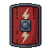

# Shields - Item Catalog

> **Category:** Shield  
> **Total items:** 100  
> **Classes:** Warrior

| # | Preview | Item Name | Visual Description | Description | Classes |
|:-:|:-------:|:----------|:------------------|:------------|:--------|
| 1 |  | **Void Bulwark** | A dark, spiky shield with a menacing central boss. The surface is predominantly deep purple-black with sharp protrusions radiating outward. Glowing violet accents highlight the edges and center, suggesting otherworldly power. The design is symmetrical and heavily armored. | *A shield forged in the abyss itself, its spikes hunger for the touch of cursed steel. Those who bear it find their will hardened against the encroaching dark-or succumb to it entirely.* | Warrior |
| 2 |  | **Obsidian Bulwark** | A hefty kite shield with a dark metallic surface, reinforced with obsidian-black plating. Intricate geometric patterns and runic inscriptions cover its face. Sharp angular edges frame a central boss, giving it an imposing, fortress-like appearance. | *Forged in the depths of forgotten wars, this shield has drunk the blood of countless foes. Those who bear it find themselves anchored to the earth, immovable as mountains and twice as merciless.* | Warrior |
| 3 |  | **Ironbound Citadel** | A tall, rectangular shield with a dark wooden frame reinforced by heavy iron bands. The center features a grid pattern of deep blue panels with ornate iron studs at each intersection, giving it a fortress-like appearance. | *A shield built to withstand the siege of ages. Those who bear it become immovable as stone, yet carry the weight of countless fallen defenders within its frame.* | Warrior |
| 4 |  | **Ironbark Bulwark** | A wooden shield with dark brown barrel staves bound by iron bands. The face features a reinforced metal boss at center, with weathered oak grain visible across the curved surface. Iron rivets and straps suggest ancient craftsmanship. | *Forged from the heartwood of trees that grew in cursed soil, this shield has weathered countless sieges. Its iron frame whispers of old wars, each dent a scar from battles long forgotten.* | Warrior |
| 5 |  | **Ironbound Bastille** | A sturdy wooden shield reinforced with dark iron bands and rivets. The face features a weathered burgundy-brown tone with vertical plank segments. Metal studs and reinforcement brackets run along edges and corners, giving it a fortress-like appearance. | *Once carried by the wardens of a forgotten stronghold, this shield has weathered countless sieges. Its iron bones remember every blow, and those who bear it inherit an unshakeable resolve against the darkness.* | Warrior |
| 6 |  | **Ironwood Bulwark** | A kite-shaped shield with a weathered wooden face reinforced by dark iron bands. A grim carved visage dominates the center-angular features etched in shadow. The wood bears deep grain marks and scorch patterns, suggesting countless battles endured. | *An ancient guardian's final gift, this shield has absorbed the anguish of fallen warriors. Its wooden heart remembers every blow, every desperate stand at the precipice of oblivion.* | Warrior |
| 7 |  | **Sunpyre Bastion** | A circular shield dominated by a blazing sun motif in gold and orange hues. The central boss glows with amber light, surrounded by radiating flame patterns. Dark blue-black borders frame the design, with intricate geometric details suggesting ancient forging. | *A shield said to hold the essence of a dying star, its warmth a hollow comfort against the encroaching dark. Warriors who bear it report visions of an empire reduced to ash, and wonder if they carry salvation or ruin.* | Warrior |
| 8 |  | **Grimhearth Bulwark** | A kite-shaped shield with a weathered bronze face depicting an ornate crowned lion's head surrounded by intricate scrollwork. The border features dark iron reinforcements with a golden trim. Deep bronze patina suggests ancient origins. | *Once carried by kings whose names have been swallowed by shadow. This shield remembers every blow it has endured, and whispers of those fallen to those brave-or foolish-enough to bear it.* | Warrior, Samurai |
| 9 |  | **Goldward Bulwark** | A heater shield with a prominent golden cross emblazoned on a dark navy blue face. Ornate gold trim frames the edges, with a central boss bearing religious iconography. The shield radiates an austere, holy aesthetic with metallic accents. | *A shield blessed by forgotten gods, its golden cross a beacon of unwavering resolve. Those who bear it find their conviction hardened against the encroaching dark.* | Warrior |
| 10 |  | **Ironbound Sentinel's Ward** | A sturdy kite shield with a weathered bronze face. Centered is a grim visage-a bearded warrior's head in relief, surrounded by ornate geometric patterns. The shield's edges are reinforced with dark iron bands, and its surface bears the patina of countless battles. | *Forged in an age when gods still walked among men, this shield was borne by sentinels sworn to protect the threshold between worlds. Those who carry it report hearing distant whispers-whether warnings or curses, none can say.* | Warrior, Samurai |
| 11 |  | **Thornveil Bulwark** | A circular shield dominated by a sickly green glowing orb at its center, surrounded by writhing thorned vines in dark browns and greens. Organic, corpse-like textures cover the surface, with the sphere pulsing with eldritch energy against weathered, bone-like plating. | *A shield born from corrupted nature itself, its thorns drink deep of those who dare strike it. The verdant heart within whispers of pain unmeasured, a sentinel's burden made manifest.* | Warrior |
| 12 |  | **Thornbound Aegis** | A sturdy kite shield featuring a dark bronze or iron face adorned with intricate gold filigree and thorny vine motifs. The center displays a glowing blue-green gemstone or magical core, surrounded by ornate metalwork. Weathered edges suggest ancient craftsmanship. | *A shield born from forgotten wars, its surface etched with thorns that seem to writhe in candlelight. Those who raise it feel the weight of countless fallen defenders pressing against their arm, their wills merging into one.* | Warrior |
| 13 |  | **Voidbound Aegis** | A circular shield with a deep obsidian face dominated by a central golden sigil. Concentric rings of dark purple and midnight blue radiate outward, forming an intricate geometric pattern. The outer rim features ornate bronze filigree with subtle angular motifs, suggesting ancient craftsmanship. | *Forged in an age when the veil between worlds grew thin, this shield drinks in the void itself. Those who bear it find their resolve hardened against both steel and sorcery alike.* | Warrior, Samurai |
| 14 |  | **Voidpact Aegis** | A circular shield with a dark metallic finish dominated by a large central circular void-a perfect black orb surrounded by concentric rings of deep purple and slate gray. Ornate geometric patterns frame the edge in muted bronze. The overall impression is heavy and ancient. | *A shield forged from the metal of fallen stars, its void-center whispers of pacts made in shadow. Those who bear it find the darkness answers their call-but at a price only the worthy can afford.* | Warrior, Samurai |
| 15 |  | **Verdant Warding Shield** | A kite-shaped shield with a deep forest-green base adorned with an intricate golden diamond lattice pattern. Bronze-rimmed edges frame the design, while curved horns protrude from the top corners, giving it an ancient, ceremonial appearance. | *Forged in an age when the old kingdoms still held dominion, this shield bears the verdant sigil of guardians long turned to dust. Those who carry it claim to feel the weight of centuries pressing against its face, as if countless blows have been absorbed into its very soul.* | Warrior, Samurai |
| 16 |  | **Grimward Bulwark** | A sturdy wooden shield with dark metal reinforcements forming a circular boss at its center. The shield features a weathered blue-gray tone with iron studs and ornate metal plating along its edges. An arcane symbol glows faintly within the central emblem. | *A shield born from the pact between warrior and shadow, its surface etched with wards that have turned back countless blades. Those who bear it feel the weight of ancients watching from beyond.* | Warrior, Samurai |
| 17 |  | **Ancient Voidpact Aegis** | A circular shield dominated by deep purple and indigo hues with an ornate star or crystalline pattern at its center. The surface gleams with an otherworldly luminescence, suggesting enchanted material or void-touched metal. Sharp geometric edges frame the design. | *A shield wrought from the essence of the void itself, its surface churns with barely-contained cosmic power. Those who bear it feel the weight of forgotten pacts, as if something watches from beyond the material plane.* | Warrior |
| 18 |  | **Ossein Bastion** | A round shield with an intricate skeletal design etched into its face. Cream-colored bone plates form a ribcage pattern against a darker background, with a central spine motif running vertically. The shield has a weathered, ancient appearance with subtle striations suggesting age and countless battles. | *A shield wrought from the bones of fallen titans, its surface whispers of protection through suffering. Those who bear it find their resolve hardened, yet haunted by the screams of what came before.* | Warrior, Samurai |
| 19 |  | **Ironpact Bulwark** | A robust kite shield dominated by warm bronze and copper tones. The face features an ornate central boss with radiating ridges, surrounded by concentric circular patterns. Gold-trimmed edges frame the shield, with intricate geometric detailing suggesting ancient craftsmanship and protective enchantments. | *Forged in an age when steel sang with purpose, this shield has weathered countless blows meant for lesser souls. Its surface bears the weight of oaths sworn in blood and ash.* | Warrior |
| 20 |  | **Soulward Aegis** | A kite-shaped shield with a prominent golden cross at its center, set against a deep navy-blue field. The cross is adorned with intricate golden filigree, and four small circular jewels mark the cardinal points. The shield's edges are reinforced with aged metal plating. | *A relic of forgotten crusades, this shield was forged to ward against both steel and shadow. Those who bear it claim the cross still glows faintly when darkness draws near.* | Warrior, Samurai |
| 21 |  | **Spiralward Aegis** | A blue-steel shield bearing a hypnotic spiral emblem at its center. The design swirls inward like a vortex, rendered in lighter blue against darker metallic plating. Ornate ridges frame the edge, suggesting ancient craftsmanship and protective enchantment. | *A shield said to draw inward the gaze of those who would strike it, their malice spiraling into the void. Few who've faced it twice remember the first encounter.* | Warrior |
| 22 |  | **Verdant Carapace Shield** | A rounded shield with a prominent dome of segmented, jade-green plating resembling an insect's exoskeleton. Darker striations run vertically across the surface, with a weathered bronze rim framing the edges. Small crystalline growths protrude from gaps between segments. | *Born from the husk of an ancient chitinous beast, this shield channels the primal vigor of the deep wilds. Those who bear it find their flesh grows resilient as shell, though whispers suggest a hunger stirs beneath its verdant surface.* | Warrior |
| 23 |  | **Lionheart Aegis** | A kite-shaped shield featuring a golden lion's head emblem centered on a warm amber field. Ornate gold filigree borders frame the heraldic design. The surface shows rich yellows and golds with darker shadowing, suggesting aged but well-maintained metalwork and craftsmanship. | *The roar of ancient kings echoes within its metal. Those who raise this shield feel the weight of untold victories pressing against their arms-a burden both terrible and noble.* | Warrior, Samurai |
| 24 |  | **Duskward Aegis** | A square shield rendered in dark stone or iron with a raised central boss. The face features an embossed sigil or crest-a stylized beast or protective rune-in silver or pale gray. Bordered by angular, geometric patterns suggesting ancient craftsmanship. Weathered edges hint at countless battles. | *Forged in an age when darkness pressed against mortal walls, this shield has turned aside blows meant for kings and beggars alike. Its weight is a comfort-the burden of protection, willingly borne.* | Warrior |
| 25 |  | **Crusader's Redemption** | A kite-shaped shield with a white Greek cross centered on a deep crimson field. The cross is bordered by thin metallic silver lines. The shield's edges are reinforced with dark iron bands, and a weathered metal boss sits at the cross's center. | *Once carried by a holy order now lost to time, this shield bears the mark of eternal conviction. Its surface drinks deep of the suffering it has endured, yet refuses to falter.* | Warrior |
| 26 |  | **Goldpact Bulwark** | A kite-shaped shield with a dark metal face adorned with golden heraldic emblems and ornamental trim. The central design features a crowned lion or beast motif in burnished gold against deep charcoal plating. Reinforced edges and a weathered patina suggest ancient battles endured. | *A relic of forgotten nobility, its golden sigils are said to channel the oaths of fallen lords. Those who raise it inherit both their honor and their curse.* | Warrior |
| 27 |  | **Void-Gorged Bulwark** | A massive shield with a chaotic, volcanic texture rendered in deep blacks and charcoal grays. The surface appears fractured and porous, resembling cooled obsidian or hardened ash. Jagged protrusions jut irregularly from its face, creating an intimidating silhouette. | *Forged in the heart of a dying star, this shield hungers for the blows of its wielder's enemies. Each impact feeds the void beneath its cracked surface, growing heavier with the weight of absorbed suffering.* | Warrior |
| 28 |  | **Serpent's Coil Ward** | A circular shield dominated by a coiled serpent motif in gold and bronze tones. The snake winds around the shield's face in intricate detail, its scales rendered in relief. The background is dark bronze with ornate circular patterns, suggesting ancient metalwork. | *A shield born from forgotten rites, its serpent guardian said to drink the malice of those who strike it. The longer one carries it, the more one hears the faint whisper of scales sliding across metal-a sound that haunts friend and foe alike.* | Warrior, Samurai |
| 29 |  | **Solward's Aegis** | A circular shield dominated by a radiant golden sun emblem at its center, surrounded by deep indigo-blue segments. Ornate golden trim frames the perimeter, with celestial markings etched into the dark steel. The design evokes both heavenly protection and ancient craftsmanship. | *Forged in an age when gods still walked the earth, this shield channels the waning light of a dying star. Those who bear it are said to carry the last warmth against the encroaching dark.* | Warrior, Samurai |
| 30 |  | **Ember Soulward Aegis** | A heater shield with a golden cross emblem centered on cream-colored surface. Ornate gold filigree borders the shield's edges. The cross glows with faint holy radiance against the weathered, aged background. | *A shield consecrated by forgotten priests, its golden cross still emanates the faint warmth of divine protection. Those who bear it carry the weight of ancient vows-salvation for some, damnation for others.* | Warrior |
| 31 |  | **Aegis of the Fallen** | A kite-shaped shield rendered in deep blue and silver tones. The face displays an ornate cross or religious motif in lighter blue, surrounded by intricate geometric patterns. Metal reinforcements frame the edges, with a weathered, ancient appearance suggesting countless battles. | *Once carried by a paladin whose conviction could turn the tide of war. Now it stands sentinel for those who would bear its solemn weight, whispering of oaths long broken and promises yet unkeepable.* | Warrior |
| 32 |  | **Hollow Duskward Aegis** | A kite-shaped shield with a deep charcoal face marked by a prominent vertical ridge. Twin peaked shoulders frame a dark metallic surface, with shadowed grooves suggesting reinforced plating. The design evokes an upturned helm or sentinel's gaze. | *A shield born from the dying light of forgotten kingdoms. Those who bear it find themselves wreathed in shadow, as if the shield itself drinks in the darkness to grant its wielder an unshakeable resolve.* | Warrior |
| 33 |  | **Hexbound Bulwark** | A hexagonal shield with a dark metallic finish, featuring a prominent raised hexagon in its center. The surface has a deep charcoal tone with subtle geometric patterns and angular ridges that suggest reinforced plating and arcane sigils etched into the metal. | *A shield forged in defiance of dark pacts, its hexagonal geometry said to ward against curses and fell magic. Those who bear it claim they feel the weight of countless oaths binding its iron.* | Warrior, Samurai |
| 34 |  | **Cursed Ironpact Bulwark** | A circular shield with a dark steel face featuring concentric ridged rings and a central raised boss. The metallic surface is weathered gunmetal gray with subtle black patina, suggesting ancient forging and countless battles. | *Forged in the depths of a fallen kingdom, this shield has absorbed the wrath of a thousand blows. Its iron remembers every scar, whispering protection to those worthy enough to bear its weight.* | Warrior, Samurai |
| 35 |  | **Umbral Bulwark** | A dark, ornate shield with a deep indigo base and silver metallic accents. The center features an intricate circular emblem with geometric patterns and what appears to be a glowing core. The edges are reinforced with dark steel plating, giving it a heavily armored appearance. | *Forged in the depths where starlight fears to tread, this shield has absorbed the anguish of a thousand fallen. Those who bear it find solace in its impenetrable shadow, though none can say what watches from within.* | Warrior |
| 36 |  | **Voidborn Ironpact Bulwark** | A circular shield with a weathered bronze face and dark iron rim. Concentric rings radiate from a central boss, with ornate metalwork forming geometric patterns. Deep rust-brown patina covers the surface, suggesting age and countless battles. | *An ancient shield that has weathered the charge of a thousand foes. Its surface bears the weight of forgotten wars, each dent a testament to the warrior who refused to break.* | Warrior |
| 37 |  | **Spiked Malevolence** | A dark, obsidian-black shield adorned with jagged crimson spikes radiating outward from a central blood-red gem or eye. The spikes form a menacing crown-like silhouette. The surface gleams with an ominous, otherworldly sheen. | *A shield born from nightmares, its spikes drink in the light of the world. Those foolish enough to strike it find their resolve-and flesh-torn asunder by forces older than memory.* | Warrior |
| 38 |  | **Hexwood Bastion** | A hexagonal shield with a rich mahogany-brown wooden face, reinforced by dark iron bands forming a geometric pattern. The center displays an intricate carved emblem in burnt orange tones. Thick metal rivets and a shadowed border give it a heavily weathered, ancient appearance. | *Forged in an age when ancient forests still held dominion over the world, this shield has weathered countless wars. Its wood remembers the screams of fallen knights, and its iron thirsts for more.* | Warrior, Samurai |
| 39 |  | **Radiant Ward Crest** | A kite-shaped shield with a cream and gold color scheme. Features a prominent golden cross at its center, surrounded by ornate geometric borders in deep brown and tan. The cross is accented with small jeweled highlights, and the shield's edges are reinforced with metallic trim. | *A bulwark blessed by forgotten temples, its sacred geometry hums with protective resonance. Those who raise it feel the weight of ancient devotion-a shield that remembers the prayers of long-dead guardians.* | Warrior |
| 40 |  | **Hollow Solward's Aegis** | A circular shield dominated by a large golden sun motif at its center, surrounded by concentric rings of blue and gold. The outer rim features ornate detailing with a weathered steel-gray base. Celestial symbols radiate from the central disk. | *Once carried by a long-forgotten sentinel, this shield bears the weight of countless battles. Its golden face gleams with corrupted radiance, as if the sun itself was bound into its core to ward against the encroaching dark.* | Warrior, Samurai |
| 41 |  | **Frostpeak Bulwark** | A tall, angular shield with a peaked crown-like top. Rendered in icy blue and white tones with a quilted or scaled diamond pattern across its surface. Sharp, crystalline edges suggest frozen magic. The design is symmetrical and geometric, evoking both ice and fortification. | *Forged in the depths of a shattered glacier, this shield drinks in the essence of winter itself. Those who bear it find their resolve as unbreakable as ancient ice, though whispers suggest the cold seeps into their very soul.* | Warrior |
| 42 |  | **Duskward Citadel** | A kite-shaped shield featuring a deep indigo background with gold trim. Central motif displays a stylized fortress or tower silhouette in pale gold, flanked by ornate vertical patterns. The shield has a weathered, ancient appearance with reinforced metalwork at the edges. | *A bastion forged in an age of endless twilight, when kingdoms rose to pierce the darkening sky. Those who bear it find their resolve hardened against despair, yet its weight reminds all that even stone eventually crumbles.* | Warrior, Samurai |
| 43 |  | **Azurite Bastion** | A crystalline shield with a geometric, faceted design. Dominated by deep blue and cyan hues with icy white accents. The surface reflects light through sharp, angular planes, suggesting hardened arcane ice or enchanted crystal. A subtle glow emanates from its core. | *Forged in the depths of a frozen ruin, this shield drinks in the essence of winter itself. Those who bear it find their resolve hardened like the eternal ice that birthed it.* | Warrior, Samurai |
| 44 |  | **Voidborn Ironpact Bulwark** | A circular shield with a rich bronze-brown patina, featuring concentric rings and ornate geometric patterns radiating from a central medallion. Weathered brass accents frame the edge, suggesting ancient metalwork and countless battles. | *An aegis forged in ages past, its surface etched with sigils of binding and protection. Those who raise it feel the weight of ancestral resolve, as if the shield itself refuses to yield.* | Warrior |
| 45 |  | **Stormwrath Bastion** | A dark steel shield with a prominent wolf or beast emblem in silver-gray. The shield features a layered design with a central crest, angular edges, and weathered metallic texturing. Dark blue or charcoal tones dominate, suggesting storm-touched steel. | *A shield forged in the heart of a tempest, its surface scarred by countless battles and cursed winds. Those who bear it claim to hear distant thunder with each impact.* | Warrior |
| 46 |  | **Crestward Bulwark** | A dark shield featuring a prominent golden crown emblem at its center. The shield has a deep charcoal or black base with ornate gold trim along the edges. The crown symbol is stylized and regal, suggesting nobility and protection through authority. | *Forged in an age when kingdoms fell to shadow, this shield bears the mark of a dynasty lost to time. Those who raise it inherit not just its weight, but the burden of forgotten crowns.* | Warrior |
| 47 |  | **Blackthorn Bastion** | A dark shield with a prominent thorn or spike motif at its center. Deep purple and black coloring dominates, with jagged geometric patterns suggesting an otherworldly origin. The surface appears weathered and ancient, with intricate engravings covering its defensive face. | *Forged in the depths where thorns grow black as midnight, this shield has drunk deep of sacrifice. Those who bear it find themselves enveloped in an aura of creeping darkness, a living barrier that hungers as fiercely as its wielder.* | Warrior, Samurai |
| 48 |  | **Thornscale Aegis** | A circular shield with a dark metallic base featuring concentric rings of cruel spikes radiating outward. The center displays a glowing golden eye or sigil surrounded by jagged thorns. The palette is deep blacks and silvers with an eerie golden luminescence. | *A shield born from forgotten battlefields, its spikes still hungry for the blood of those who dare strike it. The watching eye at its heart sees all threats-and promises none shall pass.* | Warrior |
| 49 |  | **Veilward Aegis** | A circular shield dominated by a radiant golden emblem featuring an angelic or divine figure with outstretched wings, set against a deep indigo background. Ornate golden trim frames the shield's edges, with intricate geometric patterns. The overall design suggests protection through celestial or otherworldly power. | *Once carried by a fallen sentinel sworn to guard the veil between worlds. The shield's divine radiance has dimmed to a haunting glow, a reminder that even holy wards can be shattered by forces beyond comprehension.* | Warrior |
| 50 |  | **Gilded Warden's Bulwark** | A kite-shaped shield with a golden border and cream-colored face. A golden chalice or grail emblem dominates the center, surrounded by ornate detailing. The shield has a peaked top with angular shoulders, suggesting heraldic nobility and ancient craftsmanship. | *Once carried by a holy order that fell to shadow, this shield's gilded face has grown cold. Its blessed chalice now holds nothing but the weight of forgotten oaths and the screams of the forsaken.* | Warrior, Samurai |
| 51 |  | **Voltward Aegis** | A shield with a striking gold and black color scheme. Features a large yellow lightning bolt symbol in the center, surrounded by a dark metallic border. The shield has a kite-like shape with a pointed bottom, reinforced with golden trim and intricate geometric patterns suggesting arcane power. | *A shield that crackles with residual lightning, forged in the heart of a shattered storm. Those who bear it claim they can feel the storm's fury thrumming beneath their skin, waiting to be unleashed.* | Warrior, Samurai |
| 52 |  | **Goldenmarch Bastion** | A kite-shaped shield dominated by rich gold and deep crimson hues. Central heraldic crest features a stylized lion or beast emblem in gold leaf, surrounded by ornate filigree patterns. Reinforced with dark iron bands along the edges and a prominent boss at center. Medieval craftsmanship with jeweled inlays. | *A shield born from the vaults of a fallen dynasty, its gilded surface still radiates the authority of ancient kings. Those who bear it inherit not protection alone, but the weight of forgotten glory-and the curses that follow.* | Warrior, Samurai |
| 53 |  | **Bonelord's Bulwark** | A ornate shield dominated by a large bleached skull at its center, surrounded by intricate bone-carved filigree in cream and brown tones. Decorative bone segments frame the skull in symmetrical patterns, with dark accents emphasizing the eye sockets and jaw. | *A shield born from the remains of some ancient tyrant, its very surface whispers of conquered kingdoms and faded screams. Those who bear it find death itself walks in their shadow.* | Warrior |
| 54 |  | **Crimson Bulwark** | A kite-shaped shield with a prominent cross motif in cream and gold against deep crimson panels. The cross is reinforced with metallic banding, and the shield bears weathered edges suggesting countless battles. The design suggests both religious fortitude and martial resilience. | *A shield born from the blood-soaked battlefields of a fallen crusade. Its crimson face has witnessed the fall of kingdoms, and those who bear it often find themselves cursed with the burden of its previous wielders' unfinished vengeance.* | Warrior, Samurai |
| 55 |  | **Nightward Bulwark** | A circular shield with a deep indigo face dominated by a large golden sun motif at its center. Ornate celestial patterns radiate outward in concentric rings. The rim is adorned with golden studs and intricate runic inscriptions along its edge. | *Forged in an age when light itself could be weaponized against shadow, this shield bears the mark of a dying sun. Those who carry it find darkness reluctant to claim them-though the weight of its eternal vigil takes its toll.* | Warrior |
| 56 |  | **Hollow Voidbound Aegis** | A circular shield with a deep indigo face dominated by a concentric ring pattern in gold and bronze. The center features an intricate geometric symbol resembling a void or celestial gateway. Dark metallic trim frames the edges with subtle corruption wisps. | *A shield forged in the depths where light fears to tread. Those who bear it claim the void itself whispers counsel in moments of mortal peril.* | Warrior, Samurai |
| 57 |  | **Void-Studded Bulwark** | A shield of dark purple-black material studded with countless obsidian points arranged in a symmetrical pattern. The surface has a quilted or scaled texture, with raised nodules creating a menacing, geometric appearance. The shield maintains a rounded, slightly convex shape typical of heater shields. | *A shield born from the depths of forgotten voids, its surface bristles with crystalline thorns that hunger for the touch of arcane energies. Those who bear it find themselves wrapped in an aura of dread, though whether from the shield itself or the cost of its protection remains unclear.* | Warrior, Samurai |
| 58 |  | **Ashscale Bastion** | A sturdy square shield with a dark bronze or copper rim. The face features an intricate geometric pattern in burnt orange and charcoal, depicting layered scales or overlapping segments arranged in a circular mandala-like design. The center shows a prominent circular emblem with raised detailing. | *Forged in an age of cinder and ash, this shield has drunk deep of countless battles. Its surface bears the weight of ancient curses, yet holds firm-a bastion against the encroaching dark.* | Warrior, Samurai |
| 59 |  | **Goldward Bastion** | A kite-shaped shield featuring a prominent golden cross emblem on a deep blue field. Gold metallic trim frames the edges, with ornate corner detailing. The cross is bordered by golden studs and radiates an ancient, regal presence. | *A shield blessed by forgotten kingdoms, its golden cross gleaming with the weight of oaths sworn in ash and blood. Those who bear it find themselves standing as an unyielding bulwark against the encroaching dark.* | Warrior |
| 60 |  | **Ashborn Aegis** | A wooden heater shield with a vertical cross motif. Warm brown timber frame with a cream-colored cloth backing. A golden or bronze cross symbol dominates the center, flanked by darker wood grain patterns. Sturdy construction suggesting age and holy purpose. | *Once carried by the forgotten faithful, this shield has weathered countless crusades and unholy wars. Its worn wood whispers of oaths sworn in ash and blood, granting those pure of resolve an unyielding barrier against the encroaching dark.* | Warrior, Samurai |
| 61 |  | **Shattered Ironpact Bulwark** | A sturdy kite shield with a silvery-blue metallic finish. Central circular boss features intricate geometric patterns and a glowing core. Reinforced steel bands arc across the face with a weathered, battle-worn patina. Angular design suggests ancient craftsmanship. | *Forged in an age when gods still walked among men, this shield has absorbed the fury of a thousand blows. Its core pulses with a faint otherworldly light-a binding oath made flesh and steel.* | Warrior, Samurai |
| 62 |  | **Sanctum Warden's Aegis** | A shield emblazoned with a golden cross at its center, set against a cream and tan base. The shield features a pointed kite design with ornate border detailing in bronze and gold tones, radiating a holy yet weathered appearance. | *Once carried by those who stood against the encroaching dark, this shield's holy sigil has grown cold with age. Those who bear it find no comfort in its faith-only the grim resolve that comes from guarding a world already lost.* | Warrior, Samurai |
| 63 |  | **Bloodthorn Aegis** | A kite-shaped shield with a deep crimson base overlaid with jagged, thorn-like patterns in darker red and black. The surface appears weathered with cracks, suggesting ancient conflicts. A prominent central crest features interlocking thorns forming a protective emblem. | *A shield born from battlefields soaked in old blood, its thorned surface drinks deeper with each conflict. Those who bear it find their suffering becomes their strength.* | Warrior, Samurai |
| 64 |  | **Hollow Obsidian Bulwark** | A sturdy heater shield with a dark navy-blue face and subtle metallic sheen. The surface appears carved from polished stone or dark iron, with a simple angular crest at its peak and reinforced metal banding along its edges. | *Forged in the depths where shadow pools run deep, this shield has drunk the anguish of a thousand fallen. Those who bear it find themselves wrapped in an aura of ancient dread-whether protection or curse, none can say.* | Warrior, Samurai |
| 65 |  | **Ancient Ironwood Bulwark** | A sturdy kite shield with a dark wooden face reinforced by iron bands and studs. A prominent circular metallic boss dominates the center, with vertical wood grain patterns and weathered bronze trim along the edges. | *Forged from the heartwood of long-dead forests and bound with iron salvaged from fallen kingdoms, this shield has weathered countless wars. Its weight is a comfort to those who stand against the encroaching dark.* | Warrior, Samurai |
| 66 |  | **Ironwood Bastion** | A kite-shaped shield with a weathered wooden face reinforced by dark iron bands. Vertical wood grain dominates the surface, with three prominent iron rivets arranged down the center. The shield's edges are bound in tarnished metal, and faint scorch marks scar the lower portion. | *Forged in an age when forests still harbored old magic, this shield has weathered countless storms and forgotten wars. Its wood remembers the growth rings of ancient trees; its iron remembers blood.* | Warrior, Samurai |
| 67 |  | **Voidgyre Bulwark** | A dark shield featuring a prominent spiraling vortex pattern in deep purple and black. The swirling design dominates the center, creating an hypnotic, otherworldly focal point. The shield has a rounded, curved form with a mystical, almost sentient appearance. | *A shield born from the collision of void and matter, its surface perpetually churns with spectral energy. Those who bear it find themselves anchored between worlds, protected by forces that defy natural law.* | Warrior, Samurai |
| 68 |  | **Thornheart Bulwark** | A square shield dominated by a glowing green circular sigil at its center, surrounded by ornate crimson and gold detailing. Dark wooden frame with thorny vine motifs wraps the edges. The central emblem pulses with sickly verdant light, suggesting corrupted nature or dark magic infused within aged oak. | *A shield steeped in ancient corruption, its heart beats with the pulse of a dying world. Those who raise it feel the thorns writhe beneath their grip, whispering promises of resilience purchased at a terrible price.* | Warrior |
| 69 |  | **Aegis of the Goldbound** | A circular shield dominated by warm golden tones and ornate brass detailing. The center features a radiant circular emblem with intricate concentric patterns, flanked by decorative gold accents. Rich blue fabric or material frames the shield's perimeter, creating an elegant contrast with the metalwork. | *Once carried by the divine guardians of a fallen kingdom, this shield's golden face still radiates with the faint warmth of consecrated light. Those who raise it report the whispers of ancient oaths-some find solace, others only dread.* | Warrior, Samurai |
| 70 |  | **Sundered Citadel Ward** | A circular shield with concentric golden rings radiating from a central amber boss. The outer rim features warm bronze and ochre tones with intricate geometric patterns. A glowing center sphere suggests ancient craftsmanship, with burnished metal catching ethereal light. | *Forged in the dying light of a forgotten kingdom, this shield has weathered countless blows meant for its bearer. Its warm glow is said to be the last warmth of a sun that no longer rises.* | Warrior, Samurai |
| 71 |  | **Voidspire Bulwark** | A dark, spiky shield with a jagged, star-like silhouette. Deep charcoal and black coloring with sharp obsidian-like protrusions radiating outward. Central geometric patterns suggest abyssal origin, with hints of purple shadow. | *A shield born from the depths of ruin, its spikes drinking in the light of the world. Those who raise it find themselves wrapped in an aura of dread-protection through terror itself.* | Warrior |
| 72 |  | **Heartward Aegis** | A circular shield featuring a golden-bronze rim encasing a sacred heart motif in deep crimson. The heart glows softly against a cream parchment background, bound by ornate circular bands. Weathered gold filigree adorns the edges. | *A shield blessed by those who once guarded the realm's most sacred grounds. Its radiance is said to kindle resolve in the hearts of the faithful, though whether this light grants protection or merely marks the bearer as devoted remains unclear.* | Warrior, Samurai |
| 73 |  | **Ancient Soulward Aegis** | A kite-shaped shield with a golden border and cream-colored face. Centered is a ornate cross in deep gold with a smaller circular emblem at its heart. The shield radiates holy iconography with symmetrical geometric patterns framing the sacred symbol. | *A relic of forgotten divine pacts, this shield's cross burns with the memory of consecrated ground. Those who bear it find themselves protected not by steel alone, but by the lingering faith of ages past.* | Warrior |
| 74 |  | **Marrowbound Aegis** | A shield crafted from aged bone and dark wood, featuring a prominent central boss in warm bronze. Intricate carved patterns frame the weathered surface, with earthy browns and pale ivory tones dominating. Reinforced leather binding wraps the edges. | *A shield born from the remains of some forgotten guardian, its bone-reinforced face still bears the weight of ancient curses. Those who carry it find their resolve hardened, though whispers suggest something stirs within its marrow.* | Warrior, Samurai |
| 75 |  | **Crimson Ward** | A kite-shaped shield dominated by a bold red cross on a dark grey-black field. The cross is outlined in silver, creating stark contrast. The shield's edges are reinforced with metal banding, and the overall aesthetic suggests both religious conviction and martial purpose. | *Once carried by a fallen order of holy knights, this shield has weathered countless conflicts. Its crimson cross now drinks deeper with each battle, as if the steel itself remembers every wound it has answered.* | Warrior |
| 76 |  | **Bonelord's Visage** | A circular shield dominated by a large, weathered skull rendered in cream and brown tones. Ornate bone detailing frames the skull symmetrically, with dark eye sockets and a prominent nasal cavity. The shield features intricate carved patterns radiating outward, suggesting ancient craftsmanship and eldritch significance. | *A relic of forgotten kings, this shield bears the gaze of death itself. Those who raise it find courage in mortality-for what more can the reaper take from one who stares unflinching into its hollow eyes?* | Warrior |
| 77 |  | **Shattered Voidpact Aegis** | A hexagonal shield with a deep purple core surrounded by darker obsidian plating. The center features an ethereal violet gem that pulses with otherworldly energy, ringed by geometric patterns that seem to shift in shadow. | *A shield forged in the depths of forgotten catacombs, its void-touched surface drinks in light itself. Those who bear it walk between worlds, their defenses rooted in the space between existence and shadow.* | Warrior |
| 78 |  | **Ironveil Bulwark** | A circular shield with a dark iron rim and reinforced boss. The face features concentric rings in bronze and charcoal, with an amber-glowing center eye. Weathered metal shows deep grooves and ancient engravings along the outer band. | *An aegis forged in the depths of a shattered kingdom, its cyclopean gaze said to turn aside not merely steel, but the very gaze of malevolent spirits. Those who bear it carry the weight of old oaths.* | Warrior, Samurai |
| 79 |  | **Frostward Aegis** | A heater shield with a silvery-blue crystalline face set within an ornate bronze frame. Jagged ice-like shards radiate from a central circular emblem. The border features intricate knotwork, with faint frost patterns visible across the surface. | *Forged in the depths of a frozen crypt, this shield drinks in the cold of ancient winters. Those who bear it find themselves wreathed in an aura of numbing frost, a bulwark against both blade and sorcery.* | Warrior |
| 80 |  | **Oakhearth Bulwark** | A circular wooden shield with concentric rings of natural grain. The face features a prominent central boss in warm tan and gold tones, surrounded by nested circular grooves. The wood appears aged and weathered, with a natural, earthy palette dominated by light browns and cream. | *An ancient guardian's ward, carved from the heart of a long-dead forest. Those who bear it feel the weight of centuries of protection, as if the very earth itself stands between them and oblivion.* | Warrior, Samurai |
| 81 |  | **Bloodcrest Bulwark** | A heater shield with a deep burgundy face dominated by a crimson cross symbol. The shield features ornate gold filigree detailing along its edges, with a dark metallic rim. The cross motif suggests both martial purpose and ancient ritual significance. | *An ancient shield born from battlefields soaked in blood and sacrifice. Those who raise it feel the weight of countless souls pressing against its surface, granting them unwavering resolve in the darkest hours.* | Warrior |
| 82 |  | **Oakenshield of the Fallen** | A circular wooden shield with dark brown oak planks bound by iron bands. Center features a weathered iron boss with a faded circular emblem. Edges are reinforced with metal rivets and show signs of ancient battle damage and deep staining. | *Once carried by those who held the line against the endless dark. The weight of countless sacrifices has soaked into its grain, granting it an almost sentient resolve against despair.* | Warrior |
| 83 |  | **Tortusk Bulwark** | A rounded, dome-shaped shield with a segmented, shell-like surface in muted olive and sage green. The segments form a hexagonal pattern resembling turtle carapace plates, with darker shadowing between each ridge. A central circular boss protrudes slightly from the face. | *Forged from the petrified shell of an ancient deep-dwelling beast, this shield absorbs punishment with the patience of stone. Those who bear it inherit an otherworldly resilience, though some whisper the weight of ages clings to whoever claims it.* | Warrior, Samurai |
| 84 |  | **Azurite Warden's Aegis** | A kite-shaped shield with a deep blue-grey surface featuring crystalline azure patterns. A central cross motif in lighter blue dominates the face, bordered by ornate geometric detailing. The shield's edges show weathered metallic banding with hints of verdigris. | *An ancient aegis forged in ages past, its surface still hums with the resonance of protective wards. Those who bear it carry the weight of forgotten oaths and the resolve of wardens long turned to dust.* | Warrior |
| 85 |  | **Voidwatch Bulwark** | A circular shield dominated by an ornate central wheel or sun motif in gold and bronze. The face features intricate geometric patterns radiating outward, with deep indigo and dark steel coloring. Studded metal bands frame the edges, and the overall design suggests an ancient artifact of protective power. | *An artifact of the old sentinel orders, this shield was forged to withstand the encroaching darkness. Those who bear it report glimpses of unfathomable depths watching back.* | Warrior, Samurai |
| 86 |  | **Ironwood Sentinel** | A circular shield with weathered wood grain and reinforced metal bands forming a geometric lattice pattern. Dark brown and bronze tones dominate, with riveted metal bosses at cardinal points and a prominent central iron boss bearing intricate geometric markings. | *Carved from the heartwood of trees that grew in shadow, this shield has weathered countless storms of steel and sorcery. Those who bear it claim the wood remembers every blow it has suffered-and teaches the wielder where the next shall fall.* | Warrior, Samurai |
| 87 |  | **Voidpact Bulwark** | A kite-shaped shield dominated by deep purple and black tones. A glowing violet cross or star symbol radiates from the center, surrounded by arcane runes. The edges are reinforced with dark metal trim, and the overall design suggests both magical corruption and defensive purpose. | *Forged in the aftermath of a pact with forgotten entities, this shield drinks in the void itself. Those who bear it find their resolve hardened, though whispers of its dark covenant echo in their nightmares.* | Warrior, Samurai |
| 88 |  | **Hollow Obsidian Bulwark** | A kite-shaped shield with a dark charcoal surface featuring an intricate quilted or scaled pattern. The surface is divided into geometric diamond sections with raised edges, creating a textured, armor-like appearance. A prominent vertical ridge runs down the center. | *Forged from stone older than kingdoms, this shield has turned aside blows meant to shatter bone and steel alike. Those who carry it find themselves immovable as mountains, though the weight of ancient sorrows settles upon their shoulders.* | Warrior, Samurai |
| 89 |  | **Ancient Goldward Bastion** | A circular shield featuring a centered golden figure within concentric rings of blue and gold. The design is ornate with radiating patterns, topped by a golden arch. The color palette alternates between deep blue and burnished gold, creating a ceremonial, protective aesthetic. | *An ancient ward bearing the sigil of a forgotten god. Those who raise it find themselves shielded not merely from steel, but from the creeping dread that accompanies the descent into darkness.* | Warrior, Samurai |
| 90 |  | **Faithward Aegis** | A kite-shaped shield with a prominent golden cross at its center. The cross is ornate and glowing, set against a cream-colored face rimmed with bronze. The shield features a warm, holy aesthetic with symmetrical geometric patterns framing the sacred symbol. | *A relic of forgotten crusades, this shield glows with the conviction of those who carried it into the abyss. Its light offers no mercy-only the cold certainty of righteousness.* | Warrior |
| 91 |  | **Veilwarden's Bulwark** | A shield with a dark, ornate design featuring a central thorned crown motif in deep purple and black. The shield has an intricate border of jagged spikes radiating outward, with shadowy tendrils wrapping around the edges. The surface appears to be crafted from blackened steel with mystical purple accents. | *A shield forged in the depths of forgotten crypts, its surface drinks in light as readily as it turns aside blades. Those who bear it feel the weight of ancient curses, yet remain untouched by their malice.* | Warrior, Samurai |
| 92 |  | **Voidborn Obsidian Bulwark** | A tall, rectangular shield with a slightly rounded top. Deep charcoal-black surface with subtle purple undertones and darker shadowing along the edges. The shield has a reinforced metallic rim and central boss, giving it a sturdy, imposing silhouette against the dim background. | *Forged in the heart of forgotten mines, this shield has weathered countless blows meant for unworthy souls. Its surface drinks in light itself, as if harboring the void between worlds.* | Warrior |
| 93 |  | **Shattered Obsidian Bulwark** | A shield crafted from dark obsidian stone with a polished, reflective surface. Its kite shape tapers to a point at the base, adorned with a raised circular boss at its center. The shield's edges gleam with an otherworldly sheen, suggesting ancient craftsmanship and supernatural durability. | *Forged in the depths of a lightless forge, this shield has absorbed the anguish of fallen legions. Those who bear it find courage in darkness, yet the obsidian whispers of sorrows yet to come.* | Warrior |
| 94 |  | **Crimson Bastion Shield** | A sturdy kite shield with a deep red surface dominated by a stylized lightning bolt emblem in bright yellow. The shield features dark metallic edges and corner reinforcements, with a weathered appearance suggesting countless battles. The lightning motif glows faintly against the crimson background. | *A shield born from the storms of forgotten wars, its surface still crackling with residual electricity from the tempests it has weathered. Those who bear it claim to hear distant thunder in moments of greatest peril.* | Warrior, Samurai |
| 95 |  | **Storm Obsidian Bulwark** | A sturdy heater shield with a dark charcoal surface covered in a quilted diamond pattern. The shield features a raised central boss and is rimmed with a subtle metallic edge, suggesting reinforced steel plating. | *Forged in the depths where light fears to tread, this shield has weathered countless blows meant for hearts of lesser conviction. Its surface drinks in darkness itself, leaving those who stand behind it as phantoms to their enemies.* | Warrior, Samurai |
| 96 |  | **Glacial Sentinel's Ward** | A shield of crystalline blue and white design featuring a sharp, geometric diamond pattern. The center displays a glowing ice-blue gem or core, surrounded by angular frost-like formations. The shield has a kite or heater shape with a solid, defensive stance. | *Forged in the heart of an eternal blizzard, this shield drinks in the cold of forgotten winters. Those who bear it find themselves shielded not just from blade and bow, but from the creeping despair of the frozen dark.* | Warrior |
| 97 |  | **Serpent's Aegis** | A circular shield with a dark bronze or blackened metal finish. A coiled serpent motif dominates the face, rendered in gold or brass inlay with intricate detail. The serpent's scales and sinuous form create a mesmerizing pattern. Worn stone or leather straps visible at the edges. | *An ancient ward bearing the mark of the scaled guardians. Those who carry it find themselves shielded not merely from blade and spell, but from the venom of betrayal itself.* | Warrior, Samurai |
| 98 |  | **Thornspire Bastion** | A circular shield dominated by a large, spiked boss at its center. The design features sharp, protruding thorns radiating outward in a sunburst pattern. Gold and brass metallic tones dominate, with deep shadows between spikes. The rim is reinforced with dark metal bands. | *A shield born from cursed earth, its thorns drink deep of those foolish enough to press against it. To bear this bastion is to become a walking instrument of suffering.* | Warrior, Samurai |
| 99 |  | **Soulkeeper's Aegis** | A kite-shaped shield with a bronze-gold frame and cream-colored face. A prominent cross dominates the center, rendered in deep bronze with intricate geometric patterns. The cross features a small circular medallion at its heart, suggesting divine or arcane purpose. | *A bulwark sanctified by forgotten rites, its cross burns with the weight of countless souls it has sheltered. Those who bear it report whispers of the fallen, offering strength when resolve falters.* | Warrior, Samurai |
| 100 |  | **Voidborn Sanctum Warden's Aegis** | A heater shield with a silver-grey metal face featuring a prominent golden cross at its center. The cross is flanked by ornate metallic scrollwork in gold, set against a deep blue background. The shield's edges are reinforced with dark metal bands. | *Once carried by the devoted protectors of a fallen sanctum, this shield radiates the cold conviction of absolute faith. Those who bear it claim to hear whispers of ancient oaths-a reminder that some vows transcend death itself.* | Warrior |
