# Boots — Item Catalog

> **Category:** Boots  
> **Total items:** 100  
> **Classes:** Mage, Archer, Warrior, Samurai

| # | Preview | Item Name | Visual Description | Description | Classes |
|:-:|:-------:|:----------|:------------------|:------------|:--------|
| 1 | 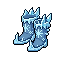 | **Frostbind Treads** | A pair of blue-tinted boots with crystalline ice formations covering the ankles and soles. Sharp, jagged frost spikes protrude from the heel and toe areas, emanating a pale, ethereal glow. The material appears to be enchanted leather reinforced with frozen arcane energy. | *Boots woven from the eternal winter of a forgotten realm. Each step leaves a whisper of cursed cold, and those who wear them find themselves bound to the frost—neither fully alive nor entirely consumed by its embrace.* | Samurai, Mage, Archer, Warrior |
| 2 | 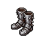 | **Ashwalker's Greaves** | Dark leather boots reinforced with blackened iron plates across the shins and ankles. Tattered cloth wrappings spiral around the calves in deep charcoal tones. The soles appear worn from countless journeys through cursed lands. | *Forged in the shadow of fallen kingdoms, these boots carry the weight of ash-covered roads. Those who wear them move as though haunted by the paths they've walked.* | Samurai, Mage, Archer, Warrior |
| 3 | 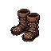 | **Cindercrust Treads** | Sturdy leather boots with dark brown and deep crimson coloring. The soles and heel reinforcements show metallic bronze accents. Surface texture suggests weathered, ash-stained material with subtle charring marks across the toe and ankle areas. | *Forged in the volcanic depths where fire meets stone, these boots carry the weight of countless journeys through cursed lands. Each step leaves an ephemeral trace of cinder in the air—a mark of those who walk between worlds.* | Samurai, Mage, Archer, Warrior |
| 4 | 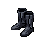 | **Shadowstep Greaves** | Dark leather boots with obsidian plating on the shins and feet. Black fabric wraps around the ankles with subtle crimson stitching. Metallic buckles and reinforced soles suggest both elegance and lethal purpose. | *Forged in the depths where light fears to tread, these boots carry the whisper of those who walk between worlds. Each step echoes with the weight of forgotten pacts.* | Samurai, Mage, Archer, Warrior |
| 5 |  | **Ashenstep Sabatons** | Heavy armored boots rendered in charcoal and pewter tones. Thick plating covers the foot and shin with layered metal segments. Ash-grey leather wraps between plates. A faint metallic sheen suggests ancient steel etched with worn runes along the heel. | *Forged in the deep sanctums where ash never settles, these boots grant the wearer the gait of inevitability. Each step echoes with the weight of countless fallen epochs.* | Samurai, Mage, Archer, Warrior |
| 6 | 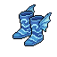 | **Azurite Strider's Boots** | Pointed-toe boots rendered in deep cobalt blue with crystalline azure accents. The sprite shows an ornate silhouette with upturned, curved heels and glowing geometric patterns etched across the surface, suggesting otherworldly craftsmanship. | *Forged in the depths where starlight crystallizes, these boots grant passage through shadow and sorrow alike. Those who wear them tread between worlds, their steps leaving faint echoes of a realm long forgotten.* | Samurai, Mage, Archer, Warrior |
| 7 |  | **Verdant Blight Treads** | Sturdy boots woven from thorny vines and dark moss, with glowing emerald accents at the ankles. Gnarled roots coil around the soles, pulsing with bioluminescent green light. Small toxic-looking flora sprouts from the leather. | *Boots grown from the soil of corrupted forests, where nature itself has turned vengeful. Each step leaves whispers of decay in your wake.* | Samurai, Mage, Archer, Warrior |
| 8 | 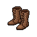 | **Bloodrust Treaders** | Weathered leather boots in deep brown and rust tones, reinforced with dark metal plating at the shins and heels. Worn fabric shows signs of old bloodstains and battle scars. Heavy soles with pronounced treads suggest countless journeys through cursed lands. | *These boots have carried warriors through battlefields where gods themselves refused to tread. The rust upon them is not mere oxidation—it remembers every drop spilled in their path.* | Samurai, Mage, Archer, Warrior |
| 9 | 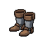 | **Ashenclomp Treads** | Heavy leather boots with dark brown and gray tones, reinforced with blackened metal plating at the shins and toe caps. Soot-stained surface suggests exposure to ancient flames. Thick soles with pronounced studs for grip. | *Boots forged in the shadow of fallen kingdoms, their leather darkened by ages of ash and sorrow. Each step carries the weight of those who walked before—a burden both curse and strength.* | Samurai, Mage, Archer, Warrior |
| 10 | 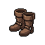 | **Ashwalker's Treads** | Weathered brown leather boots with dark iron buckles and reinforced soles. Ash-grey accents trace the seams and collar. The material appears aged and scorched, with faint burn marks across the surface suggesting passage through smoldering lands. | *Boots worn by those who walk through dying worlds. Each step echoes with the weight of ash and forgotten sorrows.* | Samurai, Mage, Archer, Warrior |
| 11 |  | **Stonewraith Treads** | Thick-soled boots rendered in slate blue and grey stone with crystalline frost accents. Heavy angular plating covers the shins, with jagged ice-like protrusions along the edges. Ethereal wisps coil around the ankles. | *Forged in the heart of a dying glacier, these boots carry the weight of ages. Each step echoes with the grinding of eternal ice.* | Samurai, Mage, Archer, Warrior |
| 12 | 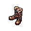 | **Ashenblight Treads** | Dark leather boots adorned with crimson cloth wrappings around the calves. Weathered brown leather with burnt orange accents and tattered burgundy fabric strips. The soles appear reinforced with dark metal plating, giving them a worn, battle-hardened appearance. | *Forged in the embers of a fallen kingdom, these boots carry the weight of cursed earth. Each step echoes with the whispers of those who walked before.* | Samurai, Mage, Archer, Warrior |
| 13 |  | **Crimson Marrow Treads** | Dark red leather boots with a deep crimson hue, adorned with black spikes or thorns protruding from the heels and ankle guards. The material appears worn and ancient, with obsidian accents along the toe and sole. | *Forged from the hide of creatures long extinct, these boots leave trails of ash with each step. Those who wear them claim to hear the whispers of the fallen echoing beneath their feet.* | Samurai, Mage, Archer, Warrior |
| 14 | 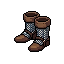 | **Ember Ashwalker's Treads** | Weathered brown leather boots with dark iron reinforcement plates across the toes and ankles. Tattered cloth wrappings spiral around the calves in shades of burnt orange and gray. The soles appear scorched, with faint ember-like patterns etched into the worn leather. | *Boots worn by those who walk through the ashes of fallen kingdoms. Each step echoes with the weight of ancient sorrows, leaving no trace but the scent of char and ruin.* | Samurai, Mage, Archer, Warrior |
| 15 | 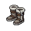 | **Ashenworn Greaves** | Weathered leather boots reinforced with dark metal plating. Ash-grey fabric wraps around the ankles, with blackened iron rivets and tarnished buckles. The soles show deep grooves worn by countless miles. Embers appear faintly etched into the metalwork. | *Boots that have trudged through fallen kingdoms and smoldering wastelands. Those who wear them carry the weight of ash-choked roads, where every step echoes with the whispers of the dead.* | Samurai, Mage, Archer, Warrior |
| 16 | 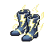 | **Hollow Shadowstep Greaves** | Heavy armored boots with dark metallic plating over midnight-blue cloth wrappings. Sharp angular pauldrons flare at the ankles, adorned with silver insignias. The soles glow faintly with ethereal violet runes that suggest supernatural speed. | *Forged in the depths where shadow pools collect the echoes of the damned, these greaves carry the curse-mark of those who walked between worlds. Each step leaves no sound, only the faint smell of sulfur and starlight.* | Samurai, Mage, Archer, Warrior |
| 17 |  | **Veilstep Treads** | Ornate boots rendered in deep purple and midnight blue with intricate arcane sigils embroidered across the fabric. The soles glow faintly with eldritch energy, and wispy shadow-like wisps curl around the ankles. Golden trim outlines the cuffs with a metallic sheen. | *Forged in the twilight between worlds, these boots carry the weight of countless journeys through forgotten realms. Each step leaves no trace—as if the wearer walks between moments themselves.* | Samurai, Mage, Archer, Warrior |
| 18 | 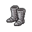 | **Ashen Wanderer's Treads** | Weathered leather boots with reinforced grey-brown plating across the shins and insteps. Tattered fabric wraps around the ankles, with faint metallic buckles visible on the sides. The sole appears worn and darkened, suggesting countless journeys through forsaken lands. | *Boots worn by those who traverse the blighted wastes between worlds. Each step echoes with the weight of a thousand forgotten roads, granting passage through places where mortals fear to tread.* | Samurai, Mage, Archer, Warrior |
| 19 | 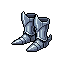 | **Duskbound Greaves** | Armored boots with dark steel plating over midnight-blue fabric. Silver buckles and rivets trace the shin guards. Ethereal wisps of shadow coil around the ankles, suggesting magical binding or cursed craftsmanship. | *Forged in the depths where light abandons hope, these boots carry the weight of forgotten oaths. Each step echoes with the whispers of those who wore them before their fall.* | Samurai, Mage, Archer, Warrior |
| 20 | 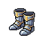 | **Ashenclaw Greaves** | Weathered steel boots with dark gray plating and ash-colored leather bindings. Claw-like talons protrude from the shins and heels, oxidized to a dull silver. Tattered cloth wrappings dangle from the cuffs. | *Forged in the grip of some forgotten war, these boots carry the weight of countless fallen. Each step echoes with the whispers of those who marched to ruin.* | Samurai, Mage, Archer, Warrior |
| 21 |  | **Tidecaller's Treads** | Ornate boots rendered in teal and cyan pixel art, featuring swirling wave motifs and aquatic embellishments. The soles glow with ethereal blue light, while decorative crests resembling coral or shells adorn the ankles. The overall aesthetic suggests deep-sea origin. | *Boots forged in the crushing depths where forgotten gods still slumber. Each step leaves ripples in reality itself, as if the wearer walks between worlds.* | Samurai, Mage, Archer, Warrior |
| 22 | 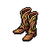 | **Bloodhoof Treads** | Weathered brown leather boots reinforced with dark metal plating at the shins and toes. Stitched with crimson thread in ritualistic patterns. The soles are thick and worn, stained with an unidentifiable dark substance. Small bone ornaments dangle from the laces. | *Boots worn by those who walk paths meant for the dead. Each step echoes with the weight of countless journeys through forsaken lands, granting the wearer an unsettling stride that unsettles the living.* | Samurai, Mage, Archer, Warrior |
| 23 | 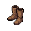 | **Ashencinder Treads** | Weathered brown leather boots with reinforced dark iron plating at the shins and toes. Burnt orange accents and ash-gray worn fabric suggest exposure to ancient flame. Heavy-soled with a deliberately weathered, battle-scarred appearance. | *Boots forged in the dying embers of a world consumed by blight. Those who wear them tread where lesser mortals dare not, leaving faint cinder-marks in their wake.* | Samurai, Mage, Archer, Warrior |
| 24 | 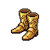 | **Hollow Ashenstep Sabatons** | Worn leather boots with weathered tan and brown coloring, reinforced at the ankles and toe caps with darker material. Ornate buckles or clasps adorning the sides, with a textured, aged appearance suggesting long travels through desolate lands. | *Forged in the remnants of an age long forgotten, these boots carry the dust of a thousand sorrowful miles. They whisper of journeys through shadow and ash, granting sure footing where hope has crumbled to stone.* | Samurai, Mage, Archer, Warrior |
| 25 |  | **Bloodthorn Greaves** | Ornate crimson and dark metal boots with jagged thorn-like protrusions along the shins and ankles. The fabric is deep burgundy with black reinforced plating. Sharp spikes curve upward from the heel. | *Forged in the depths where blood pools beneath obsidian spires, these greaves drink in the violence of their bearer's steps. Each thorn thirsts for the price of passage.* | Samurai, Mage, Archer, Warrior |
| 26 | 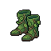 | **Mossgrown Treads** | A pair of verdant boots with thick, layered cloth wrapping in muted greens and browns. Moss and lichen cling to the reinforced leather sole and ankle cuff, suggesting age and damp earth. The textured surface evokes swampland and ancient stone. | *Boots worn by those who walk forgotten paths. The moss that adorns them whispers of centuries spent in shadow and soil, granting passage through cursed marshes where mortal flesh would rot.* | Samurai, Mage, Archer, Warrior |
| 27 |  | **Abyssal Treads** | Dark leather boots with intricate black stitching and shadowy wisps emanating from the soles. The material appears worn yet ethereal, with faint violet undertones and what resembles small obsidian clasps along the sides. | *Boots worn by those who have walked between worlds. Each step echoes with the weight of forgotten oaths, leaving whispers of shadow in your wake.* | Samurai, Mage, Archer, Warrior |
| 28 | 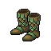 | **Marshrot Treads** | Weathered leather boots in muted olive and brown tones, adorned with tarnished bronze buckles and swamp-stained fabric. Moss-like growths cling to the reinforced soles, suggesting origins from cursed wetlands. | *Boots worn by those who walk between worlds—where rot blooms and ancient things stir. Each step leaves no trace, as the marsh itself conspires to hide the wearer's passage.* | Samurai, Mage, Archer, Warrior |
| 29 | 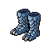 | **Stormveil Treads** | Dark blue leather boots with intricate silver threading and crystalline frost patterns. Adorned with small obsidian studs along the ankles and shimmering ethereal wisps coiling around the soles, suggesting arcane enchantment. | *Forged in the heart of a shattered sky, these boots carry the chill of forgotten storms. Those who wear them walk between worlds, leaving only frost in their wake.* | Samurai, Mage, Archer, Warrior |
| 30 | 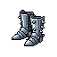 | **Duskmarrow Treads** | Heavy armored boots with dark steel plating and obsidian accents. Layered metal segments cover the shins, with tattered cloth wrappings around the ankles. Ethereal purple wisps coalesce around the soles, suggesting otherworldly weight. | *Forged in the depths where shadow pools run endless, these boots carry the burden of forgotten tombs. Each step echoes with the weight of those who walked before—and never returned.* | Samurai, Mage, Archer, Warrior |
| 31 |  | **Storm Abyssal Treads** | Dark indigo boots with ethereal purple accents and arcane runes. The soles glow faintly with void-touched energy, featuring intricate celestial patterns that shimmer against the shadowy fabric. | *Forged in the depths where starlight dies, these boots grant passage through darkness itself. Those who wear them move as whispers between worlds, leaving no trace but the faint scent of the abyss.* | Samurai, Mage, Archer, Warrior |
| 32 | 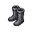 | **Umbral Treads** | Sturdy dark leather boots with blackened steel plating on the shins and reinforced soles. Intricate shadow-like patterns weave across the leather in deep purple and charcoal tones. Metal buckles gleam faintly along the sides. | *Forged in the depths where light fears to tread, these boots murmur secrets with every step. Those who wear them find the darkness becomes an ally, not an obstacle.* | Samurai, Mage, Archer, Warrior |
| 33 |  | **Shadowpact Greaves** | Dark indigo and black armored boots with angular plating. Silver accents trace mystical runes along the shin guards. Deep purple ethereal wisps coil around the ankles, suggesting enchantment or curse. | *Forged in the depths where shadow and steel converge, these boots whisper promises of swiftness to those cursed enough to wear them. Each step echoes with the weight of forgotten oaths.* | Samurai, Mage, Archer, Warrior |
| 34 | 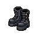 | **Shadowstep Treads** | Dark leather boots with obsidian buckles and reinforced soles. Silver runes trace the ankle cuffs, glowing faintly against the charcoal fabric. The heels are fitted with worn metal plates, suggesting countless journeys through corrupted lands. | *Forged in the depths where light fears to tread, these boots carry the weight of a thousand silent footfalls. Those who wear them find themselves one step closer to the darkness itself.* | Samurai, Mage, Archer, Warrior |
| 35 | 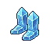 | **Frostbind Greaves** | A pair of crystalline blue boots with jagged icy formations along the shins and calves. The material appears frozen and translucent, with pale white accents at the edges and sole. Sharp, geometric ice shards protrude from the leg portions. | *Forged from the eternal winter of forgotten tundras, these boots leave trails of hoarfrost in their wake. Those who wear them find their movements swift and sure, though warmth becomes a distant memory.* | Samurai, Mage, Archer, Warrior |
| 36 | 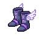 | **Voidborn Shadowstep Greaves** | A pair of dark purple boots with swirling violet ethereal patterns. The fabric appears semi-translucent with glowing arcane runes along the ankles. Sharp angular designs and wisps of shadow energy emanate from the soles. | *Woven from the twilight between worlds, these boots carry the weight of forgotten paths. Those who wear them find their steps muffled by darkness itself, as if reality bends to conceal their passage.* | Samurai, Mage, Archer, Warrior |
| 37 |  | **Cindercrust Greaves** | Heavy boots crafted from charred leather and blackened metal plating. Deep burgundy-brown tones dominate with ornate copper or bronze detailing along the shin and ankle. Textured surface suggests scorched, weathered material with layered armor segments. | *Forged in the dying embers of a fallen empire, these boots bear the scars of ages spent treading through ash and ruin. They ground the wearer, steady as stone.* | Samurai, Mage, Archer, Warrior |
| 38 | 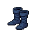 | **Nightfall Treads** | Dark indigo boots with deep navy accents and shadowy wisps. Reinforced leather upper with mysterious dark embroidery along the calf. Silver buckles and trim catch dim light. The sole appears worn from traversing cursed ground. | *Boots worn by those who walk between worlds. Each step echoes with the weight of forgotten oaths, carrying the bearer swiftly through darkness as if guided by shadow itself.* | Samurai, Mage, Archer, Warrior |
| 39 |  | **Cinderstep Treads** | Golden-brown leather boots with ember-colored accents and glowing orange runes etched along the cuffs. Reinforced with dark metal plating at the heels and toes. Wisps of faint flame seem to trail from the soles. | *Forged in the heart of a dying star, these boots carry the warmth of ancient conflagrations. Those who wear them tread between worlds, leaving only ash in their wake.* | Samurai, Mage, Archer, Warrior |
| 40 |  | **Hollow Frostbind Treads** | Pixel-art boots rendered in icy blue and white with crystalline formations. Frost patterns coat the leather upper, while the soles glow with an otherworldly pale blue luminescence. Sharp ice shards protrude from the heel and toe. | *Forged in the heart of a dead glacier, these boots leave trails of frozen despair. Those who wear them walk between worlds—neither fully present nor entirely absent.* | Samurai, Mage, Archer, Warrior |
| 41 | 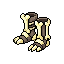 | **Soulstep Treads** | Worn leather boots with tattered cloth wrappings around the ankles and calves. Gold and bronze buckles gleam at the sides. The soles appear scorched or stained with an otherworldly ash, leaving faint spectral traces. | *Once worn by a wanderer who crossed between worlds. Each step echoes with the whispers of those who walked before, their burdens now yours to carry.* | Samurai, Mage, Archer, Warrior |
| 42 | 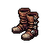 | **Bloodmire Treads** | Heavy leather boots rendered in deep crimson and dark brown. Thick soles with muddy, rust-colored staining. Metal rivets and buckles accent the ankles. The leather appears weathered and creased from countless journeys through forsaken lands. | *Boots that have trudged through battlefields forgotten by time. Those who don them find their steps eerily sure, as if guided by the restless echoes of fallen warriors whose blood still stains the earth.* | Samurai, Mage, Archer, Warrior |
| 43 | 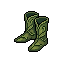 | **Verdigris Stalkers** | Weathered leather boots with oxidized copper plating across the shins and toes. Deep mossy green patina covers the metal accents. Tattered fabric wraps around the ankles, and small copper rivets glint dully along the seams. | *Once worn by forgotten tomb sentries, these boots carry the weight of centuries beneath stone. Each step echoes with the whispers of those who never left.* | Samurai, Mage, Archer, Warrior |
| 44 | 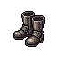 | **Voidborn Shadowstep Greaves** | Dark leather boots with reinforced plating. Charcoal-grey fabric wraps around blackened metal shin guards. Worn buckles and laces suggest ancient craftsmanship. A faint metallic sheen catches light across the toes. | *Forged in the depths where light fears to tread, these boots carry the weight of countless journeys through cursed lands. Each step echoes with whispered promises of escape.* | Samurai, Mage, Archer, Warrior |
| 45 | 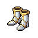 | **Ashen Wanderer's Boots** | Worn leather boots in muted browns and grays, reinforced at the soles with darkened metal plating. Tattered fabric wraps around the ankles, and faint ash-like discoloration marks the weathered leather. | *These boots have crossed countless desolate roads, their soles worn thin by pilgrims fleeing calamity. Those who wear them find their steps eerily silent, as if the earth itself refuses to echo their passage.* | Samurai, Mage, Archer, Warrior |
| 46 | 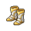 | **Ash-Treader Boots** | Worn leather boots in muted tan and grey, reinforced with darker patches and worn metal buckles. The soles show scorch marks and ash residue. Laces are frayed, suggesting countless journeys through desolate lands. | *Boots that have walked through the cinders of fallen kingdoms. Those who wear them find themselves lighter of step, as if the dust of the dead itself guides their passage.* | Samurai, Mage, Archer, Warrior |
| 47 | 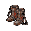 | **Cinderfell Treads** | Heavy leather boots with smoldering copper-red accents and blackened steel plating. Ash-gray fur lines the cuffs, with glowing ember-like details embedded along the soles. The heels show scorched metallic rivets. | *Forged in the embers of a fallen shrine, these boots carry the weight of ancient cinders. Each step leaves whispers of ash in the air, as if the ground itself remembers the fire.* | Samurai, Mage, Archer, Warrior |
| 48 | 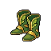 | **Swampblight Treads** | Weathered leather boots in murky olive and sickly green tones, adorned with corroded bronze buckles and trailing wisps of ghostly moss. The soles appear reinforced with dark metal plating, marked by toxic stains. | *Boots worn by those who walk paths no living thing should tread. They whisper of forgotten marshes and the suffering of those who sank into their depths.* | Samurai, Mage, Archer, Warrior |
| 49 |  | **Crimson Shroud Treads** | Dark crimson and burgundy leather boots with ornate black buckles and reinforced plating at the shins. Intricate black stitching traces arcane symbols along the calf, while deep shadows gather beneath layered fabric folds. | *Forged in the shadow of forgotten temples, these boots carry the whispers of those who walked between worlds. Each step echoes with the weight of blood debts and ancient pacts.* | Samurai, Mage, Archer, Warrior |
| 50 | 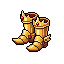 | **Emberscorch Treads** | Worn leather boots with golden-brown coloring and darker accents. The soles appear reinforced with metal plating, and embers or flame-like patterns glow faintly across the upper portions. Small ornamental buckles and straps wrap around the ankles. | *Once walked through the ash-choked ruins of a fallen empire, these boots bear the scars of infernal journeys. Those who don them find their steps quickened by spectral warmth, as if treading upon coals long since cooled.* | Samurai, Mage, Archer, Warrior |
| 51 | 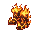 | **Embercinder Treads** | Worn leather boots with glowing orange and amber accents. Flames dance across the soles in flickering pixel patterns. The material shows scorched edges and heat-damaged stitching, with smoldering embers trailing beneath. | *Forged in the heart of a dying pyre, these boots carry the warmth of a thousand burned offerings. Each step leaves a whisper of ash in your wake.* | Samurai, Mage, Archer, Warrior |
| 52 | 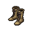 | **Ashen Treader Boots** | Weathered leather boots with dark brown and grey tones, reinforced with bronze or copper plating at the ankles and heel. Intricate stitching details visible along the seams, suggesting arcane or ritualistic craftsmanship. The soles appear worn from countless journeys through desolate lands. | *Forged in the shadow of forgotten crypts, these boots carry the weight of curses walked and dungeons plundered. Each step echoes with the resolve of those who refuse to fall.* | Samurai, Mage, Archer, Warrior |
| 53 | 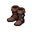 | **Ashenmire Treads** | Worn leather boots in deep brown and rust tones, reinforced with dark metal plating at the ankles and toe caps. Weathered stitching and a faint ashen patina suggest countless journeys through cursed lands. The soles appear thick and deliberately scarred. | *These boots have walked through the aftermath of fallen kingdoms, their leather drinking in the dust of a thousand graves. Those who wear them find their steps leave no trace—or perhaps worse, only ash remains where they tread.* | Samurai, Mage, Archer, Warrior |
| 54 | 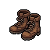 | **Emberscourge Treads** | Dark brown leather boots with charred, cracked surfaces and smoldering edges. Crimson fabric wraps around the ankles with faint runic symbols. The soles appear scorched and worn, emitting wisps of smoke. | *Forged in the dying breath of a fallen colossus, these boots carry the weight of ash and ruin. Each step echoes with the memory of conflagration.* | Samurai, Mage, Archer, Warrior |
| 55 | 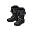 | **Shadowpact Treads** | Dark leather boots with obsidian buckles and ethereal wisps curling around the ankles. The soles bear intricate rune markings that faintly glow with spectral energy. Tattered fabric edges suggest ancient craftsmanship. | *Forged in the depths where light fears to tread, these boots carry the weight of a thousand forgotten oaths. Each step whispers secrets the living were never meant to know.* | Samurai, Mage, Archer, Warrior |
| 56 | 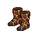 | **Hollow Emberscorch Treads** | Sturdy leather boots with burnt orange and deep brown coloring. Charred fabric wraps around reinforced ankle guards. Metal buckles and rivets run along the sides, with ash-grey accents suggesting exposure to intense heat and flame. | *Forged in the dying embers of a forgotten pyre, these boots carry the warmth of immolation. Those who wear them tread through ash and shadow as if walking between worlds.* | Samurai, Mage, Archer, Warrior |
| 57 | 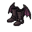 | **Umbral Talons** | A pair of dark, obsidian-black boots with sharp, claw-like protrusions along the heel and toe. The leather appears charred and textured, with jagged edges reminiscent of raven wings. Small crimson accents trace the ankle. | *Forged in shadow and hunger, these boots carry the restless spirit of things that hunt in darkness. Each step echoes with ancient malice.* | Samurai, Mage, Archer, Warrior |
| 58 | 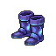 | **Nightveil Greaves** | Ornate boots rendered in deep indigo and purple hues with intricate silver threading. The design features pointed toe caps and wrapped shin guards with ethereal wispy patterns suggesting shadow or mist emanating from the material itself. | *Forged in the twilight reaches where shadow pools gather, these boots grant passage through darkness itself. Those who wear them find their footfalls swallowed by silence and their presence dimmed from prying eyes.* | Samurai, Mage, Archer, Warrior |
| 59 | 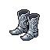 | **Forsaken Shadowstep Greaves** | Dark armored boots with layered plating in charcoal and steel grey. Intricate buckles and straps bind the segments together. The soles appear reinforced with shadowy material, suggesting supernatural lightness and silent movement. | *Forged in the depths where darkness pools like water, these boots grant those who wear them the gift of unseen passage. Even the keenest eye struggles to track their wearer's path.* | Samurai, Mage, Archer, Warrior |
| 60 | 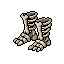 | **Ashencreep Treads** | Weathered leather boots with ornate buckles and tattered cloth wrappings. Soles are reinforced with dark iron plating. Intricate embroidered patterns run along the seams in faded gold thread, suggesting ancient craftsmanship. | *Boots forged in an age when the earth itself burned. Each step leaves whispers of ash in your wake, binding you closer to the dusk that devours all things.* | Samurai, Mage, Archer, Warrior |
| 61 | 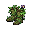 | **Thornveil Treads** | Moss-covered boots with twisted vine tendrils sprouting from the leather. Deep green coloration with hints of decay, adorned with small thorny growths and dark foliage. The soles appear rooted and organic, suggesting corruption or nature reclaimed. | *Boots woven from the cursed gardens of the Blighted Wastes, where flesh and flora blur into something neither wholly living nor dead. Each step leaves traces of corrupted growth in your wake.* | Samurai, Mage, Archer, Warrior |
| 62 | 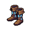 | **Cinders of the Fallen** | Weathered leather boots with copper-brown coloring and dark crimson accents. Reinforced with tarnished metal plating at the ankles and toe caps. Wisps of ember-like orange details streak across the sides, suggesting exposure to intense heat or ancient flame. | *These boots bear the scars of a thousand battlefields, their soles worn by those who walked through fire and emerged unbroken. To wear them is to inherit the grim resilience of the damned.* | Samurai, Mage, Archer, Warrior |
| 63 | 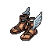 | **Cinderfang Treads** | Dark leather boots with crimson and gold accents. Sharp, claw-like protrusions curve upward from the heels. The soles glow faintly with ember-orange light. Intricate dark metal plating wraps around the ankles and shins, bearing ancient runes. | *Forged in the depths where fire consumes stone, these boots grant their wearer the predatory grace of something far older than man. Each step leaves the faintest scent of sulfur and ash.* | Samurai, Mage, Archer, Warrior |
| 64 | 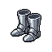 | **Ironpeak Striders** | Sturdy leather boots reinforced with dark metal plating at the shins and toes. Gray-toned leather wraps around the ankles with metallic buckles. The soles appear thick and heavy, suggesting both protection and weight. | *Forged in the shadow of mountains long forgotten, these boots carry the weight of ancient earth. Each step echoes with the promise of unshakable resolve.* | Samurai, Mage, Archer, Warrior |
| 65 |  | **Mossgrown Treaders** | Weathered leather boots overgrown with creeping moss and pale fungal growths. Deep forest green base with darker mottled patches. Reinforced sole with what appears to be petrified wood or bone plating. Small white mushroom caps dot the surface. | *Boots that have drunk deep of the old woods. Those who wear them move through shadow and ruin as if reclaimed by the earth itself, leaving barely a whisper in their wake.* | Samurai, Mage, Archer, Warrior |
| 66 |  | **Cursed Stormveil Treads** | A pair of knee-high boots rendered in deep cobalt and electric blue hues. The fabric shimmers with arcane energy, accented by silver buckles and ethereal wisps of frost-like mist emanating from the soles. Sharp, crystalline spikes protrude subtly along the heel and toe. | *Forged in the howling peaks where lightning splits stone, these boots carry the restless charge of a thousand storms. To don them is to feel the earth tremble beneath your feet.* | Samurai, Mage, Archer, Warrior |
| 67 |  | **Forsaken Embercinder Treads** | Ornate boots with deep crimson and gold accents, featuring flame-like patterns across the calf. The soles glow with smoldering embers, and intricate metalwork adorns the ankle guards with a scorched, aged appearance. | *Forged in the heart of a dying volcano, these boots carry the warmth of ancient conflagration. To wear them is to walk through ash and ruin unscathed, though the faint scent of sulfur never quite fades.* | Samurai, Mage, Archer, Warrior |
| 68 |  | **Umbralshard Treads** | Dark armored boots with obsidian plating and shadowy undertones. Sharp geometric edges catch dim light. Intricate dark runes trace along the ankle cuffs. Heavy, imposing silhouette suggests both protection and sinister purpose. | *Forged in the depths of a forgotten cataomb, these boots carry the weight of shadows themselves. Those who wear them move as if cloaked in perpetual dusk, their footfalls leaving whispers of the abyss.* | Samurai, Mage, Archer, Warrior |
| 69 |  | **Shattered Shadowstep Greaves** | Dark leather boots with reinforced steel plating at the shins and ankles. Intricate silver threading traces skeletal patterns across the surface. The soles appear worn smooth, suggesting countless journeys through forsaken lands. | *Forged in the twilight hours by those who walk between worlds, these boots grant their wearer the unsettling grace of the damned. Each step echoes with the whispers of those who came before.* | Samurai, Mage, Archer, Warrior |
| 70 |  | **Nightshade Treads** | A pair of ornate purple boots with darker violet accents and mystical rune patterns. The fabric appears rich and enchanted, with shadowy wisps emanating from the soles. Silver buckles and arcane symbols adorn the sides. | *Boots woven from the petals of flowers that bloom only in cursed soil. Each step leaves no trace, and whispers of the void cling to those who wear them.* | Samurai, Mage, Archer, Warrior |
| 71 |  | **Storm Umbral Treads** | Dark purple boots with swirling shadow wisps emanating from the ankles. The material appears to be enchanted cloth or leather with a glossy, otherworldly sheen. Ethereal tendrils of darkness coil around the leg portions, suggesting movement even in stillness. | *Forged in the depths where light fears to tread, these boots echo with the footfalls of forgotten wanderers. Each step whispers secrets that the living were never meant to hear.* | Samurai, Mage, Archer, Warrior |
| 72 |  | **Scorched Wanderer's Treads** | Weathered brown leather boots with reinforced soles and wrapped ankle cords. Charred edges and ash-grey accents suggest exposure to flame. Metal buckles and studs provide structure, with a worn, traveled appearance throughout. | *Boots that have trudged through hellfire and survived. Those who wear them find their path ever forward, as if compelled by something ancient that refuses to let them rest.* | Samurai, Mage, Archer, Warrior |
| 73 |  | **Dreadstep Greaves** | Heavy armored boots with dark metallic plating and reinforced leather. Blackened steel segments cover the shins and feet, with sharp angular ridges along the edges. The soles appear thick and worn, suggesting countless journeys through cursed lands. | *Forged in the depths of a fallen kingdom, these boots carry the weight of ages and the stench of shadow. Each step echoes with the finality of a closing tomb.* | Samurai, Mage, Archer, Warrior |
| 74 |  | **Amethyst Marrow Treads** | A pair of ornate boots rendered in deep purple and black tones. The primary color is a rich amethyst with darker obsidian accents around the ankles and heels. The boots feature intricate crystalline patterns across the leather, with pointed toes and layered soles suggesting supernatural craftsmanship. | *Forged from the calcified essence of forgotten crypts, these boots echo with the whispers of those who walked these halls before you. Each step carries the weight of ancient curses and the promise of paths obscured from mortal sight.* | Samurai, Mage, Archer, Warrior |
| 75 |  | **Forsaken Shadowstep Greaves** | Dark teal and black armored boots with jagged, crystalline spikes protruding from the shins and ankles. The material appears to be reinforced leather wrapped around obsidian-like plating, with glowing violet runes etched along the edges. | *Forged in the depths where shadow pools gather, these greaves grant those who wear them passage through darkness itself. Each step echoes with whispers of the abyss.* | Samurai, Mage, Archer, Warrior |
| 76 |  | **Crimson Void Treads** | Ornate boots rendered in deep crimson and midnight blue pixel art. Layered armor plating adorns the shins with angular, jagged edges. Gold trim accents the calf section, while the soles appear to shimmer with an otherworldly dark aura. | *Forged in the depths where shadow bleeds into stone, these boots grant passage through cursed lands. Those who wear them leave no footprints, only the faint scent of ash and old blood.* | Samurai, Mage, Archer, Warrior |
| 77 |  | **Shattered Embercinder Treads** | Ornate boots with deep crimson and gold accents. Flame-like patterns wrap around the ankles, with glowing orange embers embedded in the soles. The leather appears scorched at the edges, suggesting exposure to intense heat. | *Forged in the magma chambers of a fallen kingdom, these boots leave faint ash in their wake. Those who wear them carry the warmth of primordial fire, though it comes at the cost of restless, burning feet.* | Samurai, Mage, Archer, Warrior |
| 78 |  | **Mossveil Treads** | Weathered boots covered in creeping moss and fungal growth. The leather is dark olive-green, reinforced with blackened metal plating at the ankles and toe caps. Tangled vines wrap around the shafts, and patches of luminescent fungi glow faintly along the sole. | *These ancient boots remember forests that have long since turned to ash. Those who wear them find themselves moving as though the very earth grants passage, silent and inevitable as decay.* | Samurai, Mage, Archer, Warrior |
| 79 |  | **Abyssal Stride Boots** | Midnight-blue armored boots with glowing ethereal accents. Sharp angular plating covers the shins and feet, with swirling dark energy wisping around the soles. Golden rune-work traces the edges, contrasting the deep indigo leather. | *Forged in the depths where light fears to tread, these boots echo with the whispers of those who walked before. Each step leaves a faint mark of shadow, a reminder that some paths should never be followed twice.* | Samurai, Mage, Archer, Warrior |
| 80 |  | **Thornroot Treads** | Weathered leather boots with dark brown and tan coloring, adorned with gnarled root-like patterns wrapped around the ankles. Metal rivets and buckles reinforce the soles. Thorny vine motifs spiral up the sides in oxidized copper or bronze. | *Boots grown from the twisted roots of the Thornwood, they carry the scent of ancient soil and decay. Those who wear them walk between worlds, leaving no trace but carrying the weight of the earth itself.* | Samurai, Mage, Archer, Warrior |
| 81 |  | **Ancient Abyssal Treads** | A pair of armored boots rendered in deep blue and midnight black with crystalline accents. The soles glow faintly with an otherworldly sapphire luminescence, and intricate runes trace along the ankle cuffs. Sharp angular plates reinforce the shins. | *Forged in the depths where light dies, these boots grant passage through cursed grounds. Those who wear them leave no footprint—only the faint echo of something unwelcome.* | Samurai, Mage, Archer, Warrior |
| 82 |  | **Cursed Embercinder Treads** | Sturdy leather boots with copper-bronze reinforcement plates. Warm orange and deep brown tones dominate the palette. The soles glow faintly with embers, wisps of smoke trailing from the heel guards. Metal buckles and protective plating accent the ankles. | *Forged in the ash of fallen empires, these boots carry the lingering warmth of eternal flames. Each step leaves a whisper of ember dust—a mark of the wielder's passage through shadow and ruin.* | Samurai, Mage, Archer, Warrior |
| 83 |  | **Nightbloom Treads** | Dark purple boots with an eerie, organic design. The fabric appears to shift between deep violet and black, with thorny, vine-like protrusions wrapping around the ankles and shin. Small glowing runes pulse faintly across the surface, emanating an otherworldly luminescence. | *Woven from the petals of flowers that bloom only in cursed soil, these boots carry the whispers of the damned with every step. Those who wear them find themselves moving between shadows as easily as through open air.* | Samurai, Mage, Archer, Warrior |
| 84 |  | **Voidborn Embercinder Treads** | Weathered brown leather boots with dark iron reinforcement at the soles and ankle guards. Ash-grey accents trace the seams, with faint ember-like orange glowing cracks visible across the worn leather surface. | *Forged in volcanic ash and tempered by fell magic, these boots carry the warmth of a dying pyre. Those who wear them leave faint scorched marks upon the earth with each step.* | Samurai, Mage, Archer, Warrior |
| 85 |  | **Shattered Embercinder Treads** | Ornate boots with deep crimson and gold accents, featuring flame-like patterns across the leather. Glowing embers swirl around the soles and ankles, casting warm light. Reinforced with darkened metal plating at the heel and toe. | *Forged in the dying breath of a pyre-summoned beast, these boots carry the warmth of perpetual flame. Those who wear them tread upon ash and cinder as easily as solid ground.* | Samurai, Mage, Archer, Warrior |
| 86 |  | **Ember Embercinder Treads** | Crimson leather boots with glowing orange cracks running across the surface, suggesting molten heat. Golden buckles and reinforced toe caps. Wisps of ethereal flame flicker around the soles. | *Forged in the ash of fallen empires, these boots carry the fury of smoldering ruin. Each step leaves a faint trail of warmth, as if the wearer walks between worlds of fire and shadow.* | Samurai, Mage, Archer, Warrior |
| 87 |  | **Marrowstep Treads** | Weathered leather boots with moss-green accents and bone-pale buckles. The soles are reinforced with dark iron plating, and tattered cloth wrappings spiral around the ankles. Small totems of carved bone dangle from the sides. | *Forged in forgotten crypts, these boots carry the weight of countless pilgrims who sought answers in shadow. Each step echoes with the whispers of those who never returned.* | Samurai, Mage, Archer, Warrior |
| 88 |  | **Scorched Ember Treads** | Weathered leather boots with burnt orange and dark brown tones. Reinforced toe caps and heel plating show signs of intense heat damage. Smoldering cinders cling to the soles, casting faint amber highlights across the worn surface. | *Boots that have walked through infernos long forgotten. The embers that dance upon their soles never truly extinguish, marking the path of one cursed—or blessed—to traverse the scorched wastelands of the damned.* | Samurai, Mage, Archer, Warrior |
| 89 |  | **Ancient Bloodmire Treads** | Heavy leather boots with dark brown and rust-colored tones, reinforced with worn metal plating at the ankles and soles. Weathered straps and buckles wrap around the calves. The soles appear caked with dried earth and aged stains. | *Boots worn by those who walk cursed lands. Each step echoes with the weight of forgotten sorrows, grounding the wearer in a world that hungers to pull them deeper.* | Samurai, Mage, Archer, Warrior |
| 90 |  | **Cursed Shadowpact Greaves** | Dark armored boots with obsidian-black plating and jagged, thorned edges. Wisps of ethereal shadow coil around the ankles. The soles gleam with an eerie violet luminescence, suggesting otherworldly enchantment. | *Forged in the depths where light fears to tread, these boots carry the weight of forgotten oaths. Each step echoes with the screams of those who broke their pacts with darkness.* | Samurai, Mage, Archer, Warrior |
| 91 |  | **Frostpeak Treads** | A pair of tall, pale blue boots with crystalline ice formations adorning the ankles and shins. The soles appear reinforced with dark metal plating, while ethereal wisps of frost cling to the upper portions. Fine etchings of snowflake patterns run along the seams. | *Boots forged in the heart of an eternal blizzard, where the boundary between flesh and ice grows thin. Those who wear them leave frozen footprints that linger long after they have passed.* | Samurai, Mage, Archer, Warrior |
| 92 |  | **Voidborn Bloodmire Treads** | Knee-high boots in deep crimson and burgundy leather with dark brown accents. The upper calf features intricate embroidered patterns in black thread. Soles appear weathered and stained, suggesting passage through cursed terrain. | *Boots worn by those who walk between worlds. Each step echoes with the whispers of those lost to the crimson marshes—a reminder that some paths, once taken, cannot be retraced.* | Samurai, Mage, Archer, Warrior |
| 93 |  | **Bloodmire Greaves** | Heavy boots crafted from dark leather and tarnished bronze plating. The soles are caked with dried crimson mud, while intricate copper-wire bindings reinforce the ankles. A faint sheen of age-darkened metal adorns the upper portions. | *Cursed footwear steeped in the blood of forgotten battlefields. Those who don these boots find themselves inexplicably drawn toward conflict, as if the earth itself demands tribute.* | Samurai, Mage, Archer, Warrior |
| 94 |  | **Shadowpace Sabatons** | A pair of dark, heavy boots rendered in deep charcoal and black pixels. The boots feature reinforced plating along the shins and ankles, with subtle purple-black accents suggesting enchantment. The soles appear worn and slightly luminous, hinting at arcane infusion. | *Forged in the depths where light fears to tread, these boots carry the weight of countless shadowed steps. Those who wear them move as if darkness itself parts before them.* | Samurai, Mage, Archer, Warrior |
| 95 |  | **Storm Mossgrown Treads** | Weathered leather boots covered in creeping moss and lichen. Earthy green and gray tones dominate the worn material. Thick, gnarled buckles suggest ancient craftsmanship. Soil clings to the soles. | *Boots claimed from the tomb-keeper's corpse, still damp with grave-earth. Each step echoes with the weight of forgotten centuries.* | Samurai, Mage, Archer, Warrior |
| 96 |  | **Sapphire Warden's Greaves** | Sturdy blue-armored boots with a metallic sheen and cobalt plating. Adorned with intricate white trim and crystalline accents along the shin guards. The soles appear reinforced with dark material, suggesting both protection and mobility. | *Forged in the depths where sapphire deposits pierce eternal stone, these greaves whisper of sentinels long turned to dust. Each step echoes with the weight of forgotten oaths.* | Samurai, Mage, Archer, Warrior |
| 97 |  | **Duskstep Greaves** | A pair of armored boots rendered in deep indigo and steel blue tones. The boots feature reinforced plating along the shins and ornate buckles, with shadowy wisps or ethereal smoke coiling around the ankles. The soles appear dark and worn, suggesting countless journeys through cursed lands. | *Forged in the twilight foundries of a forgotten realm, these boots carry the weight of those who walk between worlds. Each step disturbs the veil between shadow and substance.* | Samurai, Mage, Archer, Warrior |
| 98 |  | **Cursed Duskmarrow Treads** | Sturdy black leather boots with reinforced grey metal plating at the shins and toes. Intricate dark purple stitching traces the seams. The soles appear worn from countless journeys through shadow-laden lands. | *Forged in the twilight forges of a forgotten epoch, these boots carry the weight of paths better left untrodden. Each step echoes with the whispers of those who came before.* | Samurai, Mage, Archer, Warrior |
| 99 |  | **Dreadstep Treads** | Weathered leather boots in deep brown and tan, reinforced with dark metal plates across the shins and toes. Worn laces and scuffed soles suggest long journeys through hostile terrain. Faint crimson staining marks the heel. | *Boots worn by those who walk the killing fields. Each step echoes with the weight of countless miles and darker purposes.* | Samurai, Mage, Archer, Warrior |
| 100 |  | **Verdant Mire Treads** | A pair of emerald-green boots with a slimy, organic texture suggesting moss and fungal growth. The soles appear translucent and gelatinous, with darker veins running through them. Small tufts of bioluminescent plant matter cling to the ankle guards. | *Boots cultivated in the depths where light fears to tread. Those who wear them move as if blessed by the swamp itself—silent, unseen, inevitable as rot.* | Samurai, Mage, Archer, Warrior |
