# Axes - Item Catalog

> **Category:** Axe  
> **Total items:** 100  
> **Classes:** Warrior

| # | Preview | Item Name | Visual Description | Description | Classes |
|:-:|:-------:|:----------|:------------------|:------------|:--------|
| 1 | 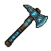 | **Grimstone Reaper** | A weathered double-bladed axe with a dark steel head streaked with slate-gray stone. The handle is wrapped in worn leather, with a prominent knot at the base. The blade edges gleam with an ominous metallic sheen against shadowy undertones. | *An executioner's tool of forgotten wars, its weight speaks of countless fallen. The stone embedded in its steel hungers still.* | Warrior |
| 2 | 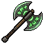 | **Blight Reaper** | A double-bladed battle axe with a dark green and black color scheme. The twin blades feature jagged, organic edges suggesting diseased growth. The wooden handle is wrapped in dark leather, with a sickly green luminescence emanating from corrupted runes carved along the haft. | *A weapon born from plague and pestilence, its blades weep with ancient corruption. Those who wield it find their enemies wither as much from despair as from steel.* | Warrior |
| 3 | 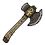 | **Bloodmoss Cleaver** | A heavy-headed axe with a weathered wooden haft wrapped in dark leather. The blade shows rust-colored staining and moss-like growths, suggesting ancient battlefields. The edge is jagged and well-worn from countless strikes. | *An axe that has drunk deep from the earth's oldest graves. Those who swing it report the moss whispers of fallen empires with each blow.* | Warrior |
| 4 | 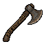 | **Bloodfall Cleaver** | A heavy-bladed axe with a dark wooden haft wrapped in what appears to be aged leather or binding. The blade shows deep crimson staining across its edge, with a weathered grey-black metal finish. The axe head is broad and brutal, suggesting countless battles. | *A weapon steeped in the gore of forgotten wars. The Bloodfall Cleaver thirsts eternally, its edge never dulling, never sating the hunger that drives those who wield it into the fray.* | Warrior |
| 5 | 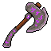 | **Bloodmoon Cleaver** | A two-handed axe with a large, crescent-shaped head rendered in deep purple and burgundy tones. The blade curves wickedly with a dark metallic sheen. The haft appears wrapped or stained, with lighter accents suggesting worn leather or bone wrappings near the grip. | *An executioner's tool forged in ages past, its curved edge thirsts for the life-wine of those foolish enough to stand before it. Each swing carries the weight of a thousand condemned souls.* | Warrior |
| 6 | 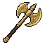 | **Goldrim Cleaver** | A robust battle axe with a wide, golden-brass head adorned with ornate detailing. The blade gleams with warm metallic luster against a darker handle, featuring intricate scrollwork and ceremonial markings along the shaft. | *Once wielded by warlords who carved empires from ash and bone. Its golden face has tasted countless battlefields, and the weight of ancient glory still resonates through those worthy enough to claim it.* | Warrior |
| 7 | 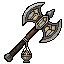 | **Bloodthorn Cleaver** | A brutish double-bladed axe with a darkened steel head. The blade edges carry a crimson tint, while thorny protrusions spiral around the haft. The handle is wrapped in worn leather, stained with age. | *A weapon that thirsts for carnage, its thorned edges leaving ragged wounds that refuse to close. Those who wield it report hearing whispers beneath the crash of battle-as if the axe itself hungers for blood.* | Warrior |
| 8 | 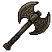 | **Hollow Bloodmoon Cleaver** | A heavy double-bladed axe with a dark metallic head featuring crimson accents. The blade edges gleam with an ominous sheen, while the wooden haft appears weathered and stained. Gold or brass bindings reinforce the handle. | *An executioner's tool forged in ages past, its blades have tasted the blood of fallen kingdoms. Those who wield it report whispers in the dark-whether from the axe itself or the countless souls it has claimed remains unclear.* | Warrior |
| 9 | 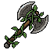 | **Mournblight Cleaver** | A heavy double-bladed axe with a dark, weathered steel head. The blade bears a sickly greenish patina, suggesting ancient decay or dark enchantment. The shaft is wrapped in tattered leather bindings, with bone fragments woven throughout. Wisps of shadow seem to coil around the edge. | *A weapon steeped in suffering, its edges thirst endlessly for the vitality of the fallen. Those who wield it report hearing whispers of the countless souls ground beneath its blade, each death feeding the shadow that dwells within.* | Warrior |
| 10 | 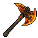 | **Emberfang Cleaver** | A broad-bladed axe with a golden-orange flame motif along the cutting edge. The head features warm amber and deep orange tones with dark metallic accents. The wooden haft is dark brown, bound with leather wrapping near the grip. | *A weapon forged in the depths of dying volcanoes, its edge still smolders with the rage of ancient fire. Those who wield it claim the blade hungers for violence, drawing power from each brutal strike.* | Warrior |
| 11 | 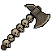 | **Blackspine Cleaver** | A heavy axe head with dark metallic blade featuring jagged, spine-like protrusions along the edge. The haft is wrapped in weathered leather binding, with a reinforced ferrule at the base. The overall silhouette suggests brutal, efficient design. | *A reaper's tool forged in despair. Each swing echoes with the weight of countless battlefields, its edge hungry for the warmth of spilled blood.* | Warrior |
| 12 | 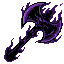 | **Voidreaper's Maul** | A large, brutal axe head rendered in deep purple and obsidian black. The blade features jagged, crystalline edges that seem to absorb light. The haft is wrapped in shadowy tendrils, with spectral wisps coiling around the shaft. | *A weapon forged in the depths of the Shattered Void, its edge thirsts for the lifeforce of those foolish enough to stand before it. Each swing echoes with the screams of the countless souls bound within its dark core.* | Warrior |
| 13 | 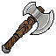 | **Bloodrust Cleaver** | A brutal two-headed axe with a weathered wooden haft bound in frayed cloth. The blade shows deep rust-brown oxidation and notched edges, suggesting countless battles. A small symbol or glyph is etched near the head. | *An executioner's tool from a forgotten war, its rust mingles with older stains. Those who swing it claim to hear whispers of the fallen embedded in its metal.* | Warrior |
| 14 | 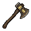 | **Ironpeak Cleaver** | A sturdy double-bladed axe with a weathered wooden haft wrapped in dark leather. The head features two asymmetrical iron blades with a dull bronze-grey patina, showing signs of ancient use and dried blood stains along the edges. | *Forged in an age when giants still walked the earth, this axe thirsts for the warmth of battle. Its dull sheen belies the terrible ruin it has wrought upon countless foes.* | Warrior |
| 15 | 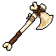 | **Bloodrite Cleaver** | A brutal double-bladed axe with a weathered wooden haft bound in dark leather. The axe head features a rusty, oxidized bronze finish with dried crimson stains along the blades' edges. Crude tribal markings are etched into the metal, giving it a ritualistic, ancient appearance. | *A weapon drunk on the sins of a thousand battlefields. Those who swing it find their rage sharpened to an edge no whetstone could ever hone-as if the axe itself hungers for blood, and feeds strength back to those who sate it.* | Warrior |
| 16 | 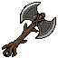 | **Hollow Bloodmoon Cleaver** | A brutal double-bladed axe with a dark metallic head tinged crimson. The handle is wrapped in aged leather, stained black. A crescent-shaped symbol glows faintly on the upper blade, suggesting corrupted craftsmanship or fell magic. | *Forged in an age of endless bloodshed, this cleaver thirsts for violence as much as the warrior who wields it. Those who carry it claim to hear whispers beneath the howl of combat.* | Warrior |
| 17 | 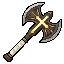 | **Ancient Bloodmoon Cleaver** | A double-bladed axe with a dark metallic head tinged rust-red, mounted on a wooden haft wrapped in weathered leather. Gold or brass accents frame the blade base, with an ornate central boss suggesting ancient craftsmanship. | *A weapon forged in nights when the moon hung crimson over forgotten battlefields. Those who swing it report visions of countless fallen, their strength flowing through the wielder's arms.* | Warrior |
| 18 | 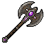 | **Blackthorn Cleaver** | A brutal double-bladed axe head with dark purple and black coloring. The blade features jagged, thorn-like protrusions along its edges. The shaft appears wrapped in shadowy material, with ornate metal bands. A menacing, asymmetrical design suggests eldritch corruption. | *A weapon born from the void between worlds, its hunger for violence is almost palpable. Those who swing it report whispers of forgotten wars and the screams of the damned echoing through their bones.* | Warrior |
| 19 | 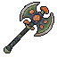 | **Forsaken Bloodrite Cleaver** | A brutal double-bladed axe with a weathered wooden haft bound in dark leather. The blade heads are stained crimson and adorned with jagged bone inlays along the edges. Gold filigree runs down the center of the metal, contrasting the oxidized steel. | *An executioner's tool reforged in blood rituals, this axe thirsts for violence as much as the warrior who wields it. Each swing leaves echoes of the ancient rites that cursed its steel.* | Warrior |
| 20 | 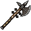 | **Voidborn Bloodmoon Cleaver** | A broad-bladed axe with a dark metallic head etched with crimson runes. The shaft appears weathered bone or pale wood, wrapped in shadow. A crescent moon symbol glints faintly on the blade's face. | *A weapon forged in ritual blood and moonless night. Those who swing it claim the darkness answers their call, hungry and without mercy.* | Warrior |
| 21 | 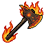 | **Shattered Emberfang Cleaver** | A double-bladed axe with a dark wooden haft. The twin heads glow with orange and yellow flames that lick upward. The metal appears scorched and molten at the edges, with ember particles frozen mid-spark around the blade. | *Forged in the heart of a dying star, this axe hungers for carnage. Each swing leaves trails of ash and cinder in its wake, consuming flesh as readily as it consumes hope.* | Warrior |
| 22 | 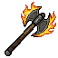 | **Emberfell Cleaver** | A double-bladed axe with a dark wooden haft wrapped in burnt orange binding. The twin blades glow with smoldering amber edges, their surfaces etched with ash-grey runes. Wisps of ember trail from the blade tips against the shadowed metal. | *A weapon forged in the depths of a dying volcano, its thirst for battle is matched only by the infernal heat that courses through its iron. Those who wield it are consumed by the same flames that birthed it.* | Warrior |
| 23 | 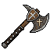 | **Bloodreaper's Maul** | A heavy-bladed axe with a dark, weathered metal head. The blade shows deep crimson streaks across its surface, suggesting age or dark ritual use. The haft appears wooden and worn, with a rough, primal quality. | *An instrument of carnage worn smooth by countless deeds of butchery. Those who swing it claim the blade hungers-that it pulls their arm toward flesh with unnatural eagerness.* | Warrior |
| 24 | 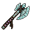 | **Hollow Bloodmoon Cleaver** | A brutal double-bladed axe with a dark wooden haft wrapped in worn leather. The wide, asymmetrical blades display deep crimson staining along their edges, contrasting against the weathered steel. A jagged spike protrudes from the pommel. | *A reaper's tool, aged in battlefields long forgotten. Those who swing it claim to hear whispers of the fallen echoing within its iron-or perhaps it is merely the wind crying through the valleys of its wounds.* | Warrior |
| 25 | 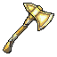 | **Grimwood Cleaver** | A single-bladed axe with a golden-bronze head and dark wooden haft. The blade is wide and slightly curved, with warm metallic highlights catching light. Simple leather wrapping adorns the grip, suggesting frequent, weathered use. | *An executioner's tool reforged into an instrument of war. Those who swing it speak of voices in the wood-whether prayers or curses, none can say.* | Warrior |
| 26 | 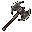 | **Blackpeak Cleaver** | A heavy double-bladed axe with a dark metallic head. The blade features asymmetrical edges with a weathered, oxidized finish. A thick wooden haft reinforced with dark iron bands extends downward, ending in a reinforced pommel. | *Forged in the depths where stone meets shadow, this cleaver has tasted the marrow of forgotten kingdoms. Each swing carries the weight of a thousand fell deeds.* | Warrior |
| 27 | 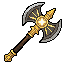 | **Goldrot Executioner** | A heavy double-bladed axe with a golden-brass head bearing intricate worn patina. The blade shows deep amber and bronze tones with dark corrosion marks. A thick wooden haft extends downward, wrapped in aged leather bindings. | *An ancient executioner's tool, its golden sheen long since tarnished by centuries of blood and neglect. Those who swing it claim to hear the whispers of the condemned in each impact.* | Warrior |
| 28 | 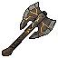 | **Blackpine Reaper** | A heavy double-bladed axe with a dark wooden haft reinforced by bronze bands. The twin blades feature a weathered bronze patina with jagged, asymmetrical edges. Gold or brass accents wrap the grip, and the axe head shows signs of ancient battle-wear. | *A reaper's tool repurposed for slaughter, its mismatched blades tell of wars forgotten by time. Those who swing it find themselves guided by an insatiable hunger-whether the axe's or their own, none can say.* | Warrior |
| 29 | 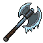 | **Frostbite Reaper** | A double-bladed axe head mounted on a dark wooden haft, with a pale blue-grey finish suggesting frost or ancient ice. The blade edges gleam with an otherworldly sheen, while icicle-like protrusions hang from the lower edge, creating an imposing silhouette. | *A weapon born from the depths of forgotten winters, its touch drains warmth from bone and steel alike. Warriors who wield it claim they hear the whispers of those frozen in its eternal grip.* | Warrior |
| 30 | 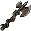 | **Bloodpeak Reaper** | A crude double-headed battle axe with weathered iron blades. The handle is wrapped in dark leather, stained crimson. Rusted metal bands reinforce the wooden shaft. The right blade appears slightly larger and more menacing than the left. | *An executioner's tool passed through countless hands, each bloodstain a testament to wars long forgotten. Those who swing it claim they can feel the weight of the fallen.* | Warrior |
| 31 | 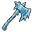 | **Stormbreaker's Maul** | A double-headed axe with a bright blue-white head and darker handle. The blade features jagged, crystalline edges suggesting frozen lightning. The weapon radiates an icy aura with subtle electric blue accents along the grip and blade. | *A weapon forged in the heart of a shattered storm, its edges crackle with the fury of ages past. Those who swing it claim to hear distant thunder with every blow.* | Warrior |
| 32 | 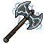 | **Bloodmoon Reaver** | A brutal double-bladed axe with a dark metal head streaked in crimson. The shaft is wrapped in aged leather and bone, featuring a crescent moon symbol etched near the pommel. Orange highlights catch the blade edges. | *Born from ancient battlefields where empires fell, this axe thirsts for the blood of the fallen. Those who wield it claim to hear whispers of a thousand last breaths upon each swing.* | Warrior |
| 33 | 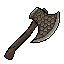 | **Bloodthorn Reaper** | A weathered axe with a dark, blood-stained blade tapering to a wicked point. The haft is wrapped in worn leather binding, leading to a stark wooden shaft. Thorny protrusions jut from the blade's spine. | *A weapon born from suffering and malice, its blade thirsts for the warmth that flows beneath mortal skin. Those who grip this axe find themselves consumed by an ancient hunger that dims all other purpose.* | Warrior |
| 34 | 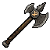 | **Cursed Bloodmoon Cleaver** | A broad-headed battle axe with a dark, weathered blade tinged crimson. The haft appears aged and wrapped, with a reinforced metal guard. The axe head shows asymmetrical wear patterns suggesting countless battles. | *A weapon steeped in carnage, its blade forever stained by the blood of those who fell beneath it. Some say it hungers still, calling to warriors who would answer its ancient thirst.* | Warrior |
| 35 | 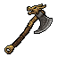 | **Forsaken Ironpeak Cleaver** | A broad-bladed battle axe with a weathered bronze head and dark iron accents. The handle is wrapped in aged leather, reinforced with metal bands. Rust streaks trace the blade's edge, and a small notch mars the cutting surface-marks of countless battles. | *A warrior's instrument of ruin, forged in an age when giants still walked the earth. Each scar upon its blade tells of blood spilled and bones broken beneath its weight.* | Warrior |
| 36 | 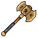 | **Voidborn Bloodrust Cleaver** | A weathered double-bladed axe with a bronze-gold head showing deep rust stains along the edges. The wooden haft is worn smooth and darkened, wrapped near the grip with tattered leather cord. The blade catches an eerie amber glow. | *An ancient executioner's tool, its edges still hungry for warmth. Those who swing it claim to hear the whispers of countless fallen souls bound within its oxidized steel.* | Warrior |
| 37 | 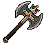 | **Bloodpact Cleaver** | A brutal double-bladed axe with a weathered bronze head marked by deep crimson stains. The haft is wrapped in aged leather, crowned with a golden pommel bearing an arcane rune. Shadows cling to its edges. | *A weapon forged in covenant with forces older than kingdoms. Those who swing it report whispers of the pact, binding user and blade in a hunger that only spilled blood can sate.* | Warrior |
| 38 | 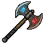 | **Ember Bloodmoon Cleaver** | A broad-headed battle axe with a deep crimson blade that catches light like dried blood. The handle is wrapped in dark leather, topped with a crescent-shaped steel pommel. Ornate grooves spiral down the shaft, filled with shadow. | *A weapon forged in times when gods walked the earth and demanded tribute in steel and ruin. Those who swing it claim to hear whispers of forgotten conquest in the wind.* | Warrior |
| 39 | 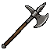 | **Storm Bloodmoon Cleaver** | A broad-bladed axe with a dark, weathered steel head. The blade features a crescent moon motif carved into its surface, stained deep crimson. The shaft is wrapped in aged leather with bone-white accents at the grip. | *A weapon forged in the depths of a forgotten war, its blade has tasted the blood of countless foes. The lunar curse etched upon it whispers of inevitable ruin to those who dare oppose its wielder.* | Warrior |
| 40 | 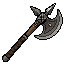 | **Blackened Reaper's Maul** | A double-bladed war axe with a dark, charred head. The blade shows asymmetrical edges with a weathered metallic sheen. A thick wooden haft extends downward, wrapped or darkened with age. The overall silhouette is heavy and imposing. | *An instrument of inevitable death, its blades have tasted the essence of countless foes. Those who swing it report hearing whispers-whether from the weapon itself or the spirits it has claimed remains mercifully unclear.* | Warrior |
| 41 | 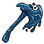 | **Duskfang Maul** | A broad-headed axe with a deep blue-black blade featuring jagged, fang-like edges. The haft is dark wood wrapped in shadowy tendrils. A sinister blue aura emanates from the blade's core, suggesting otherworldly hunger. | *A weapon forged in the depths where light fears to tread. Each swing carries the weight of forgotten ages and the bite of something far older than mortal steel.* | Warrior |
| 42 | 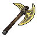 | **Goldrot Cleaver** | A broad-bladed battle axe with a golden-brass head showing verdigris patina. The blade catches light with an oxidized sheen. A sturdy wooden haft wrapped in dark binding extends below, tapering to a reinforced grip. | *Once wielded by a forgotten warlord whose name corroded with time. The golden decay upon its edge whispers of empires turned to dust, and those who swing it inherit only ruin.* | Warrior |
| 43 | 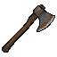 | **Forsaken Bloodmoon Cleaver** | A brutal double-bladed axe with a dark-stained head. The metal appears weathered bronze or aged iron, with deep crimson streaks running along the cutting edges. The wooden haft is wrapped in aged leather, stained dark from use. | *A executioner's tool steeped in carnage. Those who swing it speak of whispers in the blood spray, as if the axe itself thirsts for violence and remembers every life it has claimed.* | Warrior |
| 44 | 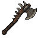 | **Bonegrinder's Maul** | A crude, heavily-weathered axe head mounted on a dark wooden haft. The blade shows deep notches and rust-brown stains. Wrapped grip with tattered leather bindings. A skull motif is faintly carved into the rusted metal head. | *An executioner's tool from a forgotten age, its edge still hungry for marrow and bone. Those who wield it speak of whispers from the countless fallen embedded in its scarred steel.* | Warrior |
| 45 | 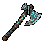 | **Bloodreaper's Cleave** | A brutish double-headed axe with dark steel blades etched in crimson runes. The haft is wrapped in aged leather, stained darker at the grip. A faint shadowy aura clings to the edges. | *An instrument of slaughter born from forgotten wars. Each swing carries the weight of countless fallen, and those who wield it feel the hunger of the blade demanding more blood.* | Warrior |
| 46 | 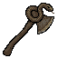 | **Ember Bloodmoon Cleaver** | A dark-stained axe head with a deep crimson sheen, mounted on a weathered wooden handle. The blade shows signs of ancient use with an oxidized, almost blackened edge. The overall design is heavy and brutal, suggesting countless battles. | *An executioner's weapon steeped in old blood and older curses. Those who swing it find their rage amplified, yet whisper of a hunger that demands ever more.* | Warrior |
| 47 | 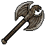 | **Storm Bloodrite Cleaver** | A heavy double-bladed axe with a dark metallic head, weathered bronze accents, and a worn wooden haft. The blade bears a distinctive notch and bears traces of old stains. The head is broad and menacing, typical of a warrior's execution tool. | *A reaper's instrument older than kingdoms. Those who wield it report that the axe seems to drink deep of violence, growing heavier with each fallen foe-or perhaps it is merely the weight of all the blood it has spilled.* | Warrior |
| 48 | 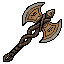 | **Hollow Bloodmoon Cleaver** | A brutal double-bladed axe with a dark wood haft. The twin blades are stained rust-brown, with one edge noticeably chipped. Golden runes trace the weapon's center, glowing faintly against the weathered metal. | *A reaper's tool, forged in an age when blood ran darker than wine. Those who swing it claim to hear distant screams echoing from the metal itself-whether memory or curse, none dare investigate.* | Warrior |
| 49 | 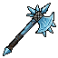 | **Frostbite Cleaver** | A broad-bladed axe with an icy blue head, crystalline formations sprouting from the blade's edge. The handle is dark wood wrapped in what appears to be frosted leather, with jagged ice shards protruding from the grip. | *Born from the frozen depths, this axe hungers for warmth. Each swing leaves a trail of bitter cold that saps the vitality from all it touches.* | Warrior |
| 50 | 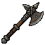 | **Bloodreaper's Cleaver** | A broad-bladed axe with a dark, weathered metal head. The blade features a jagged, serrated edge stained with crimson streaks. The wooden haft is wrapped in worn leather binding, with metal reinforcement bands near the head. | *An executioner's tool steeped in violence. This axe has tasted countless battles, its thirst for blood never quite sated-those who wield it find themselves eager to feed it again.* | Warrior |
| 51 |  | **Amethyst Rend** | A double-bladed battle axe with a thick, crystalline purple head that gleams with an otherworldly violet hue. The broad, serrated edges taper to sharp points. A darker purple grip wraps the sturdy haft, and the metal ferrule glints menacingly. | *Forged in the depths where amethyst geodes crack open with violent force, this axe hungers for the same shattering destruction. Those who wield it claim to hear the faint screaming of fractured stone.* | Warrior |
| 52 |  | **Voidborn Ironpeak Cleaver** | A hefty double-bladed axe with a weathered steel head and dark wooden haft. The blade shows deep notches from countless battles, with a faint metallic sheen. The handle is wrapped in aged leather cord. | *A weapon forged in ages past, when giants still walked the earth. Its scars tell of wars forgotten, and those who swing it inherit the weight of history itself.* | Warrior |
| 53 |  | **Shadowrend Hatchet** | A dark, weathered single-bladed axe with a blackened steel head. The blade bears deep gouges and a sinister sheen. The wooden haft is wrapped in tattered black leather, with small bone totems carved into the grip. | *A reaper's tool, forged in the depths where light fears to tread. Each swing carries the weight of a thousand fallen souls, eager to feed the void.* | Warrior |
| 54 |  | **Bloodrusted Cleaver** | A weathered battle axe with a broad, rust-stained blade. The head features deep crimson discoloration along jagged edges. A dark wooden haft with ornate metalwork wraps near the grip. The overall appearance suggests countless conflicts and a weapon that has tasted battle for ages. | *A weapon born from epochs of carnage, its blade forever stained by the essence of fallen foes. Those who wield it report a faint warmth emanating from the metal, as if the blood of ages still simmers within.* | Warrior |
| 55 |  | **Ashrender's Cleaver** | A broad-bladed axe with a dark grey steel head, weathered and scarred from countless battles. The handle is wrapped in aged leather with faint crimson stains. A small notch near the blade's edge suggests ancient impact. | *Once wielded by a fell warrior whose name burned away with their flesh. This axe hungers still, its edge singing softly in the presence of blood.* | Warrior |
| 56 |  | **Bloodfang Cleaver** | A weathered battle axe with a dark metal head featuring jagged, tooth-like edges. The wooden haft is wrapped in what appears to be aged leather or sinew. Rust-brown stains mark the blade, and the overall construction suggests brutal, repeated use. | *A reaper's tool forged in an age of endless slaughter. The blade thirsts still, each notch a testament to those who fell before its crimson arc.* | Warrior |
| 57 |  | **Ancient Bloodmoon Cleaver** | A broad-bladed axe with a dark metallic head featuring deep crimson accents. The weapon exhibits weathered bronze and iron tones with ornate carved details along the blade's edge. The handle appears wrapped in aged leather, complemented by decorative metalwork near the head. | *An executioner's tool steeped in ritual bloodshed. Those who swing it claim to hear the howls of fallen warriors echoing from its edge, as if the weapon itself hungers for violence.* | Warrior |
| 58 |  | **Bloodpeak Cleaver** | A brutal double-bladed axe with a crimson-stained head. The blade curves wickedly with a jagged upper edge, set atop a weathered wooden haft. Dark red pixelated streaks suggest dried blood along the metal, giving it an ominous, well-used appearance. | *A weapon born from carnage and tempered in suffering. Those who swing it speak of whispers that echo with each strike-echoes of all the souls it has claimed.* | Warrior |
| 59 |  | **Azureblight Cleaver** | A double-bladed battle axe with an icy blue head streaked with darker veins. The shaft is dark wood or metal, wrapped near the grip. Ethereal blue wisps emanate from the blade edges, suggesting magical corruption or winter enchantment. | *Once wielded by a frost-cursed warlord, this axe drinks deep of life and cold alike. Those who swing it feel the creeping numbness of an eternal winter seeping into their bones.* | Warrior |
| 60 |  | **Voidborn Bloodmoon Cleaver** | A broad-bladed axe with a darkened steel head. The blade catches crimson highlights, suggesting dried blood or ancient rust. The handle appears wrapped in dark leather, with a curved, menacing edge that tapers to a wicked point. | *A weapon born from slaughter and sorrow, its edge thirsts for violence as relentlessly as the moon draws the tide. Warriors who wield it report whispers of those it has felled.* | Warrior |
| 61 |  | **Shattered Bloodmoon Cleaver** | A broad-bladed axe with a deep crimson head marked by dark, arterial streaks. The handle is wrapped in weathered leather stained rust-brown. Bone-white runes run along the blade's edge, glowing faintly with malevolent purpose. | *An instrument of slaughter forged in an age when the moon hung crimson over cursed battlefields. Those who swing it feel the weight of countless felled enemies, as if the blade hungers for fresh blood to join the dark patina that stains its steel.* | Warrior |
| 62 |  | **Ember Bloodrite Cleaver** | A brutal double-bladed axe with a weathered bronze head and deep crimson stains along the edges. The shaft is wrapped in dark leather with bronze bands. Ancient runes are etched into the blade's surface, glowing faintly amber. | *A weapon born from forgotten wars, its edge still hungers for the warmth of spilled blood. Those who wield it claim to hear whispers of fallen warriors embedded within the metal itself.* | Warrior |
| 63 |  | **Storm Blackthorn Cleaver** | A broad-headed axe with a darkened steel blade featuring jagged, thorn-like protrusions along its edge. The wooden haft is wrapped in aged leather binding, and the weapon bears deep weathering marks suggesting ancient battlefields. | *A executioner's tool born from forgotten wars, its blade thirsts for the warmth of blood as readily as parched earth drinks rain. Those who swing it report hearing whispers of the fallen embedded within its iron.* | Warrior |
| 64 |  | **Hollow Bloodmoon Cleaver** | A double-bladed axe with a dark iron head featuring warm orange-gold accents along the edges. The handle is wrapped in aged leather or bone. The blade's warm glow contrasts sharply with the shadowed steel, suggesting ancient craftsmanship or fell magic. | *A weapon forged in times when the moon ran crimson with war. Those who swing it claim to hear the echoes of countless battles, as if the axe itself thirsts for the field of slaughter.* | Warrior |
| 65 |  | **Grimaxe of the Void** | A single-bladed axe with a dark, weathered metal head featuring subtle bone-like striations. The shaft appears aged and shadowed, with a worn grip. The blade's edge catches an otherworldly darkness, suggesting ancient malice. | *Born from the depths where light fears to tread, this axe hungers for the warmth of dying breath. Each swing echoes with the anguish of those who came before.* | Warrior |
| 66 |  | **Cursed Bloodpact Cleaver** | A hefty double-bladed axe with a weathered steel head tinged rust-red. The haft is wrapped in worn leather with dark staining. A jagged, asymmetrical edge suggests countless brutal encounters. Small archaic runes are etched along the blade's spine. | *Forged in an age of forgotten pacts, this axe thirsts for the violence that sustains it. Each kill strengthens the bond between wielder and weapon, blurring the line between hunter and hunted.* | Warrior |
| 67 |  | **Forsaken Bloodreaper's Cleave** | A weathered double-bladed axe with a dark grey metal head. The blade edges show a crimson stain that never fully washes clean. The wooden haft is wrapped in aged leather, and a small iron spike protrudes from the pommel. | *A executioner's tool that has tasted more blood than any battlefield could spill. Those who swing it claim the weight feels alive, as if the axe hungers for another strike.* | Warrior |
| 68 |  | **Tidebreaker's Cleave** | A double-bladed axe with teal and emerald coloring. The twin blades feature ornate curved edges with a weathered teal patina, mounted on a sturdy dark wooden haft adorned with jade-like accents and runic markings. | *Forged in the depths where ancient tides once carved the world, this axe thirsts for the blood of those who would defy the natural order. Its dual blades sing a mournful dirge with each swing, as if calling to something far beneath.* | Warrior |
| 69 |  | **Shattered Blackspine Cleaver** | A brutal double-bladed axe with a dark iron head featuring jagged, spine-like protrusions along the edges. The haft is wrapped in shadowy bindings, with a wicked barbed spike protruding from the pommel. | *Forged in the depths of a forsaken foundry, this axe thirsts for the iron in mortal blood. Each swing leaves echoes of anguish in the air, as if the weapon itself remembers every skull it has split.* | Warrior |
| 70 |  | **Ember Bloodreaper's Maul** | A massive two-handed axe with a dark iron head featuring a curved blade. The weapon showcases a deep burgundy-stained edge against blackened steel, with ornate engravings along the haft. The handle appears weathered wood reinforced with dark metal bands. | *A executioner's tool forged in an age of endless warfare. Its stained edge thirsts for the blood of those who dare stand before it, whispering promises of swift and brutal ends to all who grip its worn handle.* | Warrior |
| 71 |  | **Void Splitter** | A massive two-headed axe with dark purple and black coloring. The blade heads are jagged and asymmetrical, wreathed in wispy shadow tendrils that curl around the hafted dark wood handle. Arcane runes glow faintly along the edge. | *A weapon born from the rifts between worlds, its edge hungers for more than mere flesh. Those who wield it speak of whispers emanating from the void itself, urging them forward into darkness.* | Warrior |
| 72 |  | **Bonegrinder's Cleave** | A weathered battle axe with a broad, cream-colored head showing deep notches and wear. The handle is wrapped in tattered dark leather or sinew. Rust-brown stains mar the blade, and the overall construction appears crude yet devastatingly effective. | *An executioner's tool that has tasted countless bones. Those who swing it speak of a hunger in the weight-as if the axe itself thirsts for marrow and ruin.* | Warrior |
| 73 |  | **Bloodletting Reaper** | A brutal single-bladed axe with a dark brown wooden haft and weathered iron head. The blade bears a rust-red patina suggesting old bloodstains. A leather grip wraps the handle, and the axe head features a subtle curved edge with notched details along its striking surface. | *A weapon that has tasted countless battlefields, its edge forever stained by the crimson wages of war. Those who wield it report hearing whispers of the fallen with each swing.* | Warrior |
| 74 |  | **Cursed Bloodmoon Cleaver** | A heavy double-bladed axe with a dark metallic head marked by deep crimson stains. The handle is wrapped in aged leather, and the blade catches a sickly rust-colored sheen. Jagged edges and worn notches suggest countless brutal encounters. | *A weapon born from slaughter, its edge thirsts for violence. Those who swing it claim to hear the whispers of the fallen echoing through the iron.* | Warrior |
| 75 |  | **Bloodreaver's Maul** | A brutal double-headed axe with a dark, weathered steel head. The blade shows deep crimson staining along the edges, suggesting ancient violence. The haft is wrapped in worn leather, and a single iron spike protrudes from the pommel. | *A weapon that has drunk deeply from the veins of countless foes. Its crescent blades whisper promises of devastating cleaves to those cursed enough to wield it.* | Warrior |
| 76 |  | **Ravenmaw Cleaver** | A broad-bladed battle axe with a dark iron head featuring a pronounced curved edge. The wooden haft is wrapped in weathered leather binding. A single black feather or raven motif is etched into the blade, with hints of crimson rust staining the metal. | *Forged in an age when carrion birds feasted upon battlefields, this axe thirsts for violence. Each swing echoes with the cries of fallen warriors, drawing its wielder deeper into a primal hunger for conquest.* | Warrior |
| 77 |  | **Shattered Bloodreaper's Cleave** | A broad-bladed battle axe with a dark steel head tinged crimson. The haft is wrapped in weathered leather, and a single pale bone adorns the pommel. Rust-like stains mar the blade's edge. | *A weapon that has drunk deeply from battlefields long forgotten. Those who wield it claim the axe hungers-each swing whispers promises of carnage and ancient vengeance.* | Warrior |
| 78 |  | **Ember Blackpeak Cleaver** | A double-bladed battle axe with a dark, weathered metal head. The blade shows intricate notching and wear from countless battles. The handle appears aged and reinforced, with a prominent spike or protrusion near the base, rendered in muted grays and blacks with hints of oxidized steel. | *Forged in the depths of a fallen empire, this axe thirsts for the blood of those who would stand against its wielder. Each notch in its blade tells of victories claimed and foes reduced to ash.* | Warrior |
| 79 |  | **Bloodreaver's Cleave** | A brutal double-bladed axe with a dark iron head. The handle is wrapped in what appears to be worn leather or sinew. Rust-brown streaks mark the blade edges, and the overall silhouette suggests weight and devastating impact. | *An executioner's tool stained with the iron of a thousand fallen. Each swing echoes with the anguished screams of those who faced its hungry edge.* | Warrior |
| 80 |  | **Blackreap Cleaver** | A broad-bladed axe with a dark metallic head featuring asymmetrical edges. The weapon has a blackened steel construction with subtle crimson accents along the blade's curve. The haft appears wrapped in dark leather or cloth wrapping, with a reinforced grip and a tapered spike or counterweight at the base. | *A reaper's tool repurposed for slaughter. This axe thirsts for the lifeblood of those foolish enough to stand before it, its shadow-darkened edge claiming what death has already marked.* | Warrior |
| 81 |  | **Bloodaxe of the Forsaken** | A brutal double-bladed axe with a weathered wooden haft bound in dark leather. The blade gleams copper-red, stained with ancient ichor. Crude runes are etched along the edge, and the head bears the patina of countless battles. | *Once wielded by a warlord consumed by rage, this axe drinks deep from its victims. Those who grip its haft feel the weight of all it has severed-flesh, bone, and hope alike.* | Warrior |
| 82 |  | **Ironwood Cleaver** | A sturdy single-bladed axe with a dark wooden haft wrapped in weathered cord. The broad steel head shows rust-brown patina and deep notches from countless battles. A simple iron ferrule reinforces the grip. | *An instrument of brutal utility, this cleaver has split more than wood in its time. The weight of age and violence clings to its blade like a curse.* | Warrior |
| 83 |  | **Forsaken Bloodmoon Cleaver** | A broad-bladed axe with a dark, weathered head. The blade bears a deep crimson hue along its edge, contrasting against the blackened steel. The wooden haft is wrapped in aged leather with bone studs. A crescent moon symbol is etched into the blade's face. | *A weapon born from forgotten wars, its blade still thirsts for blood spilled beneath the hunter's moon. Those who wield it report the metal grows warm before battle, as if the axe itself remembers the slaughter of ages past.* | Warrior |
| 84 |  | **Voidborn Bloodpact Cleaver** | A heavy axe with a dark metal head featuring a broad, asymmetrical blade. The handle is wrapped in what appears to be worn leather or bone, with a distinctive knot or binding near the head. The overall coloring is muted grays and blacks with hints of rust-like weathering. | *An axe steeped in forgotten pacts, its blade thirsts for those who would break their oaths. Each swing carries the weight of debts unpaid and blood spilled in dark bargains.* | Warrior |
| 85 |  | **Bloodhewn Maul** | A brutish double-bladed axe with a dark iron head streaked in crimson. The handle is wrapped in worn leather, reinforced with corroded steel bands. Crude notches mar the blade edges, evidence of countless battles. | *A reaper's tool born from slaughter. Each notch in its blade drinks deep, and those who wield it find themselves thirsting for the same.* | Warrior |
| 86 |  | **Ember Bloodmoon Cleaver** | A double-bladed battle axe with a dark metallic head featuring crimson accents and ornate detailing. The handle is wrapped in aged leather with brass fittings. Gold or brass inlays run along the axe's edges, suggesting ancient craftsmanship and ritualistic purpose. | *A weapon born from forgotten wars, its blades have tasted the despair of countless foes. Those who swing it report visions of crimson moons and the whispered anguish of the fallen.* | Warrior |
| 87 |  | **Storm Bloodmoon Cleaver** | A double-bladed axe with a dark metallic head featuring crimson streaks and aged bronze accents. The handle is wrapped in what appears to be blackened leather or sinew. Gold-tinged details accent the blade shoulders, suggesting ancient craftsmanship. | *A weapon drunk on ages of carnage, its blades still weeping rust-colored tears. Those who swing it speak of whispers in the dark-whether from the weapon itself or the countless souls it has claimed remains mercifully unclear.* | Warrior |
| 88 |  | **Hollow Bloodrite Cleaver** | A heavy double-bladed axe with a weathered bronze head. The blade shows deep crimson staining along its edges. The wooden haft is wrapped in dark leather binding, with a worn brass pommel at the base. Notches mar both blade edges, testament to countless battles. | *An executioner's tool passed down through generations of those who wade through carnage without hesitation. Its hunger for blood seems almost tangible-as if the axe itself thirsts for another swing.* | Warrior |
| 89 |  | **Bloodaxe of the Hollow** | A brutish double-bladed axe with a dark metal head stained crimson. The haft is wrapped in weathered leather, and strange runes glow faintly along the blade edges. The weapon radiates an aura of ancient violence and hunger. | *A weapon that has tasted the blood of countless foes across forgotten ages. Those who wield it report whispers in the dark, as if the axe itself thirsts for more.* | Warrior |
| 90 |  | **Bloodmoon Reaper** | A heavy double-bladed axe with a dark crimson head marked by a crescent moon symbol. The handle is wrapped in worn leather with a deep burgundy tint. Gold or brass accents frame the blade edges. | *An executioner's tool steeped in ritual bloodshed. Those who swing it report whispers of the countless souls claimed by its edge, as if the weapon itself hungers for violence.* | Warrior |
| 91 |  | **Thornblight Cleaver** | A dual-bladed axe with emerald-green and gold coloring. The head features two curved, wickedly sharp blades with thorny protrusions along the edges. A glowing yellow-gold core pulses at the center, with ornate golden filigree wrapping the shaft. | *An ancient executioner's tool, forged when thorns still grew from the bones of fallen gods. Each strike bleeds cursed light into the wound, a blessing and a curse in equal measure.* | Warrior |
| 92 |  | **Voidborn Bloodmoon Cleaver** | A brutal double-bladed axe with a dark wooden handle wrapped in what appears to be weathered leather or sinew. The twin blades are stained rust-brown, with a distinctive crescent shape suggesting ancient battles. The weapon radiates an aura of grim purpose. | *Once wielded by a warlord whose name was erased from history. The stains upon its blades are not merely rust-they are the accumulated echoes of countless fallen, refusing to fade with time.* | Warrior |
| 93 |  | **Shattered Bloodpeak Cleaver** | A brutal double-bladed axe with a dark steel head stained crimson. The handle is wrapped in blackened leather, and the blade edges gleam with an unsettling sheen. Rusted studs line the haft. | *A weapon born from battlefields soaked in blood, its edge thirsts for more. Those who wield it feel the weight of countless fallen upon their shoulders.* | Warrior |
| 94 |  | **Bloodfell Cleaver** | A broad-bladed axe with a golden-orange hue and wooden handle. The axe head features a prominent curved blade with sharp edges, rendered in warm metallic tones against a simple background. Sturdy construction suggests brutal, efficient design. | *A weapon born from forgotten battlefields, its edge thirsts for the marrow of tyrants. Those who wield it find themselves consumed by an ancient fury that drowns all mercy.* | Warrior |
| 95 |  | **Storm Bloodrite Cleaver** | A brutal double-headed axe with a weathered bronze-gold finish. The blade edges show deep crimson staining, while dark leather wraps the wooden haft. Ornate grooves line the head, suggesting ancient runes worn smooth by time and use. | *A executioner's tool steeped in ritual slaughter. Those who swing it claim to hear whispers of the countless souls claimed by its bite-a hunger that only violence can sate.* | Warrior |
| 96 |  | **Hollow Bloodmoon Cleaver** | A brutal two-handed axe with a crescent-shaped blade tinged rust-red. The haft is wrapped in dark leather, reinforced with worn gold bands. A weathered leather loop dangles from the pommel, stained with age. | *Forged in an age when warriors carved empires from bone and shadow. Each swing echoes with the screams of those who fell before it.* | Warrior |
| 97 |  | **Blackthorn Reaper** | A brutal double-headed axe with a dark iron construction. The twin blades feature jagged, thorned edges that curve wickedly outward. A weathered wooden haft runs through the center, bound with dark leather. The overall silhouette is imposing and asymmetrical. | *A reaper's tool warped by fell sorcery, its thorned edges drink deep of those foolish enough to stand before it. Legend speaks of battlefields where this axe fell, and the cursed soil that bloomed where its victims lay.* | Warrior |
| 98 |  | **Cursed Bloodrust Cleaver** | A brutal double-bladed axe head mounted on a dark wooden haft. The blade surface shows deep rust-red discoloration and weathered bronze patina. The cutting edges appear wickedly sharp, while the poll end is reinforced with metal bands. | *An ancient axe that has tasted countless battles, its metal stained by blood long since oxidized to rust. Those who wield it speak of whispers emanating from its corrupted edge, as if the weapon remembers every fall it has caused.* | Warrior |
| 99 |  | **Forsaken Bloodmoss Cleaver** | A broad-bladed axe with a weathered wooden haft wrapped in dark leather. The metal head shows deep rust-brown patina with creeping moss growth along the blade's edge. The weapon bears marks of countless battles, its surface etched with faint runic symbols. | *An ancient weapon that has drunk deeply from the earth and its victims alike. The moss that clings to its blade is said to whisper the names of the fallen, granting the wielder strength born of accumulated sorrow.* | Warrior |
| 100 |  | **Ravencrest Cleaver** | A hefty double-bladed axe with a dark steel head featuring intricate notches along both edges. The blade gleams with an obsidian sheen, while the shaft appears weathered and wrapped in dark leather binding. A raven silhouette is etched into the metal. | *Once wielded by a fell warlord whose name was struck from history, this axe thirsts for the blood of those who dare raise it. Its edge hungers still, singing a mournful dirge with each terrible swing.* | Warrior |
