# Blades — Item Catalog

> **Category:** Blade  
> **Total items:** 100  
> **Classes:** Samurai, Warrior

| # | Preview | Item Name | Visual Description | Description | Classes |
|:-:|:-------:|:----------|:------------------|:------------|:--------|
| 1 | 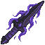 | **Nightpiercer Katana** | An elegant curved blade rendered in deep purple and midnight blue, accented with ethereal violet streaks suggesting otherworldly energy. The hilt features ornate dark metalwork with glowing rune-like patterns. Sharp, menacing silhouette evokes both grace and lethal precision. | *Forged in the twilight hours by artisans who trafficked in shadow, this blade hungers for the darkness between heartbeats. Those who wield it find reality bends ever so slightly, as if the world itself recoils from its edge.* | Samurai, Warrior |
| 2 | 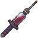 | **Bloodthorn Katana** | A curved katana blade with a deep crimson finish, accented by dark thorny patterns running along its length. The handle wraps in burgundy cloth with silver fittings. A small crescent guard glints ominously. | *A blade forged in suffering, its surface blooms with thorns that drink deep of those it cuts. Those who wield it find their hunger for battle grows with each wound inflicted.* | Samurai, Warrior |
| 3 | 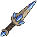 | **Azurebrand Katana** | A elegant curved blade with deep blue-steel coloring and silver accents along the edge. The crossguard features intricate metalwork, with a wrapped grip visible below. A distinctive blue aura emanates from the blade's surface, suggesting otherworldly enchantment. | *A blade forged in the depths of an ancient sorcerous conflict, its steel still humming with arcane resonance. Those who wield it taste both the sweetness of victory and the bitter price of power.* | Samurai, Warrior |
| 4 | 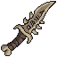 | **Rotbone Cleaver** | A weathered curved blade with a bone-white edge and rust-brown fuller running its length. The guard resembles yellowed bone wrapped in frayed leather cord. The handle is wrapped in aged sinew with dark staining near the pommel. | *A blade that has tasted centuries of decay. Those who swing it report the faint whisper of departing souls, as if the weapon itself feeds on the boundary between life and death.* | Samurai, Warrior |
| 5 | 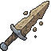 | **Rustbone Cleaver** | A weathered blade with a curved, asymmetrical edge. The steel bears deep oxidation stains of rust-brown and copper, with visible corrosion patterns along the fuller. The grip wraps in tattered dark leather, and small bone fragments are embedded near the crossguard. | *Once wielded by those who fed the old gods with iron and flesh. This blade remembers every wound it has carved, its rust the dried blood of a thousand forgotten wars.* | Samurai, Warrior |
| 6 | 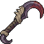 | **Bloodthorn Crescent** | A curved blade with a deep burgundy hue, featuring thorned protrusions along its spine. The handle wraps in dark leather with ornate crimson cord binding. An ancient rune glows faintly near the crossguard. | *A weapon born from suffering and thorned earth. Those who wield it find their wounds bloom like dark flowers, draining vitality from both blade and bearer alike.* | Samurai, Warrior |
| 7 | 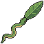 | **Serpentine Fang** | A curved blade with a sinuous, snake-like form. The metal gleams with an iridescent green patina, while natural vines wrap around the hilt. The guard features a serpent's head motif, and the blade tapers to a venomous point. | *A blade born from poison and patience, its curve mirrors the strike of the asp. Those who wield it find themselves dancing between life and venom, their strikes carrying whispers of the primordial swamp.* | Samurai, Warrior |
| 8 | 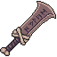 | **Bloodhunter's Edge** | A curved blade with deep burgundy coloring and dark metallic sheen. The handle appears wrapped in worn leather or sinew, with a distinctive crossguard. The blade tapers to a wickedly sharp point, suggesting both elegance and lethality. | *A predator's tool, stained with the essence of a thousand hunts. Those who wield it claim the blade whispers directions to the nearest beating heart.* | Samurai, Warrior |
| 9 | 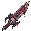 | **Crimson Spine Cleaver** | A curved, blood-red blade with a wicked pointed tip and ornate crossguard. The steel gleams with burgundy veining, suggesting corrupted ore or ritual forging. Dark leather wraps the grip, adorned with small bone fragments. | *A blade born from violence and spite, its edge thirsts for the warmth of spilled blood. Those who wield it report whispers of the countless souls it has rent asunder, their anguish forever bound within the crimson steel.* | Samurai, Warrior |
| 10 | 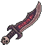 | **Bloodvein Cleaver** | A curved blade with deep crimson veining running through dark metal. The handle wraps in worn leather with a prominent crossguard. A subtle sheen of dried blood stains the fuller, and the edge gleams wickedly sharp against the oxidized steel. | *A weapon that hungers for violence, its veins seeming to pulse with each kill. Those who wield it claim they can hear whispers of fallen foes within the steel itself.* | Samurai, Warrior |
| 11 | 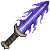 | **Amethyst Nightbane** | A sleek blade with a deep purple amethyst-hued metallic sheen. The weapon features elegant curved edges with a sharp, pointed tip. A dark leather-wrapped grip contrasts the luminous violet blade, while mystical energy seems to shimmer along its edge. | *Forged in shadow and starlight, this blade hungers for the souls of those who walk between worlds. Each strike leaves whispers of the void in its wake.* | Samurai, Warrior |
| 12 | 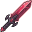 | **Crimson Thorn Katana** | A sleek curved blade with deep crimson coloring and a pronounced burgundy gradient. The handle features dark wrapping with ornate detailing. Sharp thorned or serrated edges run along the blade's length, giving it an organic, menacing appearance. | *A blade born from thorns and dried blood, its curve whispers of a thousand severed fates. Those who wield it find their strikes guided by an ancient, merciless hunger.* | Samurai, Warrior |
| 13 | 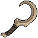 | **Crescent Fang** | A curved blade with a menacing crescent shape, rendered in dark brown and bronze tones. The hook-like form suggests a sickle or reaper's scythe, with weathered metal showing age and countless battles. | *A blade born from forgotten wars, its curve drinks deep of shadow. Those who wield it find themselves bound to its hungry edge, as if the weapon itself thirsts for what comes next.* | Samurai, Warrior |
| 14 | 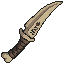 | **Bloodthorn Machete** | A curved blade with a weathered bronze-gold handle wrapped in dark binding. The steel edge shows deep crimson staining along its length, with thorned vine motifs etched into the fuller. A small bone ornament hangs from the pommel. | *A reaper's tool stained by countless hunts. Whispers claim the thorns drink deep, ensuring no wound closes cleanly—a mercy for the merciful, a curse for the cursed.* | Samurai, Warrior |
| 15 |  | **Nightpiercer's Fang** | A slender blade with a deep indigo finish, tapering to a wickedly sharp point. The fuller runs the length of the steel, gleaming silver against the dark metal. A wrapped grip and subtle violet aura emanate from the crossguard. | *Forged in the depths where starlight fears to tread, this blade drinks in darkness itself. Those who have wielded it speak of whispers in the void—whether from the steel or from what lies beyond, none can say.* | Samurai, Warrior |
| 16 | 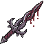 | **Nightfang Cleaver** | A curved, menacing blade with a dark purple-black metallic sheen. The weapon features sharp, fang-like protrusions along its spine and a twisted, organic handle. Wispy shadow wisps coil around the blade's edge, suggesting otherworldly corruption. | *A blade born from the abyss itself, its edge thirsts for blood with an almost sentient hunger. Those who wield it report whispers of ancient predators echoing in their mind during battle.* | Samurai, Warrior |
| 17 | 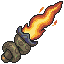 | **Emberfang Cleaver** | A broad-bladed weapon with a golden-orange flame engulfing its upper half. The handle is wrapped in dark leather, and the blade's edge glows with molten intensity. Wisps of fire cascade down the steel. | *A blade forged in the heart of a dying star, its edge forever wreathed in hungry flame. Those who wield it taste ash and ruin with every strike.* | Samurai, Warrior |
| 18 | 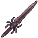 | **Duskfang Cleaver** | A long, slender blade with a dark purple-black finish and sharp, angular edges. The handle appears wrapped in dark leather or cloth. A small ornate guard or crosspiece separates blade from hilt. The overall silhouette is sleek and menacing. | *Forged in shadow's embrace, this blade drinks deep of twilight. Those who wield it find their strikes guided by something older than memory, something that hungers.* | Samurai, Warrior |
| 19 | 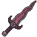 | **Duskblight Katana** | A sleek curved blade with a deep purple-black gradient, accented by crimson markings along the edge. The handle features dark wrappings, and the tsuba glows with an eerie violet luminescence. The blade tapers to a wicked point. | *Forged in shadow and tempered with the tears of forgotten gods, this blade drinks deep from the life force of those it cuts. Each strike leaves a lingering curse that corrupts flesh and spirit alike.* | Samurai, Warrior |
| 20 | 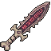 | **Crimson Marrow Blade** | A curved, serrated blade with deep burgundy coloring and organic, bone-like striations running along its length. The hilt appears wrapped in dark leather or sinew, with a subtle crimson sheen suggesting dried blood or ancient corruption. | *A blade that drinks deeply of its wielder's essence, each strike resonating with the hunger of something long-starved. Those who've wielded it speak of whispers beneath the steel, urging ever-deeper cuts.* | Samurai, Warrior |
| 21 | 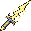 | **Goldspine Cleaver** | A curved blade with a golden-bronze sheen along its length, accented by deep amber and cream striping. The grip features a tapered, elegant design with a pointed pommel. Sharp, metallic edges glow with an otherworldly luminescence. | *A blade forged in ages past, its golden spine thrums with an ancient hunger. Those who wield it claim to hear whispers of forgotten wars echoing through its steel.* | Samurai, Warrior |
| 22 |  | **Nightfall Cleaver** | A curved blade with deep indigo steel tinged with violet hues. The handle wraps in dark leather cord over bronze fittings. A crescent moon symbol etches the fuller, glowing faintly with arcane traces. The edge gleams with an otherworldly sheen. | *Forged in the dying light of a cursed eclipse, this blade thirsts for the blood of those who walk between worlds. Each strike carries the weight of dusk itself, promising swift judgment to those unworthy of daylight.* | Samurai, Warrior |
| 23 | 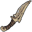 | **Storm Bloodthorn Crescent** | A curved blade with a warm bronze-gold hue, featuring a distinctive crescent shape. The edge gleams with a crimson tint, suggesting dried blood or dark enchantment. Ornate wooden grip with wrapped binding. A small curved horn or thorn protrudes from the crossguard. | *A predator's smile forged in forgotten ages. This curved blade drinks deep from those who dare oppose its wielder, its crescent form whispering of cycles of death and renewal.* | Samurai, Warrior |
| 24 | 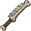 | **Bonewood Cleaver** | A weathered blade with a cream-colored bone handle wrapped in dark leather cord. The blade itself appears aged brass or corroded bronze, featuring intricate carved grooves along its length. A small circular pommel and crossguard suggest ritualistic craftsmanship. | *Forged in an age when bone was sacred and steel sang with purpose. This blade has tasted the blood of forgotten kingdoms, its edge whispering secrets to those cursed enough to wield it.* | Samurai, Warrior |
| 25 | 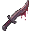 | **Bloodthorn Cleaver** | A broad-bladed axe-sword hybrid with a deep crimson hue and dark burgundy accents. The blade features jagged, thorn-like protrusions along its edge. The handle wraps in what appears to be aged leather or sinew, with a pronounced crossguard. | *A weapon born from forgotten battlefields, its edges still hunger for the blood of those who dare oppose it. Those who wield the Bloodthorn report whispers emanating from the blade itself—whether blessing or curse, none dare say.* | Samurai, Warrior |
| 26 | 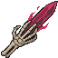 | **Crimson Talon Blade** | A sleek curved blade with deep crimson coloring along its length, wrapped in dark cord near the hilt. Gold or brass accents frame the guard, with a pointed, almost feather-like profile suggesting both elegance and lethality. | *Forged in blood-soaked rituals, this blade drinks deep from those who dare oppose it. Its curve remembers the arc of a predator's strike—beautiful, inevitable, merciless.* | Samurai, Warrior |
| 27 | 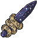 | **Nightpurple Cleaver** | A curved blade of deep indigo with golden brass fittings and ornate knuckle guard. The steel surface gleams with an ethereal violet sheen, while bronze accents frame the crossguard. A wrapped grip suggests masterful craftsmanship. | *Forged in the depths where starlight bleeds into shadow, this blade hungers for those who walk between worlds. Its edge tastes of twilight and remembers every soul it has parted from flesh.* | Samurai, Warrior |
| 28 | 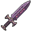 | **Voidborn Duskblight Katana** | A curved blade with deep purple and dark violet hues. The edge gleams with an ethereal, twilight glow. The handle is wrapped in shadow-black cloth with silver fittings. A crescent moon motif adorns the crossguard. | *Forged in the obsidian depths of forgotten epochs, this blade drinks in the light of dusk itself. Those who wield it find their strikes linger with an unnatural darkness, as if the very shadows bend to their will.* | Samurai, Warrior |
| 29 |  | **Shattered Bloodthorn Cleaver** | A curved blade weapon with a deep crimson hue and thorny protrusions along its spine. The handle is wrapped in dark leather, culminating in a pointed pommel. Archaic runes glow faintly along the fuller. | *A blade that thirsts for violence, its thorns drinking deep from those who dare oppose it. Legends whisper it was forged in the heart of a dying god's wound.* | Samurai, Warrior |
| 30 |  | **Moonfall Scimitar** | A curved blade with a crescent moon profile, featuring silvery-blue coloring along the edge that fades to dark steel. The handle is wrapped in shadow-black cord, with a small crescent moon guard. The blade carries an ethereal, frost-touched gleam. | *Forged in the depths of a starless night, this blade thirsts for the blood of those who walk under false light. Its curve echoes the trajectory of fallen stars.* | Samurai, Warrior |
| 31 | 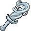 | **Serpent's Fang Katana** | A elegant curved blade with a coiled serpent motif etched along the fuller. The handle wraps in dark leather with silver wire bindings. The tsuba features intricate snake-scale patterns, and the blade gleams with an otherworldly emerald sheen. | *A blade forged in the depths of forgotten temples, its curve mirrors the strike of a viper. Those who wield it claim to hear whispers of the serpent deity that blessed its steel.* | Samurai, Warrior |
| 32 | 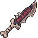 | **Hollow Bloodthorn Katana** | A slender curved blade with deep crimson streaks running along its steel. The crossguard features ornate burgundy inlays, and the handle is wrapped in dark leather. A single thorn-like protrusion juts from the blade's spine near the tip. | *Forged in an age of suffering, this blade thirsts for vitality itself. Each strike draws whispers from those it has claimed, their anguish woven into its very steel.* | Samurai, Warrior |
| 33 | 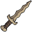 | **Thornspire Katana** | A curved blade with a bronze-gold crossguard and wrapped grip. The blade features dark metallic tones with ornate vine-like engravings along its length. The handle shows wrapped cordage detail in earth tones, with a pronounced pommel. | *A blade forged in ages past, its edge still thirsts for blood. Whispers of old magic cling to its elegant curve, promising swift judgment to those who wield it.* | Samurai, Warrior |
| 34 | 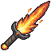 | **Emberheart Katana** | A sleek curved blade with a golden-orange flame aesthetic. The weapon features warm amber and crimson hues along its length, with a dark handle and crossguard. Ethereal fire energy seems to dance along the cutting edge. | *Forged in the heart of a dying star, this blade hungers for conflict. Its edge glows with the rage of a thousand fallen warriors, each swing leaving embers that sear the very air.* | Samurai, Warrior |
| 35 | 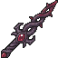 | **Thornspire Halberd** | A tall polearm weapon featuring a dark purple and crimson blade with jagged, spike-like protrusions along its edges. The shaft is wrapped in shadowy material with ornate metalwork at its base, emanating an aura of malevolent energy. | *A weapon forged in defiance of mortality itself. Those who wield this cursed polearm feel the thorns of fate cutting deeper with every swing, as if the blade hungers for the price of power.* | Samurai, Warrior |
| 36 | 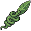 | **Serpentfall Cleaver** | A curved blade with a distinctive serpentine design etched along its length. The metal gleams with a sickly jade-green patina, while the handle wraps in weathered leather bound with copper wire. A small coiled serpent forms the pommel. | *A blade that thirsts for venom as much as blood. Forged in ancient ritual, it carries the curse of scales and fang—each strike whispers of poison that seeps through flesh like roots through soil.* | Samurai, Warrior |
| 37 | 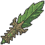 | **Vilethorn Cleaver** | A curved blade with a sickly green patina, featuring thorned protrusions along its spine. The handle wraps in dark leather, accented with bone segments. A single emerald glints at the pommel. | *A blade born from corrupted soil, its thorns weeping venom that pools like sorrow. Those who wield it find their strikes carry whispers of inevitable decay.* | Samurai, Warrior |
| 38 | 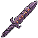 | **Amethyst Fang** | A slender blade with a deep purple gradient, transitioning from dark violet at the hilt to lavender at the tip. The surface gleams with an otherworldly luster, and the crossguard resembles curved fangs. Fine crystalline patterns web across the fuller. | *A blade forged in twilight's shadow, its amethyst sheen thirsts for the blood of those who wander cursed lands. Those who wield it claim to hear whispers of ancient serpents coiled within its depths.* | Samurai, Warrior |
| 39 | 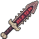 | **Crimson Reaper's Edge** | A curved blade with deep burgundy and black coloration, featuring a wickedly sharp curved edge. The handle wraps in dark leather, with a small ornamental guard. The blade tapers to a lethal point, suggesting both precision and brutal efficiency. | *A blade steeped in old blood and older sorrows. Those who wield it claim to hear whispers of fallen foes—whether blessing or curse, none can say.* | Samurai, Warrior |
| 40 | 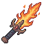 | **Embercinder Katana** | A slender curved blade wreathed in orange and yellow flames. The steel gleams dark beneath flickering fire that dances along the edge. A wrapped grip and ornate guard complete this infernal weapon. | *A blade forged in the heart of a dying star, its edge burns eternal with the rage of fallen kingdoms. Each swing leaves scorched ash in its wake.* | Samurai, Warrior |
| 41 | 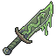 | **Verdant Spine** | A slender blade with an organic, curved design resembling a fossilized spine or thorn. The weapon features a sickly green patina across its length, with darker jade-green accents along the edge. The handle appears wrapped in weathered cord, and the crossguard has subtle leaf-like protrusions. | *A blade grown from the marrow of some ancient forest sentinel, its edge still weeps with the poison of ages. Those who wield it claim to hear the whispers of dying leaves.* | Samurai, Warrior |
| 42 | 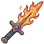 | **Emberwright Cleaver** | A broad-bladed weapon wreathed in persistent orange flame. The steel beneath glows with heat, its edges traced in gold. The wooden haft is wrapped in dark leather, contrasting the infernal glow of the blade. | *A blade forged in the heart of a dying star, its hunger for destruction never sated. Those who wield it find their strikes trailing embers, as if the world itself recoils from their fury.* | Samurai, Warrior |
| 43 | 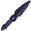 | **Nightfall Fang** | A sleek blade with a deep indigo shaft and a wickedly pointed dark purple tip. The weapon features sharp, angular geometry with a tapered design that suggests both precision and lethal intent. Fine details along the hilt hint at ancient craftsmanship. | *A blade forged in shadow's embrace, said to drink the last light from a dying sky. Those who wield it walk between worlds, their strikes carrying the weight of eternal dusk.* | Samurai, Warrior |
| 44 | 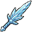 | **Skyrender Katana** | A slender, elegant blade with a pale blue-white finish, resembling crystallized sky or ice. The edge gleams with ethereal light, and wisps of blue energy trail from the tip. The hilt is wrapped in dark cord, contrasting the luminous blade. | *A blade forged where storm and steel converge. Those who wield it walk between worlds, cutting not just flesh, but the very fabric that binds mortals to earth.* | Samurai, Warrior |
| 45 | 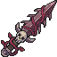 | **Crimson Blight Cleaver** | A curved blade weapon with a deep burgundy-black coloration, featuring ornate crimson accents along the spine. The handle appears wrapped in dark leather, with a distinctive curved guard. Sharp edges gleam with an unsettling maroon sheen suggesting ancient bloodstains or corrupted metal. | *A blade born from sorrow and slaughter, its curve cuts deeper than steel alone allows. Those who wield it find their strikes guided by something far older than memory.* | Samurai, Warrior |
| 46 | 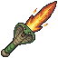 | **Emberscourge Cleaver** | A broad-bladed weapon with a burning orange-gold edge that fades to deep crimson. The blade appears scorched and wreathed in ethereal flames. The haft is wrapped in dark leather, with a bronze-toned crossguard. Small embers seem to dance along the cutting edge. | *A blade forged in the depths of a dying star, its edge still smolders with the rage of its creation. Those who wield it find their fury given form—a weapon that hungers as much as the wielder does.* | Samurai, Warrior |
| 47 | 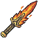 | **Emberfall Cleaver** | A broad-bladed sword with a fiery orange-gold gradient transitioning to deep amber. The blade features ornate gilded engravings along its length, with a wrapped leather grip and a decorative crossguard. Flames appear to flicker subtly along the edge. | *A blade forged in the heart of a dying star, its edge still smolders with the fury of its creation. Those who wield it taste ash and cinder with every strike, as if the weapon itself hungers for the warmth of spilled blood.* | Samurai, Warrior |
| 48 | 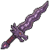 | **Amethyst Blight** | A curved blade with a deep purple-violet hue throughout its length. The edge gleams with an otherworldly sheen, while darker veining runs along the flat. The grip appears wrapped in shadowed leather, with the overall form suggesting both elegance and lethal intent. | *A blade born from corrupted stone, its purple depths swallow light as readily as they draw blood. Those who've wielded it speak of whispers in the dark—whether from the weapon or the wounds it leaves behind remains uncertain.* | Samurai, Warrior |
| 49 | 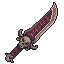 | **Crimson Marrow Cleaver** | A broad-bladed curved sword with deep burgundy coloration and dark metallic highlights. The blade exhibits an organic, almost skeletal curvature with ribbed detailing along its length, suggesting bone or corrupted steel. A wrapped grip and ornate crossguard complete this sinister weapon. | *A blade born from profane alchemy, its curve mirrors the fangs of forgotten beasts. Those who've wielded it speak of whispers that grow louder with each life it claims.* | Samurai, Warrior |
| 50 | 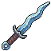 | **Azurebane Katana** | A sleek curved blade with a distinctive blue-silver sheen, featuring ornate crossguard details and wrapped grip. The blade tapers to a sharp point, with ethereal blue luminescence trailing along its edge and fuller. | *Forged in ages past when the veil between worlds ran thin, this blade thirsts for the essence of those who stand before it. Each strike resonates with an otherworldly cold that freezes both flesh and spirit.* | Samurai, Warrior |
| 51 | 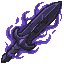 | **Voidfeather Katana** | A sleek katana with an ethereal purple-black blade that shimmers with void energy. The weapon features wispy, feather-like wisps of dark matter swirling around the steel. The handguard and grip show intricate arcane runes in violet hues. | *A blade born from the space between worlds, its edge cuts not just flesh but the very threads binding soul to body. Whispers of the abyss cling to those who wield it.* | Samurai, Warrior |
| 52 | 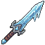 | **Frostbrand Katana** | A sleek curved blade with an ethereal blue-white sheen, outlined in cyan. The fuller gleams with frost-like crystalline patterns. The crossguard is reinforced with pale metal accents, and the handle appears wrapped in silvery cord, creating a weapon that seems to shimmer with perpetual winter. | *A blade tempered in the tears of a dying glacier, it hungers to freeze the blood of those who dare oppose its wielder. Those cut by its edge report a lingering chill that spreads through bone and sinew.* | Samurai, Warrior |
| 53 | 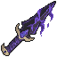 | **Void Reaper's Edge** | A long, slender blade with a deep purple gradient transitioning to black. The weapon features an ornate crossguard with curved accents, and the blade gleams with an otherworldly shimmer. Sharp, angular design suggests both elegance and lethality. | *Forged in the depths where light surrenders to shadow, this blade thirsts for the essence of those who wield it. To draw its edge is to invite darkness into your veins, though victory tastes sweeter when paid in such currency.* | Samurai, Warrior |
| 54 | 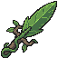 | **Verdant Fang Cleaver** | A broad-bladed curved sword with a distinctive jade-green coloration. The blade features organic, leaf-like serrations along its edge and a natural wood-grain texture. A small sprouting leaf motif adorns the crossguard, suggesting both growth and decay. | *A blade born from the corpse of an ancient forest, where nature's wrath took physical form. Those who wield it taste the bitter sap of a thousand dying trees with each strike.* | Samurai, Warrior |
| 55 |  | **Crimson Thorn Blade** | A curved blade with deep burgundy coloring and thorned protrusions along its spine. The weapon features a dark, ornate hilt and emanates an otherworldly crimson glow. Wickedly sharp edges suggest both elegance and lethal intent. | *A cursed blade born from thorned nightwood and tempered in blood-soaked soil. Those who wield it find their strikes guided by something darker than mere skill, each cut leaving wounds that refuse to close.* | Samurai, Warrior |
| 56 |  | **Hollow Nightfall Cleaver** | A curved blade with a deep indigo finish, almost black in shadow. The edge glimmers with an ethereal violet hue. The grip appears wrapped in dark leather, with a small ornamental guard. Small arcane runes trace along the fuller. | *Forged in the depths where starlight fears to tread, this blade drinks in the darkness around it. Those who've wielded it speak of whispers at dusk, and a hunger that never quite sleeps.* | Samurai, Warrior |
| 57 |  | **Nightveil Cleaver** | A curved blade weapon with a deep indigo-black finish, wrapped in a teal-green cord near the handle. The edge glimmers with an otherworldly sheen, suggesting enchantment. A crescent-shaped guard protects the grip. | *Forged in shadow and tempered by forgotten rituals, this blade thirsts for those who walk between worlds. Each strike whispers of the void it was born from.* | Samurai, Warrior |
| 58 |  | **Nightfang Crescent** | A curved blade with a deep purple hue, resembling a crescent moon. The metal gleams with an otherworldly sheen, and thorny protrusions spiral along its spine. A shadowy aura seems to emanate from the keen edge. | *A blade born from the void between dusk and dawn, hungering for the blood of those who walk in darkness. Legends whisper it was forged in the heart of a dying star, and still echoes with the screams of its first victims.* | Samurai, Warrior |
| 59 |  | **Forsaken Bloodthorn Katana** | A slender curved blade with deep crimson staining along its edge, accented by thorned protrusions near the crossguard. The hilt wraps in dark leather, and a sinister aura shimmers faintly around the metal. | *A weapon born from sorrow and spite, its blade thirsts for the blood of those who wronged its wielder. Each cut leaves wounds that refuse to close naturally.* | Samurai, Warrior |
| 60 |  | **Bloodpact Cleaver** | A curved blade with a dark crimson sheen, featuring ornate bronze-wrapped grip and crossguard. The blade's edge gleams with an eerie purple-tinted light. Weathered leather wrapping along the hilt shows signs of ancient combat. | *Forged in ages past by those who drank deep from shadow's well, this blade hungers for the vitality of its foes. Each strike echoes with the screams of covenants long broken.* | Samurai, Warrior |
| 61 |  | **Pestilence Fang** | A curved blade with a sickly green phosphorescent glow along its edge. The handle is wrapped in dark leather, with a twisted guard resembling chitinous segments. Wisps of toxic vapor coil around the corrupted metal. | *A blade forged in plague-ridden depths, its edge weeps with the essence of decay. Those who fall to its touch are marked not by death, but by the slow corruption that follows.* | Samurai, Warrior |
| 62 |  | **Crimson Talon Katana** | A curved katana blade with a deep burgundy hue, accented by dark metallic edges. The crossguard features ornate crimson detailing with claw-like protrusions. A wrapped handle in black leather completes this menacing silhouette. | *A blade born from ancient bloodshed, its crimson patina whispers of countless fallen. Those who wield it claim the steel hungers for violence, singing softly as it cuts through flesh and bone alike.* | Samurai, Warrior |
| 63 |  | **Thornspire Dirk** | A slender, wickedly-pointed blade with a bronze-gold crossguard and wrapped leather grip. The blade tapers to a cruel point, with subtle serrated edges catching dim light. Dark patina marks suggest ancient forge-work. | *A blade born from forgotten wars, its point has tasted the blood of a thousand fallen. Those who wield it speak of whispers that guide their strikes—whether blessing or curse, none remain to say.* | Samurai, Warrior |
| 64 |  | **Hollow Bloodthorn Cleaver** | A broad-bladed weapon with a deep crimson edge, featuring prominent thorny protrusions along its spine. The blade tapers to a wicked point, with a dark burgundy grip wrapped around a reinforced handle. Rust-red accents suggest age and countless battles. | *A blade born from thorned gardens of the fallen. Those who wield it find their wounds bloom crimson, as if the weapon itself thirsts for the blood it spills.* | Samurai, Warrior |
| 65 |  | **Ravenclaw Cleaver** | A curved, dark-metal blade with a distinctive raven wing motif etched along the fuller. The handle wraps in worn leather, and the pommel features a small obsidian stone. The edge gleams with an unnatural violet sheen. | *A weapon that drinks deep of shadow and sorrow. Those who wield it claim to hear the distant cry of carrion birds, as if the blade itself hungers for the fallen.* | Samurai, Warrior |
| 66 |  | **Ashblight Dirk** | A slender, tapered blade with a dull bronze-grey finish and darker patina streaks. The grip features a wrapped handle in deep brown leather with metallic accents. A small crossguard separates blade from hilt, with subtle ash-grey tones throughout. | *Forged in the embers of fallen kingdoms, this blade drinks deep of sorrow and ash. Those who wield it find their resolve hardened, though at a cost whispered only by the wind.* | Samurai, Warrior |
| 67 |  | **Verdant Reaper** | A curved blade with a jade-green edge and weathered bronze handle. Wrapped in dark cord near the grip, with a leaf-shaped guard. The blade bears an ancient patina, suggesting moss-covered stone and forgotten temples. | *A blade that thirsts for those who walk between worlds. Its verdant edge drinks deep of life itself, leaving only silence in its wake.* | Samurai, Warrior |
| 68 |  | **Duskpetal Cleaver** | A curved blade with a dark burgundy-purple gradient, reminiscent of dried bloodstains on aged metal. The handle is wrapped in worn leather with subtle ornate detailing. The blade curves slightly with a tapered point, embodying both elegance and lethal intent. | *A blade that thirsts for the moment between dusk and darkness. Some say it was forged in shadow and quenched in the tears of a fallen noble—its steel remembers every wound it has ever dealt.* | Samurai, Warrior |
| 69 |  | **Shattered Bloodthorn Cleaver** | A curved blade with a deep crimson hue, resembling dried blood along its edge. The handle is wrapped in dark leather with thorny vine motifs. The blade tapers to a wicked point, with a slight serrated pattern along one side. | *A weapon born from ancient battlefields where suffering seeped into steel. Those who wield it whisper of thorns that bloom within their veins, each strike drawing power from pain itself.* | Samurai, Warrior |
| 70 |  | **Amethyst Reaper's Edge** | A sleek curved blade with a deep purple amethyst sheen running along its length. The handle features dark leather wrapping with silver accents. Ethereal violet energy crackles faintly around the blade's edges, giving it an otherworldly glow. | *Forged in the depths of a shattered amethyst cavern, this blade drinks in the life force of those it cleaves. Whispers say it was wielded by a samurai who chose damnation over surrender.* | Samurai, Warrior |
| 71 |  | **Twilight Severance** | A curved blade with an iridescent purple and blue gradient along its edge, transitioning to golden ornamental crossguard. The handle features wrapped grip with mystical rune patterns etched into the fuller. A crescent moon motif adorns the pommel. | *A blade forged in the dying light between worlds, its edge thirsts for those who walk the boundary between life and shadow. Those who wield it claim they can taste the moment of severance.* | Samurai, Warrior |
| 72 |  | **Hollow Amethyst Blight** | A curved blade wreathed in deep purple crystalline formations. The weapon's edge glimmers with an otherworldly violet hue, while shadowy wisps coil around the ornate crossguard. The handle appears wrapped in dark leather, with arcane runes etched faintly along the fuller. | *A blade born from forgotten sorcery, its purple corruption spreads like a creeping blight. Those who wield it taste the weight of a thousand curses with each strike.* | Samurai, Warrior |
| 73 |  | **Rusted Fang Katana** | A weathered katana with a curved, oxidized blade bearing deep brown and orange rust patina. The tsuka wraps in frayed dark cord, and a small bronze guard depicts a snarling beast. The blade tapers to a wicked point, with visible nicks from countless battles. | *A blade that has tasted the blood of empires. Its rust runs deeper than iron—ancient corruption seeps through the metal, whispering promises of ruin to those bold or foolish enough to wield it.* | Samurai, Warrior |
| 74 |  | **Azureblight Katana** | A sleek curved blade rendered in cool blues and cyan, with ethereal wisps coiling along its length. The edge gleams with an otherworldly sharpness, and crystalline formations frost the crossguard, suggesting a weapon touched by ancient magic. | *A blade forged in sorrow and starlight, its edge thirsts for the lifeblood of those who bear its curse. To wield it is to invite the cold embrace of the abyss into your very soul.* | Samurai, Warrior |
| 75 |  | **Forsaken Nightfall Cleaver** | A dark, tapered blade with a blackened steel finish and deep purple aura. The shaft features ornate crimson wrapping, with a sharp obsidian-like edge that seems to absorb light. Malevolent runes glow faintly along the spine. | *A blade forged in shadow and dread, said to drink the light from dying stars. Those who wield it find their strikes carry the weight of inevitable darkness.* | Samurai, Warrior |
| 76 |  | **Thornleaf Cleaver** | A curved blade with organic, leaf-like serrations along its edge. The metal gleams with a sickly green patina, while the hilt wraps in weathered cord. A single verdant feather or thorn protrudes from the pommel, suggesting both decay and growth. | *A blade that thirsts for blood as plants thirst for rain. Those who wield it report whispers of growth in their wounds—whether blessing or curse, none remain to clarify.* | Samurai, Warrior |
| 77 |  | **Shattered Amethyst Blight** | A slender blade with a deep purple hue, featuring a tapered point and ornate crossguard. The grip appears wrapped in dark leather, while ethereal violet wisps seem to emanate from the blade itself, suggesting otherworldly enchantment. | *A cursed blade born from ancient sorcery, its violet sheen belies the hungry darkness that dwells within. Those who wield it find their strikes infused with eldritch malice, though the weapon demands a price in shadow.* | Samurai, Warrior |
| 78 |  | **Veilpiercer Katana** | A slender curved blade with a deep purple-black finish, adorned with arcane runes that glow faintly along its edge. The tsuka wraps in dark leather, while wisps of ethereal energy coil around the blade like living shadow. | *A blade forged where worlds grow thin. Those who wield it claim the steel sings with voices of the forgotten, each strike tearing through more than flesh alone.* | Samurai, Warrior |
| 79 |  | **Storm Bloodthorn Cleaver** | A broad-bladed weapon with a curved, wickedly sharp edge. The blade transitions from deep crimson at the hilt to blackened steel at the tip. Thorny protrusions jut from the spine, and the handle is wrapped in dark leather with bronze accents. | *A blade born from suffering, its thorns drinking deep the essence of countless foes. Those who wield it feel the weapon's hunger, whispering promises of dominion with each devastating stroke.* | Samurai, Warrior |
| 80 |  | **Bloodthorn Falchion** | A curved blade with a dark crimson sheen, its edge lined with thorny protrusions. The crossguard features ornate metalwork in blackened iron, while the grip is wrapped in what appears to be aged leather. A faint burgundy aura emanates from the blade's core. | *A weapon born from suffering and spite, its thorned edge drinks deep from those foolish enough to stand against it. Legends whisper that each drop spilled upon its surface only sharpens its thirst further.* | Samurai, Warrior |
| 81 |  | **Crimson Fang Cleaver** | A curved blade with a deep burgundy finish, featuring a distinctive upward hook at the tip. The handle is dark leather-wrapped with a ornate crossguard. Blood-red metallic sheen catches light along the curved edge. | *A weapon thirsting for violence, its curved form drinks deep from those foolish enough to face it. Legends whisper it was forged in the dying screams of a forgotten dynasty.* | Samurai, Warrior |
| 82 |  | **Verdant Scourge** | A curved blade with a sickly green sheen, its edge wrapped in thorned vines that pulse with an unnatural glow. The handle appears carved from blackened bone, adorned with small jade runes that shimmer faintly. | *Once wielded by a cursed samurai who sought to purify the world through bloodshed. The blade hungers still, its verdant aura a mark of the blight it carries—each swing leaves whispers of decay in its wake.* | Samurai, Warrior |
| 83 |  | **Hollow Talon** | A curved, wickedly sharp blade with a natural bone-white coloration and dark bronze accents along the hilt. The edge gleams with an unnatural sharpness, while carved patterns run along the fuller. The crossguard resembles a predator's claw. | *A blade forged from the fang of some long-extinct terror. Those who wield it report hearing distant, mournful cries—whether from the weapon itself or the void it cuts through remains unknown.* | Samurai, Warrior |
| 84 |  | **Duskfall Cleaver** | A broad-bladed sword with a dark steel edge and deep indigo-tinted fuller. The grip wraps in midnight blue cord, crowned with a small obsidian pommel. A thin silver edge catches light along the blade's curve. | *Steel tempered in twilight's embrace, this blade hungers for the threshold between worlds. Those who wield it claim shadows cling longer to its edge.* | Samurai, Warrior |
| 85 |  | **Crimson Plume Katana** | A sleek katana blade with a deep burgundy sheen, suggesting dried blood or ancient dye. The handle is wrapped in dark leather, and a distinctive crimson feather motif adorns the crossguard, matching the sprite's feathered design. | *Forged in an era of endless twilight, this blade drinks deep the life of those who cross its path. Warriors whisper that its edge remembers every wound it has ever dealt.* | Samurai, Warrior |
| 86 |  | **Azureblight Dirk** | A slender blade with an ethereal blue-white gradient along its edge, transitioning to deep indigo near the crossguard. The hilt features dark wrapping and a small circular pommel. Sharp, angular design with an almost crystalline sheen suggesting cursed or magical origin. | *A blade born from forgotten sorcery, its edge gleaming with an otherworldly chill. Those who've wielded it speak of whispers that fade only when blood meets steel.* | Samurai, Warrior |
| 87 |  | **Storm Amethyst Fang** | A slender blade forged from deep purple metal with a lustrous finish. The crossguard is ornately wrapped in dark cord, while the pommel features a polished amethyst crystal that glows faintly with an otherworldly violet hue. | *A blade tempered in starlight and despair. Those who have tasted its edge whisper of visions that linger long after the wound has closed.* | Samurai, Warrior |
| 88 |  | **Hollow Crimson Blight Cleaver** | A broad-bladed sword with deep purple and crimson hues. The blade features jagged, organic protrusions along its edge, suggesting corrupted metal or cursed iron. A dark grip wraps the handle, accented with violet runes that faintly glow against the shadowed steel. | *A blade born from shadow and malice, its edges weep with an ancient corruption. Those who wield it find their strikes guided by whispers of the damned, each swing leaving trails of blight in its wake.* | Samurai, Warrior |
| 89 |  | **Duskblight Cleaver** | A curved blade with a deep maroon-burgundy hue, featuring a tapered leaf-like shape. The edge gleams with an otherworldly purple sheen. A dark wooden or bone handle extends from the base, with subtle ribbed texturing suggesting aged craftsmanship. | *A blade steeped in shadow and decay, its curve bending light itself into darkness. Those who've wielded it speak of whispers that fade only when blood has been spilled.* | Samurai, Warrior |
| 90 |  | **Corrosion's Fang** | A curved blade with a dark, oxidized metal sheen. The edge appears weathered and stained with verdigris patina. A wrapped grip in muted tones extends from the crossguard, with subtle engravings visible along the fuller. | *Once wielded by a cursed swordmaster, this blade drinks deep of its victims' vitality. The corrosion that mars its surface spreads like a plague, consuming both flesh and spirit with each stroke.* | Samurai, Warrior |
| 91 |  | **Forsaken Crimson Fang Cleaver** | A curved, wickedly sharp blade with a deep burgundy hue. The weapon features an ornate guard and grip wrapped in what appears to be aged leather or bone. A faint crimson glow emanates from the blade's edge, with subtle serrated details suggesting a predatory nature. | *Forged in the depths of a forgotten war, this blade thirsts for the lifeblood of its wielder's enemies. Those who wield it report that the weapon hungers, drawing them deeper into darkness with each kill.* | Samurai, Warrior |
| 92 |  | **Dustbringer's Edge** | A tapered bronze-gold blade with a wrapped grip, featuring ornate crossguard detailing. The blade tapers to a sharp point with subtle etchings along its length, suggesting age and careful craftsmanship. Warm metallic tones dominate with darker accent lines. | *A blade that has tasted the dust of fallen empires. Those who wield it claim the air itself grows heavy with the weight of history.* | Samurai, Warrior |
| 93 |  | **Nightfall Katana** | A slender curved blade with a deep purple-black finish, accented by gold or brass fittings along the hilt and crossguard. The edge gleams with an ethereal twilight sheen. Intricate spiral wrapping decorates the grip. | *Forged in the depths of a starless night, this blade thirsts for the blood of those who walk in shadow. Each strike carries the weight of fallen empires and whispered curses.* | Samurai, Warrior |
| 94 |  | **Ember Nightfall Cleaver** | A dark, curved blade with deep indigo coloring and a sharp metallic edge. The weapon features an ornate handle with mystical markings etched along its length. Wisps of shadowy aura emanate from the blade's surface, suggesting otherworldly power. | *Forged in the depths of a forgotten age, this blade hungers for the blood of those who walk in darkness. Its edge cuts deeper than steel alone could ever reach, slicing through both flesh and shadow with equal ease.* | Samurai, Warrior |
| 95 |  | **Storm Bloodthorn Cleaver** | A broad-bladed curved sword with a rust-red patina and dark burgundy streaks running along the fuller. The crossguard features jagged thorned protrusions. The grip wraps tightly in worn leather stained dark with age. | *A blade that has tasted countless lives, its curve designed to rend flesh and spirit alike. Those who wield it report the thorns whispering promises of power with each kill.* | Samurai, Warrior |
| 96 |  | **Nightveil Fang** | A curved blade with deep indigo coloring and darker striations. The guard features ornate bronze metalwork with sharp angular protrusions. The handle wraps in midnight blue with silver wire binding, tapering to a small spherical pommel. | *A blade forged in shadow and tempered by forgotten curses. Those who draw it report whispers of the void answering their steel.* | Samurai, Warrior |
| 97 |  | **Bloodthorn Talon** | A curved, wickedly sharp blade with a deep crimson hue, resembling a predator's claw. The edge gleams with an almost burgundy sheen, while thorny protrusions line the spine, suggesting organic growth or corrupted craftsmanship. | *A blade born from suffering and dark pacts, its curve drinks deep of those who dare cross its path. Whispers claim it thirsts for blood as much as the wielder does for vengeance.* | Samurai, Warrior |
| 98 |  | **Bloodpetal Cleaver** | A curved blade with a deep burgundy-red hue, resembling a stylized flower petal or sickle. The metalwork shows organic, flowing curves with darker shadows suggesting aged rust or dried blood. A wrapped handle extends from the base with a small pommel detail. | *A curved instrument of death, its edge worn smooth by countless offerings. Those who wield it speak of whispers that bloom with each strike, as if the blade itself thirsts for what flows beneath the skin.* | Samurai, Warrior |
| 99 |  | **Bloodthorn Dirk** | A slender, curved blade with a deep crimson hue and thorny protrusions along its fuller. The crossguard appears forged from blackened iron, and the grip is wrapped in what resembles aged leather. A faint burgundy aura emanates from the metal. | *A blade born of suffering and dark ritual, its thorns drink deep of those who dare face it. Those who wield it find their wounds weep crimson long after the steel has withdrawn.* | Samurai, Warrior |
| 100 |  | **Stormrend Katana** | An elegant curved blade with a deep indigo finish, crackling with ethereal blue lightning along its edge. The crossguard features angular silver metalwork, while the wrapped handle appears reinforced with dark leather. Arcs of static energy dance across the fuller. | *A blade forged in the heart of a shattered tempest, its steel still trembles with the fury of the storm that birthed it. To draw this sword is to invite chaos into your veins.* | Samurai, Warrior |
