# Bows — Item Catalog

> **Category:** Bow  
> **Total items:** 100  
> **Classes:** Archer

| # | Preview | Item Name | Visual Description | Description | Classes |
|:-:|:-------:|:----------|:------------------|:------------|:--------|
| 1 |  | **Frostbite Crescent** | A sleek bow with a distinctive crescent curve, rendered in icy blue and pale white pixels. Frost crystallizes along its limbs, with thin strands of ethereal energy trailing from the bowstring. Sharp, angular design suggests both elegance and lethal precision. | *A bow forged in the heart of a long-dead glacier, its string humming with the whispers of frozen souls. Each arrow it looses carries the bite of eternal winter, leaving trails of crystalline death in its wake.* | Archer |
| 2 | 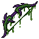 | **Veilblight Recurve** | A curved bow with a sickly green-yellow coloration, featuring organic, vine-like wrapping around its limbs. The bowstring glows with an ethereal luminescence. Dark thorns protrude from the grip, and shadowy wisps emanate from its curved frame. | *A bow born from corrupted wood and the whispers of forgotten curses. Each arrow loosed carries the weight of a thousand sorrows, leaving trails of blight in its wake.* | Archer |
| 3 | 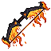 | **Emberflight Recurve** | A curved bow with warm orange and gold tones throughout the limbs and grip. The bowstring glows with ember-like particles. Dark charred sections contrast the golden wood, suggesting ancient fire magic infused into the crafted material. | *Forged in the dying light of a corrupted sun, this bow channels the fury of forgotten pyres. Each arrow loosed ignites with the rage of a thousand burning souls.* | Archer |
| 4 | 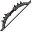 | **Thornwood Whisper** | A recurve bow carved from dark wood with thorny protrusions along its limbs. The bowstring glows faintly with an ethereal violet hue. Sharp barbs line the grip, and the entire weapon has a jagged, organic appearance suggesting corrupted nature. | *A bow born from the twisted heart of a cursed forest, its string hums with the voices of those it has claimed. Each arrow whispers secrets of mortality before finding its mark.* | Archer |
| 5 | 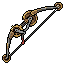 | **Ebonwood Recurve** | A curved bow crafted from dark, weathered wood with bone reinforcements along the limbs. The bowstring glows faintly with ethereal blue energy. Ornate bone carvings adorn the grip, and the entire piece bears an ancient, corrupted aesthetic. | *Forged in an age when shadow and wood intertwined, this bow draws power from the spaces between starlight. Each arrow it looses carries whispers of the void.* | Archer |
| 6 | 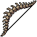 | **Ossein Recurve** | A curved bow crafted from pale, weathered bone with dark metallic reinforcements along its limbs. The bowstring appears woven from sinew or shadow-thread, with intricate carved runes adorning the grip. Sharp thorns protrude from the upper and lower tips. | *A bow hewn from the remains of something ancient and terrible. Each arrow drawn feels like a prayer to the void—whispered, inevitable, and utterly without mercy.* | Archer |
| 7 | 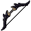 | **Nightfall Recurve** | A sleek curved bow rendered in dark silhouette with elegant, tapered limbs. The bowstring appears taut and luminous against the blackened wood. Sharp angular fletching adorns the design, suggesting predatory grace and lethal precision. | *A bow born from shadows themselves, its string hums with the whispers of those who fell to its arrows. Each shot tears through the veil between worlds, leaving trails of darkness in its wake.* | Archer |
| 8 | 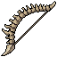 | **Spinefang Longbow** | A curved recurve bow crafted from dark chitin or bone, featuring sharp, jagged serrations along its limbs. The bowstring appears woven from sinew or dark fiber. Intricate spine-like protrusions jut outward along the bow's curve, giving it an insectoid, predatory appearance. | *A bow born from the carapace of something long dead and forgotten. Each arrow loosed carries the malice of a thousand pierced shells.* | Archer |
| 9 | 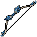 | **Nightwhisper Recurve** | A sleek recurve bow with a dark, near-black finish. The limbs curve elegantly inward, accented by pale blue or silver threading along the edges. A worn leather grip at the center, with subtle indigo accents and what appears to be a small crystal or gem embedded near the nocking point. | *Forged in shadow and strung with the sinews of forgotten things, this bow draws silence itself as an arrow. Those who have fired it speak only in whispers, if they speak at all.* | Archer |
| 10 | 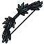 | **Raven's Requiem** | A curved bow crafted from blackened wood with obsidian accents. The limbs taper to sharp points resembling raven wings. Dark feathers wrap the grip, and the string glows with an ethereal violet hue. | *Once wielded by a forsaken archer who hunted in cursed lands, this bow calls to carrion with each drawn string. It drinks sorrow from the air itself, leaving only silence in its wake.* | Archer |
| 11 | 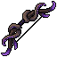 | **Voidpulse Longbow** | A curved longbow with a deep purple and black color scheme. The limbs are adorned with ethereal violet energy wisps that spiral along the wood. Silver or bone-like reinforcements wrap around the grip and tips, with small crystalline protrusions glowing faintly along the bowstring. | *A bow that seems to drink in light itself, its string humming with the energy of shattered realities. Arrows loosed from this weapon carry the weight of the void behind them, leaving trails of corruption in their wake.* | Archer |
| 12 |  | **Stormfeather Longbow** | A slender bow with sharp, angular wings extending from the limbs, colored in deep indigo and silver. Electric-blue accents trace along the bowstring. The grip features feathered etching. A mystical aura seems to shimmer around its edges. | *Forged in the heart of a shattered tempest, this bow whispers with the fury of the skies. Each arrow it looses carries the weight of eternal storms.* | Archer |
| 13 | 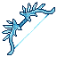 | **Stormfang Recurve** | A curved bow crafted from dark, splintered wood with jagged protrusions resembling fangs. Electric-blue energy crackles along its limbs, with wisps of ethereal light trailing from the bowstring. Sharp, crystalline shards jut from the grip. | *A bow born from the heart of a shattered storm. Those who draw its string feel the weight of tempests calling through their veins, each arrow a fragment of sky itself.* | Archer |
| 14 | 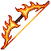 | **Emberflight Longbow** | A curved longbow crafted from dark wood with orange and yellow flame-like accents. The limbs taper to sharp points, and the bowstring glows with warm amber light. Embers appear to trail from the string, giving the weapon an ethereal, burning quality. | *Forged in the dying flames of a fallen star, this bow draws arrows of pure fire. Each shot leaves a burning trail through the air, as if the very path of death must be illuminated.* | Archer |
| 15 | 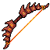 | **Embercrest Longbow** | A curved longbow crafted from dark wood with glowing crimson accents along its limbs. The bowstring shimmers with amber light. Ornate red fletching adorns the grip, and the entire weapon radiates a faint, smoldering heat. | *Forged in the heart of a fallen kingdom, this bow draws power from the embers of ancient pyres. Each arrow loosed carries the fury of a dying star, leaving scorched earth in its wake.* | Archer |
| 16 | 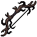 | **Shadowpiercer Longbow** | A sleek recurve bow rendered in dark grays and blacks with crimson accents along the limbs. The bowstring glows faintly purple. Angular, predatory curves suggest a predator's skeletal frame, with sharp recurve tips and a reinforced grip. | *A bow that drinks in light rather than reflects it. Those struck by its arrows find their wounds refuse to close, as if the projectiles carry fragments of the abyss itself.* | Archer |
| 17 | 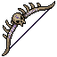 | **Carrion's Talon** | A curved, bone-white recurve bow with a dark wooden grip. The limbs taper to sharp, claw-like nocks. Wisps of shadow coil around the string, and the entire frame bears an organic, skeletal quality. | *A bow born from the remains of something ancient and terrible. Each arrow drawn from its string carries the weight of death itself, as if the bow remembers every creature it has felled.* | Archer |
| 18 | 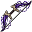 | **Veilrend Longbow** | A sinuous bow crafted from dark purple and black materials with ethereal wisps coiling around its limbs. The bowstring glows with an otherworldly violet energy, and thorned vine-like patterns wrap around the grip and tips. | *A bow that tears through the veil between worlds. Arrows loosed from this cursed arc whisper secrets of the void before finding their mark.* | Archer |
| 19 | 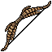 | **Ebonwing Recurve** | A curved bow with a dark, weathered wooden frame adorned with ornate gold filigree. The limbs feature feathered or wing-like protrusions in deep bronze, giving it an avian silhouette. The grip area shows intricate metalwork patterns. | *A bow carved from wood touched by shadow and death. Its elegant curve whispers of hunts conducted in moonless nights, each arrow finding its mark with predatory grace.* | Archer |
| 20 | 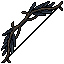 | **Raven's Lament** | A sleek, angular bow rendered in dark charcoal tones with jagged, asymmetrical limbs. Sharp black feathering or serrated edges accent the upper curve, suggesting corvid wings. The string glows faintly with an ethereal shimmer. | *Once strung by a cursed archer who hunted shadows. Each arrow whispers the names of the dead, and none who hear it live to forget.* | Archer |
| 21 | 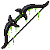 | **Shadowrend Longbow** | A curved bow rendered in dark charcoal and bone white, with an elegant recurve design. The limbs taper to sharp points, and intricate shadowy tendrils spiral along the frame, suggesting otherworldly craftsmanship. | *A bow forged in the spaces between worlds, its string thrums with the whispers of forgotten archers. Each arrow loosed tears through shadow itself, leaving voids in the air that refuse to close.* | Archer |
| 22 | 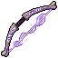 | **Duskwail Recurve** | A curved bow rendered in deep purple and lavender hues with an ethereal, ghostly aura. The limbs taper to sharp points, with a dark string appearing to shimmer with spectral energy. The grip shows ornate detailing suggesting ancient craftsmanship. | *A bow wrought from the sinew of forgotten spirits, its draw releases arrows that whisper through the veil between worlds. Those who have wielded it speak only in hushed tones, if at all.* | Archer |
| 23 | 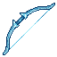 | **Whisperwind Bow** | A curved bow rendered in pale blue with elegant, flowing lines. The limbs taper gracefully from a reinforced grip, with subtle striations suggesting otherworldly craftsmanship. A thin, luminescent string connects the tips. | *Forged from the bones of a forgotten sky-beast, this bow draws arrows that cut through silence itself. Those who've loosed its bolts speak of voices that linger in the air long after the shot.* | Archer |
| 24 | 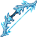 | **Frostbite Recurve** | A delicate bow crafted from pale blue-white material with crystalline edges. Intricate frost patterns spiral along the limbs, and ethereal ice particles shimmer around the bowstring. The grip appears wrapped in frozen sinew. | *A bow born from the heart of eternal winter, its arrows pierce not merely flesh but the warmth from a victim's very soul. Those who draw its string report hearing whispers of blizzards long forgotten.* | Archer |
| 25 | 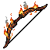 | **Ancient Emberflight Longbow** | A gracefully curved longbow crafted from dark wood with flame-orange accents along the limbs. The bowstring glows with embers, and ornate carved details suggest ancient craftsmanship. Small burning particles trail from the bow's edges. | *Forged in ages past when fire and wood were one, this bow draws arrows wreathed in ethereal flame. Those who draw its string feel the warmth of a thousand dying stars.* | Archer |
| 26 | 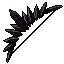 | **Ebonspine Recurve** | A curved bow crafted from dark, jagged materials with sharp protruding spikes along its limbs. The string appears taut and ethereal, glowing faintly. The overall silhouette is aggressive and menacing, with a color palette dominated by blacks and deep grays. | *A bow forged in the depths of forgotten caverns, its limbs hewn from the spine of an ancient beast. Each arrow loosed carries the weight of primordial darkness, finding its mark with inexorable purpose.* | Archer |
| 27 |  | **Frostbite Whisper** | A delicate recurve bow crafted from pale blue crystalline material with frosted edges. A single white feather adorns the upper limb, while ethereal ice particles shimmer along the bowstring, creating an otherworldly glow against the dark background. | *Forged from the shattered heart of a winter god, this bow exhales death as cold and inevitable as the grave. Each arrow drawn from its string carries the whispered curse of eternal frost.* | Archer |
| 28 | 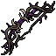 | **Voidborn Thornwood Whisper** | A gnarled, dark wooden bow with twisted limbs resembling thorned branches. Black serrated edges line the limbs, with wispy ethereal tendrils coiling around the grip. Sharp, spike-like protrusions jut from the bow's frame. | *Born from a cursed forest where screams still echo through the trees, this bow draws its arrows from the void itself. Each shot carries whispers of the damned.* | Archer |
| 29 | 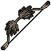 | **Ebonwing Longbow** | A recurve bow crafted from dark, twisted wood with a sleek black finish. Obsidian-tipped arrow nock and reinforced grip. Ethereal wisps of shadow coil around the limbs, suggesting corrupted craftsmanship. | *Forged in shadow-touched groves, this bow drinks the light from its targets. Each arrow released carries the weight of a curse, leaving only silence in its wake.* | Archer |
| 30 | 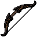 | **Ravenstrike Longbow** | A sleek curved bow rendered in dark charcoal with a graceful, almost organic curve. The limbs taper to sharp points, suggesting predatory elegance. A single feathered motif adorns the grip in stark black. | *Carved from the heartwood of trees that grew in perpetual shadow, this bow sings with an unnatural hunger. Each arrow it looses seems to cut the very darkness around it.* | Archer |
| 31 | 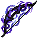 | **Voidstrike Recurve** | A darkly elegant curved bow rendered in deep indigo and silver. The limbs are adorned with ethereal purple streaks resembling fractured void energy, with sharp angular fletching details at the grip. A mystical aura trails from the bowstring. | *A bow forged in the depths of the Shattered Abyss, its string hums with the resonance of collapsing stars. Each arrow drawn from this cursed weapon tears through reality itself, leaving wounds that refuse to close.* | Archer |
| 32 | 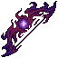 | **Stormwrath Recurve** | A curved bow with deep purple and black coloring, accented by jagged lightning-like patterns along the limbs. The bowstring glows with an ethereal violet energy. Sharp, angular details suggest corrupted wood or arcane materials. | *A bow forged in the heart of a dying storm, its string still hums with the echoes of thunder. Those who draw it risk attracting the wrath of the heavens themselves.* | Archer |
| 33 | 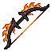 | **Emberwood Recurve** | A elegant recurve bow crafted from dark wood with warm amber grain patterns. Bronze-gold metalwork adorns the limbs and grip. Ornate string glimmers with an orange-red hue, suggesting enchanted fibers. The bow has a graceful, dangerous curve. | *Forged in the dying embers of a forgotten forge, this bow draws its power from the scorched heartwood of ancient groves. Each arrow looses a whisper of ash and flame, carrying the wrath of ages past.* | Archer |
| 34 | 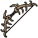 | **Thornwood Recurve** | A curved wooden bow with dark brown limbs reinforced by thorny vine-like engravings. The bowstring glows faintly with an ethereal amber hue. Sharp barbed details wrap around the grip and upper limbs, suggesting both elegance and danger. | *Carved from the petrified heartwood of the Thornwood—a forest consumed by shadow long ago. Each arrow loosed carries the whisper of that ancient curse, seeking those who disturb the dead.* | Archer |
| 35 | 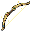 | **Serpent's Whisper Bow** | A curved wooden bow with a distinctive serpentine bend, featuring weathered golden-brown wood grain. The limbs taper gracefully with a slight undulating pattern. A worn cord spans the arc, and small ornamental details suggest ancient craftsmanship. | *A bow that seems to coil with malice in hand. Legends speak of arrows loosed from this ancient weapon finding their marks through shadow and stone alike, as if guided by something far older than mortal skill.* | Archer |
| 36 | 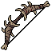 | **Voidborn Thornwood Recurve** | A recurved bow carved from dark, gnarled wood with prominent thorns jutting along its limbs. The bowstring appears woven from pale sinew or bone-colored fiber. Brown and charcoal tones dominate, with subtle crimson accents along the grip. | *A bow born from cursed timber, its thorns drink deep of those who draw it. Each arrow fired carries whispers of the ancient forest from which it was torn.* | Archer |
| 37 | 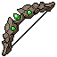 | **Shattered Thornwood Whisper** | A recurve bow crafted from gnarled, dark wood with a mottled brown and olive patina. The limbs curve elegantly with visible grain patterns. Wrapped grip section shows weathered leather binding. String appears taut and silvery, possibly sinew or enchanted fiber. | *An ancient bow that sings with each arrow released—a whispered promise of prey that never escapes. Those who draw it claim to hear the forest itself guiding their aim.* | Archer |
| 38 | 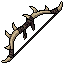 | **Thornwood Talon** | A curved, skeletal bow carved from gnarled dark wood with sharp, claw-like protrusions along its limbs. The bowstring appears woven from blackened sinew or shadow. Jagged bone accents jut from the grip and tips. | *A bow birthed from cursed groves where death takes root. Each arrow it looses carries whispers of the hunt—inevitable, merciless, drawn from the hunger of forgotten things.* | Archer |
| 39 | 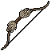 | **Storm Thornwood Whisper** | A curved bow carved from dark, gnarled wood with skeletal bone reinforcements along the limbs. The bowstring glows faintly with ethereal purple light. Thorned vines wrap the grip, and the entire weapon exudes an air of ancient decay and malice. | *An bow born from cursed forests where death takes root. Each arrow it looses carries the weight of a thousand forgotten sorrows, whistling through the air like the laments of the damned.* | Archer |
| 40 | 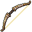 | **Thornwood Crescent** | A curved bow crafted from weathered dark wood with twisted grain patterns. The limbs are reinforced with bone accents at the tips, and frayed sinew wraps around the grip. Thorny protrusions jut from the upper limb. | *An ancient bow born from cursed forests, its wood thirsts for blood as eagerly as the archer who draws it. Each arrow leaves thorns in its wake—both literal and eternal.* | Archer |
| 41 |  | **Ancient Emberflight Recurve** | A curved bow crafted from dark wood with fiery orange and red gradient streaking across its limbs. Flickering flame-like protrusions jut from the bow's edges, glowing with an internal amber light. The bowstring appears to shimmer with heat distortion. | *Forged in the dying embers of a fallen god's pyre, this bow breathes fire with every arrow loosed. Those who draw its string risk immolation, yet none who wield it can miss.* | Archer |
| 42 |  | **Nightfall Crescent** | A curved bow crafted from dark purple-black material with a crescent moon silhouette. Silver or pale accents frame the limbs, with a glowing celestial orb at its center. The bowstring appears gossamer-thin and ethereal. | *Forged in the void between stars, this crescent bow drinks in shadow itself. Each arrow loosed carries the weight of dusk, seeking those marked by fate.* | Archer |
| 43 | 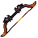 | **Bloodthorn Recurve** | A curved bow with a dark wood frame accented by crimson bindings. Thorny vines wrap around the limbs, and the bowstring glows an eerie deep red. Black and rust-colored details emphasize its sinister nature. | *An instrument of suffering born from cursed wood and thorned growth. Each arrow drawn tastes the archer's blood, binding hunter and prey in a pact sealed in shadow.* | Archer |
| 44 | 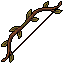 | **Voidborn Thornwood Whisper** | A dark wooden bow with a sinuous, curved frame. The limbs are wrapped in tattered brown leather strips and adorned with small thorny protrusions along the edges. The bowstring appears to glow faintly with an ethereal amber hue, contrasting against the weathered wood. | *A bow born from the twisted heartwood of a cursed forest. Each arrow drawn from its string carries the weight of ancient suffering, striking true against those who would trespass upon hallowed ground.* | Archer |
| 45 | 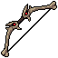 | **Bonestring Recurve** | A curved bow crafted from pale, skeletal material with dark sinew strung taut between its limbs. The wood appears bleached and ancient, with subtle bone-white striations running along its length. Tattered dark wrappings bind the grip. | *Once wielded by a hunter cursed to stalk endless midnight forests, this bow draws strength from sorrow itself. Each arrow fired carries the weight of a thousand hunted souls.* | Archer |
| 46 | 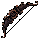 | **Shadowpine Recurve** | A dark, recurved bow with a sinuous curve. The limbs appear crafted from blackened wood with deep purple streaks running through them. The bowstring glows faintly with ethereal energy. Small thorns or barbs protrude along the upper limb. | *Carved from the heartwood of trees that grew in cursed soil, this bow drinks in shadows and exhales despair. Each arrow loosed carries whispers of the damned.* | Archer |
| 47 | 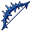 | **Storm Stormfang Recurve** | A curved bow crafted from dark, spike-studded material with jagged protrusions along its limbs. Crackling blue energy arcs between the string and frame. The bow appears menacing and otherworldly, radiating an ominous electrical aura. | *A bow born from a storm's fury, its string hums with the fury of lightning. Those who draw it find their arrows become instruments of nature's wrath, capable of piercing both flesh and the veil between worlds.* | Archer |
| 48 | 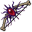 | **Spinethorn Recurve** | A curved bow rendered in deep purples and blacks, its limbs adorned with jagged, spine-like protrusions that jut outward menacingly. The bowstring appears to shimmer with an ethereal violet hue. Small barbs and thorns cover the grip and upper limbs. | *A bow born from cursed wood and malice, its barbed limbs whisper with the anguish of those it has pierced. Each arrow fired carries the weight of a thousand thorns.* | Archer |
| 49 | 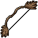 | **Ancient Thornwood Whisper** | A gnarled wooden bow with dark brown coloring and twisted limbs. The bowstring appears taut and ethereal, with feathered details at both tips suggesting a predatory nature. The wood grain is prominent and weathered. | *Carved from the heart of a cursed forest, this bow draws strength from the shadows between trees. Each arrow flies with the silence of death itself, leaving no trace but devastation.* | Archer |
| 50 | 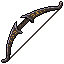 | **Cursed Ebonwing Recurve** | A recurved bow crafted from dark, weathered wood with a sharp downward curve. The limbs are wrapped in blackened leather bindings, and the bowstring appears to shimmer with an ethereal, sickly green luminescence. Intricate bone inlays trace along the grip. | *A bow born from the marrow of fallen wings. Each arrow loosed carries the whisper of those who fell to darkness, their screams faint but eternal along the shaft.* | Archer |
| 51 |  | **Forsaken Stormwrath Recurve** | A sleek recurve bow with sharp, angular geometry. The limbs are brilliant azure blue with jagged white lightning patterns etched across. The bowstring glows faintly electric. Metal fittings are dark silver with subtle frost crystals. | *Forged in the heart of a shattered sky, this bow drinks deep of storm and fury. Each arrow loosed carries the fury of tempests long forgotten.* | Archer |
| 52 | 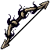 | **Voidborn Thornwood Whisper** | A curved bow crafted from dark, gnarled wood with sharp thorny protrusions along its limbs. The bowstring glows faintly with an ethereal purple hue. Blackened metal tips and wrapped grip add to its menacing appearance. | *Forged from the heart of a cursed forest, this bow draws arrows from shadow itself. Those who have heard its whisper speak only in screams.* | Archer |
| 53 | 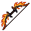 | **Shattered Emberflight Recurve** | A curved bow crafted from dark wood with orange-gold flame-like accents running along its limbs. The bowstring glows with amber light. Intricate carvings of phoenix feathers detail the grip. Small embers drift from the bow's surface. | *A bow born from the pyre of a celestial creature. Each arrow loosed carries the hunger of flame, leaving trails of ash in the air—a weapon that hungers as fiercely as the archer who draws it.* | Archer |
| 54 | 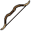 | **Shadowbind Recurve** | A curved bow rendered in dark iron or blackened wood, with a subtle curved profile. The limbs show a slight inward bend, characteristic of recurve design. Minimal ornamentation; the overall tone is muted grays and blacks with possible hints of dark purple or deep blue. | *A bow born from shadow and hunger, its string hums with the whispers of drawn souls. Each arrow loosed finds its mark with unnatural certainty, as if guided by something that dwells between worlds.* | Archer |
| 55 | 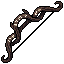 | **Storm Shadowrend Longbow** | A sleek recurve bow rendered in dark charcoal tones with elegant curved limbs. The bowstring appears taut and ethereal, glowing faintly. Ornate decorative elements spiral along the riser, suggesting ancient craftsmanship. Sharp angular details suggest danger and precision. | *Forged in an age when shadow itself could be drawn taut as string. Each arrow fired from this bow tears through more than flesh—it rends the veil between worlds, leaving wounds that refuse to close.* | Archer |
| 56 | 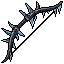 | **Spinebark Recurve** | A twisted bow crafted from dark, gnarled wood with sharp bone protrusions along its limbs. The bowstring glows with a faint ethereal cyan. Angular spikes jut from the grip and upper arc, giving it a predatory, organic appearance. | *Forged from the twisted heartwood of cursed groves, this bow thirsts for the blood of those who dare draw its string. Each arrow fired carries the anguish of a thousand thorns.* | Archer |
| 57 |  | **Crimson Thornbow** | A curved recurve bow with a deep crimson finish, adorned with sharp thorned protrusions along the limbs. The bowstring glows with an ethereal red hue. Dark spikes jut from the grip and upper limb, suggesting both elegance and menace. | *A bow born from thorned vines and bloodied steel. Each arrow loosed carries the sting of a thousand barbs, as if the very air itself bleeds in its wake.* | Archer |
| 58 |  | **Shadowbark Recurve** | A darkwood bow with a blackened, gnarled finish. Curved limbs appear twisted like charred bark, with deep purple streaks running through the wood. The bowstring glows faintly with an eerie violet hue. Thorny protrusions line the grip. | *Carved from the heartwood of trees that grew in corrupted soil, this bow hungers for the taste of shadow. Each arrow loosed carries whispers of the blight that birthed it.* | Archer |
| 59 |  | **Forsaken Shadowpine Recurve** | A darkwood bow with a curved, elegant profile. The limbs are wrapped in black leather cord with bone-white accents at the tips. A ghostly green luminescence traces the bowstring, and the grip is adorned with what appears to be carved obsidian runes. | *Carved from the heartwood of trees that grew in cursed soil, this bow drinks in shadow itself. Each arrow it looses carries the whisper of something ancient and vengeful.* | Archer |
| 60 |  | **Shadowfang Recurve** | A curved bow with a dark metallic frame, featuring sharp obsidian-black limbs that taper to wicked points. The grip wraps in worn leather, with faint crimson runes etched along the bowstring. The silhouette is angular and predatory. | *A bow born from shadow and malice, its string resonates with a sound like breaking glass. Those who draw it find their arrows seeking prey with unnatural hunger, as if the bow itself thirsts for the hunt.* | Archer |
| 61 |  | **Stormwrath Crescent** | An elegant curved bow rendered in shades of deep blue and white, featuring ornate spiral patterns along its limbs. The bowstring glows with faint ethereal light. Decorative crescent-moon shapes accent the upper and lower tips, suggesting celestial or arcane origins. | *Forged in the eye of a sundered tempest, this bow hungers for the sky. Each arrow it looses carries the wrath of storms long forgotten, trailing whispers of thunder to their mark.* | Archer |
| 62 |  | **Flamewing Recurve** | A curved bow with a striking color palette of deep orange and vibrant blue. The limbs are adorned with feather-like patterns in contrasting hues, creating a wing-like appearance. The bowstring glows faintly, and ornate metalwork frames the grip. | *A bow said to have been forged in the dying breath of a celestial creature. Each arrow loosed from its string trails embers and sorrow, as if the bow itself hungers for the sky it can no longer reach.* | Archer |
| 63 |  | **Sorrow's Talon** | A slender, curved bow rendered in deep mahogany tones with elegant, swept limbs that taper to sharp points. The bowstring glows faintly with a ghostly amber hue, and the overall design evokes both grace and predatory intent. | *A bow carved from the heartwood of trees that grew in sorrow-drenched soil. Each arrow loosed from its string carries whispers of those who fell to its aim.* | Archer |
| 64 |  | **Wraithstring Bow** | A curved bow rendered in dark graphite tones with ethereal wisps trailing from the bowstring. The limbs taper to sharp points, and spectral energy coils around the grip. Fine details suggest ancient craftsmanship. | *Forged in the twilight between worlds, this bow draws arrows from the veil itself. Those struck by its projectiles fade into shadow, their screams swallowed by the void.* | Archer |
| 65 |  | **Thornwood Requiem** | A curved bow crafted from dark, gnarled wood with deep crimson accents. Barbed thorns protrude along its limbs, and ghostly purple wisps coil around the bowstring. The grip is wrapped in what appears to be shadowy cloth or sinew. | *A bow forged in sorrow, its thorns drink deep of those who draw it. Each arrow sung from its string carries the weight of a thousand dirges.* | Archer |
| 66 |  | **Stormwing Recurve** | A elegant curved bow rendered in deep blue and cyan pixels, with feathered wing-like protrusions along the limbs. Crackling electric accents illuminate the bowstring, suggesting arcane power. | *Forged from the wing-bone of a storm-touched beast, this bow channels the fury of tempests through each arrow. Those who draw it report hearing distant thunder, as if the sky itself hungers for their aim.* | Archer |
| 67 |  | **Forsaken Nightwhisper Recurve** | A sleek curved bow with a deep indigo finish and golden accents along its limbs. The bowstring glows with an ethereal blue luminescence. Intricate dark patterns trace the wood, suggesting ancient runes or binding magic. | *Forged in the twilight hours by those who hunt shadows, this bow draws silence itself as its arrow. Each shot carries the weight of a thousand whispered deaths.* | Archer |
| 68 |  | **Sorrow's Arc** | A curved bow with a dark, weathered frame. The limbs taper to sharp points and display a murky brown-grey coloration with faint shadowy striations. Minimal ornamentation suggests age and purpose over decoration. | *A bow drawn from sorrow itself, its limbs bend as if weighted by centuries of lamentation. Each arrow loosed carries the whisper of those who fell to its former master's aim.* | Archer |
| 69 |  | **Veilpiercer's Talon** | A curved, angular bow with sharp, claw-like limbs extending outward. The frame is deep forest green with black serrated edges. Intricate vine-like carvings spiral along the grip, and spectral wisps of pale energy swirl around the bow's curves. | *A bow born from the hunt of things that should not exist. Those who draw its string report hearing whispers of prey that fled into shadow.* | Archer |
| 70 |  | **Ember Nightwhisper Recurve** | A sleek curved bow rendered in dark charcoal tones with a subtle curved silhouette. The limbs taper to sharp points, suggesting lethal precision. Minimal detail emphasizes an elegant, predatory design—a weapon of stealth over brute force. | *A bow born from shadow and silence, said to have been drawn from the depths where light fears to tread. Each arrow it looses carries the weight of forgotten sorrows.* | Archer |
| 71 |  | **Storm Stormwrath Recurve** | A curved bow with ethereal blue-white coloring and wispy, trailing energy effects. The limbs appear translucent with crackling frost patterns. Ornate string glows with pale cyan light. Details suggest wind and lightning infused into the weapon. | *A bow wrought from the captured essence of tempests long forgotten. Each arrow loosed carries the fury of a thousand storms, leaving trails of spectral lightning in the darkened sky.* | Archer |
| 72 |  | **Hollow Sorrow's Talon** | A slender recurve bow with a pale, bone-white limbs and deep indigo string. Sharp angular geometry defines its profile, with crimson accents along the grip and nock points suggesting dried blood or ancient runes. | *A bow born from sorrow itself, its string hums with the weight of a thousand wails. Each arrow drawn is a prayer to oblivion.* | Archer |
| 73 |  | **Ebonwhisper Longbow** | A slender, curved bow crafted from dark wood with a deep brown finish. The limbs taper toward elegant points, and a thin bowstring appears taut and ready. Minimal ornamentation emphasizes its predatory grace. | *Drawn from the heartwood of trees that grew in shadow, this bow feels less like a weapon and more like an extension of the archer's malice. Each arrow released carries whispers of those who came before.* | Archer |
| 74 |  | **Sorrow's Crescent** | A curved recurve bow with a graceful, moon-like profile. The limbs are dark wood with bronze reinforcement bands. A taut string gleams pale silver, and subtle bone inlays trace the grip, giving it an elegantly weathered appearance. | *Once wielded by a fallen hunter who tracked prey through endless night. This bow whispers with each draw, as if mourning the countless arrows it has loosed into darkness—a weapon that remembers every kill.* | Archer |
| 75 |  | **Nightwing Recurve** | A dark, curved bow crafted from blackened wood or bone. The limbs arc inward with a sinister grace, featuring bat-wing-like protrusions at the tips. Deep crimson accents trace the grip and string anchors, giving it an ominous, predatory silhouette. | *A bow born from shadow and malice, its draw whispers curses rather than songs. Those who claim to have fired its arrows speak only in fragmented, haunted terms—as if the bow itself remembers each kill.* | Archer |
| 76 |  | **Voidborn Shadowpine Recurve** | A curved bow with a dark wooden limbs streaked with pale bone accents. The grip is wrapped in what appears to be aged leather, and the bowstring glows faintly with an ethereal blue-white luminescence against the shadowed frame. | *Carved from wood that remembers the old forests, this bow draws power from the spaces between starlight. Each arrow it looses carries the weight of forgotten hunts.* | Archer |
| 77 |  | **Shattered Bloodthorn Recurve** | A crimson and dark wood bow with wicked barbed protrusions along its limbs. The bowstring glows faintly red, and thorned vines seem to coil around the grip and upper curve, suggesting an organic, corrupted elegance. | *A bow born from forbidden pacts, its thorns drink deep of those it pierces. Each arrow loosed carries whispers of agony, as if the bow itself hungers for suffering.* | Archer |
| 78 |  | **Ember Thornwood Whisper** | A recurve bow crafted from gnarled, dark wood with bone accents along the limbs. The bowstring glows faintly with an ethereal luminescence. Thorny vines wrap around the grip, and the entire weapon bears an ancient, weathered appearance. | *A bow born from cursed groves where arrows drink the silence of fallen prey. Each shot whispers secrets meant only for the dying.* | Archer |
| 79 |  | **Storm Bloodthorn Recurve** | A curved bow rendered in deep crimson and burgundy hues. Thorned vines coil around the limbs, with a dark shaft featuring crimson fletching. The bowstring glows faintly with an ominous red aura, suggesting inherent dark enchantment. | *Forged from cursed heartwood and strung with sinew harvested from forgotten beasts, this bow drinks deep of those it pierces. Each arrow loosed carries a fragment of old pain.* | Archer |
| 80 |  | **Hollow Stormwrath Recurve** | A curved bow with deep blue and silver coloring. The limbs feature ornate, angular details with glowing blue accents along the edges. The bowstring appears taut and luminescent, suggesting magical properties. Intricate metalwork adorns the grip. | *A bow forged in the heart of a tempest, its string still crackling with the fury of fallen skies. Those who draw it feel the weight of storms bearing down upon their enemies.* | Archer |
| 81 |  | **Stormveil Longbow** | A slender bow crafted from pale, weathered wood with golden-bronze accents along the limbs. Ethereal blue-white light crackles along the bowstring and radiates outward. Delicate angular patterns suggest ancient runic markings etched into the frame. | *A bow forged in the aftermath of a shattered sky, its string perpetually humming with the fury of forgotten storms. Each arrow loosed carries the weight of thunder itself.* | Archer |
| 82 |  | **Scorchwing Recurve** | A curved bow crafted from dark, charred wood with burnt-orange accents. Flames flicker across its limbs in amber and crimson hues. The bowstring glows with embers, and feathered details suggest wings mid-flight along the upper curve. | *A bow forged in the dying breath of a phoenix, its limbs still smolder with ancient fire. Each arrow loosed carries the weight of a thousand burning nights.* | Archer |
| 83 |  | **Ravenclaw Longbow** | A sleek recurve bow crafted from dark wood with bone-white accents along the limbs. Sharp, angular design with a corvid motif etched into the grip. The bowstring appears to shimmer with an otherworldly luminescence against the weapon's shadowed frame. | *Forged in an age of carrion and shadow, this bow drinks deeply of the hunter's intent. Each arrow loosed carries whispers of the void, as if guided by wings unseen.* | Archer |
| 84 |  | **Voidborn Frostbite Whisper** | A sleek recurve bow rendered in icy blue and white pixels. Crystalline frost adorns the limbs, with an ethereal glow emanating from its core. The bowstring shimmers with an otherworldly luminescence, appearing almost translucent. | *Forged in the breath of forgotten winter gods, this bow drinks the warmth from all it touches. Each arrow loosed carries the sting of eternal frost, leaving trails of crystalline death in its wake.* | Archer |
| 85 |  | **Spinethorn Longbow** | A curved bow constructed from dark, jagged bone with wicked spike protrusions along its limbs. The bowstring glows faintly with an ethereal purple hue. Sharp thorns jut irregularly from the frame, creating a menacing silhouette. | *A bow born from profane bone and corrupted wood, its thorns weep venom with each arrow loosed. Those who draw its string feel the weight of countless suffering souls.* | Archer |
| 86 |  | **Bonewood Whisper** | A curved bow crafted from pale, weathered bone with dark wood accents along the grip. The string appears taut and silvery. Intricate spiral carvings wind along the limbs, suggesting ancient craftsmanship. | *A bow born from forgotten crypts, its string hums with the voices of the fallen. Each arrow drawn echoes with spectral purpose—a weapon that hunts both flesh and shadow.* | Archer |
| 87 |  | **Storm Ossein Recurve** | A curved bow crafted from pale, bleached bone with intricate thorn-like barbs spiraling along its limbs. The bowstring appears woven from dark sinew or shadow-thread, creating an ominous contrast against the ivory frame. Gold filigree traces the grip. | *A bow born from the ribcage of something ancient and terrible. Each arrow drawn from this cursed arc carries the weight of forgotten suffering, promising arrows that pierce both flesh and spirit alike.* | Archer |
| 88 |  | **Raven's Talon Bow** | A recurve bow crafted from dark, weathered wood with bone-white accents along the limbs. The bowstring appears woven from shadowy sinew. A raven's skull ornament crowns the grip, with sharp angular fletching details visible on the drawn arrow. | *Forged in an age when carrion birds were harbingers of fate, this bow drinks deep of misfortune. Each arrow loosed carries whispers of those who fell before it.* | Archer |
| 89 |  | **Raven's Descent** | A sleek, angular bow crafted from blackened wood or bone. Sharp, jagged fletching resembles crow feathers, with dark metallic accents along the limbs. The bowstring appears taut and ominous, rendered in stark black lines against a darker background. | *A bow born from carrion and shadow, it drinks deep of the air itself. Those who draw its string invite the gaze of things that feast on fallen souls.* | Archer |
| 90 |  | **Cursed Thornwood Recurve** | A curved wooden bow with warm golden-brown tones and dark striping throughout. The limbs feature ornate carved details resembling thorns or barbs. String appears taut and dark, possibly sinew or enchanted fiber. Compact yet elegant design with pointed, elegant curves. | *An ancient bow carved from wood that remembers the thorned forests of a forgotten age. Each arrow loosed carries with it the whisper of overgrown ruins and the hunger of things that dwell in darkened groves.* | Archer |
| 91 |  | **Stormveil Recurve** | A curved bow with deep blue and purple coloring, accented by jagged crystalline protrusions along its limbs. Ethereal wisps of energy coil around the string, and the bow's curvature suggests both elegance and predatory grace. | *Forged in the heart of a shattered tempest, this bow drinks deep of the storm's fury. Each arrow loosed carries the weight of fracturing skies.* | Archer |
| 92 |  | **Voidborn Shadowbind Recurve** | A curved bow crafted from dark wood with deep burgundy accents. The limbs curve inward with an elegant, predatory arc. A taut black bowstring gleams with an otherworldly sheen, and the grip shows aged leather binding. | *A bow that drinks in shadow itself. Those who draw its string report a whisper like distant screams—whether blessing or curse, none can say.* | Archer |
| 93 |  | **Veilstrike Longbow** | A gracefully curved wooden bow with dark, aged oak limbs. The bowstring glows with an ethereal pale blue luminescence. Intricate bone inlays form trailing patterns along the shaft, suggesting ancient craftsmanship. The grip wraps in weathered leather. | *Forged in the twilight hours by archers of a forgotten age, this bow draws power from the space between worlds. Each arrow loosed carries the weight of shadow itself.* | Archer |
| 94 |  | **Veilpiercer Longbow** | A recurve bow crafted from dark wood with ornate bronze fittings. The limbs curve gracefully and feature carved bone inlays depicting celestial patterns. The bowstring glows faintly with ethereal purple energy. | *Forged in the shadow of forgotten temples, this bow pierces not merely flesh, but the veils between worlds. Each arrow carries whispers of the void.* | Archer |
| 95 |  | **Storm Raven's Talon Bow** | A curved, angular bow crafted from dark materials resembling crow talons. Sharp, elongated limbs extend upward in wicked points. The bowstring appears taut and sinister, with a deep burgundy or blackened finish suggesting ancient craftsmanship. | *Forged from the skeletal remains of a profane creature, this bow hungers for the taste of falling prey. Each arrow loosed carries whispers of predatory hunger across the battlefield.* | Archer |
| 96 |  | **Hollow Spinethorn Recurve** | A curved bow crafted from dark, jagged bone with sharp protrusions along its limbs. The bowstring glows with an eerie pale luminescence. Intricate thorned patterns weave across the grip, suggesting both organic and arcane origins. | *Forged from the spine of a creature long forgotten, this bow hungers for the taste of blood. Each arrow loosed carries whispers of suffering, finding their mark with unnatural precision.* | Archer |
| 97 |  | **Carrionfeather Longbow** | A skeletal recurve bow crafted from blackened bone, with tattered dark feathers woven through the limbs. The bowstring glows a sickly violet, and the grip is wrapped in what appears to be weathered leather. Sharp, angular design with an ominous presence. | *Once strung with the sinews of forgotten beasts, this bow whispers curses with every shot. Those struck by its arrows carry the stench of the grave long after their wounds close.* | Archer |
| 98 |  | **Cursed Thornwood Whisper** | A elegantly curved bow crafted from weathered wood with golden-brown tones. The limbs taper to sharp points, adorned with fine golden accents and subtle vine-like engravings. The bowstring glows faintly with an ethereal shimmer. | *A bow born from the cursed groves where silence devours sound. Each arrow it looses carries the weight of forgotten whispers, striking not just flesh but the very essence of resistance.* | Archer |
| 99 |  | **Forsaken Raven's Talon Bow** | A curved, asymmetrical bow crafted from dark wood or bone, featuring sharp angular projections resembling talons. The limbs taper to wicked points, with a silhouette suggesting a predatory bird mid-strike. Predominantly black with hints of crimson accents. | *Forged from the wing-bones of a creature long forgotten, this bow drinks the wind itself. Each arrow flies true as a raven's descent—swift, merciless, and inevitable.* | Archer |
| 100 |  | **Splinterfang Longbow** | A weathered recurve bow crafted from pale, fractured wood with dark binding along the limbs. The bowstring appears frayed and stained. Sharp bone or horn protrusions jut from the grip, resembling jagged teeth. | *A bow born from cursed timber, its draw whispers the screams of those it has pierced. Each arrow loosed carries the weight of ancient malice, seeking flesh as if guided by spite itself.* | Archer |
