# Scrolls - Item Catalog

> **Category:** Scroll  
> **Total items:** 200  
> **Classes:** Mage

| # | Preview | Item Name | Visual Description | Description | Classes |
|:-:|:-------:|:----------|:------------------|:------------|:--------|
| 1 |  | **Scroll of Withering Truths** | A weathered parchment scroll bound with frayed dark cloth and tarnished bronze clasps. The edges are singed and curled, with cryptic symbols etched in faded gold leaf across a mottled tan surface. A small obsidian seal hangs from a tether. | *Those who read from this corrupted manuscript glimpse the inevitable decay of all things. The knowledge burns away sanity like candlelight consumes shadow.* | Mage |
| 2 |  | **Cinderpact Grimoire** | A weathered scroll with a deep plum-purple binding, adorned with an orange-amber sigil glowing faintly at its center. The parchment edges are singed and darkened, suggesting exposure to arcane flame. Gold filigree borders the ancient text beneath the emblem. | *A forbidden manuscript bound in the hide of creatures best left unnamed. Those who read its incantations taste ash and feel the creeping cold of the void-a price the ambitious pay willingly.* | Mage |
| 3 |  | **Veilbound Grimoire** | A weathered scroll with pale parchment edges, bound in tattered cloth. Golden runic symbols glow faintly along its surface. The seal bears a crescent moon motif in deep indigo, with wisps of ethereal mist coiling around the rolled edges. | *An ancient manuscript that whispers secrets between worlds. Those who unfurl its pages risk glimpsing truths that shatter mortal comprehension, leaving only ash and silence in their wake.* | Mage |
| 4 |  | **Veilscript Grimoire** | A aged parchment scroll bound in weathered bone-white leather, adorned with a golden cross symbol at its center. The edges are frayed and darkened, with intricate runic patterns visible along the borders, suggesting ancient arcane knowledge. | *A manuscript inscribed with the whispered secrets of the void itself. Those who read its passages find their minds unmoored from reality, dancing between worlds that should never touch.* | Mage |
| 5 |  | **Frostpact Codex** | An ornate scroll rendered in cool azure and icy white tones, framed by an elaborate blue border with crystalline corners. Frost patterns and arcane symbols cover the parchment. The design suggests ancient, frozen magic bound within delicate paper. | *A scroll inscribed with the language of winter itself-words that frost the tongue and shatter the resolve of those who speak them. Those who dare unroll its pages invite the creeping cold to claim their very soul.* | Mage |
| 6 |  | **Veilthread Codex** | An aged scroll with tattered edges bound in dark leather, adorned with silvery arcane runes that glow faintly. The parchment within shows intricate glyphs and mystical symbols in shades of blue and purple, with wisps of ethereal energy seeming to emanate from its surface. | *A forbidden grimoire whose pages whisper secrets of the void itself. Those who read its passages find their mind fractured between worlds, forever changed by what dwells beyond the veil.* | Mage |
| 7 | 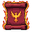 | **Crimson Covenant Scroll** | A weathered parchment scroll with deep crimson and gold embroidery. The edges are singed and worn, featuring an ornate phoenix or flame motif in the center. Bound with aged leather cord, the scroll radiates an otherworldly warmth against its dark burgundy background. | *A pact written in the blood of forgotten sorcerers, its words shift and writhe when read. Those who study its verses gain power at a terrible cost-each spell cast echoes with the screams of those bound within.* | Mage |
| 8 | 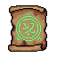 | **Verdant Whisper Scroll** | An aged parchment scroll with a sage-green seal, housed in a weathered leather case with brass accents. The scroll's edges curl slightly, revealing arcane symbols in gold leaf. A glowing emerald sigil marks its center. | *A tome of corrupted nature magic, its pages whisper secrets of growth twisted into ruin. Those who dare read its contents often find themselves unable to distinguish between life and decay.* | Mage |
| 9 |  | **Veilbound Codex** | A weathered parchment scroll encased in a translucent cyan-blue crystalline frame. The scroll glows faintly with arcane energy, its edges frayed and aged. Intricate runes are barely visible through the frosted magical barrier, suggesting forbidden knowledge sealed within. | *A grimoire bound by forces beyond mortal comprehension, its pages whisper secrets that corrode the mind. Those who dare read its contents risk unraveling the very fabric of their sanity.* | Mage |
| 10 |  | **Cursed Veilbound Grimoire** | A weathered scroll with tattered edges bound in dark cloth and metal clasps. The parchment bears intricate violet runes that seem to shift in candlelight. Ornate corner fixtures and a central seal suggest forbidden knowledge within. | *A manuscript penned in the blood of forgotten sorcerers, its pages whisper secrets that corrode the mind. To unfurl it is to invite the gaze of things better left unseen.* | Mage |
| 11 | 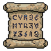 | **Codex of Withering Truths** | An aged parchment scroll with deep brown and gold tones, bound with weathered leather straps. The surface bears arcane symbols and runes rendered in crimson ink, with torn edges suggesting ancient, forbidden knowledge. | *A grimoire whose passages speak only of decay and entropy. Those who read its words find themselves caught between worlds, their essence slowly unraveling with each forbidden incantation.* | Mage |
| 12 |  | **Emberwick Codex** | A weathered scroll with deep crimson and charcoal tones. The parchment is singed at the edges, adorned with intricate gold filigree patterns and arcane symbols that seem to writhe across its surface. Small embers glow faintly within the rolled manuscript. | *A cursed manuscript penned in the blood of forgotten sorcerers. Those who dare unroll its secrets find their minds aflame with forbidden knowledge-and the price of such wisdom is always paid in ash.* | Mage |
| 13 |  | **Shattered Veilbound Grimoire** | A weathered parchment scroll with a cream-colored binding, adorned with an ornate golden frame. The scroll features intricate arcane symbols and a mystical doorway or portal motif at its center, rendered in warm amber and gold tones against the aged paper. | *An ancient manuscript that whispers of forgotten thresholds between worlds. Those who dare unfurl its pages find their consciousness stretched across veils none should witness.* | Mage |
| 14 |  | **Codex of Whispered Ruin** | A weathered parchment scroll with aged tan leather binding. Golden ornamental corners frame the edges. Dark symbols and arcane script are faintly visible across the surface, glowing with an eerie amber luminescence. | *The words inscribed upon this cursed parchment predate civilization itself. To read them is to invite calamity into one's very soul.* | Mage |
| 15 |  | **Storm Codex of Withering Truths** | An aged parchment scroll with golden binding and ornate clasps. The paper displays intricate runic symbols in deep crimson ink, with faint tendrils of shadow seeming to emanate from the text itself. The edges are scorched and weathered. | *A forbidden grimoire bound in materials best left unnamed. Those who decipher its secrets find knowledge comes at a price-sanity fractures with each revelation.* | Mage |
| 16 |  | **Veilscript Codex** | A weathered scroll unfurled within an ornate frame, rendered in pale blue and white tones. The parchment glows with arcane symbols and runes, bordered by decorative stone or bone trim. A central emblem suggests protective or binding magic. | *A forbidden grimoire bound between worlds, its pages whisper secrets that corrode the mind. Those who read from it gain power at the cost of their certainty.* | Mage |
| 17 |  | **Ancient Veilbound Codex** | A weathered parchment scroll encased in worn tan leather bindings. A glowing blue arcane sigil radiates from the center, casting an ethereal light. The edges are singed and frayed, suggesting exposure to eldritch forces. | *A grimoire penned by forgotten mages who dared transcribe the language of the void itself. Those who read its words risk unraveling their sanity, yet the power granted is undeniable.* | Mage |
| 18 |  | **Cursed Veilbound Grimoire** | A weathered parchment scroll with ochre-tan binding and worn edges. The surface displays an intricate occult diagram or sigil rendered in dark brown ink, featuring geometric patterns and arcane symbols within a circular frame. The scroll appears ancient and carefully preserved. | *A forbidden manuscript whose diagrams shift when glimpsed peripherally. Mages who study its passages report visions of worlds folding inward-each revelation exacts a price measured in sanity rather than gold.* | Mage |
| 19 |  | **Grimoire of Shattered Seals** | An ornate scroll housed in a weathered blue-steel frame, adorned with arcane symbols and celestial motifs. The parchment appears aged and ethereal, emanating a faint otherworldly glow from within the ornamental binding. | *The knowledge contained within these pages was never meant for mortal minds. Each seal broken releases forces that bend reality itself, though the cost to the caster grows with every invocation.* | Mage |
| 20 |  | **Umbral Codex** | A weathered scroll bound in dark leather with gold-trimmed edges. The parchment glows with sickly green runic inscriptions. Ornate golden clasps seal the rolled edges, and wisps of ethereal energy coil around the corners of the aged vellum. | *An ancient grimoire whose pages whisper forgotten incantations. Those who read its words find their minds fractured by visions of worlds unmade, yet their magic grows terrible and profound.* | Mage |
| 21 | 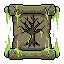 | **Chronoveil Manuscript** | An aged scroll with a moss-green binding and ornate brass corners. The parchment displays an intricate hourglass symbol surrounded by fading arcane runes. Worn edges and a subtle glow emanate from the weathered surface. | *A scroll inscribed with forgotten incantations that bend the threads of time itself. Those who dare invoke its words risk unraveling the very fabric of causality.* | Mage |
| 22 | 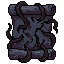 | **Ember Umbral Codex** | A tightly rolled parchment scroll with deep indigo and charcoal coloring. The surface is bound with dark leather strips and adorned with obsidian-black seals. Intricate shadowy runes are embossed across its surface, seeming to shift in dim light. | *A forbidden manuscript said to contain incantations that blur the line between worlds. Those who read its contents risk losing themselves to the void between shadows and thought.* | Mage |
| 23 |  | **Codex of Unmaking** | An aged parchment scroll with cream-colored binding and rolled edges. The surface bears faded golden script and arcane symbols, with hints of sepia staining suggesting ancient origin. A subtle aura of decay emanates from the worn edges. | *Words inscribed upon this cursed parchment unmake the very fabric of existence. Those who dare read its passages find reality bending to their will-at the cost of their sanity.* | Mage |
| 24 | 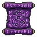 | **Veilwhisper Codex** | A tightly rolled parchment scroll with deep purple fabric binding adorned with ornate silver sigils. The edges glow faintly with arcane runes, and intricate ribbon seals wrap around its circumference in ritualistic patterns. | *A grimoire of forbidden incantations, its pages whisper secrets that corrode the mind of those who dare read them. Those who study its contents find their connection to the veil between worlds irreversibly altered.* | Mage |
| 25 | 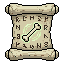 | **Ancient Veilbound Codex** | An aged parchment scroll with yellowed edges, bound in worn leather straps. Intricate occult symbols and arcane runes glow faintly in sickly green across the surface. The scroll's case bears a tarnished brass seal depicting a crescent moon over an abyss. | *A grimoire penned by those who glimpsed beyond the veil and returned changed. Its verses whisper truths that erode the mind, granting power at the cost of clarity.* | Mage |
| 26 |  | **Grimoire of Ember Runes** | A weathered scroll bound in cracked leather with bronze corner plates. The parchment glows faintly with amber symbols and arcane sigils. Charred edges suggest exposure to intense magical fire. Small intricate patterns frame the worn edges. | *A scroll inscribed with the final incantations of a pyromancer consumed by their own ambition. Those who read it claim to hear the whispers of flames long extinguished, urging them toward destructive magic.* | Mage |
| 27 |  | **Scroll of Twilight Ruin** | A rolled parchment scroll bound with tattered midnight-blue cloth. The tube is crafted from pale bone or ivory, with darkened copper fittings at both ends. A single crimson seal marks its center, glowing faintly against the weathered surface. | *An arcane manuscript penned in the final hours before the world's first dusk. Those who read its verses glimpse the architecture of reality unraveling, though few survive the knowledge intact.* | Mage |
| 28 |  | **Veilwarp Codex** | An ancient scroll with a silver-blue seal at its center, surrounded by concentric circular runes. The parchment appears ethereal and slightly translucent, with frost-like crystalline patterns etched along its edges. The seal glows with arcane energy. | *A forbidden manuscript that whispers of spaces between worlds. Those who decipher its glyphs risk unraveling the very fabric of their sanity, exchanging mortal sight for glimpses of the void itself.* | Mage |
| 29 |  | **Embercall Grimoire** | A dark purple scroll with glowing orange-red flame motifs framing an ornate doorway or gateway. The edges are rimmed with black, and the interior portal emanates warm amber light against the shadowed parchment. | *A scroll bound in shadow-touched vellum, its pages whisper of doorways between worlds. Those who read its passages invite the infernal gaze to turn upon them.* | Mage |
| 30 |  | **Voidpact Grimoire** | A tightly bound scroll with deep purple and indigo fabric wrapping. The parchment features an intricate glowing sigil at its center-a circular arcane symbol in pale blue. Dark cosmic patterns and eldritch runes frame the edges, suggesting forbidden knowledge. | *A scroll inscribed with the whispered names of things that should not be summoned. Those who read its contents risk unraveling the threads that bind reality itself.* | Mage |
| 31 |  | **Storm Veilbound Codex** | An ornate scroll with deep purple and gold accents, bound in weathered leather. Intricate arcane symbols glow faintly along its edges. The parchment appears ancient, edges curled and frayed, with mystical runes visible beneath the surface. | *A forbidden manuscript said to contain the whispered secrets of the void itself. Those who study its passages often find their minds slipping between worlds, caught between sanity and something far more terrible.* | Mage |
| 32 |  | **Crimson Pact Scroll** | A tattered scroll wrapped in deep crimson fabric with dark red wax seals. The aged parchment bears intricate runic markings that seem to writhe in shadow. Ornate metal clasps bind the scroll, with what appears to be dried blood staining its edges. | *A forbidden grimoire whose pages whisper of blood magic and shattered covenants. Those who unfurl its secrets risk binding their very soul to powers older than death itself.* | Mage |
| 33 |  | **Chronometer of the Forsaken** | An ornate square scroll case with a prominent clock face at its center, displaying a golden hour hand frozen at midnight. The frame is adorned with intricate brass filigree and dark blue cloth, embossed with arcane symbols that seem to shift in peripheral vision. | *A cursed artifact that measures not the hours mortals know, but the tick of entropy itself. Those who read from this scroll find time bends to their will-though at a terrible price measured in years they'll never see.* | Mage |
| 34 |  | **Scroll of Fell Incantations** | A weathered parchment scroll bound with frayed twine, housed in a worn leather case. The exposed vellum bears arcane symbols in deep gold ink that seem to shimmer with an otherworldly amber glow against the aged cream background. | *Words inscribed upon this cursed parchment whisper secrets meant only for those willing to sacrifice clarity of mind. Few who've read its contents have returned unchanged.* | Mage |
| 35 |  | **Forsaken Veilbound Grimoire** | A weathered scroll encased in an ornate blue frame with skull motifs. The parchment glows faintly with arcane runes along its edges. Silver filigree adorns the corners, and a dark seal is visible at the center. | *An ancient manuscript bound by forces older than memory. Those who read its passages risk unraveling the threads that hold their sanity intact.* | Mage |
| 36 |  | **Voidborn Veilbound Grimoire** | A weathered leather-bound scroll with ornate bronze corner clasps and binding. Deep brown parchment with arcane symbols etched in gold leaf. Centered seal bearing a cryptic rune surrounded by concentric circles. Worn edges suggest age and forbidden knowledge. | *An ancient compendium of forgotten rituals, its pages whisper secrets that corrode the mind of the unworthy. Those who dare unravel its teachings glimpse the spaces between worlds-and something glimpses back.* | Mage |
| 37 |  | **Starfall Grimoire** | A dark blue scroll case with arcane runes glowing in pale cyan. The fabric is worn leather adorned with silver star motifs. A crystalline blue emblem dominates the center, radiating ethereal light against the deep indigo background. | *An ancient manuscript said to contain the secrets of a fallen constellation. Those who study its pages find their sanity fraying with each revelation of cosmic truth.* | Mage |
| 38 |  | **Grimoire of Wailing Ether** | A weathered scroll case of burnished gold with dark patina, sealed with aged leather straps. The parchment inside glows with sickly violet emanations. Ornate clasp depicts a twisted rune symbol in tarnished silver. | *An accursed manuscript bound in the skin of forgotten sorcerers. Those who unfurl its contents hear whispers of the void-whether they are warnings or invitations, none have returned to tell.* | Mage |
| 39 | 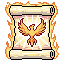 | **Veilcaster's Codex** | A aged parchment scroll encased in an ornate golden frame. The scroll features warm tan coloring with intricate orange-gold filigree borders. A central circular seal with mystical markings dominates the visible text area, surrounded by delicate arcane symbols and warding runes. | *An ancient tome whose pages whisper of forbidden thresholds between worlds. Those who study its faded passages find their will bending toward powers meant only for the dead.* | Mage |
| 40 |  | **Void-Sealed Codex** | A dark purple scroll with ornate silver bindings and celestial symbols glowing faintly across its surface. The parchment appears ancient and wrinkled, sealed with arcane runes at the corners. Wisps of shadowy energy emanate from its edges. | *An forbidden grimoire bound in the hushed moments between stars. Those who unfurl its pages taste the weight of forgotten magics-knowledge that was never meant to be remembered, only feared.* | Mage |
| 41 |  | **Scepter of Dominion** | A parchment scroll mounted on a stone tablet within an ornate square frame. The scroll features a regal crown symbol in dark purple and gold, set against aged parchment. The frame is crafted from weathered gray stone with decorative borders. | *A decree written in the blood of forgotten kings, bound within stone that remembers only conquest and ruin. Those who read its verses find their will hardening into something neither flesh nor spirit.* | Mage |
| 42 |  | **Cursed Crimson Covenant Scroll** | A weathered parchment scroll bound in deep crimson leather, adorned with a skeletal motif in the center. Gold filigree frames the edges, and dark burgundy stains suggest ancient blood rituals or long-faded incantations. | *A forbidden manuscript whispered between practitioners of the darker arts. Those who dare to unroll its contents invite the gaze of entities best left unnamed.* | Mage |
| 43 |  | **Codex of Fractured Minds** | A weathered scroll with golden binding and ornate clasp, unfurled to reveal yellowed parchment inscribed with arcane symbols. The edges are singed and frayed, with faint violet wisps emanating from the written runes. | *A grimoire whose pages whisper secrets stolen from the void itself. Those who dare unroll its contents risk losing themselves to the knowing that dwells within.* | Mage |
| 44 |  | **Scrolls of the Violet Covenant** | A weathered scroll with deep purple parchment, framed by ornate dark metal corners. Arcane symbols glow faintly in violet hues across its surface. The scroll bears intricate runic patterns and appears slightly worn, as if wielded by countless practitioners of forbidden arts. | *A tome bound by pacts older than kingdoms, its pages whisper secrets that mortal minds were never meant to comprehend. To unroll it is to invite the attention of forces that dwell beyond the veil.* | Mage |
| 45 |  | **Shattered Veilbound Grimoire** | A weathered leather-bound scroll with ornate wooden frame corners. Rich brown parchment edges protrude from gilded wooden borders. Central seal features intricate dark symbols on aged vellum, surrounded by decorative brass fittings and worn leather bindings. | *An ancient codex whose pages whisper secrets better left forgotten. Those who dare unroll its contents find their minds brushed by something vast and terrible, dwelling just beyond the veil of sanity.* | Mage |
| 46 |  | **Azurite Codex of Tides** | A tall, ornate scroll holder rendered in deep blue and teal tones. The container features intricate wave-like patterns and crystalline details across its surface. A glowing blue essence emanates from within, suggesting arcane power contained within parchment or runes. | *An ancient repository of drowning whispers and forgotten incantations. Those who unroll its contents taste salt and starlight before the visions consume them entirely.* | Mage |
| 47 | 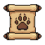 | **Paw of the Covenant** | A weathered tan parchment scroll bound with dark leather straps. A prominent paw print symbol is emblazoned across its face in deep brown ink, suggesting ancient beast-craft or primal magic sealed within aged vellum. | *A scroll bearing the mark of forgotten pacts between mage and beast. Those who unroll it risk binding themselves to powers that predate civilization, exchanging sanity for dominion over the primal forces that lurk beyond the veil.* | Mage |
| 48 | 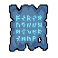 | **Hollow Veilthread Codex** | A weathered scroll with deep indigo parchment bordered by ornate silver filigree. Arcane symbols shimmer across its surface in pale blue, with wisps of ethereal energy coiling around the rolled edges. The corners are marked with tarnished silver clasps. | *A manuscript bound by forces older than kingdoms, its pages whisper secrets that mortal minds were never meant to comprehend. Those who dare read its contents find themselves forever changed-or unmade.* | Mage |
| 49 |  | **Codex of Waning Truths** | An aged parchment scroll with a golden binding and ornate seal. The paper displays a faint triangular sigil-an all-seeing eye surrounded by arcane runes. Worn edges and subtle staining suggest centuries of forbidden knowledge contained within. | *A grimoire whose pages whisper secrets that unmake reality. Those who read too deeply find their certainties crumble into void, leaving only hunger for answers that no longer exist.* | Mage |
| 50 |  | **Serpent's Covenant Scroll** | A weathered parchment scroll bound with teal silk cords, housed in a stone-blue frame with ornate corner brackets. A coiled serpent symbol is embossed in the center, rendered in lighter blue with intricate linework suggesting ancient arcane knowledge. | *A forbidden pact written in serpent's tongue, its words coil and twist before the reader's eyes. Those who dare interpret its secrets glimpse the primal forces that slither beneath the world.* | Mage |
| 51 | 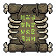 | **Verdant Grimoire** | An ornate scroll with a moss-green center panel bordered by weathered bronze corners. Intricate vine-like patterns frame a central glowing symbol. The edges show decay and age, with copper clasps holding the parchment together. | *An ancient codex that whispers secrets of corrupted nature. Those who read its passages find their minds entangled with something far older than themselves.* | Mage |
| 52 | 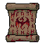 | **Voidborn Crimson Covenant Scroll** | A weathered parchment scroll bound in aged leather, stained deep crimson with ritualistic markings. Ornate bronze clasps frame the edges, and the exposed vellum reveals intricate arcane symbols rendered in dark red ink. | *A forbidden grimoire fragment whispers of pacts sealed in blood and power wrested from the void. Those who dare to read its incantations risk unraveling the threads that bind sanity to flesh.* | Mage |
| 53 |  | **Verdant Covenant Scroll** | A aged parchment scroll bound in weathered tan leather with copper fittings. A glowing green plant motif is embossed on the visible section, with hints of arcane symbols glimmering along the edges. The scroll appears ancient yet thrumming with vitality. | *A forbidden grimoire whose pages whisper of life and corruption intertwined. Those who read its verdant verses find their flesh rewoven by powers older than kingdoms.* | Mage |
| 54 | 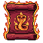 | **Ember Crimson Covenant Scroll** | A tattered parchment scroll with deep crimson borders and golden ornamental framing. The center displays an intricate symbol in burning red and gold, suggesting arcane power. Worn edges and aged texture hint at ancient origins and forbidden knowledge. | *A scroll bound by blood and shadow, its incantations whisper of pacts made in desperation. Those who read from its pages find their will bending to forces older than kingdoms.* | Mage |
| 55 |  | **Tidecaller's Covenant** | An ornate teal-blue scroll bound in aged leather with mystical runes glowing along its edges. Intricate wave patterns and arcane symbols are embossed across the parchment surface, with a prominent circular seal or sigil in the center suggesting ancient power. | *A scroll inscribed with pacts made to entities of the deep. Those who commune with its secrets find their magic tainted by something vast and hungry beneath the waves.* | Mage |
| 56 |  | **Azurite Codex of Ruin** | A weathered scroll with deep blue parchment adorned with intricate silver filigree. The edges are bound in tarnished metal bands, with a central circular seal glowing faintly. Arcane symbols cascade across the surface, emanating an ethereal azure luminescence. | *A forbidden scripture inscribed in the language of the void itself. Those who dare decipher its contents risk unraveling the very fabric of their sanity, yet none can resist its whispered promises of forbidden power.* | Mage |
| 57 |  | **Ancient Veilscript Codex** | An ornate scroll mounted in a wooden frame with bronze corner brackets. The parchment glows with ethereal blue light, adorned with arcane symbols and runes. Dark leather bindings wrap around the edges, frayed at the corners suggesting great age. | *A forbidden grimoire whose pages whisper secrets older than kingdoms. Those who read its contents find their minds touched by forces beyond mortality-power always demands its price.* | Mage |
| 58 | 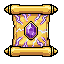 | **Amethyst Covenant Scroll** | A weathered parchment scroll bound with frayed golden cord, featuring a glowing amethyst sigil at its center. The scroll displays arcane runes in violet ink, with wisps of ethereal light emanating from the sealed edges. | *An ancient grimoire fragment whispered to contain the binding words of forgotten pacts. Those who unroll its secrets risk shattering the veil between worlds-or worse, honoring debts paid in blood by the dead.* | Mage |
| 59 |  | **Forsaken Crimson Covenant Scroll** | A weathered parchment scroll with ornate copper corners and crimson bindings. The surface features a glowing heart symbol wreathed in thorns, rendered in deep red and gold pigments against aged beige vellum. | *A pact sealed in blood and sorcery, its words writhe with eldritch purpose. Those who read from its pages bind themselves to forces older than kingdoms, trading sanity for power.* | Mage |
| 60 | 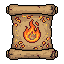 | **Emberspire Codex** | A weathered parchment scroll bound in worn leather with copper clasps. The aged paper displays a prominent flame sigil in crimson and gold, surrounded by arcane symbols. Darkened edges suggest exposure to intense heat or ancient magical rituals. | *A grimoire whose pages still smolder with the residual heat of forgotten incantations. Those who unfurl its secrets often find their flesh marked by the same flames that consumed its previous masters.* | Mage |
| 61 |  | **Veilpact Grimoire** | An ancient scroll bound in weathered parchment with ornate wooden borders. A glowing purple sigil dominates the center, surrounded by arcane symbols. The scroll is secured with faded gold clasps and emanates an otherworldly violet luminescence. | *A tome of forgotten incantations, its pages whisper secrets that mortal minds were never meant to comprehend. Those who study its contents find themselves forever changed, caught between worlds.* | Mage |
| 62 |  | **Embercrypt Codex** | A dark leather-bound scroll with a prominent orange/red circular sigil featuring geometric flame patterns. The symbol glows with an inner fire against the black fabric backing, suggesting ancient incantations bound within weathered parchment. | *An accursed tome whose pages writhe with living flame. Those who dare read its verses find their flesh singing with infernal knowledge-power granted only to those willing to burn.* | Mage |
| 63 |  | **Grimoire of Cinders** | An aged parchment scroll bound in weathered leather, sealed with a golden ornate frame. The edges are scorched amber and deep brown, with arcane symbols glowing faintly along the borders. A central emblem depicts a flame-wreathed sigil. | *A manuscript penned in the ash of forgotten rituals, its incantations whisper of power drawn from the void between worlds. Those who unfurl its pages risk burning away their very essence.* | Mage |
| 64 | 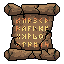 | **Codex of Withering Ruin** | An aged scroll bound in cracked leather with ornate bronze clasps. The parchment glows faintly with sickly amber sigils. Tattered edges and dark staining suggest forbidden knowledge and prolonged corruption. | *A manuscript penned in blood and shadow, its passages whisper of decay and unbinding. Those who read its verses find their will bent toward entropy itself.* | Mage |
| 65 |  | **Ossuary Grimoire** | A tattered scroll with a bone-white frame adorned with skull motifs and skeletal hands. The parchment is dark moss-green with eldritch symbols glowing faintly. Wrapped in tattered fabric with visible cracks and decay throughout. | *A manuscript bound by the twisted will of the dead, its pages whisper secrets that mortal minds were never meant to comprehend. Those who read from it feel the weight of countless souls pressing against their consciousness.* | Mage |
| 66 |  | **Frostweave Codex** | A blue-tinted scroll with intricate crystalline patterns. Bordered by an ornate frame with snowflake motifs and frost-like edges. The parchment glows faintly with an ethereal cyan luminescence. | *An ancient manuscript inscribed with the language of winter itself. Those who read its passages feel the creeping cold settle into their bones, granting mastery over the frozen arts.* | Mage |
| 67 | 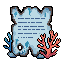 | **Crimson Codex of Withering** | A weathered scroll with pale blue-gray parchment, adorned with deep crimson coral or blood-red crystalline growths sprouting from its edges. Gold filigree accents frame the edges, with arcane symbols faintly visible on the surface. | *A forbidden manuscript that whispers of decay and unmaking. Those who unfurl its pages find their enemies withering from within, though the cost of such knowledge gnaws at the caster's own vitality.* | Mage |
| 68 |  | **Voidborn Codex of Withering Truths** | A weathered parchment scroll bound in aged tan leather with a golden seal. The visible text glows faintly with eldritch runes. A crimson wax stamp marks its spine, suggesting forbidden knowledge within. | *A grimoire whose pages whisper secrets that corrode the mind. Those who dare read its verses find their enemies' vitality unraveling like burnt parchment, though the cost to the reader's sanity is steep.* | Mage |
| 69 |  | **Veilwrought Grimoire** | A dark leather-bound scroll with gold embossed symbols and arcane runes. The parchment glows faintly with sickly green and purple hues. Golden cord binds the edges, and a jeweled clasp seals its forbidden knowledge. | *An ancient manuscript inscribed with incantations that blur the line between worlds. Those who study its pages risk losing themselves to the whispers that emanate from its yellowed parchment.* | Mage |
| 70 |  | **Whispers of the Abyss** | A weathered scroll case crafted from pale blue-grey stone or ceramic, adorned with intricate arcane symbols glowing faintly. The container features a rounded, almost organic form with pronounced caps at both ends, evoking an ancient mystical vessel. Wisps of ethereal energy swirl within the semi-translucent material. | *An accursed scroll bound in materials older than memory, its contents written in a tongue that erodes the mind of those who read too deeply. Even unopened, it hums with the weight of forgotten truths.* | Mage |
| 71 |  | **Storm Crimson Covenant Scroll** | A dark red scroll with ornate golden trim and a skull emblem at its center. The parchment appears aged and weathered, bound with crimson ribbon. Intricate arcane symbols glow faintly along its edges. | *A forbidden grimoire bound in the flesh of those who broke their oaths. Its incantations whisper promises of power, though each spell exacts a price written in blood.* | Mage |
| 72 |  | **Abyssal Codex Scroll** | An aged parchment scroll housed in a weathered stone or clay cylinder. The container features a pale, cream-colored exterior with dark shadowing around its edges. A glowing amber or golden light emanates from within, visible through the cylinder's opening, suggesting arcane knowledge contained within. | *A scroll inscribed with forbidden incantations that blur the line between revelation and madness. Those who read its contents find themselves glimpsing truths the mortal mind was never meant to comprehend.* | Mage |
| 73 |  | **Scroll of Aetheric Unfolding** | A blue-tinted parchment scroll encased in an ornate square frame with delicate corner flourishes. The scroll displays a glowing numeral '2' at its center, surrounded by arcane symbols and crystalline frost patterns. The frame features intricate metalwork with sharp, angular details. | *An ancient lexicon bound in ethereal ice, its pages whisper forbidden truths to those mad enough to listen. Each incantation drawn from its depths demands a piece of the caster's sanity as payment.* | Mage |
| 74 | 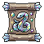 | **Veilscribe Codex** | An ornate wooden scroll case with aged parchment visible inside. The frame is bound in dark metal with intricate rune markings. A glowing blue sigil radiates from the center, casting ethereal light across the worn surface. Gold accents frame the edges. | *A forbidden manuscript whose pages shift between realms. Those who read its contents glimpse truths the mind was never meant to comprehend, each verse burning away a thread of sanity.* | Mage |
| 75 | 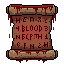 | **Forsaken Crimson Covenant Scroll** | An aged parchment scroll bound in weathered leather with crimson cloth wrappings. The surface bears faded blood-red sigils and arcane symbols, with golden embroidery adorning the edges. Dark stains suggest ancient rituals or sacrifice. | *A pact written in blood and shadow, its incantations whisper of forbidden magics. Those who unfurl this scroll risk not only their sanity, but their very soul's allegiance.* | Mage |
| 76 |  | **Voidborn Veilbound Codex** | A weathered scroll with deep blue parchment adorned with silver arcane symbols. Gold-trimmed edges frame a glowing central cross motif. The material appears aged leather, bound with mystical runes that shimmer faintly against the dark surface. | *A forbidden manuscript bound in the sinew of forgotten realms. Those who unfurl its pages glimpse the fractured geometry between worlds-a knowledge that warps the mind of all but the most disciplined sorcerers.* | Mage |
| 77 | 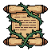 | **Grimoire of Ash Ruin** | A weathered scroll bound in tattered leather, adorned with copper clasps. The parchment bears cryptic runes in deep crimson, with charred edges suggesting exposure to arcane fire. Small bone totems dangle from frayed twine. | *An ancient manuscript inscribed with incantations of entropy and decay. Those who commune with its words taste ash upon their tongue and glimpse the hollow spaces between worlds.* | Mage |
| 78 |  | **Verdant Codex Scroll** | A golden-trimmed scroll with an emerald-green seal at its center. The parchment appears aged and mystical, bound with ornate brass fixtures. The green sigil glows faintly with arcane power, suggesting forbidden knowledge contained within. | *An ancient scroll inscribed with nature's darkest secrets. Those who read its passages find their very essence entwined with forces older than civilization itself, bending life and death to their will.* | Mage |
| 79 |  | **Storm Codex of Fractured Minds** | An ancient scroll bound in tattered azure cloth with silver-threaded edges. Crystalline shards of ice or magical energy emanate from its corners, and the parchment within glows with an ethereal blue luminescence. Ornate runes line the borders. | *A forbidden manuscript that whispers the secrets of shattered consciousness. Those who unfurl its pages risk losing themselves to the void between thoughts.* | Mage |
| 80 |  | **Stormveil Grimoire** | A tightly bound scroll with deep blue leather wrappings and silver clasp. Electric white runes crackle across its surface, illuminated against the dark parchment. A crystalline shard protrudes from its spine, humming with arcane energy. | *A scroll that thirsts for knowledge sealed away in forgotten crypts. Those who dare unfurl its pages risk their sanity, but gain command over the very storms that rage between worlds.* | Mage |
| 81 |  | **Crimson Codex of Ruin** | A burgundy-red scroll with ornate gold binding and dark crimson wax seals. The parchment edges are singed black, and arcane symbols glow faintly along its borders. A prominent blood-red emblem dominates the center. | *An ancient manuscript bound in the leather of forgotten rites. Those who dare unroll its pages risk their sanity-each incantation written within demands a price paid in shadow and suffering.* | Mage |
| 82 |  | **Veilweave Codex** | An aged parchment scroll with tan-gold coloring, bound by weathered cord. The scroll features ornate corner brackets in bronze, with shadowy magical runes visible along its edges. The material appears fragile yet impossibly ancient. | *A scholar's grimoire bound in the membrane of forgotten worlds. Those who read its contents glimpse truths that fracture the mind-knowledge was never meant to be whole.* | Mage |
| 83 |  | **Forsaken Veilbound Codex** | A weathered parchment scroll encased in a translucent blue-white crystalline frame. Golden cord binds the aged paper, which glows faintly with arcane sigils. The frame shows frost-like geometric patterns etched along its borders. | *A grimoire sealed within eternal ice, its pages whisper secrets that mortal minds struggle to comprehend. Those who dare read its contents find their consciousness fractured across planes of existence.* | Mage |
| 84 |  | **Veilrift Codex** | An ornate scroll with a dark teal and gold embossed binding. The parchment unfurls to reveal intricate arcane symbols glowing faintly purple. Silver filigree adorns the edges, and a crystalline seal dangles from a midnight-blue cord. | *A forbidden tome whispers secrets between worlds. Those who read its passages risk unraveling the threads that bind reality itself.* | Mage |
| 85 |  | **Scrollbound Anathema** | A square parchment scroll with ornate blue and gold borders. Central arcane circle glows with ethereal light, surrounded by intricate runes and geometric patterns. The edges are weathered, with faint wisps of magical energy coiling around the corners. | *A forbidden grimoire bound within silk and starlight. Those who dare decipher its twisted verses find their will unraveling, one incantation at a time.* | Mage |
| 86 |  | **Embercursed Grimoire** | An ancient leather-bound scroll with ornate golden clasps and crimson seals. The parchment glows with smoldering amber runes and arcane symbols. Dark brown leather binding adorned with metallic filigree and mystical embroidered patterns. | *A forbidden manuscript whose pages whisper with the anguish of a thousand cursed souls. To unfurl its secrets is to invite calamity upon the world.* | Mage |
| 87 |  | **Chronofracture Codex** | A weathered scroll housed in a wooden case with brass corners. The parchment glows with faint amber light, edges curled and darkened with age. Golden hourglass symbol visible on the seal. | *A forbidden manuscript that bends the threads of time itself. Those who decipher its runes risk unraveling their own fate.* | Mage |
| 88 |  | **Veilthrone Grimoire** | A purple-bound scroll or tome with ornate dark trimmings and arcane symbols. The central emblem features a crowned skull or void sigil wreathed in shadowy runes. Rich indigo fabric with blackened metal accents suggest forbidden knowledge. | *A manuscript penned in the courts of forgotten lords, its pages whisper secrets that mortal minds were never meant to harbor. Each incantation etched within draws closer the veil between worlds.* | Mage |
| 89 |  | **Codex of the Void Bound** | A weathered scroll with deep indigo and gold accents, bound with ornate clasps. Arcane symbols glow faintly along its edges, with a central emblem of interlocking runes. The parchment appears ancient and slightly translucent, emanating subtle otherworldly light. | *A grimoire penned by sorcerers long consumed by their own summoning. Those who read its passages taste eternity-and find themselves forever changed, marked by forces that hunger from beyond the veil.* | Mage |
| 90 |  | **Arcaneblight Codex** | A weathered blue scroll case with ornate silver clasps and glowing arcane runes etched across its surface. The parchment within emits a faint crystalline light. Intricate geometric patterns frame the edges in darker blue. | *A grimoire bound in the hide of forgotten things, its pages inscribed with incantations that warp the very fabric of reality. To unfurl it is to invite calamity upon your enemies-or yourself.* | Mage |
| 91 |  | **Forsaken Veilbound Codex** | A weathered scroll with tattered purple and black fabric edges, adorned with ornate crimson runic seals and arcane symbols. The parchment appears ancient and slightly luminous, bound with frayed cord and emanating a faint ethereal glow. | *An accursed tome whose pages whisper secrets meant for the dead. Those who read its contents find their will slowly consumed by forces that dwell beyond the veil.* | Mage |
| 92 |  | **Codex of Smoldering Ruin** | A weathered scroll with charred edges and deep orange-red flames depicted across its surface. The parchment appears ancient and scorched, with intricate dark symbols and arcane markings visible beneath layers of ash and ember patterns. | *A forbidden grimoire whose pages burn with the memory of civilizations reduced to cinder. Those who commune with its secrets glimpse the world not as it is, but as ash.* | Mage |
| 93 |  | **Shattered Codex of Withering Truths** | A golden-bordered scroll with aged parchment, featuring an ornate seal and arcane symbols. The scroll radiates a faint amber glow, with weathered edges suggesting ancient origins and dark knowledge. | *Those who read its passages glimpse the inevitable decay of all things. The knowledge within demands a price-sanity for power, mortality for transcendence.* | Mage |
| 94 |  | **Ember Veilbound Grimoire** | A square scroll with a deep purple border and ornate frame. The center displays a glowing violet sigil or rune within a darker square. The corners feature decorative corner pieces, and the overall design suggests an ancient, magical tome compressed into scroll form. | *A forbidden manuscript bound in the flesh of forgotten gods. Those who dare unfurl its pages hear whispers of realms unmade, each word a key to unraveling the fabric between worlds.* | Mage |
| 95 |  | **Storm Veilscript Codex** | A weathered scroll with pale blue parchment, bound by ornate silver clasps. Arcane symbols glow faintly across its surface in ethereal light. Decorative corner flourishes and a prominent seal suggest forbidden knowledge. | *A tome of fractured incantations, its pages whisper with the voices of mages long consumed by their own ambitions. To read it is to court the abyss.* | Mage |
| 96 | 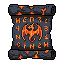 | **Emberwraith Codex** | A weathered scroll with ornate crimson and gold filigree borders. Dark parchment is bound with charred leather straps. Orange arcane runes glow faintly across its surface, and wisps of ethereal flame seem to dance around its edges without consuming it. | *A forbidden grimoire whose pages whisper secrets of fire and ruin. Those who dare decipher its burning script find their will consumed by the very flames they command.* | Mage |
| 97 |  | **Veilmoon Grimoire** | A purple-toned scroll with a crescent moon symbol glowing softly at its center. The parchment appears weathered and arcane, bordered by darker purple sigils and celestial motifs. A faint ethereal aura emanates from the scroll's surface. | *A forbidden codex inscribed with the whispers of the void itself. Those who unfurl its pages find their connection to the twilight deepened, though at the cost of truths their minds were never meant to know.* | Mage |
| 98 |  | **Cobalt Covenant Scroll** | An aged parchment scroll sealed with glowing azure bands. The scroll features intricate arcane runes embossed in silver along its edges, with a deep blue gemstone affixed to its center. Gold leaf trim borders the rolled manuscript, suggesting ancient magical knowledge. | *A scroll inscribed with pacts older than empires, its blue light thrumming with power drawn from the void itself. Those who read its contents risk shattering the fragile barriers between worlds.* | Mage |
| 99 |  | **Verdant Codex of Thorns** | An aged scroll housed in a weathered wooden case with bronze fittings. The parchment within glows with sickly green luminescence, featuring twisted botanical illustrations and eldritch runes. Thorny vines coil around the edges of the frame. | *A grimoire bound in the flesh of forgotten groves, its pages whisper secrets of nature's cruelest magics. Those who study its verdant wisdom find their will entwined with the wild, bending the very growth of life itself to ruin.* | Mage |
| 100 |  | **Voidborn Abyssal Codex Scroll** | A weathered scroll housed in a ornate frame of tarnished silver and dark blue stone. Crackling cerulean energy radiates from within, with arcane runes etched along the borders. The parchment glows with an otherworldly luminescence. | *A forbidden grimoire bound in the pages of forgotten incantations. Those who dare read its contents glimpse the void between worlds-a price paid in sanity, not gold.* | Mage |
| 101 |  | **Void Compendium** | A tightly rolled scroll of deep purple parchment with obsidian-dark binding. Eldritch runes glow faintly along its edges, and wisps of ethereal energy coil around the rolled form, suggesting arcane power contained within. | *A grimoire bound in shadow itself, its pages whisper of forbidden truths that unravel the mind. Those who dare commune with its knowledge glimpse the spaces between worlds-and something glimpses back.* | Mage |
| 102 |  | **Crimson Codex of Unmaking** | A weathered scroll with deep burgundy and black coloring, adorned with intricate eldritch symbols and arcane runes. The edges are singed and tattered, with tendrils of shadow seeming to writhe across its surface. A blood-red seal marks its center. | *A forbidden manuscript bound in the flesh of forgotten sorcerers. Those who dare read its passages risk unraveling the very threads that hold reality together-and themselves along with it.* | Mage |
| 103 |  | **Storm Scroll of Withering Truths** | A weathered parchment scroll bound with frayed leather straps and tarnished metal clasps. The surface bears faded runes and arcane symbols in deep crimson ink, with edges singed brown as if exposed to profane flame. Wax seals mark its corners. | *Knowledge inscribed in blood and sorrow. Those who read its verses glimpse the decay that underlies all creation, a burden few minds survive intact.* | Mage |
| 104 |  | **Embercrest Codex** | A weathered scroll with a striking tiger emblem rendered in orange and gold leaf. The parchment edges are charred black, with crimson seals visible along the binding. Ornate corner flourishes frame the fierce beast illustration. | *An ancient tome bound in the hide of beasts long extinct. Its pages whisper of flame and fury-knowledge meant only for those willing to burn.* | Mage |
| 105 |  | **Void Covenant Scroll** | A dark purple and black scroll with ornate crimson accents. The parchment bears eldritch runes that seem to shift in candlelight. Sealed with wax embossed with a void-like symbol, wisps of shadow curl around its edges. | *A forbidden manuscript penned in blood and starlight, its secrets capable of unmaking the very fabric of reality. Those who read its contents find their minds touched by forces beyond mortal comprehension.* | Mage |
| 106 | 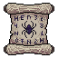 | **Grimoire of Sundered Seals** | An aged parchment scroll with ornate wooden rollers, bound in tattered cloth. The surface displays cryptic runes and sigils in deep purple and gold, with a cracked circular seal motif at its center. Wisps of ethereal energy seem to emanate from the edges. | *An arcane codex penned in languages long forgotten, containing incantations that fracture the veil between worlds. Those who recite its verses risk unraveling the very fabric binding their soul to flesh.* | Mage |
| 107 |  | **Verdant Curse Scroll** | An aged parchment scroll with emerald and dark teal hues, bound with twisted vines. A glowing skull emblem marks its center, surrounded by spreading corruption. The edges curl inward as if consumed by some creeping blight. | *A forbidden grimoire penned in the language of rotting things. Those who unfurl its pages find their will entwined with ancient toxins-a pact sealed in chlorophyll and shadow.* | Mage |
| 108 |  | **Verdant Entropy Scroll** | An ancient parchment scroll rendered in sickly greens and yellows, wrapped with thorny vines. Corrupted flora symbols spiral across its surface, with dark wisps coiling around the edges. The material appears organic and decaying. | *A forbidden grimoire whose pages whisper with the voice of dying things. Those who read its verdant verses invite the slow corruption of nature itself into their bones.* | Mage |
| 109 |  | **Shattered Veilrift Codex** | An ancient scroll housed in a weathered blue-grey stone frame adorned with arcane runes. The parchment glows with ethereal turquoise light, swirling with eldritch symbols. Dark metal clasps and ornamental corners frame the mystical text within. | *A fragment of forbidden knowledge, its pages whisper secrets that bend the veil between worlds. Those who dare read its contents risk shattering their grip on reality itself.* | Mage |
| 110 |  | **Crimson Binding Scroll** | A tattered parchment scroll bound in deep crimson cloth with ornate gold embroidery. Dark runic symbols glow faintly across its surface, arranged in concentric geometric patterns. The edges are singed and weathered, suggesting ancient rituals or forbidden knowledge. | *A scroll inscribed with pacts older than kingdoms, its binding woven from threads dyed in the blood of forgotten casters. Those who unfurl its secrets risk unraveling their very essence.* | Mage |
| 111 |  | **Storm Crimson Pact Scroll** | A weathered scroll with a deep crimson frame adorned with gold filigree. The parchment glows faintly with amber light, bearing a skull sigil wreathed in thorns. Dark stains mark its edges, suggesting ancient rituals or forbidden knowledge. | *A covenant written in blood and shadow. Those who unfurl its secrets find power coursing through their veins-at a price whispered only in nightmares.* | Mage |
| 112 |  | **Scorchveil Codex** | A weathered scroll with burnt orange and deep brown parchment, bound with blackened metal clasps. Ornate runes glow faintly along its edges in crimson. The seal bears a stylized flame motif, with wisps of ethereal smoke coiling around the aged edges. | *A forbidden grimoire whose pages hold the secrets of immolation and ruin. Those who dare read its contents risk their very soul to the consuming flames that dance between its lines.* | Mage |
| 113 |  | **Ancient Umbral Codex** | A dark purple scroll with ornate corners, bound by shadowy sigils. The parchment glows faintly with violet runes, wisps of ethereal smoke curling from its edges. Intricate arcane symbols frame the surface. | *An ancient grimoire whose pages whisper secrets older than kingdoms. Those who dare read its contents find their will unmade, their fate rewritten by forces beyond mortal comprehension.* | Mage |
| 114 |  | **Frostbind Codex** | An icy blue scroll with crystalline frost formations coating its edges. The parchment glows with pale azure runes, and delicate icicles dangle from the rolled edges. Wisps of cold mist emanate from the surface. | *A scroll inscribed with the secrets of primordial winter. Those who unfurl its frozen pages risk their very essence being locked away in eternal ice.* | Mage |
| 115 |  | **Forsaken Veilwhisper Codex** | A weathered scroll with deep blue-tinted parchment, bound by ornate silver clasps. Intricate arcane symbols glow faintly along its edges, with darker runes marking its center. The surface shows signs of ancient handling and mystical wear. | *Words inscribed upon this cursed parchment twist the mind of those who dare decipher them. It is said the scroll contains fragments of a forgotten language-one that reality itself fears to acknowledge.* | Mage |
| 116 |  | **Voidborn Frostbind Codex** | A rolled parchment scroll bound with crystalline ice-blue bands. The paper appears frost-touched and brittle, with glowing runes visible along its edges. Icy formations cling to the outer wrapping, suggesting ancient preservation or cursed enchantment. | *A manuscript of forgotten incantations, its pages locked in eternal winter. Those who unroll its secrets risk the numbing cold of the void itself seeping into their mind.* | Mage |
| 117 |  | **Shadowveil Grimoire** | A weathered scroll with deep indigo parchment, adorned with ornate silver clasps and arcane symbols glowing faintly green. The edges are worn and frayed, bound with tattered dark ribbons. Crown-like emblem visible at the top. | *An ancient tome of forbidden knowledge, its pages whisper secrets that bend reality itself. Those who read its contents find their very essence unraveling, thread by thread.* | Mage |
| 118 |  | **Ember Veilrift Codex** | An ornate scroll housed in a decorative frame of dark purple and gold. The parchment glows with ethereal blue runes and fractured geometric patterns. Sealed with obsidian clasps and adorned with shadowy crystalline accents that seem to shift in peripheral vision. | *A forbidden manuscript that whispers secrets of the spaces between worlds. Those who dare study its passages find their grasp on reality delightfully... uncertain.* | Mage |
| 119 | 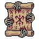 | **Cryptbound Grimoire** | An aged parchment scroll bound in weathered leather with copper clasps. The surface displays arcane symbols in faded crimson ink, with ornate corner braces. Torn edges and dark staining suggest forbidden knowledge and ancient rituals. | *A manuscript scrawled by those who glimpsed beyond the veil and paid the price. To unfurl its pages is to invite whispers that linger long after the words fade from memory.* | Mage |
| 120 | 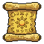 | **Goldleaf Incantation** | A tightly rolled parchment scroll with ornate golden edges and embossed leaf motifs. The paper appears aged and weathered, with a warm ochre tone. Secured with a decorative golden cord, the scroll radiates an arcane luminescence. | *A scroll inscribed with forgotten words that shimmer like burnished gold. Those who dare recite its verses find their magic intertwined with nature's most primal forces, though the cost is often paid in ash and silence.* | Mage |
| 121 |  | **Void Whisper Codex** | A tattered scroll with deep purple and indigo hues, adorned with arcane silver sigils that seem to shimmer with an otherworldly glow. Wisps of shadowy energy curl around its edges, and the parchment appears aged and weathered, bound with dark cloth. | *A grimoire that channels the whispers of the void itself, granting its reader glimpses of forbidden knowledge. Those who study its pages risk losing themselves to the abyss that speaks back.* | Mage |
| 122 | 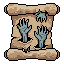 | **Cursed Veilscript Codex** | A weathered parchment scroll with deep indigo and gold accents. Ornate binding frames arcane symbols that glow faintly. The edges are singed and crumbling, suggesting exposure to eldritch forces. A dark seal marks its center. | *A forbidden grimoire whose secrets warp the mind of those who dare comprehend them. The words shift when unobserved, revealing truths that shatter certainty itself.* | Mage |
| 123 |  | **Forsaken Embercall Grimoire** | A weathered scroll with burnt orange and deep crimson hues, bordered by ornate gold filigree. Arcane symbols glow faintly along its edges. The parchment appears scorched, with wisps of ethereal flame dancing around the rolled edges. | *A forbidden manuscript that whispers incantations of consuming fire. Those who dare unroll its pages find their will ensnared by ancient pacts, binding them to forces that devour all they hold dear.* | Mage |
| 124 |  | **Voidborn Veilbound Grimoire** | A tattered scroll with dark blue-grey parchment adorned with golden arcane symbols. The edges are singed and worn, with wisps of ethereal energy coiling around the rolled document. Ancient runes glow faintly along the binding. | *A forbidden manuscript bound by pacts older than kingdoms. Those who read from its pages glimpse truths the mind was never meant to comprehend, each word a thread pulling reality toward oblivion.* | Mage |
| 125 |  | **Emberveil Codex** | A weathered scroll unfurled within a ornate wooden frame. The parchment glows with amber and crimson hues, adorned with intricate golden runes and symbols. Worn leather bindings frame the edges, with smoldering embers faintly visible within the margins. | *An ancient grimoire bound in the skin of forgotten things. Those who decipher its burning runes gain power to unmake reality itself, though the knowledge exacts a terrible price in sanity and flesh.* | Mage |
| 126 |  | **Ember Veilbound Grimoire** | A rectangular scroll with a deep purple border and ornate frame. The center features a glowing blue sigil or rune on a darker background, suggesting arcane power. The frame appears weathered stone or metal with intricate detailing at the corners. | *A scroll bound by forces beyond mortal comprehension, its pages whisper secrets that corrode the mind. Those who dare decipher its contents walk the razor's edge between enlightenment and oblivion.* | Mage |
| 127 |  | **Grimveil Codex** | An aged scroll with deep purple fabric wrapping, adorned with tarnished bronze clasps and ornate corners. The parchment visible at edges appears stained with ash or dried blood. A faint, eldritch symbol glows softly from the center of the rolled manuscript. | *Bound within this accursed scroll are incantations that blur the line between knowledge and corruption. Those who dare unravel its secrets find their will slowly consumed by whispers of forgotten gods.* | Mage |
| 128 |  | **Verdant Grimoire of Blight** | An aged scroll bound in tattered emerald cloth with bronze clasps. The parchment within glows with sickly green runes and arcane symbols. Wisps of dark vapor curl from its edges, and the corners bear marks of decay and shadow. | *A chronicle of withering curses and profane knowledge, penned by sorcerers who sought dominion over life itself. Those who dare commune with its pages find their magic twisted into instruments of ruin.* | Mage |
| 129 |  | **Ancient Crimson Covenant Scroll** | A blood-red cloth scroll with dark burgundy accents and black binding. The parchment shows intricate crimson patterns and arcane symbols embossed across its surface. Gold-threaded edges frame the rolled manuscript, suggesting forbidden knowledge within. | *A scroll penned in the blood of ancient pacts, its words writhe with power that demands a price. Those who read its contents find their magic deepened, but never without consequence.* | Mage |
| 130 | 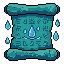 | **Teal Covenant Scroll** | A weathered scroll bound in teal cloth with ornate clasps. The parchment within glows faintly with arcane symbols. Wrapped in corrupted vines or ethereal tendrils, it emanates an otherworldly aura despite its age. | *An ancient manuscript inscribed with pacts older than kingdoms. Those who dare read its whispered words find their essence forever altered-power gained at a price written in forgotten blood.* | Mage |
| 131 |  | **Forsaken Verdant Codex of Thorns** | A weathered scroll with deep emerald binding and brass corner clasps. The parchment surface shows intricate vine motifs and skeletal thorns winding around arcane runes. A faint bioluminescent glow emanates from the edges, suggesting forbidden nature magic. | *A grimoire that whispers of the pact between flesh and root. Those who read its passages feel the slow creep of nature's reclamation, as if the earth itself hungers to reclaim what was taken.* | Mage |
| 132 |  | **Violet Runewhisper Scroll** | A weathered parchment scroll bound with dark iron clasps, emanating swirling violet energy. The scroll features ornate purple runes arranged in an otherworldly pattern, surrounded by a square stone frame. Wisps of magical aura dance around its edges, suggesting latent arcane power. | *A scroll inscribed with forbidden incantations that bend reality's fabric. Those who dare decipher its violet verses risk unraveling the very threads that bind sanity to flesh.* | Mage |
| 133 |  | **Shattered Grimoire of Cinders** | A weathered scroll with a dark blue-grey parchment base, adorned with an ornate golden seal bearing a skeletal emblem. Wispy flame motifs curl around the edges, rendered in amber and crimson tones against the shadowed background. | *Once clutched by a sorcerer consumed by their own incantations, this scroll smolders with residual malice. Those who study its faded runes inherit both knowledge and the creeping dread of what was sacrificed to inscribe them.* | Mage |
| 134 |  | **Ember Frostbind Codex** | A weathered scroll encased in an ornate blue-tinted frame with crystalline borders. Frost patterns spiral across the parchment edges, and the backing appears carved from pale bone or ice-touched stone. A central seal glows with arcane runes. | *An ancient grimoire bound by winter's own curse, its pages whisper secrets that freeze the blood. To unfurl it is to invite the eternal cold into one's very soul.* | Mage |
| 135 |  | **Storm Verdant Covenant Scroll** | An aged parchment scroll bound with weathered green cloth and bronze clasps. The scroll features an ornate emerald symbol at its center-a glowing arcane sigil surrounded by intricate vine-like patterns. Faded gilt edges and mystical runes frame the edges. | *A scroll containing forgotten pacts with the old world. Those who read its words find their will bent toward nature's cruel design, commanding the very essence of growth and decay as instruments of power.* | Mage |
| 136 |  | **Hollow Verdant Grimoire** | An aged scroll with a dark green canvas border featuring an ornate crimson serpent symbol coiled around itself. The scroll is bound with black cord and adorned with mystical rune markings. The central emblem glows faintly with eldritch power, suggesting forbidden knowledge. | *A cursed manuscript recovered from the depths of the Withered Gardens. Those who study its serpentine verses claim to hear whispers of nature corrupted, of life twisted into instruments of devastation. Few mages survive its tutelage unchanged.* | Mage |
| 137 |  | **Verdant Decay Scroll** | A weathered parchment scroll bound in tattered emerald cloth, adorned with gilded brass fittings. The visible text glows with sickly green runes that seem to writhe across the aged vellum. Wisps of corrupted nature emanate from its edges. | *A forbidden grimoire of twisted nature magic, its incantations promising power drawn from the rot of all living things. Those who read from its pages find their words carry the weight of entropy itself.* | Mage |
| 138 |  | **Crimson Doctrine Scroll** | A blood-red parchment scroll bound with dark iron clasps and tattered crimson fabric. The aged paper bears intricate arcane symbols in black ink, with ornate decorative borders featuring thorned motifs. Small wisps of crimson energy seem to emanate from its edges. | *A forbidden grimoire bound in the flesh of forgotten mages. Its incantations whisper promises of power drawn from suffering, each word a pact sealed in blood and shadow.* | Mage |
| 139 |  | **Soulbound Codex** | An aged scroll encased in a weathered wooden frame with ornate corner bindings. The parchment within displays a deep brownish-tan hue with visible wear and aging. Ethereal wisps or arcane symbols shimmer faintly across its surface, suggesting latent magical power. | *A forbidden manuscript bound by oath and blood-those who commune with its passages hear whispers of the departed. Few mages survive its teachings with sanity intact.* | Mage |
| 140 | 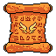 | **Smoldering Grimoire** | A weathered orange-brown scroll with ornate golden corner brackets. The parchment bears intricate crimson runes and glowing amber symbols that seem to pulse with inner heat. Wisps of ash cling to its edges. | *A manuscript bound in flesh and flame, its pages whisper secrets that burn the mind. Those who read its contents are forever marked by the infernal knowledge within.* | Mage |
| 141 |  | **Shattered Verdant Covenant Scroll** | A weathered parchment scroll bound with frayed olive and gold cords. The surface displays an intricate green arcane sigil within a bordered frame, rendered in luminous emerald tones against aged vellum. Gold leaf accents frame the borders. | *A pact written in the language of forgotten groves. Those who unfurl its secrets find themselves bound to powers that demand a price-renewal through sacrifice, growth through ruin.* | Mage |
| 142 |  | **Crimson Oath Scroll** | A weathered parchment scroll bound with dark crimson cloth. The surface bears ornate blood-red seals and arcane sigils rendered in deep maroon ink. Worn edges suggest age and repeated use by practitioners of forbidden arts. | *A covenant written in the blood of ancients, promising power at a terrible cost. Those who read its contents feel the weight of curses accumulated across generations.* | Mage |
| 143 |  | **Storm Crimson Covenant Scroll** | A tightly rolled parchment with deep crimson binding and gold leaf accents. The scroll features ornate red wax seals at both ends and displays intricate dark runes along its surface, suggesting forbidden knowledge contained within. | *A pact written in blood and shadow, its verses whisper of power drawn from realms beyond mortal comprehension. Those who dare unroll its secrets find themselves forever changed, marked by the knowledge they have gained.* | Mage |
| 144 | 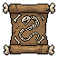 | **Codex of Withering Runes** | A weathered parchment scroll bound in dark leather with ornate bronze corner clasps. The surface is stained with crimson markings and arcane symbols that seem to shimmer with an otherworldly glow. Tattered edges and a heavy, foreboding aura surround the aged manuscript. | *An ancient grimoire whose verses speak only of decay and the unmaking of flesh. Those who dare decipher its corrupted script find their minds unraveling alongside the very fabric of their enemies' forms.* | Mage |
| 145 |  | **Veilweaver's Codex** | A dark indigo scroll with arcane runes glowing along its edges. Silver constellation patterns and celestial symbols cover the parchment surface, with wisps of ethereal energy coiling around the rolled edges. The corners are adorned with small obsidian clasps. | *A forbidden grimoire whose pages blur the line between worlds. Those who decipher its star-marked verses find themselves speaking in tongues that unmake reality itself.* | Mage |
| 146 |  | **Verdant Blight Grimoire** | A dark-bound scroll with sickly green phosphorescent text glowing along its edges. The parchment appears corrupted, with writhing vine-like patterns and pustulent symbols. Black iron clasps with oxidized copper trim hold it sealed. | *An accursed manuscript born from plague gardens, its incantations whisper of withering flesh and poisoned growth. Those who dare unroll it find knowledge, but at the cost of their vitality.* | Mage |
| 147 |  | **Umbral Codex Scroll** | A tattered purple scroll bound with dark green cord, adorned with an ornate seal or sigil. The parchment appears aged and weathered, with arcane markings visible across its surface. A faint ethereal glow emanates from within the rolled manuscript. | *The whispers contained within this scroll speak of forgotten magics that predate civilization itself. Those who dare to unroll its pages risk shattering the fragile boundary between worlds.* | Mage |
| 148 |  | **Violet Covenant Scroll** | A tattered parchment scroll with deep purple and indigo coloring, adorned with ornate gold trim and arcane symbols. The edges are darkened as if singed by eldritch fire, with wisps of ethereal energy swirling around its borders. | *This forbidden scripture whispers of pacts made in shadow, binding the caster to forces that hunger beyond the veil. To read its words is to invite their attention.* | Mage |
| 149 |  | **Crimson Codex of Binding** | A weathered scroll with deep crimson and gold leaf accents. The parchment is stained with arcane symbols and occult markings. Ornate wooden rollers frame the edges, decorated with intricate bronze filigree and small obsidian studs. | *A forbidden manuscript bound in the blood of ancient pacts. Those who read its corrupted verses risk their sanity, but gain mastery over forces meant to remain sealed.* | Mage |
| 150 | 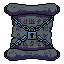 | **Grimstone Codex** | A weathered scroll with dark teal and black coloring, bound with frayed cloth strips. The parchment shows intricate arcane runes glowing faintly at its edges. The frame appears aged stone or bone, adorned with small corrupted symbols suggesting forbidden knowledge. | *An ancient tome whose very pages seem to whisper of things best left forgotten. Those who dare study its contents find their will gradually consumed by the weight of abyssal truths.* | Mage |
| 151 |  | **Storm Veilscript Codex** | A midnight-blue scroll with ornate copper corner braces. Intricate arcane symbols glow faintly along its edges, rendered in deep indigo and silver. The parchment appears aged and ethereal, bound with dark leather straps adorned with small mystical runes. | *A forbidden grimoire bound in the skin of forgotten realms. Those who read its passages hear whispers of the void itself, bending reality to their will-at a terrible cost to their sanity.* | Mage |
| 152 |  | **Hollow Umbral Codex** | A weathered leather-bound scroll with dark brown and bronze bindings. The parchment shows intricate arcane runes glowing faintly in purple and gold. Ornate metal clasps hold the edges, with a tattered rope fastener dangling from one side. | *A grimoire bound in shadow-touched leather, its pages whisper secrets that mortal minds were never meant to comprehend. Those who dare unfurl its contents find their very essence rewritten by forces older than civilization itself.* | Mage |
| 153 |  | **Grimtongue Codex** | A weathered leather-bound scroll with dark brown and tan hues. The cover features an ornate bronze clasp shaped like a crouching beast, with gold filigree details along the edges. The parchment inside appears aged and stained, bound with frayed cord. | *An ancient manuscript whispered to contain the true names of forgotten horrors. Those who read its passages risk madness, yet power flows freely to those mad enough to comprehend.* | Mage |
| 154 |  | **Cursed Veilbound Grimoire** | A weathered scroll with midnight-blue parchment sealed by spectral silver clasps. Arcane runes glow faintly along its edges, and wisps of ethereal smoke curl from its edges. The worn fabric suggests centuries of forbidden knowledge. | *A manuscript bound between dimensions, its pages whisper secrets that mortal minds were never meant to comprehend. Those who dare unfurl its contents risk unraveling the very fabric of their sanity.* | Mage |
| 155 | 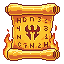 | **Scorched Grimoire of Cinders** | A weathered scroll with a burnt-orange parchment texture, bordered by ornate golden embossing. Crimson wax seals hang from frayed edges. The center displays a stylized flame symbol radiating outward, with charred corners suggesting age and exposure to intense heat. | *Once the spellbook of a sorcerer consumed by their own infernal ambitions, this scroll still smolders with the residual fury of forbidden incantations. Those who dare to unfurl it find their mind ablaze with knowledge that burns to possess.* | Mage |
| 156 |  | **Voidborn Abyssal Codex Scroll** | A weathered scroll wrapped in dark teal cloth with ornate bronze clasps. The parchment edges glow with an eerie cyan luminescence. Intricate arcane symbols and swirling patterns cover the visible surface, suggesting forbidden knowledge bound within aged vellum. | *A manuscript penned in an age when the veil between worlds grew thin. Those who decipher its whispered incantations glimpse truths that corrode the mind-yet power flows freely to those mad enough to listen.* | Mage |
| 157 |  | **Codex of Wasting** | A weathered scroll bound in dark leather with corroded bronze clasps. The parchment edges curl inward, stained with sickly brown and deep purple inks. Ornate sigils cover the surface, glowing faintly with an unsettling luminescence. | *Knowledge carved into dying flesh becomes a weapon of its own. Those who read from this cursed codex inherit not wisdom, but the slow unmaking that claimed its previous masters.* | Mage |
| 158 |  | **Ember Crimson Covenant Scroll** | A weathered parchment scroll bound with frayed crimson cloth and copper clasps. The scroll features an ornate golden seal at its center, depicting a glowing arcane symbol surrounded by intricate geometric patterns. Aged leather edges show signs of ancient use. | *A forbidden manuscript inscribed with blood-sworn incantations. Those who dare unfurl its secrets find their will bending to powers older than kingdoms, though the cost is always paid in kind.* | Mage |
| 159 | 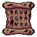 | **Storm Crimson Covenant Scroll** | A weathered parchment scroll bound in deep burgundy leather with ornate copper clasps. Intricate runes are embroidered across the surface in gold thread, with crimson wax seals adorning the edges. The aged material shows signs of ancient rituals. | *A scroll inscribed with pacts written in blood and shadow. Those who study its forbidden verses gain command over forces that should remain sleeping, though the cost of such knowledge gnaws eternally at the soul.* | Mage |
| 160 |  | **Cerulean Codex Scroll** | A rolled parchment with a glowing blue seal, bound by ethereal ice-blue ribbons. The scroll's edges shimmer with arcane frost, and intricate runes spiral across its surface, emanating pale luminescence. | *A scroll inscribed with the frozen words of the old mages, its pages whisper secrets of the void. To unroll it is to invite the cold kiss of forgotten spells.* | Mage |
| 161 |  | **Vortex Codex** | An ancient scroll rendered in deep purples and blacks, its surface dominated by a mesmerizing spiral vortex pattern. The swirling void at its center radiates arcane energy, with wisps of ethereal smoke curling around the aged parchment edges. | *A forbidden grimoire whispers of the void between worlds. Those who unroll its pages risk losing themselves to the endless spiral within.* | Mage |
| 162 | 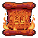 | **Crimson Theurgy Scroll** | A weathered parchment scroll with ornate crimson and gold embroidered borders. The surface displays intricate arcane symbols glowing faintly amber, bound with tattered burgundy silk ribbon. Edges are singed and darkened, suggesting exposure to intense magical fire. | *An ancient incantation bound in blood-soaked silk, its formulae whisper secrets of forbidden transmutation. Those who unfurl its pages find their will bent toward destruction, though the cost to sanity remains unspoken.* | Mage |
| 163 |  | **Embercrypt Grimoire** | A tattered scroll with burnt orange and deep crimson hues, bound in blackened leather. Arcane symbols glow faintly along its edges, with wisps of ash-like particles emanating from the parchment. Gold filigree traces ancient runes across its surface. | *A forbidden manuscript penned in the blood of forgotten sorcerers. Those who dare read its contents find their sanity unraveling with each incantation, yet power beyond mortal comprehension awaits the willing.* | Mage |
| 164 |  | **Grimtome of Withering** | A weathered scroll with deep brown parchment bound in tarnished bronze clasps. The edges curl and fray, revealing cryptic symbols etched in gold leaf. Dark stains mark the surface, suggesting age or sinister rituals. | *An ancient manuscript whose words drain the life from those who speak them. Those versed in its teachings command forces beyond mortal comprehension, though the price is always paid in shadow.* | Mage |
| 165 | 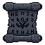 | **Shadowrift Codex** | A weathered scroll with dark parchment, bound in black leather with ornate metal clasps. Arcane runes glow faintly along its edges in sickly purple hues. The surface bears strange textile patterns woven into the material itself. | *A forbidden manuscript that whispers secrets between worlds. Those who read its passages risk fragmenting their very essence across the veil.* | Mage |
| 166 |  | **Ember Verdant Codex of Thorns** | An ancient scroll bound in weathered leather with golden clasps, adorned with glowing green arcane symbols and thorny vine motifs. The parchment within emanates a faint emerald luminescence, its edges worn and stained with age. | *A grimoire of forgotten sorcery, its pages whisper secrets of nature's darkest corruptions. Those who dare unroll its passages find themselves entangled in the very roots of the world-a pact sealed in blood and chlorophyll.* | Mage |
| 167 |  | **Storm Veilbound Grimoire** | A weathered scroll with a dark green binding and skull emblem. The parchment glows with sickly emerald runes along its edges. Wrapped in black cord with bone clasps, wisps of spectral energy coil around its surface. | *A forbidden text that whispers secrets from beyond the veil. Those who read its passages find their mind fractured, glimpsing truths no mortal should comprehend.* | Mage |
| 168 |  | **Voidmarks Grimoire** | A tattered black scroll with a stark white X symbol marking its center. The parchment appears ancient and weathered, with frayed edges and arcane markings visible along its borders. A sense of dark energy emanates from the symbol itself. | *A forbidden manuscript bearing the seal of the Void. Those who decipher its crossed runes are said to unravel the very fabric between worlds, though few minds remain whole after the reading.* | Mage |
| 169 | 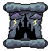 | **Grimoire of Sundered Thresholds** | A weathered scroll case with dark charcoal binding and tarnished silver clasps. The exterior bears faded runes and arcane symbols etched into aged leather. Wisps of shadow seem to curl around its edges, suggesting forbidden knowledge contained within. | *A tome bound in the leather of forgotten realms, its pages whisper of gates between worlds. To read its contents is to invite the attention of things that dwell in the spaces between light and dark.* | Mage |
| 170 |  | **Crimson Grimoire of Whispers** | A square pink-magenta scroll with ornate borders and decorative corner emblems. The parchment appears aged and heavily textured, with darker burgundy accents forming intricate patterns across its surface. Wisps of shadowy energy coil around the edges. | *An ancient manuscript bound in flesh and sorrow, its pages whisper forbidden incantations to those mad enough to listen. Those who study its contents find their mind unraveling, one arcane truth at a time.* | Mage |
| 171 |  | **Scorched Covenant Scroll** | An aged parchment scroll with ornate golden-blue frame and ornamental corners. The scroll features warm orange and amber tones with intricate mystical symbols and runic markings. A glowing blue crystalline emblem adorns the center, surrounded by decorative flourishes suggesting ancient arcane knowledge. | *A forbidden scroll inscribed with pacts older than empires. Those who read its burning words find their magic twisted-more potent, yet hungrier for a price that compounds with each casting.* | Mage |
| 172 | 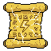 | **Grimscroll of Withering** | A weathered parchment scroll with golden-brown coloring and ornate borders. The surface is dotted with arcane symbols and aged marks. A tied ribbon binds the rolled parchment, with subtle wear suggesting ancient craftsmanship and forgotten knowledge. | *A scroll whose words decay the flesh as they're spoken. Those who dare inscribe its verses find their very essence unraveling with each incantation, drawing power from the void between life and death.* | Mage |
| 173 |  | **Shattered Veilbound Grimoire** | A weathered scroll with ornate midnight-blue bindings and silver clasps. The parchment features intricate arcane symbols in white and gold, with ethereal wisps of shadow coiling around its edges. A jeweled seal marks its center. | *An ancient scroll bound in the hide of forgotten spirits. Those who dare to read its eldritch passages feel reality's fabric grow thin, as though the words themselves are hungry for a mind to consume.* | Mage |
| 174 |  | **Ember Cryptbound Grimoire** | A weathered scroll bound in tattered brown fabric with ornate golden corner clasps. The parchment is aged and stained, adorned with arcane symbols rendered in deep crimson. A prominent seal bearing an occult sigil dominates the center. | *An accursed manuscript bound by forces older than memory itself. Those who dare decipher its profane incantations risk unraveling the very threads that hold sanity intact.* | Mage |
| 175 | 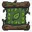 | **Storm Verdant Codex Scroll** | An aged parchment scroll bound in weathered leather with brass clasps. The surface displays an arcane green sigil surrounded by intricate runic borders. Moss-like markings creep along the edges, suggesting age and otherworldly corruption. | *An ancient manuscript inscribed with forgotten incantations that bloom like poisonous flora. Those who study its verses find their will entangled with forces older than kingdoms.* | Mage |
| 176 |  | **Verdant Blight Codex** | An aged scroll with deep green and black coloring, bound with tattered vines and moss. Arcane symbols glow faintly across its weathered parchment surface. Shadows writhe within its borders, suggesting corrupted nature magic. | *A forbidden manuscript where the boundary between growth and decay dissolves. Those who read its passages find the natural world responds-twisted, hungering, and utterly obedient to their will.* | Mage |
| 177 |  | **Ancient Verdant Whisper Scroll** | A weathered parchment scroll bound with thorny vines and glowing green sigils. The surface writhes with bioluminescent moss and corrupted plant matter, emanating an eerie verdant light. Ancient runes frame the edges in deep purple. | *A forbidden grimoire of nature's darkest secrets, where life and decay intertwine. Those who read from its twisted pages find themselves speaking in the tongue of things that grow in shadow and rot.* | Mage |
| 178 |  | **Cursed Veilweave Codex** | A weathered scroll with deep indigo parchment, bound in tattered dark fabric with ornate purple clasps. Arcane symbols glow faintly along its edges, and wisps of ethereal energy coil around the rolled edges. | *A grimoire of forgotten incantations, its pages whisper secrets that bend the veil between worlds. Those who read its contents risk losing themselves to the spaces between thoughts.* | Mage |
| 179 | 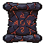 | **Forsaken Crimson Covenant Scroll** | A dark scroll bound with tattered crimson cloth and blackened metal clasps. The parchment surface is stained deep red with arcane symbols glowing faintly along its edges. Ornate corner pieces frame weathered, blood-inscribed text. | *An ancient pact sealed in blood and shadow. Those who read its words feel the weight of forgotten oaths pressing against their mind, promising power at a cost yet to be claimed.* | Mage |
| 180 |  | **Voidborn Veilbound Grimoire** | A weathered parchment scroll bound in aged leather with golden clasps. The surface is covered in faded arcane runes and symbols that glow faintly amber. Stained edges suggest centuries of use, with wax seals visible along the rolled edges. | *An ancient tome that whispers secrets to those foolish enough to heed its call. Those who study its pages find their minds stretched across dimensions best left unexplored.* | Mage |
| 181 |  | **Shattered Embercall Grimoire** | A dark square scroll with glowing crimson sigils arranged in a spiral pattern. The edges are singed black, with an ornate border of obsidian-like material. A central burning symbol pulses with eldritch light. | *A scroll bound by pacts older than kingdoms, its pages whisper incantations that sear the mind. Those who dare read its contents find themselves forever changed-if they survive the burning.* | Mage |
| 182 | 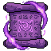 | **Violetpact Grimoire** | An ancient scroll bound in deep purple fabric with ornate dark corners. The parchment glows with violet runes and mystical symbols, encased in shadowy metallic frames. Wisps of ethereal energy emanate from its edges. | *A forbidden manuscript whispers secrets that unravel the mind. Those who dare decipher its violet incantations gain mastery over forces that should remain sealed.* | Mage |
| 183 |  | **Veilmark Codex** | A purple-bound scroll with ornate gold trim and arcane runes along its edges. The cover features a glowing violet sigil centered within a decorative frame, rendered in dark purples and golds against aged parchment. | *An ancient grimoire whose pages whisper secrets of the veil between worlds. Those who read from it find their mind expanded-and fractured-by truths no mortal was meant to comprehend.* | Mage |
| 184 |  | **Hollow Codex of Fractured Minds** | A weathered scroll with a dark blue-grey parchment bound by ornate silver clasps. Intricate arcane symbols and runes cover its surface in silver embroidery. The edges are frayed and aged, with hints of violet luminescence emanating from the sealed seams. | *An ancient manuscript said to contain the splintered thoughts of a sorcerer driven mad by forbidden knowledge. Those who dare unfurl its pages risk losing themselves to whispers older than kingdoms.* | Mage |
| 185 | 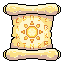 | **Codex of Waning Starlight** | A weathered parchment scroll with cream-colored edges, adorned with intricate golden symbols and arcane markings. The scroll is bound with frayed twine and displays faint luminescent runes that seem to shift within the yellowed paper. | *A forbidden grimoire whose pages whisper of celestial decay. Those who read its contents find their connection to the heavens severed, replaced by a hunger for forgotten magics that mortal minds were never meant to grasp.* | Mage |
| 186 |  | **Cursed Grimveil Codex** | A dark teal scroll with ornate black corners and arcane symbols. The parchment appears aged and weathered, with a glowing purple sigil at its center. Wisps of shadowy energy coil around the edges, suggesting forbidden knowledge contained within. | *A manuscript bound by forces older than kingdoms, its pages whisper secrets that corrode the mind. Those who decipher its contents glimpse the space between worlds-and rarely return unchanged.* | Mage |
| 187 |  | **Forsaken Codex of Withering Truths** | A weathered scroll case with worn brass fittings and darkened leather binding. The parchment within glows faintly with eldritch symbols. Ornate clasps hold it sealed, with hints of ash-grey and deep crimson accents. | *Knowledge inscribed in the margins of reality itself. Those who read its contents find their grasp on sanity as fragile as the ancient parchment that bears such terrible wisdom.* | Mage |
| 188 |  | **Veilstitched Codex** | A weathered scroll bound in dark leather with orange embroidered patterns. The parchment is yellowed and adorned with arcane symbols in burnt orange and gold. Ornate corner clasps frame the edges, with a mystical aura suggesting forbidden knowledge. | *A grimoire whose pages whisper secrets stolen from the spaces between worlds. Those who read its contents find their mind forever marked by truths mortal flesh was not meant to comprehend.* | Mage |
| 189 | 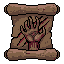 | **Bloodpact Grimoire** | A weathered leather-bound scroll with deep burgundy and brown tones. The cover features ornate golden filigree forming ritualistic symbols and a central emblem. Worn edges and aged parchment suggest ancient origins and forbidden knowledge. | *A covenant written in blood and shadow, its pages whisper pacts with forces that hunger beyond the veil. Those who read its verses trade sanity for power, forever marked by what gazes back.* | Mage |
| 190 | 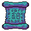 | **Ember Veilweave Codex** | An arcane scroll with deep teal and purple hues, bound in dark cloth with ornate corners. Glowing runes spiral across the weathered parchment, emanating a faint ethereal light. The edges are frayed and worn, suggesting age and forbidden knowledge. | *A grimoire whose secrets twist perception itself. Mages who study its passages report visions of worlds that should not exist-and the creeping suspicion that something is studying them in return.* | Mage |
| 191 |  | **Embercinder Codex** | A weathered scroll with burnt orange and deep blue coloring, adorned with a glowing triangular arcane symbol. Wisps of flame and frost swirl around the edges, suggesting volatile magical forces contained within aged parchment. | *A forbidden grimoire whose pages burn with the memory of empires reduced to ash. Those who read its secrets find their will consumed by the very magic they sought to command.* | Mage |
| 192 | 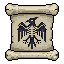 | **Nightbound Codex** | A weathered parchment scroll bound in aged leather, featuring a central black eagle emblem with outstretched wings. The background is cream-colored with dark ornamental borders. A subtle rune or sigil marks the upper corners, suggesting forbidden knowledge. | *An ancient compendium whose pages whisper forbidden incantations to those worthy of their power. Those who dare unroll its secrets find their will bent toward darker magics, though the price of such knowledge is written in shadows.* | Mage |
| 193 |  | **Flameburst Codex** | A weathered scroll mounted in an ornate bronze frame with flame-orange trim. The parchment glows with amber runes and smoldering edges. Decorative metal corners and a wax seal adorn the corners, suggesting ancient craft and contained power. | *A grimoire bound by forces older than kingdoms, its pages writhe with incantations that taste of ash and sulfur. Those who dare channel its knowledge invite infernos that consume both flesh and certainty.* | Mage |
| 194 |  | **Stormbound Codex** | A rolled scroll bound with tattered blue fabric and ancient cord. Deep indigo parchment visible at edges, marked with glowing arcane symbols. Weathered edges suggest age and countless incantations cast from its pages. | *A scroll that whispers secrets of tempests long forgotten. Those who unfurl its pages risk drowning in visions of apocalyptic storms, their minds fractured by knowledge no mortal was meant to comprehend.* | Mage |
| 195 | 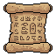 | **Scrollbark Grimoire** | A weathered parchment scroll bound in aged tan leather with ornate bronze clasps. The surface bears faded crimson symbols and arcane runes arranged in concentric circles. Edges are slightly singed and frayed, suggesting exposure to otherworldly energies. | *A forbidden manuscript whose pages whisper secrets that mortal minds were never meant to comprehend. Those who dare decipher its contents find their will slowly consumed by the knowledge they've gained.* | Mage |
| 196 |  | **Verdant Codex** | A weathered scroll encased in an ornate green frame adorned with mystical runes and flourishes. The parchment within glows faintly with arcane energy, surrounded by decorative corners suggesting ancient craftsmanship and eldritch knowledge. | *A grimoire bound by forces older than kingdoms, its pages whisper secrets that corrode the mind. Those who dare decode its verdant script find themselves changed-if they survive the reading.* | Mage |
| 197 |  | **Scrolls of the Starfall Covenant** | An ornate scroll with deep indigo parchment adorned with glowing silver runes and constellation patterns. The edges are bound in dark metal filigree, with mystical symbols radiating an ethereal blue luminescence against the shadowy background. | *A forbidden grimoire whose pages whisper of celestial collapse and the inevitable unraveling of the veil between worlds. Those who read its incantations risk losing themselves to the void that answers.* | Mage |
| 198 |  | **Ember Crimson Codex of Unmaking** | A worn scroll with deep crimson leather binding and ornate gold clasps. The parchment within glows faintly with arcane symbols in blood-red and violet. Intricate runes frame the edges, and wisps of dark energy seem to drift from the rolled edges. | *An ancient grimoire bound in the leather of forgotten creatures, its pages whisper secrets of entropy and dissolution. Those who read its verses invite ruin upon their enemies-and perhaps themselves.* | Mage |
| 199 |  | **Storm Verdant Codex of Thorns** | An ancient scroll bound in moss-covered leather with glowing green runes. Thorny vines coil around the rolled parchment, with luminescent symbols crawling across its surface. The edges glow with sickly verdant light. | *A twisted grimoire of forgotten nature magic, its pages whisper secrets of decay and overgrowth. Those who read from it find the line between life and rot dangerously blurred.* | Mage |
| 200 | 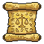 | **Hollow Codex of Withering Truths** | A weathered parchment scroll bound in cracked leather with golden brass fittings. The edges are singed and darkened, with arcane symbols embossed across the worn surface. A golden clasp seals the rolled manuscript. | *An ancient grimoire containing forbidden knowledge that corrodes the mind of those who dare read its contents. Those who study its passages find their comprehension of reality fundamentally altered, bending magic to their will before sanity slips away.* | Mage |
