# Staffs — Item Catalog

> **Category:** Staff  
> **Total items:** 100  
> **Classes:** Mage

| # | Preview | Item Name | Visual Description | Description | Classes |
|:-:|:-------:|:----------|:------------------|:------------|:--------|
| 1 | 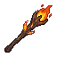 | **Emberfang Staff** | A gnarled wooden staff topped with a blazing flame wreathed in orange and amber hues. The wooden shaft appears charred and weathered, with the burning orb crackling with primal fire energy at its apex. | *A staff forged in the depths of volcanic ruin, its flame never extinguished since the age of cinders. Those who wield it feel the ancient hunger of fire coursing through their veins, consuming reason with each spell.* | Mage |
| 2 | 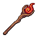 | **Bloodthorn Scepter** | A wooden staff topped with a gnarled crimson orb wreathed in thorny protrusions. The sphere pulses with an inner glow, casting bloody light across the dark wood handle. Thorns spiral down the shaft like veins. | *A scepter born from profane rituals, its orb drinks deep of vitality itself. Those who wield it feel the weight of countless sacrifices, their magic fed by something far older than mortal reckoning.* | Mage |
| 3 | 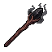 | **Marrowveil Scepter** | A gnarled wooden staff topped with a dark, bulbous skull-like orb wreathed in shadowy tendrils. The shaft is blackened wood with bone-white accents spiraling downward. Wisps of dark energy coil around the pommel. | *An instrument of forbidden rites, its corrupted heart pulses with the essence of forgotten curses. Those who grasp it feel the weight of countless whispered incantations burning against their palms.* | Mage |
| 4 | 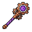 | **Runecarved Scepter** | A ornate staff with a rounded, gem-like head in deep purple and magenta hues. The bulbous top features intricate runic patterns and glowing crystalline facets arranged in a circular mandala. A dark wooden or obsidian shaft extends below with reinforced bands. | *A conduit of forgotten sorcery, its crystalline apex pulses with the heartbeat of a dying star. Those who grip its shaft feel whispers of power clawing at the edge of sanity.* | Mage |
| 5 | 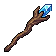 | **Duskwarden's Crook** | A gnarled wooden staff with a dark brown, twisted shaft. The head features an ornate blue crystal orb wreathed in bronze metalwork, glowing faintly. Runic symbols spiral down the length, and the base tapers to a sharp iron point. | *A staff born from the twilight pacts of forgotten mages. Its crystalline eye hungers for the arcane, drawing power from the spaces between thought and reality.* | Mage |
| 6 | 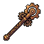 | **Rusted Bonegnawer** | A gnarled wooden staff topped with a large, ornate bronze or copper head featuring skull motifs and twisted metalwork. The staff shaft is dark brown with visible wear, and the head displays intricate detailing with what appears to be bone or ivory inlays. The overall design suggests ancient craftsmanship steeped in necromancy. | *Once wielded by a forgotten sorcerer, this staff hungers for the essence of the dying. Its metal head whispers incantations in tongues long dead, drawing power from suffering itself.* | Mage |
| 7 |  | **Azurespire Staff** | A wooden staff topped with a spherical orb of deep blue crystalline material, wreathed in arcane energy. The shaft is dark brown with subtle grip patterns, and the orb glows with an inner radiance suggesting concentrated magical power. | *A conduit for the voiceless abyss. Mages who grasp this staff find their spellcraft amplified tenfold, though whispers of something vast and watchful echo through their incantations.* | Mage |
| 8 | 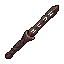 | **Thornwood Conduit** | A gnarled wooden staff wrapped in dark leather bindings. The shaft is deep brown with carved spiral grooves, topped with a twisted copper or bronze ferrule. Intricate runic patterns trace down its length, glowing faintly with eldritch energy. | *An artifact of forgotten ritual, this staff channels the raw forces that exist between worlds. Those who grasp it find their connection to the arcane deepened—but at a price only the practiced can afford.* | Mage |
| 9 | 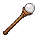 | **Soulroot Staff** | A wooden staff with a weathered brown shaft, topped with a spherical orb of pale stone or crystal. The orb glows faintly with an ethereal luminescence, emanating an otherworldly aura. The wood appears ancient and gnarled. | *Carved from the heartwood of a tree that grew upon a mass grave, this staff channels the restless whispers of the departed. Those who grip it feel the weight of countless souls pressing against the veil between worlds.* | Mage |
| 10 | 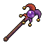 | **Bloodthorn Crook** | A gnarled staff topped with a curved, hook-like head adorned with crimson thorns. The shaft appears twisted and organic, with deep burgundy and purple hues suggesting aged wood or bone. A small orb of dark energy pulses at the crook's center. | *A staff born from profane rituals, its thorns thirsting for the essence of the living. Whispers say it was carved from the spine of a forgotten god, and those who wield it find their magic corrodes all it touches.* | Mage |
| 11 | 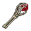 | **Crimson Marrow Staff** | A gnarled wooden staff topped with a crimson crystalline orb wreathed in wispy red energy. The sphere pulses with an internal glow, casting bloody light across carved runes along the shaft. Thorned vines coil around the base of the gemstone. | *Once wielded by a blood-witch whose pact with forgotten powers left her drained to shadow. The staff still hungers for vitality, drawing it from both spell and flesh alike.* | Mage |
| 12 | 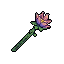 | **Bloodthorn Catalyst** | A gnarled staff topped with a dark crimson orb wrapped in thorny vines. The shaft is weathered wood tinged purple-black, with a twisted grip. Thorns protrude from the head, suggesting arcane corruption and pain. | *A staff born from profane rituals, its crystalline core pulses with stolen vitality. Those who channel through it taste iron and shadow, their spells written in the agony of things long dead.* | Mage |
| 13 |  | **Ossein Conduit Staff** | A slender staff crafted from pale bone or ivory, topped with a spherical orb that glows faintly with ethereal light. The shaft features wrapped leather grip and delicate runic engravings spiraling downward. The orb casts a subtle luminescence against the darkened background. | *A staff born from the marrow of forgotten gods, its crystalline apex drinks deep of the veil between worlds. Those who channel through it feel the weight of eternity pressing against their mortal frame.* | Mage |
| 14 | 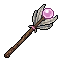 | **Thornbloom Scepter** | A dark wooden staff topped with a blooming flower bulb in shades of pink and magenta. The bulb appears organic and slightly corrupted, with thorny protrusions along the shaft. The orb glows faintly with arcane energy. | *A staff that blooms with unnatural flora, its petals whispering forgotten incantations. Those who grasp it taste ash and ancient nectar upon their tongue.* | Mage |
| 15 | 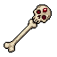 | **Bonepulse Scepter** | A gnarled staff topped with a spherical skull-like ornament in weathered bone or ivory. The orb features intricate crimson markings and radiates an eerie aura. The shaft is dark wood wrapped in sinew, with a skeletal hand-grip near the base. | *A relic of forgotten necromancers, this staff pulses with the essence of the departed. Those who wield it hear whispers of the dead, and reality bends slightly around its bearer.* | Mage |
| 16 | 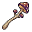 | **Hollow Bloodthorn Scepter** | A gnarled wooden staff topped with a dark crimson orb wrapped in thorny vines. The sphere pulses with an inner glow, while barbed tendrils coil around the grip below, suggesting both organic growth and arcane corruption. | *Once wielded by a hedge witch whose pact with something older than gods went terribly right. The thorns taste blood with each incantation, hungry for payment.* | Mage |
| 17 | 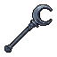 | **Umbralshard Staff** | A gnarled staff carved from dark wood or bone, topped with a jagged crystalline orb that glows with sickly purple luminescence. The shaft is wrapped in tattered cloth bindings, and arcane runes spiral down its length in a faint, haunting light. | *A conduit for forces best left undisturbed. Those who grip this staff report whispers from the void itself, promises of power that demand a terrible price.* | Mage |
| 18 | 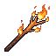 | **Embercrown Staff** | A gnarled wooden staff topped with a burst of orange and yellow flames. The grip is wrapped in dark leather, and embers drift from the ornate flame-wreathed crown at its apex, creating an aura of crackling light. | *A conduit for primordial fire, this staff hungers for the mana of those foolish enough to wield it. The flames atop it burn eternal—never consuming, only devouring.* | Mage |
| 19 | 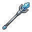 | **Azurite Spirecaster** | A slender staff topped with a glowing azure crystal point. The shaft is dark wood or iron, accented with blue ethereal wisps. A crescent-shaped enchantment symbol glows faintly near the crystalline tip. | *An instrument of starfall magic, its crystalline apex hungers for the weave. Those who wield it speak of whispers from beyond the veil, urging them toward powers best left untouched.* | Mage |
| 20 | 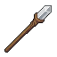 | **Shadowthorn Crescent** | A gnarled wooden staff with a curved, crescent-shaped head wrapped in tattered cloth. The wood is dark brown with black striations, and the staff's tip glows with an ethereal pale blue light. Aged leather bindings spiral down the shaft. | *A cursed implement born from the marrow of a dead god's thorn. Those who channel its power feel the weight of forgotten sorrows seeping into their bones with each incantation.* | Mage |
| 21 | 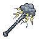 | **Stormcaller's Conduit** | A gnarled staff with a bulbous, crystalline head wreathed in crackling energy. The shaft is dark wood bound with tarnished metal bands. Storm-grey wisps coil around the glowing core, and jagged protrusions jut from the orb's surface like frozen lightning. | *A conduit for the primal forces of tempest and chaos. Those who grip this staff invite the wrath of the heavens into their trembling hands—a pact written in thunder and paid in ash.* | Mage |
| 22 |  | **Azureblight Scepter** | A slender staff crowned with a luminous blue crystal that crackles with ethereal energy. The shaft is wrapped in worn leather bindings, darkened by age. Wisps of pale blue arcane power swirl around the gemstone. | *A conduit for forces that predate mortal comprehension. Those who wield it report hearing whispers in the spaces between thoughts—whether blessing or curse remains unclear.* | Mage |
| 23 | 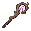 | **Crimson Spiraling Wand** | A gnarled wooden staff topped with a spiraling crimson orb enclosed in dark iron filigree. The shaft is weathered brown wood with intricate rune carvings running its length, glowing faintly at the base where it meets a tattered crimson ribbon. | *An artifact of old blood sorcery, this wand thirsts for the essence of the living. Those who channel through it feel the weight of countless sacrifices binding their will to its purpose.* | Mage |
| 24 | 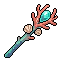 | **Bloomveil Scepter** | A gnarled wooden staff topped with a vibrant crystalline bloom of red and pink petals. The staff's shaft is dark wood wrapped in teal binding, with golden accents near the gemstone. The flower head glows with ethereal light, suggesting potent arcane energy contained within natural form. | *Once the staff of a forgotten botanist-mage who sought to merge the cycle of growth with the void. Now it blooms with unnatural radiance, each petal a fragment of stolen vitality waiting to be unleashed upon the world.* | Mage |
| 25 | 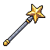 | **Starfall Conduit** | A slender wooden staff topped with a radiant golden star. The shaft is pale ash-grey with subtle purple ethereal wisps coiling around it. The star glows with warm amber light, its five points sharp and defined against the dark background. | *A staff channeling the essence of fallen celestial bodies. Those who grasp it feel the weight of distant stars pressing against their will, as if the cosmos itself demands to be wielded.* | Mage |
| 26 | 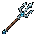 | **Wraithbark Scepter** | A gnarled staff carved from blackened wood, crowned with a forked prong resembling spectral antlers. The shaft is wrapped in tattered cloth and adorned with bone accents. A sickly pale aura emanates from the twisted top. | *A cursed staff pulled from the grip of a long-dead ritualist. Those who wield it hear whispers of forgotten incantations, as if the wood itself remembers the spells it once channeled.* | Mage |
| 27 | 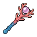 | **Crimson Conduit Staff** | A slender staff topped with a ruby-red crystalline orb wreathed in arcane energy. The shaft is deep blue with ornate gold banding. Wisps of crimson light coil around the glowing gem, suggesting contained power. | *An artifact of forgotten sorcery, its crystalline apex pulses with the malice of a thousand tortured souls. Those who wield it feel their mortality slip like sand through trembling fingers.* | Mage |
| 28 | 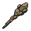 | **Ossein Crook** | A gnarled staff carved from weathered bone, its surface stained deep brown and charred black. A skeletal bird's skull crowns the twisted shaft, hollow eye sockets glowing faintly. Wrapped in frayed cloth near the grip. | *An implement of necromantic communion, this staff whispers with the voices of the departed. Those who grasp it feel the cold certainty of mortality seeping through their fingertips.* | Mage |
| 29 | 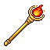 | **Shattered Emberfang Staff** | A wooden staff topped with a glowing orb of orange and red flame. The orb sits within a metal cage of dark iron, radiating warmth. The shaft is weathered wood bound with bronze bands, leading to a simple grip. | *A conduit for primordial fire, this staff hungers for arcane flesh. Those who wield it speak of the orb's whispered demands, each spell cast feeding its eternal hunger.* | Mage |
| 30 | 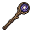 | **Spiralveil Crook** | A gnarled wooden staff topped with an ornate spiral orb of swirling purple and dark indigo energy. The sphere rotates slowly, crackling with arcane essence. The shaft is weathered wood wrapped in dark bindings, with a subtle luminescent aura surrounding the entire implement. | *An ancient conduit of forbidden knowledge, this staff draws power from the void between worlds. Those who grasp it feel the weight of countless incantations spoken by practitioners long turned to dust.* | Mage |
| 31 | 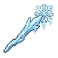 | **Frostspire Staff** | A slender staff with a crystalline ice-blue head crowned by jagged, frozen shards. The shaft glows with pale azure light, wreathed in wisps of ethereal frost. Icicles dangle from the top, suggesting ancient, bitter magic. | *A conduit of primordial winter, this staff channels the screaming cold of forgotten wastelands. Those who wield it risk losing themselves to the void's endless freeze.* | Mage |
| 32 | 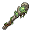 | **Sepulcher's Reach** | A gnarled staff carved from blackened bone, topped with an emerald orb wreathed in withered vines. The shaft tapers toward a pointed ferrule, accented by tattered cloth wrappings in sickly green hues. | *A staff drawn from the tombs of forgotten sorcerers, its emerald core still pulses with the hunger of centuries-old curses. Those who grip it feel the weight of every soul it has consumed.* | Mage |
| 33 | 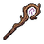 | **Ancient Bloodthorn Scepter** | A twisted wooden staff topped with a crimson orb wreathed in thorny vines. The shaft is dark burgundy with ornate bronze bands. A single thorn curves downward from the sphere's base, dripping with arcane energy. | *An instrument of forbidden pacts, this scepter pulses with the heartbeat of something long dead. Those who wield it find their spells feed on vitality itself—a gift and curse in equal measure.* | Mage |
| 34 | 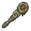 | **Bonegnaw Crook** | A gnarled staff carved from weathered bone, topped with an ornate bronze spherical head etched with arcane symbols. The shaft features wrapped leather bindings and exhibits deep brown and grey tones with intricate metalwork details. | *Once wielded by a forgotten sorcerer who communed with spirits long entombed. The staff hungers still, its bone marrow resonating with whispers of the dead.* | Mage |
| 35 |  | **Thornspire Catalyst** | A gnarled staff topped with a thorny, crystalline orb that glows with sickly green light. The shaft is dark wood wrapped in blackened iron bands, with jagged protrusions spiraling upward. Small skull motifs adorn the base. | *A relic of forgotten sorcery, this staff hungers for the mana of those foolish enough to wield it. Each spell cast feeds the cursed thorns that writhe within its core, drawing power from both caster and victim alike.* | Mage |
| 36 | 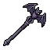 | **Ebonspire Crook** | A gnarled staff with a curved, hook-like head forged from blackened metal. The shaft is dark wood wrapped in tattered bindings, topped with an ornate raven or crow motif. Wisps of shadow seem to coil around the pointed tip. | *A cursed implement of the old witches, its crooked head whispers incantations to those mad enough to listen. Those who wield it find their flesh growing cold as the veil between worlds grows thin.* | Mage |
| 37 | 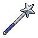 | **Starfall Scepter** | A slender staff topped with a gleaming six-pointed star. The shaft is deep indigo with silver accents, tapering toward an ornate grip. The star radiates ethereal light, its points sharp and celestial, suggesting cosmic power. | *A relic of forgotten starfall rituals, this scepter channels the ancient light of distant constellations. Those who wield it risk burning away their mortality with each incantation.* | Mage |
| 38 | 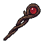 | **Bloodmoon Scepter** | A gnarled wooden staff topped with a large crimson orb wreathed in dark tendrils. The sphere pulses with an inner ruby glow, set against aged charcoal wood. Metal bindings wrap the shaft in intricate patterns. | *Once wielded by a court mage who bargained with entities beyond the veil. The orb at its crown hungers for the life force of the living, whispering promises of power to those desperate enough to listen.* | Mage |
| 39 | 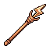 | **Thornwood Diviner's Staff** | A wooden staff with a warm, rust-brown hue. The top features an ornate spear-like point with sharp, jagged edges suggesting thorns or arcane energy. The shaft tapers toward a wrapped grip, with subtle grain patterns visible throughout the weathered wood. | *Once wielded by a seer who read fate in the bones of the earth. The staff hungers for whispered truths, its point drinking deep of blood and sorrow to pierce the veil between worlds.* | Mage |
| 40 | 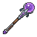 | **Amethyst Spiritbinder** | A gnarled wooden staff topped with a large, glowing amethyst orb. The crystal pulses with violet energy, wreathed in ethereal wisps. Dark leather wrapping spirals down the wooden shaft, adorned with arcane runes that faintly shimmer. | *Once wielded by a sorcerer who delved too deep into the veil between worlds. The stone still resonates with the echoes of their final incantation, hungering to bind more souls to its glowing depths.* | Mage |
| 41 | 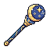 | **Veilstone Scepter** | A wooden staff topped with a large spherical orb of deep blue and purple hues, swirling with arcane energy. The sphere is ringed with ornate golden bands and sits atop a dark wooden shaft wrapped in mystical binding. | *An ancient conduit of the void itself, this scepter pulses with the whispers of forgotten incantations. Those who grasp it feel the weight of cosmic truth pressing against the edges of sanity.* | Mage |
| 42 | 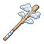 | **Veilpiercer's Crook** | A gnarled wooden staff with a pale, crystalline head wreathed in ethereal wisps. The top features an ornate, luminous gem-like structure radiating faint arcane light. The shaft is weathered bone-brown with silver-threaded bindings. | *A staff fashioned from the heartwood of trees that grew in places where the veil between worlds wore thin. Those who wield it report whispers from dimensions beyond—whether blessing or curse remains unclear.* | Mage |
| 43 | 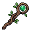 | **Verdantis Staff of Thorns** | A gnarled wooden staff crowned with an ornate emerald circlet. The shaft features twisted vines and thorns carved into dark wood, with glowing green runes spiraling downward. The gem atop pulses with sickly luminescence. | *Once wielded by a nature priestess consumed by the rot she sought to control, this staff bleeds ancient malice through every fiber. Its thorns whisper promises of dominion over flesh and forest alike.* | Mage |
| 44 | 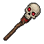 | **Bonelust Crook** | A gnarled staff with a bulbous skull crowning its length. The bone is cream-white with dark striations, wrapped in tattered crimson cloth near the grip. The skull's eye sockets glow faintly amber. | *A staff that thirsts for the life force of the living. Whispers of forgotten incantations echo from its marrow, promising power to those willing to feed it their sanity.* | Mage |
| 45 | 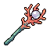 | **Bloodbloom Scepter** | A gnarled wooden staff topped with a crimson, pulsating flower-like cluster. The bloom appears organic and grotesque, with jagged petals dripping a dark ichor. The shaft is weathered bone-gray with thorny vines coiled around its length. | *A staff that blooms only in the presence of spilled blood, its petals unfurling to drink deep of mortal essence. Those who wield it find their spellcraft amplified by suffering—both their own and that of their enemies.* | Mage |
| 46 | 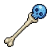 | **Azurebound Scepter** | A wooden staff with a gnarled, bone-like handle tapering upward. The head features a large spherical orb of deep blue crystal or magical essence, glowing with an ethereal light. The orb sits in a weathered metal socket with visible metal bands wrapping the upper shaft. | *An instrument of the arcane devoted, its crystalline apex pulses with the memory of a shattered sky. Those who grasp it feel the weight of forgotten incantations pressing against their mind.* | Mage |
| 47 | 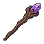 | **Amethyst Thornscepter** | A gnarled wooden staff topped with a jagged amethyst crystal that pulses with violet light. The shaft is twisted and dark, wrapped in thorny vines that coil toward the glowing gemstone. The base tapers to a pointed iron ferrule. | *A scepter born from the marriage of nature's fury and arcane power. Those who wield it speak of whispers from the crystal—ancient voices offering forbidden knowledge at a terrible price.* | Mage |
| 48 | 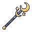 | **Aurelion's Crescent Staff** | A tall wooden staff topped with a polished golden crescent moon adorned with glowing amber orb. The shaft is dark brown with subtle arcane runes etched along its length. Warm light radiates from the celestial head piece. | *Once wielded by a sorcerer who commanded the very heavens. This staff thirsts for the mana of those bold enough to channel the moon's ancient power through its gleaming form.* | Mage |
| 49 | 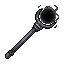 | **Obsidian Veilstaff** | A gnarled staff topped with a large spherical orb of deep black stone, swirling with faint violet wisps. The shaft is dark wood bound with tarnished silver bands. The orb's surface gleams ominously, as if containing trapped starlight. | *A staff born from the void between worlds, its dark heart pulses with forgotten incantations. Those who wield it taste ash and shadow, their spells twisted by the weight of the abyss.* | Mage |
| 50 | 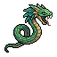 | **Serpent's Covenant Staff** | A tall wooden staff topped with a coiled green serpent wrapped around an ornate finial. The snake's scales shimmer with emerald hues, its head raised as if striking. The shaft is dark wood reinforced with copper bands. | *An ancient conduit of primordial magic, this staff channels the venom of forgotten serpents through its wielder's will. Those who grasp it report whispers in tongues long dead, and their spells carry the weight of serpentine malice.* | Mage |
| 51 | 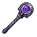 | **Veiltwist Scepter** | A dark staff topped with an orb of swirling purple energy encased in thorned metalwork. The shaft is slender and midnight-black, with arcane runes etched along its length. The orb pulses with an otherworldly violet glow. | *A conduit for forbidden magic, its sphere writhes with the essence of things that should not be named. Those who wield it find their will bending toward the abyss, one spell at a time.* | Mage |
| 52 |  | **Bonepulse Staff** | A gnarled wooden staff topped with a bleached skull adorned with arcane runes. The bone is pale cream-white against dark weathered wood, with hollow eye sockets that seem to glow faintly. Wisps of ethereal energy coil around the cranium. | *A conduit for forces that should remain buried. Those who grasp this staff feel the weight of countless spirits pressing against their consciousness, their whispers a constant reminder that every spell demands a price.* | Mage |
| 53 | 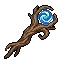 | **Azurite Thaumaturge's Rod** | A gnarled wooden staff wrapped in leather bindings, topped with a glowing blue crystalline orb. The crystal radiates an ethereal azure light, while the wood appears aged and weathered, suggesting ancient craftsmanship. | *A conduit for forces beyond mortal comprehension, this staff channels the raw essence of the aether itself. Those who wield it speak of whispers from the void, and the unmistakable weight of power drawing ever closer.* | Mage |
| 54 | 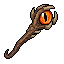 | **Emberfang Scepter** | A gnarled wooden staff topped with a glowing amber orb encased in twisted bronze claws. The sphere pulses with inner fire, casting warm light across the dark wood shaft. Ornate metalwork wraps the grip. | *An ancient conduit of primal flame, its heat still burns with the fury of forgotten rituals. Those who wield it taste ash and cinder with every incantation.* | Mage |
| 55 | 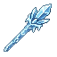 | **Frostweave Conduit** | An ethereal staff crafted from pale blue crystalline material with wispy, flame-like energy spiraling around its length. The top features a sharp, icy point that glows with cold luminescence. Delicate frost patterns trace along the shaft. | *A staff born from the marriage of ice and arcane force, its touch drains warmth from the world. Those who wield it speak of whispered incantations echoing from the crystalline depths, as if the staff itself hungers to channel spells.* | Mage |
| 56 |  | **Thornwick Conduit** | A gnarled wooden staff topped with a glowing amber orb encased in thorned metalwork. The shaft is dark and twisted, wrapped with copper bands. Wisps of ethereal light emanate from the crystalline core. | *A staff born from profane pacts, its warmth belies the screams sealed within. Those who grasp it feel the weight of countless borrowed souls pressing against their sanity.* | Mage |
| 57 |  | **Ebonspire Conduit** | A gnarled staff with dark wood or bone material twisted into a spiraling form. The top features an ornate golden or brass socket cradling a luminous amber or sickly green orb. The shaft tapers toward the base with subtle vine-like patterns etched along its length. | *A staff wrought from the heartwood of trees that drank deep of cursed soil. Its crystalline apex pulses with otherworldly light, channeling forces that mortal minds were not meant to wield.* | Mage |
| 58 |  | **Cursed Emberfang Staff** | A gnarled wooden staff with deep crimson bindings and a wicked, spike-tipped head. The upper section glows with soot-blackened metal, adorned with feather-like ornaments in rust and copper tones. Wisps of ashen residue cling to its surface. | *Forged in the dying light of a fallen star, this staff hungers for the warmth of spellfire. Those who wield it find their magic scorched with an ancient, primal hunger.* | Mage |
| 59 |  | **Bonewraith Scepter** | A gnarled staff topped with a bleached skull adorned with ornate brass bindings. The shaft appears crafted from aged bone, weathered to a pale cream color with intricate dark runes etched along its length. A faint crimson gem glows within the skull's eye socket. | *A staff that whispers with the voices of the departed. Those who grip its bone shaft feel the weight of countless souls pressing against their consciousness, granting power at a terrible cost.* | Mage |
| 60 |  | **Ossuary Crook** | A gnarled staff with a curved, hook-like head resembling a skeletal talon. The shaft is pale bone or driftwood, wrapped in dark binding. The crook glows faintly with an otherworldly luminescence, and small wisps of shadow curl around its pointed tip. | *An instrument of the grave-touched, this staff channels the whispers of the departed. Those who grip its bone-worn haft find their will bent toward dominion over death itself—though the cost of such power is often paid in stolen years.* | Mage |
| 61 |  | **Serpent's Coil Staff** | A gnarled wooden staff with a twisted, snake-like form spiraling upward. Dark brown wood with copper or bronze metallic accents wrapping around the curves. The top curves into a serpentine head, suggesting a coiled viper frozen mid-strike. | *A staff born from forbidden rites, its wood remembers the taste of venom and shadow. Those who grasp it feel the whisper of something ancient coiling through their veins, patient and predatory.* | Mage |
| 62 |  | **Stormveil Scepter** | A ornate staff topped with a crystalline blue orb wreathed in arcane energy. The shaft features intricate silver filigree and dark metal bands. Wisps of ethereal light coil around the gemstone, suggesting dormant power. | *Once wielded by a court mage whose ambitions exceeded mortality itself. The scepter hungers for spellcraft, its crystalline heart drinking deep from the caster's essence with each incantation.* | Mage |
| 63 |  | **Storm Bloodthorn Scepter** | A gnarled staff topped with a crimson orb wrapped in thorny vines. The shaft is dark wood reinforced with bone segments. A single obsidian spike protrudes from the pommel, glowing faintly red. | *Once wielded by a forgotten court of blood-mages, this scepter still hungers for vitality. Each incantation draws power from both the caster and those foolish enough to stand near.* | Mage |
| 64 |  | **Ossein Conduit** | A gnarled staff of bleached bone and twisted wood, crowned with a spherical amber crystal emanating a faint glow. The shaft tapers toward a pointed base, wrapped in leather bindings. Warm ochre and cream tones dominate the weathered palette. | *A relic of forgotten rites, this staff drinks the essence of those who channel through it. The amber heart pulses with each incantation, whispering promises of power at a cost that echoes in one's very bones.* | Mage |
| 65 |  | **Duskblight Crook** | A gnarled staff with a dark wooden shaft wrapped in tattered leather bindings. The top curves into a hooked, claw-like head with a sickly bronze or gold finish, emanating a faint corrupted aura. The wood appears aged and weathered, with subtle arcane markings etched along its length. | *A staff born from the marriage of nature's decay and forbidden sorcery. Those who wield it find their spells tinged with entropy, as if reality itself recoils from their touch.* | Mage |
| 66 |  | **Frostwhisper Conduit** | A slender staff carved from crystalline blue ice-stone, tapering to a sharp point. Ethereal blue energy swirls along its length, with delicate frost-like patterns etched into the shaft. The tip glows with an arcane radiance. | *Born from the tears of winter spirits, this staff channels the bitter cold that precedes oblivion. Those who wield it find their mind sharpened, but their heart grows ever colder.* | Mage |
| 67 |  | **Forsaken Bloodthorn Scepter** | A gnarled wooden staff topped with a crimson orb wreathed in thorny protrusions. The sphere glows with an ominous red hue, while dark veins spider across the wood below, suggesting corruption or ancient power. | *A scepter born of profane ritual, its core pulses with the essence of those who fell to its wielder's will. To grasp it is to invite whispers of the damned into your mind.* | Mage |
| 68 |  | **Voidborn Thornwood Conduit** | A wooden staff with a dark reddish-brown finish, featuring a gnarled, twisted grip and a tapered shaft that narrows toward the top. The wood appears ancient and weathered, with subtle grain patterns visible along its length. | *A staff born from the heart of a cursed forest, its wood still thrumming with the whispers of forgotten incantations. Those who channel power through it report hearing the distant screams of bound spirits.* | Mage |
| 69 |  | **Azurite Scepter of Unmaking** | A slender staff topped with a crystalline blue gemstone that glows with ethereal light. The shaft is wrapped in deep indigo leather, with arcane runes etched along its length. Wisps of magical energy coil around the stone. | *A conduit for forces beyond mortal comprehension, this scepter drinks deep of the aether. Those who wield it find reality bends to their whispered demands—though the cost is always paid in kind.* | Mage |
| 70 |  | **Soulweaver's Crook** | A gnarled staff with a twisted wooden shaft in deep purple-black tones. The head features an ornate spiral or circular sigil wreathed in arcane symbols, emanating a faint violet glow. The design suggests both organic decay and eldritch craftsmanship. | *A conduit for those who traffic with forces beyond mortal ken. Whispers cling to its surface like frost, and those who grasp it feel the thin veil between worlds grow gossamer-thin.* | Mage |
| 71 |  | **Bonewood Conduit** | A gnarled wooden staff with a bulbous, skull-like head carved from bleached bone. Wrapped sinew binds the shaft in spiraling patterns. The orb glows with an eerie amber hue, surrounded by jagged protrusions suggesting age and dark purpose. | *An instrument of communion with forces beyond the veil. Those who grasp it feel the weight of countless incantations spoken into the void, each word etched into the very marrow of its being.* | Mage |
| 72 |  | **Voidbloom Scepter** | A gnarled staff with a bulbous, flower-like head in deep purple and magenta hues. The head appears organic, almost floral, with spiral patterns and crystalline formations sprouting from its crown. The shaft is dark and twisted, suggesting ancient wood or bone. | *A staff that blooms only in the spaces between worlds. Those who wield it find their spells flowering with unnatural potency, though each casting leaves a faint mark upon their soul.* | Mage |
| 73 |  | **Solstice Crook** | A wooden staff topped with a radiating golden sunburst orb. The shaft is dark brown wood wrapped in golden wire near the head. The star-like metal crown glows warmly against the dim background, suggesting ancient solar magic. | *An artifact blessed by forgotten suns, this staff channels primordial light into devastating arcs. Those who wield it risk burning away their mortality along with their enemies.* | Mage |
| 74 |  | **Ossein Scepter** | A gnarled staff topped with a large, aged brass gear mechanism. The shaft is wrapped in weathered leather bindings, with bone-white accents and rusted metal fixtures. A faint amber glow emanates from within the gear's center. | *An arcane conduit forged in ages past, where clockwork and sorcery intertwined. Those who wield it claim to hear the grinding of cosmic gears within their own mind.* | Mage |
| 75 |  | **Crescent Voidstaff** | A gnarled staff topped with a crescent moon-shaped ornament in deep purple and black. The shaft tapers to a point, with intricate wrapping near the head. The curved metal fixture gleams with an otherworldly sheen against the dark wood. | *A staff born from the void between stars, its crescent apex drinks in shadow itself. Those who grasp it feel the weight of forgotten incantations pressing against their mind.* | Mage |
| 76 |  | **Thornbloom Catalyst** | A gnarled wooden staff topped with a blooming flower of golden-yellow petals and green foliage. The flower glows softly, suggesting arcane power. The staff's dark wood is twisted and weathered, suggesting age and natural magic. | *Once a sapling blessed by forgotten gods, this staff now thrums with primal magic. Its eternal bloom grants those attuned to the weave power over nature's wrath and the hidden currents of the world.* | Mage |
| 77 |  | **Embercinder's Crook** | A gnarled staff of blackened wood topped with a twisted, ornate metal claw gripping a smoldering crimson gem. Wisps of smoke coil around the shaft. The claw glows faintly amber, casting dancing shadows. | *Born from the ashes of a forgotten pyre, this staff hungers for the channeling of raw elemental fury. Those who wield it walk perpetually wreathed in dying embers, forever tainted by the flames they command.* | Mage |
| 78 |  | **Verdant Scepter of Thorns** | A wooden staff with a gnarled, twisted trunk. The head features an ornate circular gem setting in deep emerald green, surrounded by thorny vine-like metalwork in bronze. Small leaf motifs accent the shaft. | *Once wielded by a druid whose pact with the wild turned to bitter conquest. This scepter pulses with corrupted nature—beautiful and deadly, like poison wrapped in silk.* | Mage |
| 79 |  | **Storm Crimson Marrow Staff** | A gnarled staff topped with a glowing crimson orb wreathed in dark tendrils. The shaft is twisted bone or blackened wood, with ornate circular bands spiraling downward. The sphere pulses with an eerie reddish light, suggesting contained otherworldly energy. | *A staff carved from the marrow of forgotten things, its core stone drinks deep of spilled essence. Whispers of the damned coil within its sphere, eager to answer the call of those mad enough to wield it.* | Mage |
| 80 |  | **Soulveil Crook** | A gnarled staff topped with a crescent moon-shaped head in weathered brass or bronze. The orb glows with ethereal teal-green light. The wooden shaft is darkened and twisted, adorned with occult symbols. Small crystalline fragments protrude from the metal crown. | *This ancient conduit channels the boundary between worlds. Those who wield it report whispers of forgotten names echoing through their casting.* | Mage |
| 81 |  | **Stormfang Staff** | A gnarled wooden staff topped with a jagged golden lightning bolt, crackling with ethereal energy. The shaft is dark brown, weathered and twisted, with golden runic bands wrapped around its length. Wisps of yellow-white energy dance around the head. | *A conduit for the primal fury of the heavens, this staff drinks deep from the storm itself. Those who wield it taste copper and ash, their flesh alight with power borrowed from the world's violent birth.* | Mage |
| 82 |  | **Cursed Stormveil Scepter** | An elegant staff with a deep indigo shaft traced with ethereal blue lightning patterns. The head features a crystalline prism wreathed in crackling arcane energy, emanating violet and azure light. Sharp, feathered edges frame the core, suggesting tempestuous power. | *A conduit for the rage of forgotten storms, this scepter hungers for the mana of those bold enough to wield it. Each spell cast bleeds the air with the scent of scorched earth and ozone.* | Mage |
| 83 |  | **Veilmend Crescent** | A gnarled staff topped with a crescent-shaped crystal orb, rendered in cool blues and grays. The orb glows faintly with an ethereal light, surrounded by wispy tendrils of arcane energy. The staff shaft is twisted and weathered, suggesting ancient craftsmanship. | *Once wielded by a sorcerer who bargained with forces beyond the veil, this staff hums with forbidden knowledge. Those who channel its power often glimpse fractured truths in the spaces between worlds.* | Mage |
| 84 |  | **Voidborn Bloodthorn Crook** | A gnarled staff topped with a thorned, bulbous crimson orb wreathed in dark vines. The wooden shaft is weathered bone-grey, reinforced with copper bands. Dried brambles coil around its length, and the sphere pulses with a deep burgundy hue. | *Once wielded by a hedge witch consumed by her own thirst for power, this staff hungers still. Each spell cast through it demands a price written in shadow and sorrow.* | Mage |
| 85 |  | **Emberfang Conduit** | A gnarled wooden staff topped with a spherical orb of roiling flame and ember. The staff's dark wood is scorched and cracked, with orange light pulsing from within. A wrapped grip near the base suggests ancient use. | *A relic of the Pyromantic Order, this staff hungers for the warmth of spilled blood. Those who wield it feel the phantom heat of a thousand funeral pyres burning in their bones.* | Mage |
| 86 |  | **Shadowpulse Scepter** | A dark, twisted staff with a bulbous orb of deep purple and black at its head. Wrapped in tattered crimson cloth near the grip, with ornate metallic bands spiraling up the shaft. The orb pulses with an eerie violet glow. | *A scepter carved from the bone of forgotten rituals, its core thrums with stolen vitality. Those who wield it feel the weight of a thousand whispered incantations burning beneath their fingertips.* | Mage |
| 87 |  | **Bonewraith Staff** | A gnarled wooden staff topped with a bleached skull ornament. The shaft is weathered bone-white with dark striations, wrapped in tattered bindings. A faint ethereal aura surrounds the skull crown. | *An instrument of necromantic power, this staff drinks deep from the wells between life and death. Those who grasp it feel the weight of departed souls pressing against their mind, eager to be channeled into ruin.* | Mage |
| 88 |  | **Veilshard Scepter** | A wooden staff with a dark, swirling orb of deep indigo and crimson nestled in an ornate metal crown at its head. The orb contains what appears to be captured starlight or ethereal wisps. The shaft is wrapped in worn leather binding, with small metal rings adorned along its length. | *A conduit for forces that should remain forgotten. Those who grasp its haft feel the weight of realities that bleed into one another, whispering secrets best left unlearned.* | Mage |
| 89 |  | **Thornwick Cataclysm** | A gnarled wooden staff with dark, twisted grain and thorny protrusions along its length. The head features a jagged, obsidian-like crystal shard wreathed in wispy purple energy. Weathered leather wrapping spirals down the handle. | *An instrument of calamity wrought from the heartwood of cursed groves. Those who channel its power feel reality fracture beneath their will, though the staff hungers for more.* | Mage |
| 90 |  | **Flamecrest Scepter** | A gnarled wooden staff topped with jagged crystalline formations in deep crimson and orange hues. Arcane runes spiral down the shaft, and wisps of ethereal flame flicker around the crystal crown. | *Born from the heart of a dying star, this scepter channels the primal fury of inferno. Those who wield it feel the weight of countless incinerated worlds pressing against their will.* | Mage |
| 91 |  | **Forsaken Starfall Conduit** | A gnarled wooden staff topped with a crystalline orb emanating ethereal blue-white light. The shaft is deep indigo with gold accents, while luminous sparks cascade from the crystal apex, suggesting arcane power contained within. | *An instrument of cosmic severance, its crystalline crown pulses with the dying light of fallen stars. Those who channel through its frame risk unraveling the very fabric between worlds.* | Mage |
| 92 |  | **Solstice Arbor Staff** | A tall wooden staff topped with a radiant golden starburst crown. The shaft is warm amber wood, tapering upward to six pointed rays that glow with ethereal light. Fine details accent the base where wood meets metal. | *An ancient conduit of celestial power, its golden crown blazes with the eternal light of a sun long fallen from the sky. Those who grip its wood feel the weight of ages pressing against their will.* | Mage |
| 93 |  | **Shattered Bloodthorn Scepter** | A twisted staff crowned with a jagged, crimson-black crystalline formation. Dark burgundy wrapping spirals down the shaft, accented with obsidian thorns. The core glows faintly with malevolent red energy, suggesting contained arcane corruption. | *A staff born from profane rituals, its thorns weep with the essence of those who fell to its wielder's will. To grasp it is to invite the hunger of the void into your flesh.* | Mage |
| 94 |  | **Embercinder Staff** | A gnarled wooden staff crowned with a large crimson flame motif. The shaft is dark brown with amber veins running through it. A glowing red orb pulses at the staff's head, wreathed in flickering embers and ash particles. | *Once wielded by a pyromancer whose ambitions consumed entire kingdoms. The staff still hungers—each spell cast feeds the eternal flame coiled within its core, growing hotter with blood and sorcery.* | Mage |
| 95 |  | **Thornspire Scepter** | A slender staff topped with a sharp, crystalline prism of deep magenta and plum hues. The shaft tapers to a pointed tip, with thorny protrusions spiraling down its length. The gemstone core pulses with an ethereal violet glow against the darker wooden grip. | *A staff born from cursed thornwood and crystallized void-essence. Whispers say it was wielded by a mage who sought to pierce the veil between worlds—she succeeded, but never returned.* | Mage |
| 96 |  | **Ravenwing Catalyst** | A gnarled staff topped with splayed feathered branches in deep purple and black. The shaft is weathered bone or pale wood, adorned with tattered cloth wrappings. Ethereal wisps curl around the feathered crown, suggesting arcane power contained within. | *A staff born from the corpse of a lesser god's familiar. Its plumage still writhes with the echoes of forbidden incantations, whispering truths that shatter mortal sanity.* | Mage |
| 97 |  | **Crimson Thaumaturge's Rod** | A gnarled wooden staff topped with a large spherical orb of deep crimson crystal. The orb glows faintly with an inner light, surrounded by ornate metal bands. The shaft is weathered brown wood wrapped in tattered cloth near the grip. | *An artifact of forgotten sorcery, its pulsing core drinks deep from the wellspring of blood magic. Those who wield it feel the weight of countless incantations whispered into the void.* | Mage |
| 98 |  | **Cursed Thornbloom Scepter** | A gnarled wooden staff topped with a blooming flower head rendered in warm amber and rust tones. The flower's petals are sharp and pointed, suggesting both beauty and danger. The shaft is dark wood with thorny protrusions spiraling upward, ending in a bulbous, glowing orb at its crown. | *Once wielded by a witch who communed with the forgotten groves, this scepter pulses with the wild magic of nature corrupted. Its thorns weep amber sap, and those who grasp it feel the whispered hunger of something ancient and untamed.* | Mage |
| 99 |  | **Crimson Blight Scepter** | A wooden staff topped with a blooming flower-like crystal formation in deep crimson and pale pink. The orb pulses with an otherworldly glow, wreathed in thorny protrusions. The shaft is dark wood bound with thin metallic bands. | *Once wielded by a plague-sworn ritualist, this scepter blooms with the suffering of a thousand curses. Its petals unfurl with each incantation, drawing vitality from both caster and foe alike.* | Mage |
| 100 |  | **Azurite Spire Staff** | A wooden staff topped with a glowing blue crystalline orb wreathed in ethereal flames. The shaft is dark brown with arcane runes carved along its length. Golden bands wrap the upper portion, and wisps of magical energy dance around the crystal. | *A conduit of fractured starlight, this staff whispers forgotten incantations to those mad enough to wield it. Its azure core hungers for the mana of lesser sorcerers.* | Mage |
