# Swords - Item Catalog

> **Category:** Sword  
> **Total items:** 100  
> **Classes:** Warrior, Samurai

| # | Preview | Item Name | Visual Description | Description | Classes |
|:-:|:-------:|:----------|:------------------|:------------|:--------|
| 1 | 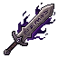 | **Veilpiercer's Edge** | A slender blade with a deep purple sheen, wreathed in ethereal wisps of dark energy. The guard features ornate curved wings or plumage in silver, while the handle is wrapped in midnight cloth. A spectral aura trails from the tip. | *Forged where shadow bleeds into steel, this blade thirsts for the veil between worlds. Those who wield it claim they hear whispers of the damned with each strike.* | Samurai, Warrior |
| 2 | 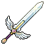 | **Dawnblight Cleaver** | A broad-bladed longsword with a golden-bronze hilt and crossguard. The blade gleams with an ethereal pale glow, while the leather-wrapped grip shows signs of ancient wear. A small ornamental pommel sits at the base. | *A blade forged in forgotten ages, its light-touched steel thirsts for shadow. Those who wield it claim the air grows cold, as if the sword itself drains warmth from the world to fuel its terrible edge.* | Warrior, Samurai |
| 3 | 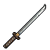 | **Duskbane Longsword** | A slender longsword with a dark, matte blade bearing subtle grey striations. The crossguard is minimal and angular, with the grip wrapped in what appears to be weathered leather or cloth wrapping in muted tones. A small pommel sits at the base. | *Forged in an age when shadow threatened to consume the world entire, this blade drinks in the darkness and answers with cold steel. Many who have wielded it speak of a peculiar warmth at its core-as if the sword itself remembers the twilight wars it was made to win.* | Samurai, Warrior |
| 4 | 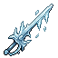 | **Frostbite Cleaver** | A broad-bladed sword with an icy blue sheen and crystalline formations along its edge. The blade tapers to a sharp point, with darker blue accents suggesting ancient enchantment. A wrapped hilt suggests worn leather grip. | *A blade forged in the depths where winter never dies. Its edge carries the bite of endless frost, and those who've felt its kiss speak only in whispers-if they speak at all.* | Warrior, Samurai |
| 5 | 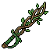 | **Thornspire Cleaver** | A broad-bladed sword with a dark, weathered metal finish. The blade features intricate vine-like engravings that spiral toward the hilt. The crossguard is wrapped in aged leather, and thorny protrusions jut from the pommel, suggesting ancient craftsmanship. | *A weapon born from forgotten battlefields, its blade thirsts for the blood of those who dare wield it. The thorns that crown its hilt whisper of a pact made in shadow, demanding a price far greater than steel.* | Warrior, Samurai |
| 6 | 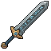 | **Duskbrand Cleaver** | A broad-bladed longsword with a dark steel edge and bronze crossguard. The blade features a subtle gradient from shadowed gray to deeper charcoal tones. The hilt wraps in worn leather, anchored by a rounded pommel. Faint runes trace the fuller. | *A blade forged in twilight hours, its edge thirsts for the blood of those who walk between worlds. Legends speak of warriors who wielded this steel to pierce the veil itself.* | Samurai, Warrior |
| 7 | 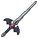 | **Duskfang Cleaver** | A broad-bladed sword with a dark, shadowed metallic finish. The blade tapers to a sharp point, with subtle serrated edges along one side. The crossguard is angular and ornate, and the grip appears wrapped in dark leather or cloth binding. | *A blade forged in the depths of forgotten wars, its edge thirsts for the blood of those who dare raise arms against it. Some say it drinks the light from the air around it, leaving only shadow in its wake.* | Samurai, Warrior |
| 8 | 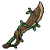 | **Ashcrown Falchion** | A curved, elegant sword with a bronze-gold crossguard shaped like sweeping wings. The blade gleams with a weathered silvery patina, adorned with subtle ash-grey etchings along its length. The grip appears wrapped in dark leather, with a prominent rounded pommel. | *A blade forged in ages past, its curve mirrors the flight of carrion birds. Those who wield it claim to hear whispers of falling ash with each swing-echoes of kingdoms long consumed by flame.* | Samurai, Warrior |
| 9 | 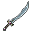 | **Shadowblight Cleaver** | A curved blade with a dark steel finish, featuring an ornate crossguard with intricate detailing. The grip appears wrapped in dark leather or cloth. A faint ethereal mist seems to cling to the blade's edge, suggesting otherworldly properties. | *A weapon forged in shadow and malice, its curve drinks deep of life's essence. Those who wield it feel the weight of countless fallen souls pressing against their will.* | Warrior, Samurai |
| 10 | 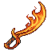 | **Embercleaver Sabre** | A curved, flame-wreathed blade with a warm amber glow. The sword features ornate orange-gold geometry along its length, with a darker handle wrapped in what appears to be scorched leather or sinew. Wisps of embers trail from the edge. | *A blade tempered in the heart of a dying sun, its edge still hungry for warmth. Warriors who wield it speak of ancient conflagrations and the screams of those who fell before its hungry flame.* | Warrior, Samurai |
| 11 | 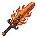 | **Emberfang Cleaver** | A broad-bladed sword with a distinctive orange-red gradient, suggesting heat-forged steel. The blade tapers to a sharp point with a subtle curved edge. A dark crossguard and wrapped grip provide contrast, while the overall design conveys brutal efficiency and smoldering intensity. | *Tempered in dragon's breath and quenched in the blood of ancient foes, this blade hungers for carnage. Its edge never dulls, forever glowing with the embers of a thousand fallen warriors.* | Warrior, Samurai |
| 12 | 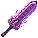 | **Violetscourge Blade** | A sword with an amethyst-hued blade that gleams with an otherworldly luminescence. The weapon features intricate dark purple coloration with shadowy undertones, suggesting enchantment or corruption. The grip and crossguard are rendered in deep violet, creating a cohesive, sinister appearance throughout. | *Forged in the depths where starlight bends to shadow, this blade hungers for those who dare wield it. Each strike leaves whispers of violet flame in the air-a mark of something far older than mortal steel.* | Samurai, Warrior |
| 13 | 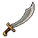 | **Duskfall Cleaver** | A curved blade with a bronze-wrapped grip and crossguard. The steel shows a dark patina with hints of rust-orange along the edge. The blade curves gracefully, suggesting both precision and devastating power. Simple, ancient craftsmanship. | *A blade forged in an age of ash and shadow, its curve designed to cleave through bone and sinew alike. Those who wield it report the steel whispers of distant battlefields, as if thirsting for one final war.* | Warrior, Samurai |
| 14 | 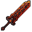 | **Bloodpact Cleaver** | A broad-bladed sword with a deep crimson hue dominating its surface. The blade tapers to a wicked point, with a darker burgundy grip wrapped around the hilt. The crossguard appears reinforced and weathered, suggesting countless battles. | *Forged in rituals long forgotten, this blade thirsts for violence. Those who wield it report a warmth spreading through their veins-whether blessing or curse, none have lived long enough to discern.* | Samurai, Warrior |
| 15 | 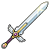 | **Duskbane Cleaver** | A longsword with a weathered silver blade bearing dark streaks along its fuller. The cross-guard is ornate bronze, and the grip wraps in aged leather. The pommel features a small dark stone, worn smooth by countless hands. | *Forged in an age when shadow consumed the earth, this blade hungers for the darkness that dwells within all living things. Each swing leaves echoes of a forgotten war.* | Warrior, Samurai |
| 16 | 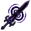 | **Nightpiercer Falchion** | A curved, elegantly tapered sword rendered in deep indigo and silver. The blade features a crescent moon motif along its length, with an ornate spiral guard and wrapped handle. Ethereal purple aura trails from the tip. | *A blade forged in shadow and starlight, said to cut through both flesh and the veil between worlds. Those who wield it find their strikes guided by an unseen hand, each blow precise as fate itself.* | Samurai, Warrior |
| 17 |  | **Dawnbringer's Edge** | A longsword with a luminous lavender blade that transitions to pale silver at the tip. The crossguard is ornate and metallic, with subtle geometric etchings. A dark grip extends below, contrasting the ethereal glow of the blade. | *Forged in an age when light still held dominion over shadow, this blade remembers its purpose. Those who wield it carry the burden of an ancient dawn that will never break again.* | Samurai, Warrior |
| 18 |  | **Cursed Duskfang Cleaver** | A broad-bladed sword with a gradient from pale blue at the tip to deep violet near the crossguard. The blade features a subtle sheen suggesting otherworldly steel. Dark metallic grip with blue accents. Compact, efficient design. | *A blade forged in the twilight hours when the veil between worlds grows thin. Those who've wielded it speak of whispers that guide their strikes, as if the steel itself hungers for what lies beyond mortal ken.* | Warrior, Samurai |
| 19 | 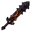 | **Emberclaw Reaver** | A fierce longsword with a darkened steel blade traced by crimson runes. The crossguard resembles a grasping claw, and the grip is wrapped in what appears to be scaled leather. Embers seem to drift from the blade's edge. | *A weapon forged in the depths of forgotten forges, its blade still smolders with the rage of its creation. Those who wield it report the steel whispers of ancient hunts and slaughter.* | Warrior, Samurai |
| 20 | 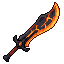 | **Emberbrand Cleaver** | A broad-bladed sword with a warm orange-gold gradient running along its length. The blade features a distinctive flame-like pattern etched into the steel, transitioning from deep amber at the cross-guard to bright orange at the tip. Dark leather wrapping binds the handle, with a small ornamental pommel. | *Forged in the dying embers of a forgotten war, this blade hungers for the warmth of spilled blood. Those who wield it claim the steel still radiates heat, as if the fire that birthed it never truly faded.* | Warrior, Samurai |
| 21 | 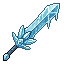 | **Frostpiercer's Edge** | A slender longsword with a crystalline blue blade that glimmers with ethereal light. The crossguard features intricate ice-like patterns, and wisps of pale mist coil around the fuller. The grip is wrapped in white leather with silver threading. | *A blade forged in the heart of eternal winter, where the screams of fallen warriors still echo as frost. Those who wield it claim the cold doesn't bite-only guides their hand toward destiny.* | Samurai, Warrior |
| 22 |  | **Glacial Fang Blade** | A longsword with an icy-blue blade emanating pale crystalline light. The crossguard features intricate frost-etched patterns, and the grip wraps in cool azure leather. Ethereal wisps of frozen mist drift from the blade's edge. | *Forged in the heart of a fallen glacier, this blade drinks the warmth from all it touches. Those who've wielded it speak of a voice like cracking ice, whispering secrets meant only for the dead.* | Samurai, Warrior |
| 23 | 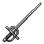 | **Storm Duskfang Cleaver** | A single-edged longsword with a darkened steel blade and ornate crossguard. The handle wraps in worn leather, while a distinctive curved quillon curves downward, resembling a fang or claw. The blade bears subtle etchings along its length. | *Forged in an age of twilight, this blade thirsts for the blood of those who walk between worlds. Its wielder becomes a instrument of inevitable dusk.* | Warrior, Samurai |
| 24 | 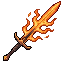 | **Hollow Emberfang Cleaver** | A broad-bladed sword with a warm orange-gold hue, reminiscent of smoldering metal. The blade tapers to a sharp point with subtle serrated edges. A darker handle with wrapped binding contrasts the luminous blade, suggesting ancient forging techniques. | *Forged in the dying embers of a fallen empire, this blade thirsts for the blood of those who would disturb its master's rest. Each strike leaves a whisper of ash in the air.* | Warrior, Samurai |
| 25 | 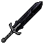 | **Obsidian Requiem** | A slender longsword with a jet-black blade that tapers to a sharp point. The crossguard is minimal and angular, with a dark metallic sheen. The grip appears wrapped in shadowed leather, and the overall silhouette suggests both elegance and lethal precision. | *Forged in the depths of a forgotten epoch, this blade hungers for the essence of the fallen. Each stroke leaves whispers of shadow in its wake-a weapon for those who walk the line between honor and oblivion.* | Samurai, Warrior |
| 26 | 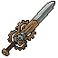 | **Cursed Thornspire Cleaver** | A broad-bladed sword with a dark bronze or oxidized copper finish. The blade features prominent vertical ridges and a wicked barbed spine running down its length. The crossguard resembles thorned vines, with the grip wrapped in what appears to be aged leather or scaled material. | *A weapon forged in ages of strife, its blade drinks deep of sorrow. Those who wield it feel the whispers of countless fallen enemies carved into its barbed spine.* | Warrior, Samurai |
| 27 | 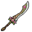 | **Thornwood Cleaver** | A weathered blade with a dark, aged patina spanning its length. The crossguard bears intricate bronze detailing with vine-like engravings. The grip wraps in worn leather cord, and the blade tapers to a wicked point, with faint striations suggesting ancient folding techniques. | *Forged in ages past by craftsmen whose names are dust, this blade thirsts for violence. Those who wield it claim they can hear the whispers of felled foes echoing from its steel.* | Warrior, Samurai |
| 28 | 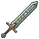 | **Voidborn Duskbane Cleaver** | A broad-bladed longsword with a dark steel edge and ornate crossguard. The blade bears a metallic sheen with hints of tarnished silver, while the grip wraps in weathered leather. A subtle groove runs down the center of the blade, and the pommel gleams with worn brass. | *Forged in an age when shadow consumed the land, this blade drinks deep of darkness itself. Those who wield it claim the weapon grows colder with each foe it fells, as if drawing the warmth from the world around it.* | Warrior, Samurai |
| 29 | 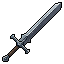 | **Shattered Duskbrand Cleaver** | A longsword with a dark steel blade featuring a subtle gradient from charcoal to deep grey. The crossguard is angular and reinforced, with a wrapped grip suggesting worn leather. A thin luminescent line runs down the blade's center, hinting at ancient enchantment. | *Forged in an age when shadow and steel were one, this blade drinks in the darkness around it. Those who wield it speak of a whisper-a hunger-that grows louder with each kill.* | Warrior, Samurai |
| 30 | 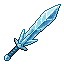 | **Azureblight Cleaver** | A broad-bladed sword forged from ethereal blue steel with a luminescent sheen. The blade tapers to a wicked point, its edge seeming to shimmer with an otherworldly glow. The hilt is wrapped in dark leather, accented with silvered guard work. | *A blade that drinks deep of the void between stars. Those who've wielded it speak of whispers that linger in the cold steel-ancient voices warning of horrors yet to come.* | Warrior, Samurai |
| 31 | 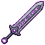 | **Veilpiercer Blade** | A slender sword with an ethereal purple hue, its blade seeming to shimmer between material and shadow. Ornate circular pommel glows with arcane energy. The crossguard features delicate, otherworldly filigree. | *A weapon born where steel met the void itself. Those who wield it report their strikes pass through defenses as though they were mere phantoms, leaving wounds that refuse to heal naturally.* | Samurai, Warrior |
| 32 | 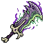 | **Veilpiercer Halberd** | A twisted polearm weapon with a purple-black shaft and ornate head. The blade portion features sharp, jagged protrusions in deep violet and silver, with an ethereal glow emanating from intricate runes carved along the length. The overall design suggests corrupted magic infused into steel. | *A weapon forged in the depths where the veil between worlds grows thin. Those who wield it report whispers of forgotten names and the sensation of piercing not just flesh, but the very fabric of reality itself.* | Warrior, Samurai |
| 33 | 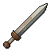 | **Bloodveil Cleaver** | A broad-bladed sword with a rust-brown patina suggesting dried blood or ancient iron oxide. The blade tapers to a wicked point, with a darker wrapped grip and a simple crossguard. Bronze or copper accents frame the hilt. | *A blade that has tasted countless battlefields, its edge still hungry despite the centuries. Those who wield it claim to hear whispers of the fallen echoing within its metal.* | Warrior, Samurai |
| 34 | 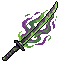 | **Thornspike Cleaver** | A broad-bladed sword with a verdant, thorned aesthetic. The blade features sharp, organic spike protrusions along its edges and a sickly green-tinted metal core. A wrapped grip and crossguard suggest purposeful craftsmanship, while creeping vines or tendrils seem to coil around the weapon. | *A blade that drinks deep of poisoned earth. Those who wield it taste the forest's hunger with every swing, their wounds festering long after the steel has left skin.* | Warrior, Samurai |
| 35 | 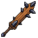 | **Bloodthorn Cleaver** | A weathered blade with a distinctive rust-brown patina and dark crimson streaks running along its length. The hilt wraps in worn leather, and thorned protrusions jut from the crossguard, catching light like dried blood. | *A weapon forged in ancient suffering, its edge thirsts for violence. Those who wield it report whispers of anguish emanating from the metal itself-whether curse or blessing remains unclear.* | Warrior, Samurai |
| 36 | 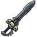 | **Umbral Reaper** | A dark longsword with a blackened blade that seems to absorb light. The crossguard features angular, shadowy metalwork. The grip wraps in dark leather, and a wisp of ethereal mist coils around the blade's edge. | *A blade forged in the depths of forgotten crypts, its edge thirsts for the lifeforce of the living. Those who wield it find themselves slowly consumed by the very darkness it channels.* | Warrior, Samurai |
| 37 | 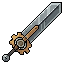 | **Shattered Thornspire Cleaver** | A broad-bladed longsword with a dark metallic finish and ornate crossguard. The blade features subtle ridge detailing running its length, while the grip appears wrapped in aged leather. A prominent pommel suggests balanced weight. | *A blade forged in ages past, its edge still thirsts for the blood of those who dare challenge its wielder. Those who swing this weapon often find their enemies fall before them-whether by skill or by the blade's own dark hunger.* | Warrior, Samurai |
| 38 | 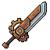 | **Bloodrust Cleaver** | A broad-bladed sword with a distinctive rust-red patina coating its metal surface. The blade appears worn and aged, with darker streaks suggesting dried blood or oxidation. A wrapped leather grip extends from a simple crossguard, and the overall construction suggests brutish, practical craftsmanship. | *A weapon tempered in centuries of carnage, its rust a permanent reminder of blood spilled in forgotten wars. Those who wield it find their strikes carry the weight of the countless dead who came before.* | Warrior, Samurai |
| 39 | 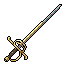 | **Ashenbrand Cleaver** | A weathered longsword with a bronze-tinted blade showing ashen streaks and patina. The crossguard features ornate metalwork with curved embellishments. The grip appears wrapped in aged leather, and the pommel tapers to a blunt point. Overall worn but purposeful. | *Forged in ages past by hands long turned to dust, this blade thirsts for the blood of the fallen. Those who wield it carry the weight of countless battles and the whispers of the dead.* | Warrior, Samurai |
| 40 | 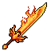 | **Hollow Emberfang Cleaver** | A broad-bladed sword with a golden-orange hue, wreathed in flickering flame effects. The blade tapers to a wicked point, with intricate amber striations running along its length. The crossguard glows warmly, suggesting an inner fire. | *A blade born from the forge-hearts of fallen empires, its steel drinks the warmth of dying suns. Those who wield it find their resolve hardened, though the weapon whispers of hungers that demand blood.* | Warrior, Samurai |
| 41 | 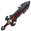 | **Ancient Bloodthorn Cleaver** | A broad-bladed sword with a dark crimson edge and obsidian spine. The crossguard features thorned protrusions in deep burgundy, while the grip wraps in blackened leather. A faint crimson aura pulses along the blade's edge. | *A blade born from forgotten battlefields, its edge thirsts for vitality as much as steel. Those who wield it find their wounds close as swiftly as they open others'.* | Warrior, Samurai |
| 42 | 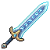 | **Cursed Glacial Fang Blade** | A longsword with a pale blue-white blade that gleams with an icy sheen. The crossguard features ornate golden detailing, and the grip appears wrapped in dark leather. Crystalline formations shimmer along the blade's edge, suggesting ancient frost magic. | *Forged in the depths of a cursed winter, this blade drinks warmth from all it touches. Those who wield it find their resolve hardening alongside their enemies' blood.* | Samurai, Warrior |
| 43 | 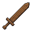 | **Bloodoak Cleaver** | A broad-bladed sword with a weathered brown wooden grip and crossguard. The blade exhibits a deep rust-brown patina with darker striations, suggesting aged iron stained by countless conflicts. The pommel is rounded and worn. | *A blade forged in elder times, its grain scarred by the weight of dark deeds. Those who wield it speak of whispers that fade only when steel meets flesh.* | Warrior, Samurai |
| 44 | 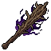 | **Veilpiercer's Bane** | A curved blade wreathed in deep purple and crimson ethereal flames. The handle is wrapped in shadowed cord, with obsidian crossguard adorned with arcane runes. Wisps of dark magic coil around the pommel. | *A weapon forged in the depths where sorcery bleeds into steel. Those who wield it claim the blade hungers for the flesh of spellcasters, drinking their essence with each strike.* | Samurai, Warrior |
| 45 | 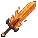 | **Shattered Emberfang Cleaver** | A broad-bladed sword with warm orange and golden hues dominating its form. The blade appears to glow with inner heat, resembling molten metal caught mid-flow. Dark grip wrapping contrasts the luminous edge, while the crossguard shows intricate metalwork suggesting ancient craftsmanship. | *A blade forged in dragon's breath, its edge still smolders with the fury of ancient fires. Those who wield it claim the weapon hungers-not for blood, but for the warmth of their enemies' final moments.* | Warrior, Samurai |
| 46 | 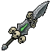 | **Thornspire Reaver** | A jagged, dark-bladed longsword with a wickedly serrated edge. The blade appears forged from blackened steel with sharp, thorn-like protrusions running along its fuller. The hilt is wrapped in what seems to be aged leather, with a simple crossguard. | *A weapon born from malice and suffering, its thorned edge drinks deep of those who dare stand before it. Those touched by its bite report whispers of endless thorns coiling through their veins.* | Warrior, Samurai |
| 47 | 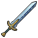 | **Storm Duskbane Longsword** | A longsword with a silvery blade featuring a subtle gradient toward darker edges. The crossguard is ornate bronze with angular, swept wings. The grip appears wrapped in dark leather or cloth, leading to a pommel that glows faintly with an ethereal blue tint. | *Forged in an age when dusk consumed entire kingdoms, this blade drinks in shadow and exhales sorrow. Those who wield it find the boundary between day and night grows thin.* | Warrior, Samurai |
| 48 | 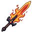 | **Hollow Emberfang Cleaver** | A broad-bladed sword wreathed in orange and amber flames. The blade tapers to a wickedly sharp point, with a dark grip and crossguard. Fiery aura trails from the edges, suggesting both heat and ancient power. | *A weapon forged in the heart of a dying star, its blade drinks deep of both blood and flame. Those who wield it claim the screams of its victims echo long after the killing blow.* | Warrior, Samurai |
| 49 | 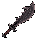 | **Shadowrend Cleaver** | A broad-bladed sword with a dark, blackened metal finish. The blade features a subtle purple-black gradient along its edge, suggesting an otherworldly corruption or enchantment. The handle appears wrapped in dark leather or shadow-touched material, with a simple cross-guard. | *A blade forged in the depths where light fears to tread. Those who wield it report feeling the weight of countless fallen shadows upon their shoulders.* | Warrior, Samurai |
| 50 | 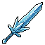 | **Cursed Azureblight Cleaver** | A broad-bladed sword with an ethereal blue-white gradient coating its steel edge. The blade tapers to a wicked point, while the crossguard features angular, wing-like protrusions in deep cyan. The grip appears wrapped in pale leather, with small mystical runes etched along the fuller. | *A blade forged in the depths where starlight meets corruption. Those who wield it report visions of endless twilight skies-whether curse or blessing, none have lived long enough to discern.* | Samurai, Warrior |
| 51 | 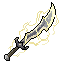 | **Bonewraith Cleaver** | A broad-bladed sword with a curved, wickedly sharp edge. The blade gleams pale bone-white with dark veining throughout. The crossguard is wrapped in weathered leather, and the pommel features an ornate brass cap etched with ancient runes. | *Forged in an age when death held dominion over steel, this blade thirsts for the life force of those it cuts. Those who wield it claim to hear whispers of the fallen in its every swing.* | Warrior, Samurai |
| 52 | 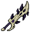 | **Bonefang Cleaver** | A curved, bone-white blade with dark streaking throughout. The crossguard features twisted bone segments. The handle wraps in aged leather with ivory inlays. The weapon has an asymmetrical, slightly jagged edge suggesting both elegance and brutality. | *A blade born from the marrow of forgotten beasts. Each strike carries the weight of ancient hunger, leaving wounds that refuse to close cleanly.* | Warrior, Samurai |
| 53 | 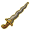 | **Ashborn Katana** | A elegant curved blade with golden brass fittings along the hilt and crossguard. The blade itself appears weathered bronze or brass-colored metal with a subtle gradient. The handle features ornate detailing typical of Eastern weaponry, with refined proportions suggesting masterwork craftsmanship. | *Forged in the dying embers of a fallen empire, this blade drinks deep of ash and sorrow. Those who wield it inherit not strength, but the burden of all it has severed.* | Samurai, Warrior |
| 54 |  | **Ember Emberfang Cleaver** | A broad-bladed sword wreathed in flickering orange and amber flames. The blade tapers to a wicked point, with a warm golden sheen suggesting enchanted metal. Dark leather wraps the hilt, contrasting the fiery aura that dances along its edge. | *A weapon born from the heart of dying stars, its blade forever hungry for warmth. Those who wield it find their resolve hardened, yet their enemies turn to ash before the inferno's kiss.* | Warrior, Samurai |
| 55 |  | **Nightpurge Cleaver** | A broad-bladed sword with a deep purple-black finish, accented by glowing violet runes along the fuller. The crossguard flares wickedly outward, and wisps of dark energy coil around the blade's edges like corrupted smoke. | *A weapon forged in shadow and hunger, its edge drinks deeper than blood. Those who wield it find the darkness answers their call, though at a price only the wielder understands.* | Samurai, Warrior |
| 56 |  | **Goldflare Cleaver** | A broad-bladed sword with warm golden-orange coloring and metallic sheen. The blade tapers to a sharp point with a subtle curve, suggesting both slashing and piercing capability. The crossguard and pommel feature ornate golden accents against darker wood or leather wrapping on the grip. | *Forged in an age when light and shadow danced as one, this blade drinks in the amber glow of dying suns. Those who wield it find their strikes leave trails of searing warmth-a weapon that hungers as much as it protects.* | Warrior, Samurai |
| 57 |  | **Ashborn Cleaver** | A broad-bladed longsword with a weathered steel edge tinged grey. The crossguard is adorned with ornate copper detailing. The grip wraps in dark leather, and the pommel gleams with a dull bronze finish. Ash-like discoloration marks the blade's fuller. | *Forged in the dying embers of a fallen age, this blade remembers the taste of ash and elder blood. Those who wield it walk the thin line between mortality and oblivion.* | Warrior, Samurai |
| 58 |  | **Verdant Reaper's Edge** | A longsword with an iridescent teal-green blade adorned with golden filigree patterns. The crossguard features ornate metalwork, and the handle is wrapped in weathered leather. Wisps of ethereal green mist coil around the blade. | *A weapon steeped in ancient bloodshed, its verdant sheen said to drink the vitality of the fallen. Those who wield it claim to hear whispers of conquered kingdoms in the dark.* | Samurai, Warrior |
| 59 |  | **Cerulean Fang** | A slender longsword with an ethereal blue-white blade that shimmers with arcane energy. The crossguard is ornate and swept, with the pommel featuring a deep sapphire gem. Wisps of pale light trace along the edge. | *A blade forged in the depths where starlight bleeds into shadow. Those who wield it claim to hear the whispers of forgotten oaths, and to feel the weight of destinies yet unfulfilled.* | Samurai, Warrior |
| 60 |  | **Voidborn Emberbrand Cleaver** | A broad-bladed sword with a warm copper-orange hue throughout the blade and crossguard. The grip features dark leather wrapping with a black pommel. Subtle gradient suggests heat-forged metal with an oxidized patina. | *Tempered in the dying embers of a fallen civilization, this blade drinks in warmth and thirsts for carnage. Those who wield it claim they hear the whispers of ancient forges singing in their ears.* | Warrior, Samurai |
| 61 |  | **Thornshadow Cleaver** | A broad, curved blade of dark purple and black metal with jagged, thorn-like protrusions along its spine. The handle wraps in what appears to be wrapped sinew or dark cord, with subtle crimson accents near the crossguard. | *A weapon born from shadow and suffering, its blade drinks in light as readily as it drinks blood. Those who wield it report whispers that fade only when steel finds flesh.* | Samurai, Warrior |
| 62 |  | **Ember Thornspire Cleaver** | A broad-bladed sword with a darkened steel finish and thorny, ornate crossguard. The blade tapers to a wicked point, with etched patterns running down the fuller. The grip appears wrapped in dark leather or cloth, with a menacing silhouette. | *A weapon born from obsidian depths, its thorned edge drinks deep of shadow. Those who wield it find themselves bound to an ancient hunger that feeds on conquest.* | Warrior, Samurai |
| 63 |  | **Storm Ashenbrand Cleaver** | A broad-bladed sword with a weathered steel finish and subtle ash-grey patina. The blade tapers to a wicked point, with a reinforced crossguard and wrapped grip. A faint ember-like glow traces the edge. | *Forged in the dying embers of an ancient war, this blade drinks deep the lifeblood of those it touches. To wield it is to carry the weight of ash-choked battlefields and the screams of the fallen.* | Warrior, Samurai |
| 64 |  | **Bloodrusted Cleaver** | A weathered longsword with a broad, slightly curved blade bearing deep rust-brown stains. The crossguard is wrapped in tattered leather straps, and the pommel features a dull bronze skull motif. Edges appear notched from countless brutal encounters. | *A blade steeped in the carnage of forgotten wars, its rust a testament to blood spilled across centuries. Those who wield it feel the weight of the fallen pressing upon their shoulders.* | Warrior, Samurai |
| 65 |  | **Ancient Thornspire Cleaver** | A broad-bladed sword with a bronze-gold crossguard and grip. The blade features subtle serrated edges along its spine, with a dark patina suggesting age. A small ornamental crest or symbol adorns the pommel, catching faint light. | *A blade forged in an age when steel drank deep of elder blood. Its edge thirsts still, and those who wield it find themselves bound to its hunger.* | Warrior, Samurai |
| 66 |  | **Frostbind Cleaver** | A broad-bladed sword with an icy blue tint across its steel edge. The blade narrows toward a sharp point, with a darker grip and crossguard. Crystalline frost patterns shimmer along the fuller, suggesting otherworldly cold. | *A blade forged in the depths of a cursed glacier, its edge perpetually weeping with arcane chill. Those who've wielded it speak of whispers in the howling wind-whether warnings or curses remains unclear.* | Samurai, Warrior |
| 67 |  | **Verdantblight Cleaver** | A broad-bladed sword with sickly green luminescence running along its edge. The blade tapers to a wicked point, wrapped in corroded bronze with an organic, vine-like grip that seems almost alive. | *A blade born from corruption and forgotten conquest. Those who wield it report the metal whispers of withering kingdoms and the slow decay of all things.* | Samurai, Warrior |
| 68 |  | **Verdant Reaver** | A long sword with a pale golden blade featuring intricate green vine patterns etched along its length. The crossguard is ornate brass, and the grip is wrapped in aged leather. A subtle emerald glow emanates from the blade's fuller. | *A blade born from forgotten groves, where nature and steel became one. Those who wield it claim the sword hungers for those who would desecrate the wild.* | Samurai, Warrior |
| 69 |  | **Shattered Ashenbrand Cleaver** | A broad-bladed sword with a dark, charcoal-grey finish. The blade tapers to a wicked point, with a blackened fuller running its length. The crossguard is minimal and angular, while the grip appears wrapped in shadowed leather or dark cloth. | *Forged in the depths where ash falls eternally, this blade thirsts for the lifeblood of those who dare oppose it. Its edge drinks deep the darkness of forgotten wars.* | Warrior, Samurai |
| 70 |  | **Embercinder Cleaver** | A broad-bladed sword with a warm copper-gold hue and darkened edges. The blade features intricate burnt orange striations resembling flame patterns. The crossguard and grip are wrapped in deep crimson leather, with small ember-like details scattered across the fuller. | *Forged in volcanic depths and quenched in shadow, this blade hungers for carnage. Each swing leaves embers trailing through the air, as if the sword itself bleeds fire.* | Warrior, Samurai |
| 71 |  | **Duskblight Cleaver** | A broad-bladed sword with a darkened steel finish and weathered grip. The blade tapers to a wicked point, with subtle rust-like discoloration along the edges. The crossguard appears reinforced, and the pommel is wrapped in worn leather. | *A blade forged in shadow and tempered by ancient sorrows. Those who wield it report whispers of departed souls clinging to its edge, as if the weapon itself thirsts for the darkness within.* | Warrior, Samurai |
| 72 |  | **Ashenfang Cleaver** | A broad-bladed longsword with a dull bronze-grey finish and darkened edges. The blade tapers to a wicked point, with subtle notches along the spine suggesting ancient battles. The crossguard is minimal, and the grip appears wrapped in weathered cord or leather. | *Forged in an age when ash fell like snow, this blade has tasted the blood of countless foes. It thirsts still, and those who wield it become instruments of inevitable ruin.* | Warrior, Samurai |
| 73 |  | **Ancient Duskbane Longsword** | A straight-bladed longsword with a tapered crossguard and wrapped grip. The blade features a subtle dark gradient from steel-gray to deep charcoal, suggesting ages of shadow exposure. A faint ethereal shimmer traces the edge. | *Forged in the twilight forges of a fallen kingdom, this blade hungers for the darkness that spawned it. Those who wield it find shadows bend to their will, though the cost is always paid in kind.* | Warrior, Samurai |
| 74 |  | **Ashbringer's Edge** | A longsword with a dark steel blade etched with faint runes. The crossguard is ornate and weathered, with a wrapped grip. The blade appears scorched, transitioning from grey steel to ashen black near the tip. | *A blade forged in the heart of a dying star, said to have tasted the ash of empires. Those who wield it carry the weight of inevitable ruin.* | Warrior, Samurai |
| 75 |  | **Forsaken Bonewraith Cleaver** | A weathered longsword with a curved, slightly fractured blade of pale bone-white metal. The crossguard features intricate skeletal filigree, and the grip wraps in dark leather binding. Faint spectral wisps coil around the edges. | *A blade forged from the remains of an ancient tyrant, still resonating with the anguish of its final death. Those who wield it walk between worlds, their strikes tearing through flesh and spirit alike.* | Samurai, Warrior |
| 76 |  | **Verdant Reaper** | A long sword with a pale green blade that transitions to darker forest tones. The blade features elegant curved striations suggesting otherworldly craftsmanship. The hilt is wrapped in weathered binding, with a simple crossguard. Faint luminescent veins run through the steel. | *A blade born from the dying breaths of an ancient forest. Those who wield it claim to hear the whispers of forgotten groves, though whether blessing or curse remains unclear.* | Samurai, Warrior |
| 77 |  | **Shattered Emberfang Cleaver** | A broad-bladed sword with a golden-orange flame gradient along its length. The blade tapers to a wicked point, with darker burnt sienna edges suggesting intense heat. The crossguard and handle are wrapped in dark leather, contrasting the luminous, fire-kissed steel. | *A blade forged in dragonfire and quenched in shadow. Those who've wielded it speak of whispers in the flames-whether warnings or temptations, none can say.* | Samurai, Warrior |
| 78 |  | **Gilded Sunburst Blade** | A curved sword with a golden-bronze hue, featuring ornate detailing along the blade and crossguard. The weapon radiates warm amber tones with intricate geometric patterns. A prominent circular sun motif adorns the pommel, suggesting divine or celestial origins. | *Forged in an age of forgotten glory, this blade drinks in the light of fallen suns. Those who wield it find their resolve hardened, though whispers suggest the weapon remembers masters long turned to dust.* | Samurai, Warrior |
| 79 |  | **Storm Azureblight Cleaver** | A broad-bladed longsword with an ethereal blue-white gradient running along its edge. The blade tapers to a sharp point, with a darker crossguard and wrapped hilt. Faint crystalline patterns shimmer along the fuller, suggesting corrupted arcane origins. | *A blade kissed by forgotten magic, its edge carries the cold of a thousand winters. Those who've wielded it speak of whispers that fade only when blood is spilled.* | Warrior, Samurai |
| 80 |  | **Glacial Cleaver** | A longsword with a pale blue blade that shimmers with an icy sheen. The crossguard is silver-edged, and the grip appears wrapped in frost-touched leather. Ethereal wisps of cold emanate from the blade's edges. | *A blade tempered in the breath of forgotten winters. Those who wield it carry the chill of death itself, each strike leaving frost in its wake-a weapon for those who have embraced the eternal cold.* | Warrior, Samurai |
| 81 |  | **Bloodworn Cleaver** | A broad-bladed sword with a weathered bronze hue and dark crimson streaks along the edge. The crossguard features ornate metalwork with curved flourishes. The handle appears wrapped in aged leather, and the blade bears the patina of countless battles. | *A blade that has tasted enough blood to remember the names of the fallen. Those who claim to wield it speak of whispers in the dark-whether from the weapon or their own descent into madness remains unclear.* | Warrior, Samurai |
| 82 |  | **Cursed Bloodrust Cleaver** | A broad-bladed sword with a dark reddish-brown patina, suggesting aged iron or corroded steel. The blade tapers to a wicked point, with a simple cross-guard and wrapped grip. Weathered and battle-scarred, it exudes grim utility. | *A blade forged in forgotten wars, its rust-stained surface whispers of countless fallen. Those who wield it find their strikes carry an inexplicable hunger, as if the sword itself thirsts for what it has already tasted.* | Warrior, Samurai |
| 83 |  | **Forsaken Bloodthorn Cleaver** | A broad-bladed sword with a rust-brown oxidized finish and dark crimson streaking along its edge. The crossguard features jagged, thorn-like protrusions. A worn leather grip wraps the hilt, darkened by age and battle-stains. | *A weapon born from bloodshed and ancient sorcery, its edge thirsts for the lifeblood of its wielders' foes. Those who swing it report whispers of pain that are not their own.* | Samurai, Warrior |
| 84 |  | **Voidborn Duskbane Cleaver** | A broad-bladed longsword with a dark grey metallic finish and subtle gradient to black at the edges. The blade features a prominent central fuller running its length. The crossguard is simple and angular, with the grip wrapped in what appears to be dark leather or bound cloth. The pommel is rounded and weighted. | *A blade forged in shadow-touched foundries, its edge thirsts for the blood of those who dwell in darkness. Many who've wielded it speak of whispers that fade only when steel finds flesh.* | Warrior, Samurai |
| 85 |  | **Shattered Ashenbrand Cleaver** | A weathered longsword with a dull grey-brown blade marked by dark striations and corrosion. The crossguard and pommel appear blackened iron, with the grip wrapped in aged leather. A faint ashen patina coats the steel. | *A blade forged in the dying embers of an ancient forge, its dull finish belies the countless souls it has sundered. Those who wield it claim to hear whispers of ash on the wind.* | Warrior, Samurai |
| 86 |  | **Ember Azureblight Cleaver** | A broad-bladed sword with an ethereal blue gradient coating its steel edge. The blade tapers to a sharp point and features a darker crossguard. A wrapped grip with subtle rune markings leads to a pommel wrapped in shadow-tinted cloth. | *Forged in the depths where starlight touches corrupted iron, this blade thirsts for the blood of those who walk between worlds. Its unnatural azure sheen marks it as a weapon of both blessing and curse.* | Warrior, Samurai |
| 87 |  | **Storm Azureblight Cleaver** | A broad-bladed sword with an ethereal blue-white gradient coating the metal. The blade tapers to a sharp point with subtle serrations along one edge. The crossguard glows faintly, and celestial runes trace down the fuller. | *A blade forged in celestial ice and quenched in void-touched waters. Those who wield it report whispers of the abyss, as if the sword itself thirsts for what lies beyond mortality.* | Warrior, Samurai |
| 88 |  | **Luminous Cleaver** | A longsword with an ethereal pale blue blade that glows softly along its edge. The blade tapers to a sharp point with a subtle radiant aura. Dark grip and crossguard provide stark contrast to the luminescent steel. | *A blade forged in the heart of a dying star, its edge humming with otherworldly light. Those who wield it claim to see truth in shadow, though such visions often come at a terrible cost.* | Warrior, Samurai |
| 89 |  | **Shadowfang Cleaver** | A dark, curved blade with a slightly jagged edge, rendered in deep charcoal and obsidian tones. The hilt appears wrapped in shadow, with a subtle red accent near the crossguard. Distinctive hooked protrusion near the blade's tip suggests both elegance and malice. | *A weapon born from the void between worlds, its edge hunggers for the warmth of mortal blood. Those who wield it find themselves whispering to the darkness-whether the blade listens back is a question best left unasked.* | Warrior, Samurai |
| 90 |  | **Umbral Cleaver** | A dark iron longsword with a tapered blade and dulled edge. The fuller runs down the center, catching no light. The crossguard is simple and austere, with the grip wrapped in what appears to be aged leather. A faint purple sheen suggests corruption or ancient enchantment. | *Forged in an age of shadow, this blade drinks in light rather than reflects it. Those who wield it speak of whispers in the dark-whether warnings or temptations, none can say.* | Warrior, Samurai |
| 91 |  | **Tideborne Cleaver** | A broad-bladed sword with an aquamarine gradient, transitioning from deep teal at the crossguard to pale cyan at the tip. The blade features a subtle wave-like pattern etched along its length, with a luminescent quality suggesting otherworldly craftsmanship. | *Forged in the depths where ancient currents flow, this blade thirsts for blood as the sea hungers for the drowned. Those who wield it find their strikes guided by currents unseen, as if the weapon itself remembers the depths from which it was drawn.* | Warrior, Samurai |
| 92 |  | **Voidborn Embercinder Cleaver** | A broad-bladed sword with a warm amber and copper hue, depicting flames along the fuller. The cross-guard gleams with brass accents, while the grip shows dark leather wrapping. Embers appear to drift from the blade's edge. | *A blade forged in the heart of dying stars, its metal still radiates the warmth of ancient conflagrations. Those who wield it speak of whispers-as if the sword itself hungers for the next inferno.* | Warrior, Samurai |
| 93 |  | **Duskbringer's Edge** | A long, tapered blade rendered in muted bronze and grey tones. The crossguard features subtle angular details, while the grip appears wrapped in dark leather or cloth. A thin fuller runs down the blade's center, with faint wear marks suggesting countless battles. | *Forged in an age when dusk lasted forever, this blade hungers for the blood of those who walk in daylight. Each strike carries the weight of forgotten wars.* | Warrior, Samurai |
| 94 |  | **Obsidian Reaper** | A longsword with a dark, obsidian-black blade tapering to a wicked point. The crossguard is simple and angular, with the grip wrapped in shadow-dark leather. A faint ethereal shimmer runs along the edge. | *Forged from fallen starlight and quenched in the tears of the damned, this blade hungers for the souls of the unworthy. Those who wield it are marked by death itself.* | Samurai, Warrior |
| 95 |  | **Storm Glacial Fang Blade** | A slender longsword with an icy blue-white blade that tapers to a sharp point. The crossguard and handle are deep indigo with frost-like crystalline patterns. A faint ethereal glow emanates from the blade's edge. | *Forged in the frozen depths where starlight touches eternal ice, this blade drinks the warmth from all it touches. Those who wield it report a creeping cold that numbs both flesh and spirit.* | Samurai, Warrior |
| 96 |  | **Emberhusk Cleaver** | A broad-bladed sword with a warm amber-orange hue, its surface marked by deep cracks filled with glowing embers. The handle is wrapped in dark leather, and the blade tapers to a wicked point, suggesting both cleaving power and careful craftsmanship. | *A blade forged in dragon's breath, its metal singing with contained fury. Those who wield it claim the cracks in the steel weep small flames, as if the sword itself refuses to cool.* | Warrior, Samurai |
| 97 |  | **Frostbane Cleaver** | A broad-bladed sword with an icy blue gradient running through its steel. Crystalline formations frame the crossguard, and the grip wraps in what appears to be frost-touched leather. White ethereal wisps coil around the blade's edge. | *A blade forged in the heart of endless winter, its edge never dulls nor warms. Those who've wielded it speak of a cold that seeps into bone-whether from the weapon or from the souls it claims remains unclear.* | Warrior, Samurai |
| 98 |  | **Dawnpiercer Blade** | A longsword with a cream-colored grip and crossguard. The blade gleams with a silvery sheen, featuring subtle golden accents along the fuller. The weapon appears well-maintained despite its age, with intricate metalwork suggesting masterful craftsmanship. | *Forged in an age when light still held dominion over shadow, this blade thirsts for the blood of those who dwell in darkness. Its edge remembers the first dawn and hungers for another.* | Samurai, Warrior |
| 99 |  | **Forsaken Embercinder Cleaver** | A broad-bladed sword with a flame-orange gradient transitioning to deep crimson at the edge. The blade appears scorched and smolders faintly, with wispy ember trails rising from the metal. The hilt is wrapped in charred leather. | *A weapon forged in the heart of a dying pyre, its steel still remembers the inferno. Those who wield it taste ash and cinder with every strike.* | Warrior, Samurai |
| 100 |  | **Voidborn Duskbane Cleaver** | A long, straight-bladed sword with a dark grey metallic finish and a shadowed core. The blade tapers to a sharp point, with a simple crossguard and wrapped handle. Minimalist design suggests ancient forging. | *A blade tempered in the blood of forgotten wars. Those who swing it report the steel grows cold at dusk, as if drawing power from the creeping darkness itself.* | Warrior, Samurai |
